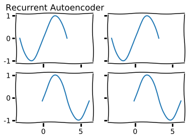
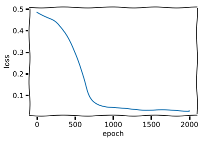
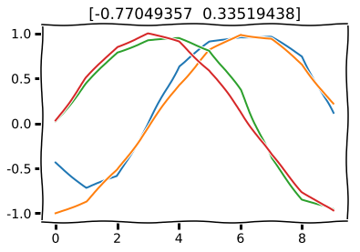
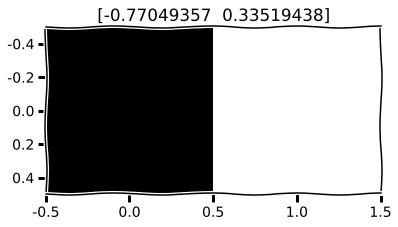
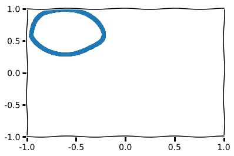
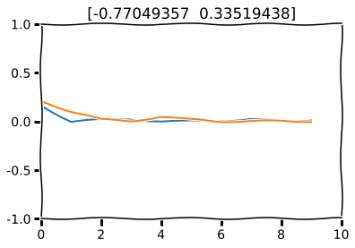
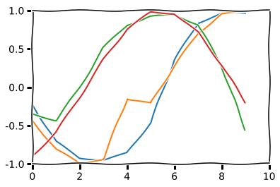
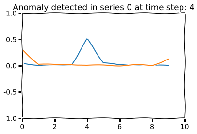

# Using Autoencoders to Learn Most Salient Features from Time Series

In this post we examine a simple, if not the simplest, tool in deep learning and see how it can be applied to multi-dimensional financial time series. This is a toy example of how one would apply such model to sequential data such as ones encountered in finance.

## Autoencoder

Autoencoding is the practice of copying input to output. It has an internal state $h$ to represent the input. Autoencoders is composed of two parts: an encoder $f :{\mathcal {X}}\rightarrow {\mathcal {H}}$ and a decoder $g :{\mathcal {H}}\rightarrow {\mathcal {Y}}$. Autoencoders are designed to be unable to learn to copy perfectly.


The hidden dimension should constrained to be smaller than $x$, the input dimension. This way, $h$ is forced to take on useful properties and most salient features of the input space.

To train an autoencoder, minimize

$\arg \min _{f, g}||X-(g \circ f )X||^{2}$


## Recurrent Autoencoder
For time series data, recurrent autoencoder is more useful. The encoder and decoder are RNNs such as LSTMs. We encode the input into an undercomplete latent vector $h$ which is then decoded. For the decoder, we can either initialize with the latent vector and use output at time $t-1$ as input for time $t$ or we can use latent vector $h$ as the input at each timestep. These are called conditional and unconditional RNNs. Recurrent autoencoder is a special case of sequence-to-sequence(seq2seq) architecture which is extremely powerful in neural machine translation.


```python
import tensorflow as tf
import numpy as np
import matplotlib.pyplot as plt
```

# Task

Copy a tensor of two sine function that are initialized out of phase.

The shape of the tensor is: $(batch\_size, time\_step, input\_dim)$ where $input\_dim$ = 2.

To deal with financial data, simply replace the $input\_dim$ axis with desired data points.

* Bid, Ask, Spread, Volume, RSI. For this setup, the $input\_dim$ would be 5.
* Order book levels. We can rebin the order book such that each tick aggregates more liquidity. An example would be 10 levels that are 1 stddev apart. Then $input\_dim$ would be 10.

Here is an artist's rendering of a recurrent autoencoder.


```python
plt.xkcd()

x1 = np.linspace(-np.pi, np.pi)
y1 = np.sin(x1)
phi = 3
x2 = np.linspace(-np.pi+phi, np.pi+phi)
y2 = np.sin(x2)

f, ((ax1, ax2), (ax3, ax4)) = plt.subplots(2, 2, sharex=True, sharey=True)
ax1.plot(x1, y1)
ax1.set_title('Recurrent Autoencoder')
ax2.plot(x1, y1)
ax3.plot(x2, y2)
ax4.plot(x2, y2)
plt.show()
```





# Generator

We generate 10 time steps for the random phased sine function.


```python
import random
def gen(batch_size):
    seq_length = 10

    batch_x = []
    batch_y = []
    for _ in range(batch_size):
        rand = random.random() * 2 * np.pi

        sig1 = np.sin(np.linspace(0.0 * np.pi + rand,
                                  3.0 * np.pi + rand, seq_length * 2))
        sig2 = np.cos(np.linspace(0.0 * np.pi + rand,
                                  3.0 * np.pi + rand, seq_length * 2))
        x1 = sig1[:seq_length]
        y1 = sig1[seq_length:]
        x2 = sig2[:seq_length]
        y2 = sig2[seq_length:]

        x_ = np.array([x1, x2])
        y_ = np.array([y1, y2])
        x_, y_ = x_.T, y_.T

        batch_x.append(x_)
        batch_y.append(y_)

    batch_x = np.array(batch_x)
    batch_y = np.array(batch_y)

    return batch_x, batch_x#batch_y
```

# Model

We use a 2-vector to represent the sine functions. Normally, we use $\phi \in \mathbb{R}$ to represent the phase angle for a trignometric function. The big picture here is to compress the input sine functions into two numbers and then decode them back.

We define the architecture and let the neural network do its trick.


```python
from keras.models import Sequential, Model
from keras.layers import LSTM, RepeatVector

batch_size = 100
X_train, _ = gen(batch_size)

m = Sequential()
m.add(LSTM(2, input_shape=(10, 2)))
m.add(RepeatVector(10))
m.add(LSTM(2, return_sequences=True))
print m.summary()
m.compile(loss='mse', optimizer='adam')
history = m.fit(X_train, X_train, nb_epoch=2000, batch_size=100)
```

    Epoch 1/2000
    100/100 [==============================] - 0s - loss: 0.4845
    Epoch 2/2000
    100/100 [==============================] - 0s - loss: 0.4843
    Epoch 3/2000
    100/100 [==============================] - 0s - loss: 0.4840
    Epoch 4/2000
    100/100 [==============================] - 0s - loss: 0.4838
    Epoch 5/2000
    100/100 [==============================] - 0s - loss: 0.4836
    Epoch 6/2000
    100/100 [==============================] - 0s - loss: 0.4834
    Epoch 7/2000
    100/100 [==============================] - 0s - loss: 0.4832
    Epoch 8/2000
    100/100 [==============================] - 0s - loss: 0.4830
    Epoch 9/2000
    100/100 [==============================] - 0s - loss: 0.4828
    Epoch 10/2000
    100/100 [==============================] - 0s - loss: 0.4826
    Epoch 11/2000
    100/100 [==============================] - 0s - loss: 0.4824
    Epoch 12/2000
    100/100 [==============================] - 0s - loss: 0.4822
    Epoch 13/2000
    100/100 [==============================] - 0s - loss: 0.4820
    Epoch 14/2000
    100/100 [==============================] - 0s - loss: 0.4818
    Epoch 15/2000
    100/100 [==============================] - 0s - loss: 0.4816
    Epoch 16/2000
    100/100 [==============================] - 0s - loss: 0.4814
    Epoch 17/2000
    100/100 [==============================] - 0s - loss: 0.4812
    Epoch 18/2000
    100/100 [==============================] - 0s - loss: 0.4811
    Epoch 19/2000
    100/100 [==============================] - 0s - loss: 0.4809
    Epoch 20/2000
    100/100 [==============================] - 0s - loss: 0.4807
    Epoch 21/2000
    100/100 [==============================] - 0s - loss: 0.4805
    Epoch 22/2000
    100/100 [==============================] - 0s - loss: 0.4804
    Epoch 23/2000
    100/100 [==============================] - 0s - loss: 0.4802
    Epoch 24/2000
    100/100 [==============================] - 0s - loss: 0.4800
    Epoch 25/2000
    100/100 [==============================] - 0s - loss: 0.4798
    Epoch 26/2000
    100/100 [==============================] - 0s - loss: 0.4797
    Epoch 27/2000
    100/100 [==============================] - 0s - loss: 0.4795
    Epoch 28/2000
    100/100 [==============================] - 0s - loss: 0.4793
    Epoch 29/2000
    100/100 [==============================] - 0s - loss: 0.4791
    Epoch 30/2000
    100/100 [==============================] - 0s - loss: 0.4790
    Epoch 31/2000
    100/100 [==============================] - 0s - loss: 0.4788
    Epoch 32/2000
    100/100 [==============================] - 0s - loss: 0.4786
    Epoch 33/2000
    100/100 [==============================] - 0s - loss: 0.4785
    Epoch 34/2000
    100/100 [==============================] - 0s - loss: 0.4783
    Epoch 35/2000
    100/100 [==============================] - 0s - loss: 0.4781
    Epoch 36/2000
    100/100 [==============================] - 0s - loss: 0.4780
    Epoch 37/2000
    100/100 [==============================] - 0s - loss: 0.4778
    Epoch 38/2000
    100/100 [==============================] - 0s - loss: 0.4776
    Epoch 39/2000
    100/100 [==============================] - 0s - loss: 0.4775
    Epoch 40/2000
    100/100 [==============================] - 0s - loss: 0.4773
    Epoch 41/2000
    100/100 [==============================] - 0s - loss: 0.4771
    Epoch 42/2000
    100/100 [==============================] - 0s - loss: 0.4770
    Epoch 43/2000
    100/100 [==============================] - 0s - loss: 0.4768
    Epoch 44/2000
    100/100 [==============================] - 0s - loss: 0.4766
    Epoch 45/2000
    100/100 [==============================] - 0s - loss: 0.4765
    Epoch 46/2000
    100/100 [==============================] - 0s - loss: 0.4763
    Epoch 47/2000
    100/100 [==============================] - 0s - loss: 0.4761
    Epoch 48/2000
    100/100 [==============================] - 0s - loss: 0.4760
    Epoch 49/2000
    100/100 [==============================] - 0s - loss: 0.4758
    Epoch 50/2000
    100/100 [==============================] - 0s - loss: 0.4756
    Epoch 51/2000
    100/100 [==============================] - 0s - loss: 0.4755
    Epoch 52/2000
    100/100 [==============================] - 0s - loss: 0.4753
    Epoch 53/2000
    100/100 [==============================] - 0s - loss: 0.4752
    Epoch 54/2000
    100/100 [==============================] - 0s - loss: 0.4750
    Epoch 55/2000
    100/100 [==============================] - 0s - loss: 0.4748
    Epoch 56/2000
    100/100 [==============================] - 0s - loss: 0.4747
    Epoch 57/2000
    100/100 [==============================] - 0s - loss: 0.4745
    Epoch 58/2000
    100/100 [==============================] - 0s - loss: 0.4744
    Epoch 59/2000
    100/100 [==============================] - 0s - loss: 0.4742
    Epoch 60/2000
    100/100 [==============================] - 0s - loss: 0.4740
    Epoch 61/2000
    100/100 [==============================] - 0s - loss: 0.4739
    Epoch 62/2000
    100/100 [==============================] - 0s - loss: 0.4737
    Epoch 63/2000
    100/100 [==============================] - 0s - loss: 0.4736
    Epoch 64/2000
    100/100 [==============================] - 0s - loss: 0.4734
    Epoch 65/2000
    100/100 [==============================] - 0s - loss: 0.4732
    Epoch 66/2000
    100/100 [==============================] - 0s - loss: 0.4731
    Epoch 67/2000
    100/100 [==============================] - 0s - loss: 0.4729
    Epoch 68/2000
    100/100 [==============================] - 0s - loss: 0.4728
    Epoch 69/2000
    100/100 [==============================] - 0s - loss: 0.4726
    Epoch 70/2000
    100/100 [==============================] - 0s - loss: 0.4725
    Epoch 71/2000
    100/100 [==============================] - 0s - loss: 0.4723
    Epoch 72/2000
    100/100 [==============================] - 0s - loss: 0.4721
    Epoch 73/2000
    100/100 [==============================] - 0s - loss: 0.4720
    Epoch 74/2000
    100/100 [==============================] - 0s - loss: 0.4718
    Epoch 75/2000
    100/100 [==============================] - 0s - loss: 0.4717
    Epoch 76/2000
    100/100 [==============================] - 0s - loss: 0.4715
    Epoch 77/2000
    100/100 [==============================] - 0s - loss: 0.4714
    Epoch 78/2000
    100/100 [==============================] - 0s - loss: 0.4712
    Epoch 79/2000
    100/100 [==============================] - 0s - loss: 0.4711
    Epoch 80/2000
    100/100 [==============================] - 0s - loss: 0.4709
    Epoch 81/2000
    100/100 [==============================] - 0s - loss: 0.4708
    Epoch 82/2000
    100/100 [==============================] - 0s - loss: 0.4706
    Epoch 83/2000
    100/100 [==============================] - 0s - loss: 0.4705
    Epoch 84/2000
    100/100 [==============================] - 0s - loss: 0.4703
    Epoch 85/2000
    100/100 [==============================] - 0s - loss: 0.4702
    Epoch 86/2000
    100/100 [==============================] - 0s - loss: 0.4700
    Epoch 87/2000
    100/100 [==============================] - 0s - loss: 0.4699
    Epoch 88/2000
    100/100 [==============================] - 0s - loss: 0.4697
    Epoch 89/2000
    100/100 [==============================] - 0s - loss: 0.4696
    Epoch 90/2000
    100/100 [==============================] - 0s - loss: 0.4694
    Epoch 91/2000
    100/100 [==============================] - 0s - loss: 0.4693
    Epoch 92/2000
    100/100 [==============================] - 0s - loss: 0.4691
    Epoch 93/2000
    100/100 [==============================] - 0s - loss: 0.4690
    Epoch 94/2000
    100/100 [==============================] - 0s - loss: 0.4688
    Epoch 95/2000
    100/100 [==============================] - 0s - loss: 0.4687
    Epoch 96/2000
    100/100 [==============================] - 0s - loss: 0.4685
    Epoch 97/2000
    100/100 [==============================] - 0s - loss: 0.4684
    Epoch 98/2000
    100/100 [==============================] - 0s - loss: 0.4682
    Epoch 99/2000
    100/100 [==============================] - 0s - loss: 0.4681
    Epoch 100/2000
    100/100 [==============================] - 0s - loss: 0.4679
    Epoch 101/2000
    100/100 [==============================] - 0s - loss: 0.4678
    Epoch 102/2000
    100/100 [==============================] - 0s - loss: 0.4676
    Epoch 103/2000
    100/100 [==============================] - 0s - loss: 0.4675
    Epoch 104/2000
    100/100 [==============================] - 0s - loss: 0.4673
    Epoch 105/2000
    100/100 [==============================] - 0s - loss: 0.4672
    Epoch 106/2000
    100/100 [==============================] - 0s - loss: 0.4671
    Epoch 107/2000
    100/100 [==============================] - 0s - loss: 0.4669
    Epoch 108/2000
    100/100 [==============================] - 0s - loss: 0.4668
    Epoch 109/2000
    100/100 [==============================] - 0s - loss: 0.4666
    Epoch 110/2000
    100/100 [==============================] - 0s - loss: 0.4665
    Epoch 111/2000
    100/100 [==============================] - 0s - loss: 0.4663
    Epoch 112/2000
    100/100 [==============================] - 0s - loss: 0.4662
    Epoch 113/2000
    100/100 [==============================] - 0s - loss: 0.4660
    Epoch 114/2000
    100/100 [==============================] - 0s - loss: 0.4659
    Epoch 115/2000
    100/100 [==============================] - 0s - loss: 0.4658
    Epoch 116/2000
    100/100 [==============================] - 0s - loss: 0.4656
    Epoch 117/2000
    100/100 [==============================] - 0s - loss: 0.4655
    Epoch 118/2000
    100/100 [==============================] - 0s - loss: 0.4653
    Epoch 119/2000
    100/100 [==============================] - 0s - loss: 0.4652
    Epoch 120/2000
    100/100 [==============================] - 0s - loss: 0.4650
    Epoch 121/2000
    100/100 [==============================] - 0s - loss: 0.4649
    Epoch 122/2000
    100/100 [==============================] - 0s - loss: 0.4648
    Epoch 123/2000
    100/100 [==============================] - 0s - loss: 0.4646
    Epoch 124/2000
    100/100 [==============================] - 0s - loss: 0.4645
    Epoch 125/2000
    100/100 [==============================] - 0s - loss: 0.4643
    Epoch 126/2000
    100/100 [==============================] - 0s - loss: 0.4642
    Epoch 127/2000
    100/100 [==============================] - 0s - loss: 0.4641
    Epoch 128/2000
    100/100 [==============================] - 0s - loss: 0.4639
    Epoch 129/2000
    100/100 [==============================] - 0s - loss: 0.4638
    Epoch 130/2000
    100/100 [==============================] - 0s - loss: 0.4636
    Epoch 131/2000
    100/100 [==============================] - 0s - loss: 0.4635
    Epoch 132/2000
    100/100 [==============================] - 0s - loss: 0.4634
    Epoch 133/2000
    100/100 [==============================] - 0s - loss: 0.4632
    Epoch 134/2000
    100/100 [==============================] - 0s - loss: 0.4631
    Epoch 135/2000
    100/100 [==============================] - 0s - loss: 0.4629
    Epoch 136/2000
    100/100 [==============================] - 0s - loss: 0.4628
    Epoch 137/2000
    100/100 [==============================] - 0s - loss: 0.4627
    Epoch 138/2000
    100/100 [==============================] - 0s - loss: 0.4625
    Epoch 139/2000
    100/100 [==============================] - 0s - loss: 0.4624
    Epoch 140/2000
    100/100 [==============================] - 0s - loss: 0.4622
    Epoch 141/2000
    100/100 [==============================] - 0s - loss: 0.4621
    Epoch 142/2000
    100/100 [==============================] - 0s - loss: 0.4620
    Epoch 143/2000
    100/100 [==============================] - 0s - loss: 0.4618
    Epoch 144/2000
    100/100 [==============================] - 0s - loss: 0.4617
    Epoch 145/2000
    100/100 [==============================] - 0s - loss: 0.4615
    Epoch 146/2000
    100/100 [==============================] - 0s - loss: 0.4614
    Epoch 147/2000
    100/100 [==============================] - 0s - loss: 0.4613
    Epoch 148/2000
    100/100 [==============================] - 0s - loss: 0.4611
    Epoch 149/2000
    100/100 [==============================] - 0s - loss: 0.4610
    Epoch 150/2000
    100/100 [==============================] - 0s - loss: 0.4608
    Epoch 151/2000
    100/100 [==============================] - 0s - loss: 0.4607
    Epoch 152/2000
    100/100 [==============================] - 0s - loss: 0.4605
    Epoch 153/2000
    100/100 [==============================] - 0s - loss: 0.4604
    Epoch 154/2000
    100/100 [==============================] - 0s - loss: 0.4603
    Epoch 155/2000
    100/100 [==============================] - 0s - loss: 0.4601
    Epoch 156/2000
    100/100 [==============================] - 0s - loss: 0.4600
    Epoch 157/2000
    100/100 [==============================] - 0s - loss: 0.4598
    Epoch 158/2000
    100/100 [==============================] - 0s - loss: 0.4597
    Epoch 159/2000
    100/100 [==============================] - 0s - loss: 0.4595
    Epoch 160/2000
    100/100 [==============================] - 0s - loss: 0.4594
    Epoch 161/2000
    100/100 [==============================] - 0s - loss: 0.4593
    Epoch 162/2000
    100/100 [==============================] - 0s - loss: 0.4591
    Epoch 163/2000
    100/100 [==============================] - 0s - loss: 0.4590
    Epoch 164/2000
    100/100 [==============================] - 0s - loss: 0.4588
    Epoch 165/2000
    100/100 [==============================] - 0s - loss: 0.4587
    Epoch 166/2000
    100/100 [==============================] - 0s - loss: 0.4585
    Epoch 167/2000
    100/100 [==============================] - 0s - loss: 0.4584
    Epoch 168/2000
    100/100 [==============================] - 0s - loss: 0.4582
    Epoch 169/2000
    100/100 [==============================] - 0s - loss: 0.4581
    Epoch 170/2000
    100/100 [==============================] - 0s - loss: 0.4579
    Epoch 171/2000
    100/100 [==============================] - 0s - loss: 0.4578
    Epoch 172/2000
    100/100 [==============================] - 0s - loss: 0.4576
    Epoch 173/2000
    100/100 [==============================] - 0s - loss: 0.4575
    Epoch 174/2000
    100/100 [==============================] - 0s - loss: 0.4573
    Epoch 175/2000
    100/100 [==============================] - 0s - loss: 0.4572
    Epoch 176/2000
    100/100 [==============================] - 0s - loss: 0.4570
    Epoch 177/2000
    100/100 [==============================] - 0s - loss: 0.4569
    Epoch 178/2000
    100/100 [==============================] - 0s - loss: 0.4567
    Epoch 179/2000
    100/100 [==============================] - 0s - loss: 0.4566
    Epoch 180/2000
    100/100 [==============================] - 0s - loss: 0.4564
    Epoch 181/2000
    100/100 [==============================] - 0s - loss: 0.4562
    Epoch 182/2000
    100/100 [==============================] - 0s - loss: 0.4561
    Epoch 183/2000
    100/100 [==============================] - 0s - loss: 0.4559
    Epoch 184/2000
    100/100 [==============================] - 0s - loss: 0.4558
    Epoch 185/2000
    100/100 [==============================] - 0s - loss: 0.4556
    Epoch 186/2000
    100/100 [==============================] - 0s - loss: 0.4554
    Epoch 187/2000
    100/100 [==============================] - 0s - loss: 0.4553
    Epoch 188/2000
    100/100 [==============================] - 0s - loss: 0.4551
    Epoch 189/2000
    100/100 [==============================] - 0s - loss: 0.4549
    Epoch 190/2000
    100/100 [==============================] - 0s - loss: 0.4548
    Epoch 191/2000
    100/100 [==============================] - 0s - loss: 0.4546
    Epoch 192/2000
    100/100 [==============================] - 0s - loss: 0.4544
    Epoch 193/2000
    100/100 [==============================] - 0s - loss: 0.4543
    Epoch 194/2000
    100/100 [==============================] - 0s - loss: 0.4541
    Epoch 195/2000
    100/100 [==============================] - 0s - loss: 0.4539
    Epoch 196/2000
    100/100 [==============================] - 0s - loss: 0.4537
    Epoch 197/2000
    100/100 [==============================] - 0s - loss: 0.4536
    Epoch 198/2000
    100/100 [==============================] - 0s - loss: 0.4534
    Epoch 199/2000
    100/100 [==============================] - 0s - loss: 0.4532
    Epoch 200/2000
    100/100 [==============================] - 0s - loss: 0.4530
    Epoch 201/2000
    100/100 [==============================] - 0s - loss: 0.4528
    Epoch 202/2000
    100/100 [==============================] - 0s - loss: 0.4527
    Epoch 203/2000
    100/100 [==============================] - 0s - loss: 0.4525
    Epoch 204/2000
    100/100 [==============================] - 0s - loss: 0.4523
    Epoch 205/2000
    100/100 [==============================] - 0s - loss: 0.4521
    Epoch 206/2000
    100/100 [==============================] - 0s - loss: 0.4519
    Epoch 207/2000
    100/100 [==============================] - 0s - loss: 0.4517
    Epoch 208/2000
    100/100 [==============================] - 0s - loss: 0.4515
    Epoch 209/2000
    100/100 [==============================] - 0s - loss: 0.4513
    Epoch 210/2000
    100/100 [==============================] - 0s - loss: 0.4511
    Epoch 211/2000
    100/100 [==============================] - 0s - loss: 0.4509
    Epoch 212/2000
    100/100 [==============================] - 0s - loss: 0.4507
    Epoch 213/2000
    100/100 [==============================] - 0s - loss: 0.4505
    Epoch 214/2000
    100/100 [==============================] - 0s - loss: 0.4503
    Epoch 215/2000
    100/100 [==============================] - 0s - loss: 0.4501
    Epoch 216/2000
    100/100 [==============================] - 0s - loss: 0.4499
    Epoch 217/2000
    100/100 [==============================] - 0s - loss: 0.4497
    Epoch 218/2000
    100/100 [==============================] - 0s - loss: 0.4495
    Epoch 219/2000
    100/100 [==============================] - 0s - loss: 0.4493
    Epoch 220/2000
    100/100 [==============================] - 0s - loss: 0.4491
    Epoch 221/2000
    100/100 [==============================] - 0s - loss: 0.4488
    Epoch 222/2000
    100/100 [==============================] - 0s - loss: 0.4486
    Epoch 223/2000
    100/100 [==============================] - 0s - loss: 0.4484
    Epoch 224/2000
    100/100 [==============================] - 0s - loss: 0.4482
    Epoch 225/2000
    100/100 [==============================] - 0s - loss: 0.4479
    Epoch 226/2000
    100/100 [==============================] - 0s - loss: 0.4477
    Epoch 227/2000
    100/100 [==============================] - 0s - loss: 0.4474
    Epoch 228/2000
    100/100 [==============================] - 0s - loss: 0.4472
    Epoch 229/2000
    100/100 [==============================] - 0s - loss: 0.4470
    Epoch 230/2000
    100/100 [==============================] - 0s - loss: 0.4467
    Epoch 231/2000
    100/100 [==============================] - 0s - loss: 0.4465
    Epoch 232/2000
    100/100 [==============================] - 0s - loss: 0.4462
    Epoch 233/2000
    100/100 [==============================] - 0s - loss: 0.4460
    Epoch 234/2000
    100/100 [==============================] - 0s - loss: 0.4457
    Epoch 235/2000
    100/100 [==============================] - 0s - loss: 0.4454
    Epoch 236/2000
    100/100 [==============================] - 0s - loss: 0.4452
    Epoch 237/2000
    100/100 [==============================] - 0s - loss: 0.4449
    Epoch 238/2000
    100/100 [==============================] - 0s - loss: 0.4446
    Epoch 239/2000
    100/100 [==============================] - 0s - loss: 0.4444
    Epoch 240/2000
    100/100 [==============================] - 0s - loss: 0.4441
    Epoch 241/2000
    100/100 [==============================] - 0s - loss: 0.4438
    Epoch 242/2000
    100/100 [==============================] - 0s - loss: 0.4435
    Epoch 243/2000
    100/100 [==============================] - 0s - loss: 0.4432
    Epoch 244/2000
    100/100 [==============================] - 0s - loss: 0.4429
    Epoch 245/2000
    100/100 [==============================] - 0s - loss: 0.4426
    Epoch 246/2000
    100/100 [==============================] - 0s - loss: 0.4423
    Epoch 247/2000
    100/100 [==============================] - 0s - loss: 0.4420
    Epoch 248/2000
    100/100 [==============================] - 0s - loss: 0.4417
    Epoch 249/2000
    100/100 [==============================] - 0s - loss: 0.4414
    Epoch 250/2000
    100/100 [==============================] - 0s - loss: 0.4411
    Epoch 251/2000
    100/100 [==============================] - 0s - loss: 0.4408
    Epoch 252/2000
    100/100 [==============================] - 0s - loss: 0.4404
    Epoch 253/2000
    100/100 [==============================] - 0s - loss: 0.4401
    Epoch 254/2000
    100/100 [==============================] - 0s - loss: 0.4398
    Epoch 255/2000
    100/100 [==============================] - 0s - loss: 0.4394
    Epoch 256/2000
    100/100 [==============================] - 0s - loss: 0.4391
    Epoch 257/2000
    100/100 [==============================] - 0s - loss: 0.4388
    Epoch 258/2000
    100/100 [==============================] - 0s - loss: 0.4384
    Epoch 259/2000
    100/100 [==============================] - 0s - loss: 0.4381
    Epoch 260/2000
    100/100 [==============================] - 0s - loss: 0.4377
    Epoch 261/2000
    100/100 [==============================] - 0s - loss: 0.4373
    Epoch 262/2000
    100/100 [==============================] - 0s - loss: 0.4370
    Epoch 263/2000
    100/100 [==============================] - 0s - loss: 0.4366
    Epoch 264/2000
    100/100 [==============================] - 0s - loss: 0.4362
    Epoch 265/2000
    100/100 [==============================] - 0s - loss: 0.4358
    Epoch 266/2000
    100/100 [==============================] - 0s - loss: 0.4354
    Epoch 267/2000
    100/100 [==============================] - 0s - loss: 0.4351
    Epoch 268/2000
    100/100 [==============================] - 0s - loss: 0.4347
    Epoch 269/2000
    100/100 [==============================] - 0s - loss: 0.4343
    Epoch 270/2000
    100/100 [==============================] - 0s - loss: 0.4339
    Epoch 271/2000
    100/100 [==============================] - 0s - loss: 0.4335
    Epoch 272/2000
    100/100 [==============================] - 0s - loss: 0.4330
    Epoch 273/2000
    100/100 [==============================] - 0s - loss: 0.4326
    Epoch 274/2000
    100/100 [==============================] - 0s - loss: 0.4322
    Epoch 275/2000
    100/100 [==============================] - 0s - loss: 0.4318
    Epoch 276/2000
    100/100 [==============================] - 0s - loss: 0.4314
    Epoch 277/2000
    100/100 [==============================] - 0s - loss: 0.4309
    Epoch 278/2000
    100/100 [==============================] - 0s - loss: 0.4305
    Epoch 279/2000
    100/100 [==============================] - 0s - loss: 0.4301
    Epoch 280/2000
    100/100 [==============================] - 0s - loss: 0.4296
    Epoch 281/2000
    100/100 [==============================] - 0s - loss: 0.4292
    Epoch 282/2000
    100/100 [==============================] - 0s - loss: 0.4287
    Epoch 283/2000
    100/100 [==============================] - 0s - loss: 0.4283
    Epoch 284/2000
    100/100 [==============================] - 0s - loss: 0.4278
    Epoch 285/2000
    100/100 [==============================] - 0s - loss: 0.4274
    Epoch 286/2000
    100/100 [==============================] - 0s - loss: 0.4269
    Epoch 287/2000
    100/100 [==============================] - 0s - loss: 0.4265
    Epoch 288/2000
    100/100 [==============================] - 0s - loss: 0.4260
    Epoch 289/2000
    100/100 [==============================] - 0s - loss: 0.4255
    Epoch 290/2000
    100/100 [==============================] - 0s - loss: 0.4251
    Epoch 291/2000
    100/100 [==============================] - 0s - loss: 0.4246
    Epoch 292/2000
    100/100 [==============================] - 0s - loss: 0.4241
    Epoch 293/2000
    100/100 [==============================] - 0s - loss: 0.4237
    Epoch 294/2000
    100/100 [==============================] - 0s - loss: 0.4232
    Epoch 295/2000
    100/100 [==============================] - 0s - loss: 0.4227
    Epoch 296/2000
    100/100 [==============================] - 0s - loss: 0.4222
    Epoch 297/2000
    100/100 [==============================] - 0s - loss: 0.4217
    Epoch 298/2000
    100/100 [==============================] - 0s - loss: 0.4212
    Epoch 299/2000
    100/100 [==============================] - 0s - loss: 0.4208
    Epoch 300/2000
    100/100 [==============================] - 0s - loss: 0.4203
    Epoch 301/2000
    100/100 [==============================] - 0s - loss: 0.4198
    Epoch 302/2000
    100/100 [==============================] - 0s - loss: 0.4193
    Epoch 303/2000
    100/100 [==============================] - 0s - loss: 0.4188
    Epoch 304/2000
    100/100 [==============================] - 0s - loss: 0.4183
    Epoch 305/2000
    100/100 [==============================] - 0s - loss: 0.4178
    Epoch 306/2000
    100/100 [==============================] - 0s - loss: 0.4173
    Epoch 307/2000
    100/100 [==============================] - 0s - loss: 0.4168
    Epoch 308/2000
    100/100 [==============================] - 0s - loss: 0.4163
    Epoch 309/2000
    100/100 [==============================] - 0s - loss: 0.4158
    Epoch 310/2000
    100/100 [==============================] - 0s - loss: 0.4154
    Epoch 311/2000
    100/100 [==============================] - 0s - loss: 0.4149
    Epoch 312/2000
    100/100 [==============================] - 0s - loss: 0.4144
    Epoch 313/2000
    100/100 [==============================] - 0s - loss: 0.4139
    Epoch 314/2000
    100/100 [==============================] - 0s - loss: 0.4134
    Epoch 315/2000
    100/100 [==============================] - 0s - loss: 0.4129
    Epoch 316/2000
    100/100 [==============================] - 0s - loss: 0.4124
    Epoch 317/2000
    100/100 [==============================] - 0s - loss: 0.4119
    Epoch 318/2000
    100/100 [==============================] - 0s - loss: 0.4114
    Epoch 319/2000
    100/100 [==============================] - 0s - loss: 0.4109
    Epoch 320/2000
    100/100 [==============================] - 0s - loss: 0.4104
    Epoch 321/2000
    100/100 [==============================] - 0s - loss: 0.4099
    Epoch 322/2000
    100/100 [==============================] - 0s - loss: 0.4094
    Epoch 323/2000
    100/100 [==============================] - 0s - loss: 0.4089
    Epoch 324/2000
    100/100 [==============================] - 0s - loss: 0.4084
    Epoch 325/2000
    100/100 [==============================] - 0s - loss: 0.4079
    Epoch 326/2000
    100/100 [==============================] - 0s - loss: 0.4074
    Epoch 327/2000
    100/100 [==============================] - 0s - loss: 0.4069
    Epoch 328/2000
    100/100 [==============================] - 0s - loss: 0.4064
    Epoch 329/2000
    100/100 [==============================] - 0s - loss: 0.4059
    Epoch 330/2000
    100/100 [==============================] - 0s - loss: 0.4054
    Epoch 331/2000
    100/100 [==============================] - 0s - loss: 0.4049
    Epoch 332/2000
    100/100 [==============================] - 0s - loss: 0.4044
    Epoch 333/2000
    100/100 [==============================] - 0s - loss: 0.4039
    Epoch 334/2000
    100/100 [==============================] - 0s - loss: 0.4034
    Epoch 335/2000
    100/100 [==============================] - 0s - loss: 0.4029
    Epoch 336/2000
    100/100 [==============================] - 0s - loss: 0.4024
    Epoch 337/2000
    100/100 [==============================] - 0s - loss: 0.4019
    Epoch 338/2000
    100/100 [==============================] - 0s - loss: 0.4014
    Epoch 339/2000
    100/100 [==============================] - 0s - loss: 0.4009
    Epoch 340/2000
    100/100 [==============================] - 0s - loss: 0.4004
    Epoch 341/2000
    100/100 [==============================] - 0s - loss: 0.3999
    Epoch 342/2000
    100/100 [==============================] - 0s - loss: 0.3994
    Epoch 343/2000
    100/100 [==============================] - 0s - loss: 0.3989
    Epoch 344/2000
    100/100 [==============================] - 0s - loss: 0.3984
    Epoch 345/2000
    100/100 [==============================] - 0s - loss: 0.3979
    Epoch 346/2000
    100/100 [==============================] - 0s - loss: 0.3974
    Epoch 347/2000
    100/100 [==============================] - 0s - loss: 0.3969
    Epoch 348/2000
    100/100 [==============================] - 0s - loss: 0.3964
    Epoch 349/2000
    100/100 [==============================] - 0s - loss: 0.3959
    Epoch 350/2000
    100/100 [==============================] - 0s - loss: 0.3954
    Epoch 351/2000
    100/100 [==============================] - 0s - loss: 0.3949
    Epoch 352/2000
    100/100 [==============================] - 0s - loss: 0.3944
    Epoch 353/2000
    100/100 [==============================] - 0s - loss: 0.3939
    Epoch 354/2000
    100/100 [==============================] - 0s - loss: 0.3934
    Epoch 355/2000
    100/100 [==============================] - 0s - loss: 0.3928
    Epoch 356/2000
    100/100 [==============================] - 0s - loss: 0.3923
    Epoch 357/2000
    100/100 [==============================] - 0s - loss: 0.3918
    Epoch 358/2000
    100/100 [==============================] - 0s - loss: 0.3913
    Epoch 359/2000
    100/100 [==============================] - 0s - loss: 0.3908
    Epoch 360/2000
    100/100 [==============================] - 0s - loss: 0.3903
    Epoch 361/2000
    100/100 [==============================] - 0s - loss: 0.3897
    Epoch 362/2000
    100/100 [==============================] - 0s - loss: 0.3892
    Epoch 363/2000
    100/100 [==============================] - 0s - loss: 0.3887
    Epoch 364/2000
    100/100 [==============================] - 0s - loss: 0.3882
    Epoch 365/2000
    100/100 [==============================] - 0s - loss: 0.3876
    Epoch 366/2000
    100/100 [==============================] - 0s - loss: 0.3871
    Epoch 367/2000
    100/100 [==============================] - 0s - loss: 0.3866
    Epoch 368/2000
    100/100 [==============================] - 0s - loss: 0.3860
    Epoch 369/2000
    100/100 [==============================] - 0s - loss: 0.3855
    Epoch 370/2000
    100/100 [==============================] - 0s - loss: 0.3850
    Epoch 371/2000
    100/100 [==============================] - 0s - loss: 0.3844
    Epoch 372/2000
    100/100 [==============================] - 0s - loss: 0.3839
    Epoch 373/2000
    100/100 [==============================] - 0s - loss: 0.3833
    Epoch 374/2000
    100/100 [==============================] - 0s - loss: 0.3828
    Epoch 375/2000
    100/100 [==============================] - 0s - loss: 0.3823
    Epoch 376/2000
    100/100 [==============================] - 0s - loss: 0.3817
    Epoch 377/2000
    100/100 [==============================] - 0s - loss: 0.3812
    Epoch 378/2000
    100/100 [==============================] - 0s - loss: 0.3806
    Epoch 379/2000
    100/100 [==============================] - 0s - loss: 0.3801
    Epoch 380/2000
    100/100 [==============================] - 0s - loss: 0.3795
    Epoch 381/2000
    100/100 [==============================] - 0s - loss: 0.3789
    Epoch 382/2000
    100/100 [==============================] - 0s - loss: 0.3784
    Epoch 383/2000
    100/100 [==============================] - 0s - loss: 0.3778
    Epoch 384/2000
    100/100 [==============================] - 0s - loss: 0.3773
    Epoch 385/2000
    100/100 [==============================] - 0s - loss: 0.3767
    Epoch 386/2000
    100/100 [==============================] - 0s - loss: 0.3761
    Epoch 387/2000
    100/100 [==============================] - 0s - loss: 0.3756
    Epoch 388/2000
    100/100 [==============================] - 0s - loss: 0.3750
    Epoch 389/2000
    100/100 [==============================] - 0s - loss: 0.3744
    Epoch 390/2000
    100/100 [==============================] - 0s - loss: 0.3738
    Epoch 391/2000
    100/100 [==============================] - 0s - loss: 0.3733
    Epoch 392/2000
    100/100 [==============================] - 0s - loss: 0.3727
    Epoch 393/2000
    100/100 [==============================] - 0s - loss: 0.3721
    Epoch 394/2000
    100/100 [==============================] - 0s - loss: 0.3715
    Epoch 395/2000
    100/100 [==============================] - 0s - loss: 0.3710
    Epoch 396/2000
    100/100 [==============================] - 0s - loss: 0.3704
    Epoch 397/2000
    100/100 [==============================] - 0s - loss: 0.3698
    Epoch 398/2000
    100/100 [==============================] - 0s - loss: 0.3692
    Epoch 399/2000
    100/100 [==============================] - 0s - loss: 0.3686
    Epoch 400/2000
    100/100 [==============================] - 0s - loss: 0.3681
    Epoch 401/2000
    100/100 [==============================] - 0s - loss: 0.3675
    Epoch 402/2000
    100/100 [==============================] - 0s - loss: 0.3669
    Epoch 403/2000
    100/100 [==============================] - 0s - loss: 0.3663
    Epoch 404/2000
    100/100 [==============================] - 0s - loss: 0.3657
    Epoch 405/2000
    100/100 [==============================] - 0s - loss: 0.3651
    Epoch 406/2000
    100/100 [==============================] - 0s - loss: 0.3645
    Epoch 407/2000
    100/100 [==============================] - 0s - loss: 0.3640
    Epoch 408/2000
    100/100 [==============================] - 0s - loss: 0.3634
    Epoch 409/2000
    100/100 [==============================] - 0s - loss: 0.3628
    Epoch 410/2000
    100/100 [==============================] - 0s - loss: 0.3622
    Epoch 411/2000
    100/100 [==============================] - 0s - loss: 0.3616
    Epoch 412/2000
    100/100 [==============================] - 0s - loss: 0.3610
    Epoch 413/2000
    100/100 [==============================] - 0s - loss: 0.3604
    Epoch 414/2000
    100/100 [==============================] - 0s - loss: 0.3598
    Epoch 415/2000
    100/100 [==============================] - 0s - loss: 0.3592
    Epoch 416/2000
    100/100 [==============================] - 0s - loss: 0.3586
    Epoch 417/2000
    100/100 [==============================] - 0s - loss: 0.3580
    Epoch 418/2000
    100/100 [==============================] - 0s - loss: 0.3574
    Epoch 419/2000
    100/100 [==============================] - 0s - loss: 0.3568
    Epoch 420/2000
    100/100 [==============================] - 0s - loss: 0.3562
    Epoch 421/2000
    100/100 [==============================] - 0s - loss: 0.3556
    Epoch 422/2000
    100/100 [==============================] - 0s - loss: 0.3550
    Epoch 423/2000
    100/100 [==============================] - 0s - loss: 0.3544
    Epoch 424/2000
    100/100 [==============================] - 0s - loss: 0.3537
    Epoch 425/2000
    100/100 [==============================] - 0s - loss: 0.3531
    Epoch 426/2000
    100/100 [==============================] - 0s - loss: 0.3525
    Epoch 427/2000
    100/100 [==============================] - 0s - loss: 0.3519
    Epoch 428/2000
    100/100 [==============================] - 0s - loss: 0.3513
    Epoch 429/2000
    100/100 [==============================] - 0s - loss: 0.3506
    Epoch 430/2000
    100/100 [==============================] - 0s - loss: 0.3500
    Epoch 431/2000
    100/100 [==============================] - 0s - loss: 0.3494
    Epoch 432/2000
    100/100 [==============================] - 0s - loss: 0.3487
    Epoch 433/2000
    100/100 [==============================] - 0s - loss: 0.3481
    Epoch 434/2000
    100/100 [==============================] - 0s - loss: 0.3475
    Epoch 435/2000
    100/100 [==============================] - 0s - loss: 0.3468
    Epoch 436/2000
    100/100 [==============================] - 0s - loss: 0.3462
    Epoch 437/2000
    100/100 [==============================] - 0s - loss: 0.3455
    Epoch 438/2000
    100/100 [==============================] - 0s - loss: 0.3449
    Epoch 439/2000
    100/100 [==============================] - 0s - loss: 0.3442
    Epoch 440/2000
    100/100 [==============================] - 0s - loss: 0.3436
    Epoch 441/2000
    100/100 [==============================] - 0s - loss: 0.3429
    Epoch 442/2000
    100/100 [==============================] - 0s - loss: 0.3423
    Epoch 443/2000
    100/100 [==============================] - 0s - loss: 0.3416
    Epoch 444/2000
    100/100 [==============================] - 0s - loss: 0.3409
    Epoch 445/2000
    100/100 [==============================] - 0s - loss: 0.3403
    Epoch 446/2000
    100/100 [==============================] - 0s - loss: 0.3396
    Epoch 447/2000
    100/100 [==============================] - 0s - loss: 0.3389
    Epoch 448/2000
    100/100 [==============================] - 0s - loss: 0.3383
    Epoch 449/2000
    100/100 [==============================] - 0s - loss: 0.3376
    Epoch 450/2000
    100/100 [==============================] - 0s - loss: 0.3369
    Epoch 451/2000
    100/100 [==============================] - 0s - loss: 0.3362
    Epoch 452/2000
    100/100 [==============================] - 0s - loss: 0.3356
    Epoch 453/2000
    100/100 [==============================] - 0s - loss: 0.3349
    Epoch 454/2000
    100/100 [==============================] - 0s - loss: 0.3342
    Epoch 455/2000
    100/100 [==============================] - 0s - loss: 0.3335
    Epoch 456/2000
    100/100 [==============================] - 0s - loss: 0.3328
    Epoch 457/2000
    100/100 [==============================] - 0s - loss: 0.3321
    Epoch 458/2000
    100/100 [==============================] - 0s - loss: 0.3315
    Epoch 459/2000
    100/100 [==============================] - 0s - loss: 0.3308
    Epoch 460/2000
    100/100 [==============================] - 0s - loss: 0.3301
    Epoch 461/2000
    100/100 [==============================] - 0s - loss: 0.3294
    Epoch 462/2000
    100/100 [==============================] - 0s - loss: 0.3287
    Epoch 463/2000
    100/100 [==============================] - 0s - loss: 0.3280
    Epoch 464/2000
    100/100 [==============================] - 0s - loss: 0.3273
    Epoch 465/2000
    100/100 [==============================] - 0s - loss: 0.3266
    Epoch 466/2000
    100/100 [==============================] - 0s - loss: 0.3259
    Epoch 467/2000
    100/100 [==============================] - 0s - loss: 0.3252
    Epoch 468/2000
    100/100 [==============================] - 0s - loss: 0.3245
    Epoch 469/2000
    100/100 [==============================] - 0s - loss: 0.3238
    Epoch 470/2000
    100/100 [==============================] - 0s - loss: 0.3231
    Epoch 471/2000
    100/100 [==============================] - 0s - loss: 0.3224
    Epoch 472/2000
    100/100 [==============================] - 0s - loss: 0.3217
    Epoch 473/2000
    100/100 [==============================] - 0s - loss: 0.3210
    Epoch 474/2000
    100/100 [==============================] - 0s - loss: 0.3203
    Epoch 475/2000
    100/100 [==============================] - 0s - loss: 0.3196
    Epoch 476/2000
    100/100 [==============================] - 0s - loss: 0.3189
    Epoch 477/2000
    100/100 [==============================] - 0s - loss: 0.3181
    Epoch 478/2000
    100/100 [==============================] - 0s - loss: 0.3174
    Epoch 479/2000
    100/100 [==============================] - 0s - loss: 0.3167
    Epoch 480/2000
    100/100 [==============================] - 0s - loss: 0.3160
    Epoch 481/2000
    100/100 [==============================] - 0s - loss: 0.3153
    Epoch 482/2000
    100/100 [==============================] - 0s - loss: 0.3146
    Epoch 483/2000
    100/100 [==============================] - 0s - loss: 0.3139
    Epoch 484/2000
    100/100 [==============================] - 0s - loss: 0.3132
    Epoch 485/2000
    100/100 [==============================] - 0s - loss: 0.3125
    Epoch 486/2000
    100/100 [==============================] - 0s - loss: 0.3118
    Epoch 487/2000
    100/100 [==============================] - 0s - loss: 0.3111
    Epoch 488/2000
    100/100 [==============================] - 0s - loss: 0.3103
    Epoch 489/2000
    100/100 [==============================] - 0s - loss: 0.3096
    Epoch 490/2000
    100/100 [==============================] - 0s - loss: 0.3089
    Epoch 491/2000
    100/100 [==============================] - 0s - loss: 0.3082
    Epoch 492/2000
    100/100 [==============================] - 0s - loss: 0.3075
    Epoch 493/2000
    100/100 [==============================] - 0s - loss: 0.3068
    Epoch 494/2000
    100/100 [==============================] - 0s - loss: 0.3060
    Epoch 495/2000
    100/100 [==============================] - 0s - loss: 0.3053
    Epoch 496/2000
    100/100 [==============================] - 0s - loss: 0.3046
    Epoch 497/2000
    100/100 [==============================] - 0s - loss: 0.3039
    Epoch 498/2000
    100/100 [==============================] - 0s - loss: 0.3031
    Epoch 499/2000
    100/100 [==============================] - 0s - loss: 0.3024
    Epoch 500/2000
    100/100 [==============================] - 0s - loss: 0.3016
    Epoch 501/2000
    100/100 [==============================] - 0s - loss: 0.3009
    Epoch 502/2000
    100/100 [==============================] - 0s - loss: 0.3002
    Epoch 503/2000
    100/100 [==============================] - 0s - loss: 0.2994
    Epoch 504/2000
    100/100 [==============================] - 0s - loss: 0.2987
    Epoch 505/2000
    100/100 [==============================] - 0s - loss: 0.2979
    Epoch 506/2000
    100/100 [==============================] - 0s - loss: 0.2972
    Epoch 507/2000
    100/100 [==============================] - 0s - loss: 0.2964
    Epoch 508/2000
    100/100 [==============================] - 0s - loss: 0.2957
    Epoch 509/2000
    100/100 [==============================] - 0s - loss: 0.2949
    Epoch 510/2000
    100/100 [==============================] - 0s - loss: 0.2941
    Epoch 511/2000
    100/100 [==============================] - 0s - loss: 0.2934
    Epoch 512/2000
    100/100 [==============================] - 0s - loss: 0.2926
    Epoch 513/2000
    100/100 [==============================] - 0s - loss: 0.2918
    Epoch 514/2000
    100/100 [==============================] - 0s - loss: 0.2910
    Epoch 515/2000
    100/100 [==============================] - 0s - loss: 0.2902
    Epoch 516/2000
    100/100 [==============================] - 0s - loss: 0.2894
    Epoch 517/2000
    100/100 [==============================] - 0s - loss: 0.2886
    Epoch 518/2000
    100/100 [==============================] - 0s - loss: 0.2878
    Epoch 519/2000
    100/100 [==============================] - 0s - loss: 0.2870
    Epoch 520/2000
    100/100 [==============================] - 0s - loss: 0.2862
    Epoch 521/2000
    100/100 [==============================] - 0s - loss: 0.2854
    Epoch 522/2000
    100/100 [==============================] - 0s - loss: 0.2845
    Epoch 523/2000
    100/100 [==============================] - 0s - loss: 0.2837
    Epoch 524/2000
    100/100 [==============================] - 0s - loss: 0.2829
    Epoch 525/2000
    100/100 [==============================] - 0s - loss: 0.2820
    Epoch 526/2000
    100/100 [==============================] - 0s - loss: 0.2812
    Epoch 527/2000
    100/100 [==============================] - 0s - loss: 0.2803
    Epoch 528/2000
    100/100 [==============================] - 0s - loss: 0.2794
    Epoch 529/2000
    100/100 [==============================] - 0s - loss: 0.2786
    Epoch 530/2000
    100/100 [==============================] - 0s - loss: 0.2777
    Epoch 531/2000
    100/100 [==============================] - 0s - loss: 0.2768
    Epoch 532/2000
    100/100 [==============================] - 0s - loss: 0.2759
    Epoch 533/2000
    100/100 [==============================] - 0s - loss: 0.2750
    Epoch 534/2000
    100/100 [==============================] - 0s - loss: 0.2741
    Epoch 535/2000
    100/100 [==============================] - 0s - loss: 0.2731
    Epoch 536/2000
    100/100 [==============================] - 0s - loss: 0.2722
    Epoch 537/2000
    100/100 [==============================] - 0s - loss: 0.2713
    Epoch 538/2000
    100/100 [==============================] - 0s - loss: 0.2703
    Epoch 539/2000
    100/100 [==============================] - 0s - loss: 0.2694
    Epoch 540/2000
    100/100 [==============================] - 0s - loss: 0.2684
    Epoch 541/2000
    100/100 [==============================] - 0s - loss: 0.2674
    Epoch 542/2000
    100/100 [==============================] - 0s - loss: 0.2664
    Epoch 543/2000
    100/100 [==============================] - 0s - loss: 0.2654
    Epoch 544/2000
    100/100 [==============================] - 0s - loss: 0.2644
    Epoch 545/2000
    100/100 [==============================] - 0s - loss: 0.2634
    Epoch 546/2000
    100/100 [==============================] - 0s - loss: 0.2624
    Epoch 547/2000
    100/100 [==============================] - 0s - loss: 0.2614
    Epoch 548/2000
    100/100 [==============================] - 0s - loss: 0.2603
    Epoch 549/2000
    100/100 [==============================] - 0s - loss: 0.2593
    Epoch 550/2000
    100/100 [==============================] - 0s - loss: 0.2582
    Epoch 551/2000
    100/100 [==============================] - 0s - loss: 0.2571
    Epoch 552/2000
    100/100 [==============================] - 0s - loss: 0.2560
    Epoch 553/2000
    100/100 [==============================] - 0s - loss: 0.2549
    Epoch 554/2000
    100/100 [==============================] - 0s - loss: 0.2538
    Epoch 555/2000
    100/100 [==============================] - 0s - loss: 0.2527
    Epoch 556/2000
    100/100 [==============================] - 0s - loss: 0.2515
    Epoch 557/2000
    100/100 [==============================] - 0s - loss: 0.2504
    Epoch 558/2000
    100/100 [==============================] - 0s - loss: 0.2492
    Epoch 559/2000
    100/100 [==============================] - 0s - loss: 0.2480
    Epoch 560/2000
    100/100 [==============================] - 0s - loss: 0.2468
    Epoch 561/2000
    100/100 [==============================] - 0s - loss: 0.2456
    Epoch 562/2000
    100/100 [==============================] - 0s - loss: 0.2444
    Epoch 563/2000
    100/100 [==============================] - 0s - loss: 0.2432
    Epoch 564/2000
    100/100 [==============================] - 0s - loss: 0.2419
    Epoch 565/2000
    100/100 [==============================] - 0s - loss: 0.2407
    Epoch 566/2000
    100/100 [==============================] - 0s - loss: 0.2394
    Epoch 567/2000
    100/100 [==============================] - 0s - loss: 0.2381
    Epoch 568/2000
    100/100 [==============================] - 0s - loss: 0.2368
    Epoch 569/2000
    100/100 [==============================] - 0s - loss: 0.2355
    Epoch 570/2000
    100/100 [==============================] - 0s - loss: 0.2341
    Epoch 571/2000
    100/100 [==============================] - 0s - loss: 0.2328
    Epoch 572/2000
    100/100 [==============================] - 0s - loss: 0.2314
    Epoch 573/2000
    100/100 [==============================] - 0s - loss: 0.2301
    Epoch 574/2000
    100/100 [==============================] - 0s - loss: 0.2287
    Epoch 575/2000
    100/100 [==============================] - 0s - loss: 0.2274
    Epoch 576/2000
    100/100 [==============================] - 0s - loss: 0.2260
    Epoch 577/2000
    100/100 [==============================] - 0s - loss: 0.2246
    Epoch 578/2000
    100/100 [==============================] - 0s - loss: 0.2232
    Epoch 579/2000
    100/100 [==============================] - 0s - loss: 0.2217
    Epoch 580/2000
    100/100 [==============================] - 0s - loss: 0.2203
    Epoch 581/2000
    100/100 [==============================] - 0s - loss: 0.2189
    Epoch 582/2000
    100/100 [==============================] - 0s - loss: 0.2175
    Epoch 583/2000
    100/100 [==============================] - 0s - loss: 0.2161
    Epoch 584/2000
    100/100 [==============================] - 0s - loss: 0.2147
    Epoch 585/2000
    100/100 [==============================] - 0s - loss: 0.2134
    Epoch 586/2000
    100/100 [==============================] - 0s - loss: 0.2120
    Epoch 587/2000
    100/100 [==============================] - 0s - loss: 0.2106
    Epoch 588/2000
    100/100 [==============================] - 0s - loss: 0.2092
    Epoch 589/2000
    100/100 [==============================] - 0s - loss: 0.2079
    Epoch 590/2000
    100/100 [==============================] - 0s - loss: 0.2065
    Epoch 591/2000
    100/100 [==============================] - 0s - loss: 0.2052
    Epoch 592/2000
    100/100 [==============================] - 0s - loss: 0.2038
    Epoch 593/2000
    100/100 [==============================] - 0s - loss: 0.2025
    Epoch 594/2000
    100/100 [==============================] - 0s - loss: 0.2011
    Epoch 595/2000
    100/100 [==============================] - 0s - loss: 0.1998
    Epoch 596/2000
    100/100 [==============================] - 0s - loss: 0.1984
    Epoch 597/2000
    100/100 [==============================] - 0s - loss: 0.1971
    Epoch 598/2000
    100/100 [==============================] - 0s - loss: 0.1957
    Epoch 599/2000
    100/100 [==============================] - 0s - loss: 0.1944
    Epoch 600/2000
    100/100 [==============================] - 0s - loss: 0.1930
    Epoch 601/2000
    100/100 [==============================] - 0s - loss: 0.1917
    Epoch 602/2000
    100/100 [==============================] - 0s - loss: 0.1903
    Epoch 603/2000
    100/100 [==============================] - 0s - loss: 0.1890
    Epoch 604/2000
    100/100 [==============================] - 0s - loss: 0.1876
    Epoch 605/2000
    100/100 [==============================] - 0s - loss: 0.1863
    Epoch 606/2000
    100/100 [==============================] - 0s - loss: 0.1849
    Epoch 607/2000
    100/100 [==============================] - 0s - loss: 0.1836
    Epoch 608/2000
    100/100 [==============================] - 0s - loss: 0.1822
    Epoch 609/2000
    100/100 [==============================] - 0s - loss: 0.1808
    Epoch 610/2000
    100/100 [==============================] - 0s - loss: 0.1795
    Epoch 611/2000
    100/100 [==============================] - 0s - loss: 0.1781
    Epoch 612/2000
    100/100 [==============================] - 0s - loss: 0.1768
    Epoch 613/2000
    100/100 [==============================] - 0s - loss: 0.1754
    Epoch 614/2000
    100/100 [==============================] - 0s - loss: 0.1741
    Epoch 615/2000
    100/100 [==============================] - 0s - loss: 0.1727
    Epoch 616/2000
    100/100 [==============================] - 0s - loss: 0.1714
    Epoch 617/2000
    100/100 [==============================] - 0s - loss: 0.1700
    Epoch 618/2000
    100/100 [==============================] - 0s - loss: 0.1687
    Epoch 619/2000
    100/100 [==============================] - 0s - loss: 0.1673
    Epoch 620/2000
    100/100 [==============================] - 0s - loss: 0.1660
    Epoch 621/2000
    100/100 [==============================] - 0s - loss: 0.1647
    Epoch 622/2000
    100/100 [==============================] - 0s - loss: 0.1633
    Epoch 623/2000
    100/100 [==============================] - 0s - loss: 0.1620
    Epoch 624/2000
    100/100 [==============================] - 0s - loss: 0.1607
    Epoch 625/2000
    100/100 [==============================] - 0s - loss: 0.1594
    Epoch 626/2000
    100/100 [==============================] - 0s - loss: 0.1581
    Epoch 627/2000
    100/100 [==============================] - 0s - loss: 0.1568
    Epoch 628/2000
    100/100 [==============================] - 0s - loss: 0.1555
    Epoch 629/2000
    100/100 [==============================] - 0s - loss: 0.1543
    Epoch 630/2000
    100/100 [==============================] - 0s - loss: 0.1530
    Epoch 631/2000
    100/100 [==============================] - 0s - loss: 0.1517
    Epoch 632/2000
    100/100 [==============================] - 0s - loss: 0.1505
    Epoch 633/2000
    100/100 [==============================] - 0s - loss: 0.1493
    Epoch 634/2000
    100/100 [==============================] - 0s - loss: 0.1480
    Epoch 635/2000
    100/100 [==============================] - 0s - loss: 0.1468
    Epoch 636/2000
    100/100 [==============================] - 0s - loss: 0.1456
    Epoch 637/2000
    100/100 [==============================] - 0s - loss: 0.1444
    Epoch 638/2000
    100/100 [==============================] - 0s - loss: 0.1432
    Epoch 639/2000
    100/100 [==============================] - 0s - loss: 0.1420
    Epoch 640/2000
    100/100 [==============================] - 0s - loss: 0.1408
    Epoch 641/2000
    100/100 [==============================] - 0s - loss: 0.1396
    Epoch 642/2000
    100/100 [==============================] - 0s - loss: 0.1384
    Epoch 643/2000
    100/100 [==============================] - 0s - loss: 0.1373
    Epoch 644/2000
    100/100 [==============================] - 0s - loss: 0.1361
    Epoch 645/2000
    100/100 [==============================] - 0s - loss: 0.1350
    Epoch 646/2000
    100/100 [==============================] - 0s - loss: 0.1338
    Epoch 647/2000
    100/100 [==============================] - 0s - loss: 0.1327
    Epoch 648/2000
    100/100 [==============================] - 0s - loss: 0.1316
    Epoch 649/2000
    100/100 [==============================] - 0s - loss: 0.1305
    Epoch 650/2000
    100/100 [==============================] - 0s - loss: 0.1294
    Epoch 651/2000
    100/100 [==============================] - 0s - loss: 0.1283
    Epoch 652/2000
    100/100 [==============================] - 0s - loss: 0.1273
    Epoch 653/2000
    100/100 [==============================] - 0s - loss: 0.1262
    Epoch 654/2000
    100/100 [==============================] - 0s - loss: 0.1252
    Epoch 655/2000
    100/100 [==============================] - 0s - loss: 0.1242
    Epoch 656/2000
    100/100 [==============================] - 0s - loss: 0.1232
    Epoch 657/2000
    100/100 [==============================] - 0s - loss: 0.1222
    Epoch 658/2000
    100/100 [==============================] - 0s - loss: 0.1212
    Epoch 659/2000
    100/100 [==============================] - 0s - loss: 0.1202
    Epoch 660/2000
    100/100 [==============================] - 0s - loss: 0.1192
    Epoch 661/2000
    100/100 [==============================] - 0s - loss: 0.1183
    Epoch 662/2000
    100/100 [==============================] - 0s - loss: 0.1174
    Epoch 663/2000
    100/100 [==============================] - 0s - loss: 0.1164
    Epoch 664/2000
    100/100 [==============================] - 0s - loss: 0.1156
    Epoch 665/2000
    100/100 [==============================] - 0s - loss: 0.1147
    Epoch 666/2000
    100/100 [==============================] - 0s - loss: 0.1138
    Epoch 667/2000
    100/100 [==============================] - 0s - loss: 0.1130
    Epoch 668/2000
    100/100 [==============================] - 0s - loss: 0.1122
    Epoch 669/2000
    100/100 [==============================] - 0s - loss: 0.1113
    Epoch 670/2000
    100/100 [==============================] - 0s - loss: 0.1105
    Epoch 671/2000
    100/100 [==============================] - 0s - loss: 0.1097
    Epoch 672/2000
    100/100 [==============================] - 0s - loss: 0.1090
    Epoch 673/2000
    100/100 [==============================] - 0s - loss: 0.1082
    Epoch 674/2000
    100/100 [==============================] - 0s - loss: 0.1074
    Epoch 675/2000
    100/100 [==============================] - 0s - loss: 0.1067
    Epoch 676/2000
    100/100 [==============================] - 0s - loss: 0.1059
    Epoch 677/2000
    100/100 [==============================] - 0s - loss: 0.1052
    Epoch 678/2000
    100/100 [==============================] - 0s - loss: 0.1045
    Epoch 679/2000
    100/100 [==============================] - 0s - loss: 0.1038
    Epoch 680/2000
    100/100 [==============================] - 0s - loss: 0.1031
    Epoch 681/2000
    100/100 [==============================] - 0s - loss: 0.1024
    Epoch 682/2000
    100/100 [==============================] - 0s - loss: 0.1017
    Epoch 683/2000
    100/100 [==============================] - 0s - loss: 0.1010
    Epoch 684/2000
    100/100 [==============================] - 0s - loss: 0.1003
    Epoch 685/2000
    100/100 [==============================] - 0s - loss: 0.0997
    Epoch 686/2000
    100/100 [==============================] - 0s - loss: 0.0990
    Epoch 687/2000
    100/100 [==============================] - 0s - loss: 0.0984
    Epoch 688/2000
    100/100 [==============================] - 0s - loss: 0.0978
    Epoch 689/2000
    100/100 [==============================] - 0s - loss: 0.0971
    Epoch 690/2000
    100/100 [==============================] - 0s - loss: 0.0965
    Epoch 691/2000
    100/100 [==============================] - 0s - loss: 0.0959
    Epoch 692/2000
    100/100 [==============================] - 0s - loss: 0.0953
    Epoch 693/2000
    100/100 [==============================] - 0s - loss: 0.0947
    Epoch 694/2000
    100/100 [==============================] - 0s - loss: 0.0941
    Epoch 695/2000
    100/100 [==============================] - 0s - loss: 0.0936
    Epoch 696/2000
    100/100 [==============================] - 0s - loss: 0.0930
    Epoch 697/2000
    100/100 [==============================] - 0s - loss: 0.0924
    Epoch 698/2000
    100/100 [==============================] - 0s - loss: 0.0919
    Epoch 699/2000
    100/100 [==============================] - 0s - loss: 0.0913
    Epoch 700/2000
    100/100 [==============================] - 0s - loss: 0.0908
    Epoch 701/2000
    100/100 [==============================] - 0s - loss: 0.0903
    Epoch 702/2000
    100/100 [==============================] - 0s - loss: 0.0897
    Epoch 703/2000
    100/100 [==============================] - 0s - loss: 0.0892
    Epoch 704/2000
    100/100 [==============================] - 0s - loss: 0.0887
    Epoch 705/2000
    100/100 [==============================] - 0s - loss: 0.0882
    Epoch 706/2000
    100/100 [==============================] - 0s - loss: 0.0877
    Epoch 707/2000
    100/100 [==============================] - 0s - loss: 0.0872
    Epoch 708/2000
    100/100 [==============================] - 0s - loss: 0.0867
    Epoch 709/2000
    100/100 [==============================] - 0s - loss: 0.0862
    Epoch 710/2000
    100/100 [==============================] - 0s - loss: 0.0858
    Epoch 711/2000
    100/100 [==============================] - 0s - loss: 0.0853
    Epoch 712/2000
    100/100 [==============================] - 0s - loss: 0.0848
    Epoch 713/2000
    100/100 [==============================] - 0s - loss: 0.0844
    Epoch 714/2000
    100/100 [==============================] - 0s - loss: 0.0839
    Epoch 715/2000
    100/100 [==============================] - 0s - loss: 0.0835
    Epoch 716/2000
    100/100 [==============================] - 0s - loss: 0.0830
    Epoch 717/2000
    100/100 [==============================] - 0s - loss: 0.0826
    Epoch 718/2000
    100/100 [==============================] - 0s - loss: 0.0822
    Epoch 719/2000
    100/100 [==============================] - 0s - loss: 0.0818
    Epoch 720/2000
    100/100 [==============================] - 0s - loss: 0.0813
    Epoch 721/2000
    100/100 [==============================] - 0s - loss: 0.0809
    Epoch 722/2000
    100/100 [==============================] - 0s - loss: 0.0805
    Epoch 723/2000
    100/100 [==============================] - 0s - loss: 0.0801
    Epoch 724/2000
    100/100 [==============================] - 0s - loss: 0.0797
    Epoch 725/2000
    100/100 [==============================] - 0s - loss: 0.0793
    Epoch 726/2000
    100/100 [==============================] - 0s - loss: 0.0789
    Epoch 727/2000
    100/100 [==============================] - 0s - loss: 0.0786
    Epoch 728/2000
    100/100 [==============================] - 0s - loss: 0.0782
    Epoch 729/2000
    100/100 [==============================] - 0s - loss: 0.0778
    Epoch 730/2000
    100/100 [==============================] - 0s - loss: 0.0774
    Epoch 731/2000
    100/100 [==============================] - 0s - loss: 0.0771
    Epoch 732/2000
    100/100 [==============================] - 0s - loss: 0.0767
    Epoch 733/2000
    100/100 [==============================] - 0s - loss: 0.0764
    Epoch 734/2000
    100/100 [==============================] - 0s - loss: 0.0760
    Epoch 735/2000
    100/100 [==============================] - 0s - loss: 0.0757
    Epoch 736/2000
    100/100 [==============================] - 0s - loss: 0.0753
    Epoch 737/2000
    100/100 [==============================] - 0s - loss: 0.0750
    Epoch 738/2000
    100/100 [==============================] - 0s - loss: 0.0747
    Epoch 739/2000
    100/100 [==============================] - 0s - loss: 0.0743
    Epoch 740/2000
    100/100 [==============================] - 0s - loss: 0.0740
    Epoch 741/2000
    100/100 [==============================] - 0s - loss: 0.0737
    Epoch 742/2000
    100/100 [==============================] - 0s - loss: 0.0734
    Epoch 743/2000
    100/100 [==============================] - 0s - loss: 0.0731
    Epoch 744/2000
    100/100 [==============================] - 0s - loss: 0.0728
    Epoch 745/2000
    100/100 [==============================] - 0s - loss: 0.0725
    Epoch 746/2000
    100/100 [==============================] - 0s - loss: 0.0722
    Epoch 747/2000
    100/100 [==============================] - 0s - loss: 0.0719
    Epoch 748/2000
    100/100 [==============================] - 0s - loss: 0.0716
    Epoch 749/2000
    100/100 [==============================] - 0s - loss: 0.0713
    Epoch 750/2000
    100/100 [==============================] - 0s - loss: 0.0710
    Epoch 751/2000
    100/100 [==============================] - 0s - loss: 0.0707
    Epoch 752/2000
    100/100 [==============================] - 0s - loss: 0.0704
    Epoch 753/2000
    100/100 [==============================] - 0s - loss: 0.0701
    Epoch 754/2000
    100/100 [==============================] - 0s - loss: 0.0699
    Epoch 755/2000
    100/100 [==============================] - 0s - loss: 0.0696
    Epoch 756/2000
    100/100 [==============================] - 0s - loss: 0.0693
    Epoch 757/2000
    100/100 [==============================] - 0s - loss: 0.0691
    Epoch 758/2000
    100/100 [==============================] - 0s - loss: 0.0688
    Epoch 759/2000
    100/100 [==============================] - 0s - loss: 0.0685
    Epoch 760/2000
    100/100 [==============================] - 0s - loss: 0.0683
    Epoch 761/2000
    100/100 [==============================] - 0s - loss: 0.0680
    Epoch 762/2000
    100/100 [==============================] - 0s - loss: 0.0678
    Epoch 763/2000
    100/100 [==============================] - 0s - loss: 0.0675
    Epoch 764/2000
    100/100 [==============================] - 0s - loss: 0.0673
    Epoch 765/2000
    100/100 [==============================] - 0s - loss: 0.0670
    Epoch 766/2000
    100/100 [==============================] - 0s - loss: 0.0668
    Epoch 767/2000
    100/100 [==============================] - 0s - loss: 0.0665
    Epoch 768/2000
    100/100 [==============================] - 0s - loss: 0.0663
    Epoch 769/2000
    100/100 [==============================] - 0s - loss: 0.0661
    Epoch 770/2000
    100/100 [==============================] - 0s - loss: 0.0658
    Epoch 771/2000
    100/100 [==============================] - 0s - loss: 0.0656
    Epoch 772/2000
    100/100 [==============================] - 0s - loss: 0.0654
    Epoch 773/2000
    100/100 [==============================] - 0s - loss: 0.0652
    Epoch 774/2000
    100/100 [==============================] - 0s - loss: 0.0649
    Epoch 775/2000
    100/100 [==============================] - 0s - loss: 0.0647
    Epoch 776/2000
    100/100 [==============================] - 0s - loss: 0.0645
    Epoch 777/2000
    100/100 [==============================] - 0s - loss: 0.0643
    Epoch 778/2000
    100/100 [==============================] - 0s - loss: 0.0641
    Epoch 779/2000
    100/100 [==============================] - 0s - loss: 0.0639
    Epoch 780/2000
    100/100 [==============================] - 0s - loss: 0.0636
    Epoch 781/2000
    100/100 [==============================] - 0s - loss: 0.0634
    Epoch 782/2000
    100/100 [==============================] - 0s - loss: 0.0632
    Epoch 783/2000
    100/100 [==============================] - 0s - loss: 0.0630
    Epoch 784/2000
    100/100 [==============================] - 0s - loss: 0.0628
    Epoch 785/2000
    100/100 [==============================] - 0s - loss: 0.0626
    Epoch 786/2000
    100/100 [==============================] - 0s - loss: 0.0624
    Epoch 787/2000
    100/100 [==============================] - 0s - loss: 0.0622
    Epoch 788/2000
    100/100 [==============================] - 0s - loss: 0.0620
    Epoch 789/2000
    100/100 [==============================] - 0s - loss: 0.0618
    Epoch 790/2000
    100/100 [==============================] - 0s - loss: 0.0617
    Epoch 791/2000
    100/100 [==============================] - 0s - loss: 0.0615
    Epoch 792/2000
    100/100 [==============================] - 0s - loss: 0.0613
    Epoch 793/2000
    100/100 [==============================] - 0s - loss: 0.0611
    Epoch 794/2000
    100/100 [==============================] - 0s - loss: 0.0609
    Epoch 795/2000
    100/100 [==============================] - 0s - loss: 0.0607
    Epoch 796/2000
    100/100 [==============================] - 0s - loss: 0.0606
    Epoch 797/2000
    100/100 [==============================] - 0s - loss: 0.0604
    Epoch 798/2000
    100/100 [==============================] - 0s - loss: 0.0602
    Epoch 799/2000
    100/100 [==============================] - 0s - loss: 0.0600
    Epoch 800/2000
    100/100 [==============================] - 0s - loss: 0.0599
    Epoch 801/2000
    100/100 [==============================] - 0s - loss: 0.0597
    Epoch 802/2000
    100/100 [==============================] - 0s - loss: 0.0595
    Epoch 803/2000
    100/100 [==============================] - 0s - loss: 0.0593
    Epoch 804/2000
    100/100 [==============================] - 0s - loss: 0.0592
    Epoch 805/2000
    100/100 [==============================] - 0s - loss: 0.0590
    Epoch 806/2000
    100/100 [==============================] - 0s - loss: 0.0588
    Epoch 807/2000
    100/100 [==============================] - 0s - loss: 0.0587
    Epoch 808/2000
    100/100 [==============================] - 0s - loss: 0.0585
    Epoch 809/2000
    100/100 [==============================] - 0s - loss: 0.0583
    Epoch 810/2000
    100/100 [==============================] - 0s - loss: 0.0582
    Epoch 811/2000
    100/100 [==============================] - 0s - loss: 0.0580
    Epoch 812/2000
    100/100 [==============================] - 0s - loss: 0.0579
    Epoch 813/2000
    100/100 [==============================] - 0s - loss: 0.0577
    Epoch 814/2000
    100/100 [==============================] - 0s - loss: 0.0576
    Epoch 815/2000
    100/100 [==============================] - 0s - loss: 0.0574
    Epoch 816/2000
    100/100 [==============================] - 0s - loss: 0.0573
    Epoch 817/2000
    100/100 [==============================] - 0s - loss: 0.0571
    Epoch 818/2000
    100/100 [==============================] - 0s - loss: 0.0570
    Epoch 819/2000
    100/100 [==============================] - 0s - loss: 0.0568
    Epoch 820/2000
    100/100 [==============================] - 0s - loss: 0.0567
    Epoch 821/2000
    100/100 [==============================] - 0s - loss: 0.0565
    Epoch 822/2000
    100/100 [==============================] - 0s - loss: 0.0564
    Epoch 823/2000
    100/100 [==============================] - 0s - loss: 0.0562
    Epoch 824/2000
    100/100 [==============================] - 0s - loss: 0.0561
    Epoch 825/2000
    100/100 [==============================] - 0s - loss: 0.0560
    Epoch 826/2000
    100/100 [==============================] - 0s - loss: 0.0558
    Epoch 827/2000
    100/100 [==============================] - 0s - loss: 0.0557
    Epoch 828/2000
    100/100 [==============================] - 0s - loss: 0.0555
    Epoch 829/2000
    100/100 [==============================] - 0s - loss: 0.0554
    Epoch 830/2000
    100/100 [==============================] - 0s - loss: 0.0553
    Epoch 831/2000
    100/100 [==============================] - 0s - loss: 0.0551
    Epoch 832/2000
    100/100 [==============================] - 0s - loss: 0.0550
    Epoch 833/2000
    100/100 [==============================] - 0s - loss: 0.0549
    Epoch 834/2000
    100/100 [==============================] - 0s - loss: 0.0547
    Epoch 835/2000
    100/100 [==============================] - 0s - loss: 0.0546
    Epoch 836/2000
    100/100 [==============================] - 0s - loss: 0.0545
    Epoch 837/2000
    100/100 [==============================] - 0s - loss: 0.0544
    Epoch 838/2000
    100/100 [==============================] - 0s - loss: 0.0542
    Epoch 839/2000
    100/100 [==============================] - 0s - loss: 0.0541
    Epoch 840/2000
    100/100 [==============================] - 0s - loss: 0.0540
    Epoch 841/2000
    100/100 [==============================] - 0s - loss: 0.0539
    Epoch 842/2000
    100/100 [==============================] - 0s - loss: 0.0537
    Epoch 843/2000
    100/100 [==============================] - 0s - loss: 0.0536
    Epoch 844/2000
    100/100 [==============================] - 0s - loss: 0.0535
    Epoch 845/2000
    100/100 [==============================] - 0s - loss: 0.0534
    Epoch 846/2000
    100/100 [==============================] - 0s - loss: 0.0533
    Epoch 847/2000
    100/100 [==============================] - 0s - loss: 0.0532
    Epoch 848/2000
    100/100 [==============================] - 0s - loss: 0.0530
    Epoch 849/2000
    100/100 [==============================] - 0s - loss: 0.0529
    Epoch 850/2000
    100/100 [==============================] - 0s - loss: 0.0528
    Epoch 851/2000
    100/100 [==============================] - 0s - loss: 0.0527
    Epoch 852/2000
    100/100 [==============================] - 0s - loss: 0.0526
    Epoch 853/2000
    100/100 [==============================] - 0s - loss: 0.0525
    Epoch 854/2000
    100/100 [==============================] - 0s - loss: 0.0524
    Epoch 855/2000
    100/100 [==============================] - 0s - loss: 0.0522
    Epoch 856/2000
    100/100 [==============================] - 0s - loss: 0.0521
    Epoch 857/2000
    100/100 [==============================] - 0s - loss: 0.0520
    Epoch 858/2000
    100/100 [==============================] - 0s - loss: 0.0519
    Epoch 859/2000
    100/100 [==============================] - 0s - loss: 0.0518
    Epoch 860/2000
    100/100 [==============================] - 0s - loss: 0.0517
    Epoch 861/2000
    100/100 [==============================] - 0s - loss: 0.0516
    Epoch 862/2000
    100/100 [==============================] - 0s - loss: 0.0515
    Epoch 863/2000
    100/100 [==============================] - 0s - loss: 0.0514
    Epoch 864/2000
    100/100 [==============================] - 0s - loss: 0.0513
    Epoch 865/2000
    100/100 [==============================] - 0s - loss: 0.0512
    Epoch 866/2000
    100/100 [==============================] - 0s - loss: 0.0511
    Epoch 867/2000
    100/100 [==============================] - 0s - loss: 0.0510
    Epoch 868/2000
    100/100 [==============================] - 0s - loss: 0.0509
    Epoch 869/2000
    100/100 [==============================] - 0s - loss: 0.0508
    Epoch 870/2000
    100/100 [==============================] - 0s - loss: 0.0507
    Epoch 871/2000
    100/100 [==============================] - 0s - loss: 0.0506
    Epoch 872/2000
    100/100 [==============================] - 0s - loss: 0.0505
    Epoch 873/2000
    100/100 [==============================] - 0s - loss: 0.0504
    Epoch 874/2000
    100/100 [==============================] - 0s - loss: 0.0503
    Epoch 875/2000
    100/100 [==============================] - 0s - loss: 0.0502
    Epoch 876/2000
    100/100 [==============================] - 0s - loss: 0.0501
    Epoch 877/2000
    100/100 [==============================] - 0s - loss: 0.0500
    Epoch 878/2000
    100/100 [==============================] - 0s - loss: 0.0499
    Epoch 879/2000
    100/100 [==============================] - 0s - loss: 0.0498
    Epoch 880/2000
    100/100 [==============================] - 0s - loss: 0.0497
    Epoch 881/2000
    100/100 [==============================] - 0s - loss: 0.0497
    Epoch 882/2000
    100/100 [==============================] - 0s - loss: 0.0496
    Epoch 883/2000
    100/100 [==============================] - 0s - loss: 0.0495
    Epoch 884/2000
    100/100 [==============================] - 0s - loss: 0.0494
    Epoch 885/2000
    100/100 [==============================] - 0s - loss: 0.0493
    Epoch 886/2000
    100/100 [==============================] - 0s - loss: 0.0492
    Epoch 887/2000
    100/100 [==============================] - 0s - loss: 0.0491
    Epoch 888/2000
    100/100 [==============================] - 0s - loss: 0.0490
    Epoch 889/2000
    100/100 [==============================] - 0s - loss: 0.0489
    Epoch 890/2000
    100/100 [==============================] - 0s - loss: 0.0489
    Epoch 891/2000
    100/100 [==============================] - 0s - loss: 0.0488
    Epoch 892/2000
    100/100 [==============================] - 0s - loss: 0.0487
    Epoch 893/2000
    100/100 [==============================] - 0s - loss: 0.0486
    Epoch 894/2000
    100/100 [==============================] - 0s - loss: 0.0485
    Epoch 895/2000
    100/100 [==============================] - 0s - loss: 0.0484
    Epoch 896/2000
    100/100 [==============================] - 0s - loss: 0.0484
    Epoch 897/2000
    100/100 [==============================] - 0s - loss: 0.0483
    Epoch 898/2000
    100/100 [==============================] - 0s - loss: 0.0482
    Epoch 899/2000
    100/100 [==============================] - 0s - loss: 0.0481
    Epoch 900/2000
    100/100 [==============================] - 0s - loss: 0.0480
    Epoch 901/2000
    100/100 [==============================] - 0s - loss: 0.0480
    Epoch 902/2000
    100/100 [==============================] - 0s - loss: 0.0479
    Epoch 903/2000
    100/100 [==============================] - 0s - loss: 0.0478
    Epoch 904/2000
    100/100 [==============================] - 0s - loss: 0.0477
    Epoch 905/2000
    100/100 [==============================] - 0s - loss: 0.0477
    Epoch 906/2000
    100/100 [==============================] - 0s - loss: 0.0476
    Epoch 907/2000
    100/100 [==============================] - 0s - loss: 0.0475
    Epoch 908/2000
    100/100 [==============================] - 0s - loss: 0.0474
    Epoch 909/2000
    100/100 [==============================] - 0s - loss: 0.0474
    Epoch 910/2000
    100/100 [==============================] - 0s - loss: 0.0473
    Epoch 911/2000
    100/100 [==============================] - 0s - loss: 0.0472
    Epoch 912/2000
    100/100 [==============================] - 0s - loss: 0.0471
    Epoch 913/2000
    100/100 [==============================] - 0s - loss: 0.0471
    Epoch 914/2000
    100/100 [==============================] - 0s - loss: 0.0470
    Epoch 915/2000
    100/100 [==============================] - 0s - loss: 0.0469
    Epoch 916/2000
    100/100 [==============================] - 0s - loss: 0.0468
    Epoch 917/2000
    100/100 [==============================] - 0s - loss: 0.0468
    Epoch 918/2000
    100/100 [==============================] - 0s - loss: 0.0467
    Epoch 919/2000
    100/100 [==============================] - 0s - loss: 0.0466
    Epoch 920/2000
    100/100 [==============================] - 0s - loss: 0.0466
    Epoch 921/2000
    100/100 [==============================] - 0s - loss: 0.0465
    Epoch 922/2000
    100/100 [==============================] - 0s - loss: 0.0464
    Epoch 923/2000
    100/100 [==============================] - 0s - loss: 0.0464
    Epoch 924/2000
    100/100 [==============================] - 0s - loss: 0.0463
    Epoch 925/2000
    100/100 [==============================] - 0s - loss: 0.0462
    Epoch 926/2000
    100/100 [==============================] - 0s - loss: 0.0462
    Epoch 927/2000
    100/100 [==============================] - 0s - loss: 0.0461
    Epoch 928/2000
    100/100 [==============================] - 0s - loss: 0.0460
    Epoch 929/2000
    100/100 [==============================] - 0s - loss: 0.0460
    Epoch 930/2000
    100/100 [==============================] - 0s - loss: 0.0459
    Epoch 931/2000
    100/100 [==============================] - 0s - loss: 0.0458
    Epoch 932/2000
    100/100 [==============================] - 0s - loss: 0.0458
    Epoch 933/2000
    100/100 [==============================] - 0s - loss: 0.0457
    Epoch 934/2000
    100/100 [==============================] - 0s - loss: 0.0456
    Epoch 935/2000
    100/100 [==============================] - 0s - loss: 0.0456
    Epoch 936/2000
    100/100 [==============================] - 0s - loss: 0.0455
    Epoch 937/2000
    100/100 [==============================] - 0s - loss: 0.0454
    Epoch 938/2000
    100/100 [==============================] - 0s - loss: 0.0454
    Epoch 939/2000
    100/100 [==============================] - 0s - loss: 0.0453
    Epoch 940/2000
    100/100 [==============================] - 0s - loss: 0.0453
    Epoch 941/2000
    100/100 [==============================] - 0s - loss: 0.0452
    Epoch 942/2000
    100/100 [==============================] - 0s - loss: 0.0451
    Epoch 943/2000
    100/100 [==============================] - 0s - loss: 0.0451
    Epoch 944/2000
    100/100 [==============================] - 0s - loss: 0.0450
    Epoch 945/2000
    100/100 [==============================] - 0s - loss: 0.0450
    Epoch 946/2000
    100/100 [==============================] - 0s - loss: 0.0449
    Epoch 947/2000
    100/100 [==============================] - 0s - loss: 0.0448
    Epoch 948/2000
    100/100 [==============================] - 0s - loss: 0.0448
    Epoch 949/2000
    100/100 [==============================] - 0s - loss: 0.0447
    Epoch 950/2000
    100/100 [==============================] - 0s - loss: 0.0447
    Epoch 951/2000
    100/100 [==============================] - 0s - loss: 0.0446
    Epoch 952/2000
    100/100 [==============================] - 0s - loss: 0.0446
    Epoch 953/2000
    100/100 [==============================] - 0s - loss: 0.0445
    Epoch 954/2000
    100/100 [==============================] - 0s - loss: 0.0444
    Epoch 955/2000
    100/100 [==============================] - 0s - loss: 0.0444
    Epoch 956/2000
    100/100 [==============================] - 0s - loss: 0.0443
    Epoch 957/2000
    100/100 [==============================] - 0s - loss: 0.0443
    Epoch 958/2000
    100/100 [==============================] - 0s - loss: 0.0442
    Epoch 959/2000
    100/100 [==============================] - 0s - loss: 0.0442
    Epoch 960/2000
    100/100 [==============================] - 0s - loss: 0.0441
    Epoch 961/2000
    100/100 [==============================] - 0s - loss: 0.0441
    Epoch 962/2000
    100/100 [==============================] - 0s - loss: 0.0440
    Epoch 963/2000
    100/100 [==============================] - 0s - loss: 0.0439
    Epoch 964/2000
    100/100 [==============================] - 0s - loss: 0.0439
    Epoch 965/2000
    100/100 [==============================] - 0s - loss: 0.0438
    Epoch 966/2000
    100/100 [==============================] - 0s - loss: 0.0438
    Epoch 967/2000
    100/100 [==============================] - 0s - loss: 0.0437
    Epoch 968/2000
    100/100 [==============================] - 0s - loss: 0.0437
    Epoch 969/2000
    100/100 [==============================] - 0s - loss: 0.0436
    Epoch 970/2000
    100/100 [==============================] - 0s - loss: 0.0436
    Epoch 971/2000
    100/100 [==============================] - 0s - loss: 0.0435
    Epoch 972/2000
    100/100 [==============================] - 0s - loss: 0.0435
    Epoch 973/2000
    100/100 [==============================] - 0s - loss: 0.0434
    Epoch 974/2000
    100/100 [==============================] - 0s - loss: 0.0434
    Epoch 975/2000
    100/100 [==============================] - 0s - loss: 0.0433
    Epoch 976/2000
    100/100 [==============================] - 0s - loss: 0.0433
    Epoch 977/2000
    100/100 [==============================] - 0s - loss: 0.0432
    Epoch 978/2000
    100/100 [==============================] - 0s - loss: 0.0432
    Epoch 979/2000
    100/100 [==============================] - 0s - loss: 0.0431
    Epoch 980/2000
    100/100 [==============================] - 0s - loss: 0.0431
    Epoch 981/2000
    100/100 [==============================] - 0s - loss: 0.0430
    Epoch 982/2000
    100/100 [==============================] - 0s - loss: 0.0430
    Epoch 983/2000
    100/100 [==============================] - 0s - loss: 0.0429
    Epoch 984/2000
    100/100 [==============================] - 0s - loss: 0.0429
    Epoch 985/2000
    100/100 [==============================] - 0s - loss: 0.0429
    Epoch 986/2000
    100/100 [==============================] - 0s - loss: 0.0428
    Epoch 987/2000
    100/100 [==============================] - 0s - loss: 0.0428
    Epoch 988/2000
    100/100 [==============================] - 0s - loss: 0.0427
    Epoch 989/2000
    100/100 [==============================] - 0s - loss: 0.0427
    Epoch 990/2000
    100/100 [==============================] - 0s - loss: 0.0426
    Epoch 991/2000
    100/100 [==============================] - 0s - loss: 0.0426
    Epoch 992/2000
    100/100 [==============================] - 0s - loss: 0.0425
    Epoch 993/2000
    100/100 [==============================] - 0s - loss: 0.0425
    Epoch 994/2000
    100/100 [==============================] - 0s - loss: 0.0424
    Epoch 995/2000
    100/100 [==============================] - 0s - loss: 0.0424
    Epoch 996/2000
    100/100 [==============================] - 0s - loss: 0.0423
    Epoch 997/2000
    100/100 [==============================] - 0s - loss: 0.0423
    Epoch 998/2000
    100/100 [==============================] - 0s - loss: 0.0423
    Epoch 999/2000
    100/100 [==============================] - 0s - loss: 0.0422
    Epoch 1000/2000
    100/100 [==============================] - 0s - loss: 0.0422
    Epoch 1001/2000
    100/100 [==============================] - 0s - loss: 0.0421
    Epoch 1002/2000
    100/100 [==============================] - 0s - loss: 0.0421
    Epoch 1003/2000
    100/100 [==============================] - 0s - loss: 0.0420
    Epoch 1004/2000
    100/100 [==============================] - 0s - loss: 0.0420
    Epoch 1005/2000
    100/100 [==============================] - 0s - loss: 0.0420
    Epoch 1006/2000
    100/100 [==============================] - 0s - loss: 0.0419
    Epoch 1007/2000
    100/100 [==============================] - 0s - loss: 0.0419
    Epoch 1008/2000
    100/100 [==============================] - 0s - loss: 0.0418
    Epoch 1009/2000
    100/100 [==============================] - 0s - loss: 0.0418
    Epoch 1010/2000
    100/100 [==============================] - 0s - loss: 0.0417
    Epoch 1011/2000
    100/100 [==============================] - 0s - loss: 0.0417
    Epoch 1012/2000
    100/100 [==============================] - 0s - loss: 0.0417
    Epoch 1013/2000
    100/100 [==============================] - 0s - loss: 0.0416
    Epoch 1014/2000
    100/100 [==============================] - 0s - loss: 0.0416
    Epoch 1015/2000
    100/100 [==============================] - 0s - loss: 0.0415
    Epoch 1016/2000
    100/100 [==============================] - 0s - loss: 0.0415
    Epoch 1017/2000
    100/100 [==============================] - 0s - loss: 0.0415
    Epoch 1018/2000
    100/100 [==============================] - 0s - loss: 0.0414
    Epoch 1019/2000
    100/100 [==============================] - 0s - loss: 0.0414
    Epoch 1020/2000
    100/100 [==============================] - 0s - loss: 0.0413
    Epoch 1021/2000
    100/100 [==============================] - 0s - loss: 0.0413
    Epoch 1022/2000
    100/100 [==============================] - 0s - loss: 0.0413
    Epoch 1023/2000
    100/100 [==============================] - 0s - loss: 0.0412
    Epoch 1024/2000
    100/100 [==============================] - 0s - loss: 0.0412
    Epoch 1025/2000
    100/100 [==============================] - 0s - loss: 0.0411
    Epoch 1026/2000
    100/100 [==============================] - 0s - loss: 0.0411
    Epoch 1027/2000
    100/100 [==============================] - 0s - loss: 0.0411
    Epoch 1028/2000
    100/100 [==============================] - 0s - loss: 0.0410
    Epoch 1029/2000
    100/100 [==============================] - 0s - loss: 0.0410
    Epoch 1030/2000
    100/100 [==============================] - 0s - loss: 0.0410
    Epoch 1031/2000
    100/100 [==============================] - 0s - loss: 0.0409
    Epoch 1032/2000
    100/100 [==============================] - 0s - loss: 0.0409
    Epoch 1033/2000
    100/100 [==============================] - 0s - loss: 0.0408
    Epoch 1034/2000
    100/100 [==============================] - 0s - loss: 0.0408
    Epoch 1035/2000
    100/100 [==============================] - 0s - loss: 0.0408
    Epoch 1036/2000
    100/100 [==============================] - 0s - loss: 0.0407
    Epoch 1037/2000
    100/100 [==============================] - 0s - loss: 0.0407
    Epoch 1038/2000
    100/100 [==============================] - 0s - loss: 0.0407
    Epoch 1039/2000
    100/100 [==============================] - 0s - loss: 0.0406
    Epoch 1040/2000
    100/100 [==============================] - 0s - loss: 0.0406
    Epoch 1041/2000
    100/100 [==============================] - 0s - loss: 0.0405
    Epoch 1042/2000
    100/100 [==============================] - 0s - loss: 0.0405
    Epoch 1043/2000
    100/100 [==============================] - 0s - loss: 0.0405
    Epoch 1044/2000
    100/100 [==============================] - 0s - loss: 0.0404
    Epoch 1045/2000
    100/100 [==============================] - 0s - loss: 0.0404
    Epoch 1046/2000
    100/100 [==============================] - 0s - loss: 0.0404
    Epoch 1047/2000
    100/100 [==============================] - 0s - loss: 0.0403
    Epoch 1048/2000
    100/100 [==============================] - 0s - loss: 0.0403
    Epoch 1049/2000
    100/100 [==============================] - 0s - loss: 0.0403
    Epoch 1050/2000
    100/100 [==============================] - 0s - loss: 0.0402
    Epoch 1051/2000
    100/100 [==============================] - 0s - loss: 0.0402
    Epoch 1052/2000
    100/100 [==============================] - 0s - loss: 0.0402
    Epoch 1053/2000
    100/100 [==============================] - 0s - loss: 0.0401
    Epoch 1054/2000
    100/100 [==============================] - 0s - loss: 0.0401
    Epoch 1055/2000
    100/100 [==============================] - 0s - loss: 0.0401
    Epoch 1056/2000
    100/100 [==============================] - 0s - loss: 0.0400
    Epoch 1057/2000
    100/100 [==============================] - 0s - loss: 0.0400
    Epoch 1058/2000
    100/100 [==============================] - 0s - loss: 0.0400
    Epoch 1059/2000
    100/100 [==============================] - 0s - loss: 0.0399
    Epoch 1060/2000
    100/100 [==============================] - 0s - loss: 0.0399
    Epoch 1061/2000
    100/100 [==============================] - 0s - loss: 0.0398
    Epoch 1062/2000
    100/100 [==============================] - 0s - loss: 0.0398
    Epoch 1063/2000
    100/100 [==============================] - 0s - loss: 0.0398
    Epoch 1064/2000
    100/100 [==============================] - 0s - loss: 0.0397
    Epoch 1065/2000
    100/100 [==============================] - 0s - loss: 0.0397
    Epoch 1066/2000
    100/100 [==============================] - 0s - loss: 0.0397
    Epoch 1067/2000
    100/100 [==============================] - 0s - loss: 0.0396
    Epoch 1068/2000
    100/100 [==============================] - 0s - loss: 0.0396
    Epoch 1069/2000
    100/100 [==============================] - 0s - loss: 0.0396
    Epoch 1070/2000
    100/100 [==============================] - 0s - loss: 0.0396
    Epoch 1071/2000
    100/100 [==============================] - 0s - loss: 0.0395
    Epoch 1072/2000
    100/100 [==============================] - 0s - loss: 0.0395
    Epoch 1073/2000
    100/100 [==============================] - 0s - loss: 0.0395
    Epoch 1074/2000
    100/100 [==============================] - 0s - loss: 0.0394
    Epoch 1075/2000
    100/100 [==============================] - 0s - loss: 0.0394
    Epoch 1076/2000
    100/100 [==============================] - 0s - loss: 0.0394
    Epoch 1077/2000
    100/100 [==============================] - 0s - loss: 0.0393
    Epoch 1078/2000
    100/100 [==============================] - 0s - loss: 0.0393
    Epoch 1079/2000
    100/100 [==============================] - 0s - loss: 0.0393
    Epoch 1080/2000
    100/100 [==============================] - 0s - loss: 0.0392
    Epoch 1081/2000
    100/100 [==============================] - 0s - loss: 0.0392
    Epoch 1082/2000
    100/100 [==============================] - 0s - loss: 0.0392
    Epoch 1083/2000
    100/100 [==============================] - 0s - loss: 0.0392
    Epoch 1084/2000
    100/100 [==============================] - 0s - loss: 0.0391
    Epoch 1085/2000
    100/100 [==============================] - 0s - loss: 0.0391
    Epoch 1086/2000
    100/100 [==============================] - 0s - loss: 0.0391
    Epoch 1087/2000
    100/100 [==============================] - 0s - loss: 0.0390
    Epoch 1088/2000
    100/100 [==============================] - 0s - loss: 0.0390
    Epoch 1089/2000
    100/100 [==============================] - 0s - loss: 0.0390
    Epoch 1090/2000
    100/100 [==============================] - 0s - loss: 0.0390
    Epoch 1091/2000
    100/100 [==============================] - 0s - loss: 0.0389
    Epoch 1092/2000
    100/100 [==============================] - 0s - loss: 0.0389
    Epoch 1093/2000
    100/100 [==============================] - 0s - loss: 0.0389
    Epoch 1094/2000
    100/100 [==============================] - 0s - loss: 0.0388
    Epoch 1095/2000
    100/100 [==============================] - 0s - loss: 0.0388
    Epoch 1096/2000
    100/100 [==============================] - 0s - loss: 0.0388
    Epoch 1097/2000
    100/100 [==============================] - 0s - loss: 0.0388
    Epoch 1098/2000
    100/100 [==============================] - 0s - loss: 0.0387
    Epoch 1099/2000
    100/100 [==============================] - 0s - loss: 0.0387
    Epoch 1100/2000
    100/100 [==============================] - 0s - loss: 0.0387
    Epoch 1101/2000
    100/100 [==============================] - 0s - loss: 0.0387
    Epoch 1102/2000
    100/100 [==============================] - 0s - loss: 0.0386
    Epoch 1103/2000
    100/100 [==============================] - 0s - loss: 0.0386
    Epoch 1104/2000
    100/100 [==============================] - 0s - loss: 0.0386
    Epoch 1105/2000
    100/100 [==============================] - 0s - loss: 0.0385
    Epoch 1106/2000
    100/100 [==============================] - 0s - loss: 0.0385
    Epoch 1107/2000
    100/100 [==============================] - 0s - loss: 0.0385
    Epoch 1108/2000
    100/100 [==============================] - 0s - loss: 0.0385
    Epoch 1109/2000
    100/100 [==============================] - 0s - loss: 0.0384
    Epoch 1110/2000
    100/100 [==============================] - 0s - loss: 0.0384
    Epoch 1111/2000
    100/100 [==============================] - 0s - loss: 0.0384
    Epoch 1112/2000
    100/100 [==============================] - 0s - loss: 0.0384
    Epoch 1113/2000
    100/100 [==============================] - 0s - loss: 0.0383
    Epoch 1114/2000
    100/100 [==============================] - 0s - loss: 0.0383
    Epoch 1115/2000
    100/100 [==============================] - 0s - loss: 0.0383
    Epoch 1116/2000
    100/100 [==============================] - 0s - loss: 0.0383
    Epoch 1117/2000
    100/100 [==============================] - 0s - loss: 0.0382
    Epoch 1118/2000
    100/100 [==============================] - 0s - loss: 0.0382
    Epoch 1119/2000
    100/100 [==============================] - 0s - loss: 0.0382
    Epoch 1120/2000
    100/100 [==============================] - 0s - loss: 0.0382
    Epoch 1121/2000
    100/100 [==============================] - 0s - loss: 0.0381
    Epoch 1122/2000
    100/100 [==============================] - 0s - loss: 0.0381
    Epoch 1123/2000
    100/100 [==============================] - 0s - loss: 0.0381
    Epoch 1124/2000
    100/100 [==============================] - 0s - loss: 0.0381
    Epoch 1125/2000
    100/100 [==============================] - 0s - loss: 0.0380
    Epoch 1126/2000
    100/100 [==============================] - 0s - loss: 0.0380
    Epoch 1127/2000
    100/100 [==============================] - 0s - loss: 0.0380
    Epoch 1128/2000
    100/100 [==============================] - 0s - loss: 0.0380
    Epoch 1129/2000
    100/100 [==============================] - 0s - loss: 0.0379
    Epoch 1130/2000
    100/100 [==============================] - 0s - loss: 0.0379
    Epoch 1131/2000
    100/100 [==============================] - 0s - loss: 0.0379
    Epoch 1132/2000
    100/100 [==============================] - 0s - loss: 0.0379
    Epoch 1133/2000
    100/100 [==============================] - 0s - loss: 0.0378
    Epoch 1134/2000
    100/100 [==============================] - 0s - loss: 0.0378
    Epoch 1135/2000
    100/100 [==============================] - 0s - loss: 0.0378
    Epoch 1136/2000
    100/100 [==============================] - 0s - loss: 0.0378
    Epoch 1137/2000
    100/100 [==============================] - 0s - loss: 0.0378
    Epoch 1138/2000
    100/100 [==============================] - 0s - loss: 0.0377
    Epoch 1139/2000
    100/100 [==============================] - 0s - loss: 0.0377
    Epoch 1140/2000
    100/100 [==============================] - 0s - loss: 0.0377
    Epoch 1141/2000
    100/100 [==============================] - 0s - loss: 0.0377
    Epoch 1142/2000
    100/100 [==============================] - 0s - loss: 0.0376
    Epoch 1143/2000
    100/100 [==============================] - 0s - loss: 0.0376
    Epoch 1144/2000
    100/100 [==============================] - 0s - loss: 0.0376
    Epoch 1145/2000
    100/100 [==============================] - 0s - loss: 0.0376
    Epoch 1146/2000
    100/100 [==============================] - 0s - loss: 0.0375
    Epoch 1147/2000
    100/100 [==============================] - 0s - loss: 0.0375
    Epoch 1148/2000
    100/100 [==============================] - 0s - loss: 0.0375
    Epoch 1149/2000
    100/100 [==============================] - 0s - loss: 0.0375
    Epoch 1150/2000
    100/100 [==============================] - 0s - loss: 0.0375
    Epoch 1151/2000
    100/100 [==============================] - 0s - loss: 0.0374
    Epoch 1152/2000
    100/100 [==============================] - 0s - loss: 0.0374
    Epoch 1153/2000
    100/100 [==============================] - 0s - loss: 0.0374
    Epoch 1154/2000
    100/100 [==============================] - 0s - loss: 0.0374
    Epoch 1155/2000
    100/100 [==============================] - 0s - loss: 0.0373
    Epoch 1156/2000
    100/100 [==============================] - 0s - loss: 0.0373
    Epoch 1157/2000
    100/100 [==============================] - 0s - loss: 0.0373
    Epoch 1158/2000
    100/100 [==============================] - 0s - loss: 0.0373
    Epoch 1159/2000
    100/100 [==============================] - 0s - loss: 0.0373
    Epoch 1160/2000
    100/100 [==============================] - 0s - loss: 0.0372
    Epoch 1161/2000
    100/100 [==============================] - 0s - loss: 0.0372
    Epoch 1162/2000
    100/100 [==============================] - 0s - loss: 0.0372
    Epoch 1163/2000
    100/100 [==============================] - 0s - loss: 0.0372
    Epoch 1164/2000
    100/100 [==============================] - 0s - loss: 0.0371
    Epoch 1165/2000
    100/100 [==============================] - 0s - loss: 0.0371
    Epoch 1166/2000
    100/100 [==============================] - 0s - loss: 0.0371
    Epoch 1167/2000
    100/100 [==============================] - 0s - loss: 0.0371
    Epoch 1168/2000
    100/100 [==============================] - 0s - loss: 0.0371
    Epoch 1169/2000
    100/100 [==============================] - 0s - loss: 0.0370
    Epoch 1170/2000
    100/100 [==============================] - 0s - loss: 0.0370
    Epoch 1171/2000
    100/100 [==============================] - 0s - loss: 0.0370
    Epoch 1172/2000
    100/100 [==============================] - 0s - loss: 0.0370
    Epoch 1173/2000
    100/100 [==============================] - 0s - loss: 0.0370
    Epoch 1174/2000
    100/100 [==============================] - 0s - loss: 0.0369
    Epoch 1175/2000
    100/100 [==============================] - 0s - loss: 0.0369
    Epoch 1176/2000
    100/100 [==============================] - 0s - loss: 0.0369
    Epoch 1177/2000
    100/100 [==============================] - 0s - loss: 0.0369
    Epoch 1178/2000
    100/100 [==============================] - 0s - loss: 0.0368
    Epoch 1179/2000
    100/100 [==============================] - 0s - loss: 0.0368
    Epoch 1180/2000
    100/100 [==============================] - 0s - loss: 0.0368
    Epoch 1181/2000
    100/100 [==============================] - 0s - loss: 0.0368
    Epoch 1182/2000
    100/100 [==============================] - 0s - loss: 0.0368
    Epoch 1183/2000
    100/100 [==============================] - 0s - loss: 0.0367
    Epoch 1184/2000
    100/100 [==============================] - 0s - loss: 0.0367
    Epoch 1185/2000
    100/100 [==============================] - 0s - loss: 0.0367
    Epoch 1186/2000
    100/100 [==============================] - 0s - loss: 0.0367
    Epoch 1187/2000
    100/100 [==============================] - 0s - loss: 0.0367
    Epoch 1188/2000
    100/100 [==============================] - 0s - loss: 0.0366
    Epoch 1189/2000
    100/100 [==============================] - 0s - loss: 0.0366
    Epoch 1190/2000
    100/100 [==============================] - 0s - loss: 0.0366
    Epoch 1191/2000
    100/100 [==============================] - 0s - loss: 0.0366
    Epoch 1192/2000
    100/100 [==============================] - 0s - loss: 0.0366
    Epoch 1193/2000
    100/100 [==============================] - 0s - loss: 0.0365
    Epoch 1194/2000
    100/100 [==============================] - 0s - loss: 0.0365
    Epoch 1195/2000
    100/100 [==============================] - 0s - loss: 0.0365
    Epoch 1196/2000
    100/100 [==============================] - 0s - loss: 0.0365
    Epoch 1197/2000
    100/100 [==============================] - 0s - loss: 0.0365
    Epoch 1198/2000
    100/100 [==============================] - 0s - loss: 0.0364
    Epoch 1199/2000
    100/100 [==============================] - 0s - loss: 0.0364
    Epoch 1200/2000
    100/100 [==============================] - 0s - loss: 0.0364
    Epoch 1201/2000
    100/100 [==============================] - 0s - loss: 0.0364
    Epoch 1202/2000
    100/100 [==============================] - 0s - loss: 0.0364
    Epoch 1203/2000
    100/100 [==============================] - 0s - loss: 0.0363
    Epoch 1204/2000
    100/100 [==============================] - 0s - loss: 0.0363
    Epoch 1205/2000
    100/100 [==============================] - 0s - loss: 0.0363
    Epoch 1206/2000
    100/100 [==============================] - 0s - loss: 0.0363
    Epoch 1207/2000
    100/100 [==============================] - 0s - loss: 0.0363
    Epoch 1208/2000
    100/100 [==============================] - 0s - loss: 0.0362
    Epoch 1209/2000
    100/100 [==============================] - 0s - loss: 0.0362
    Epoch 1210/2000
    100/100 [==============================] - 0s - loss: 0.0362
    Epoch 1211/2000
    100/100 [==============================] - 0s - loss: 0.0362
    Epoch 1212/2000
    100/100 [==============================] - 0s - loss: 0.0362
    Epoch 1213/2000
    100/100 [==============================] - 0s - loss: 0.0361
    Epoch 1214/2000
    100/100 [==============================] - 0s - loss: 0.0361
    Epoch 1215/2000
    100/100 [==============================] - 0s - loss: 0.0361
    Epoch 1216/2000
    100/100 [==============================] - 0s - loss: 0.0361
    Epoch 1217/2000
    100/100 [==============================] - 0s - loss: 0.0361
    Epoch 1218/2000
    100/100 [==============================] - 0s - loss: 0.0361
    Epoch 1219/2000
    100/100 [==============================] - 0s - loss: 0.0360
    Epoch 1220/2000
    100/100 [==============================] - 0s - loss: 0.0360
    Epoch 1221/2000
    100/100 [==============================] - 0s - loss: 0.0360
    Epoch 1222/2000
    100/100 [==============================] - 0s - loss: 0.0360
    Epoch 1223/2000
    100/100 [==============================] - 0s - loss: 0.0360
    Epoch 1224/2000
    100/100 [==============================] - 0s - loss: 0.0359
    Epoch 1225/2000
    100/100 [==============================] - 0s - loss: 0.0359
    Epoch 1226/2000
    100/100 [==============================] - 0s - loss: 0.0359
    Epoch 1227/2000
    100/100 [==============================] - 0s - loss: 0.0359
    Epoch 1228/2000
    100/100 [==============================] - 0s - loss: 0.0359
    Epoch 1229/2000
    100/100 [==============================] - 0s - loss: 0.0359
    Epoch 1230/2000
    100/100 [==============================] - 0s - loss: 0.0358
    Epoch 1231/2000
    100/100 [==============================] - 0s - loss: 0.0358
    Epoch 1232/2000
    100/100 [==============================] - 0s - loss: 0.0358
    Epoch 1233/2000
    100/100 [==============================] - 0s - loss: 0.0358
    Epoch 1234/2000
    100/100 [==============================] - 0s - loss: 0.0358
    Epoch 1235/2000
    100/100 [==============================] - 0s - loss: 0.0357
    Epoch 1236/2000
    100/100 [==============================] - 0s - loss: 0.0357
    Epoch 1237/2000
    100/100 [==============================] - 0s - loss: 0.0357
    Epoch 1238/2000
    100/100 [==============================] - 0s - loss: 0.0357
    Epoch 1239/2000
    100/100 [==============================] - 0s - loss: 0.0357
    Epoch 1240/2000
    100/100 [==============================] - 0s - loss: 0.0357
    Epoch 1241/2000
    100/100 [==============================] - 0s - loss: 0.0356
    Epoch 1242/2000
    100/100 [==============================] - 0s - loss: 0.0356
    Epoch 1243/2000
    100/100 [==============================] - 0s - loss: 0.0356
    Epoch 1244/2000
    100/100 [==============================] - 0s - loss: 0.0356
    Epoch 1245/2000
    100/100 [==============================] - 0s - loss: 0.0356
    Epoch 1246/2000
    100/100 [==============================] - 0s - loss: 0.0356
    Epoch 1247/2000
    100/100 [==============================] - 0s - loss: 0.0355
    Epoch 1248/2000
    100/100 [==============================] - 0s - loss: 0.0355
    Epoch 1249/2000
    100/100 [==============================] - 0s - loss: 0.0355
    Epoch 1250/2000
    100/100 [==============================] - 0s - loss: 0.0355
    Epoch 1251/2000
    100/100 [==============================] - 0s - loss: 0.0355
    Epoch 1252/2000
    100/100 [==============================] - 0s - loss: 0.0354
    Epoch 1253/2000
    100/100 [==============================] - 0s - loss: 0.0354
    Epoch 1254/2000
    100/100 [==============================] - 0s - loss: 0.0354
    Epoch 1255/2000
    100/100 [==============================] - 0s - loss: 0.0354
    Epoch 1256/2000
    100/100 [==============================] - 0s - loss: 0.0354
    Epoch 1257/2000
    100/100 [==============================] - 0s - loss: 0.0354
    Epoch 1258/2000
    100/100 [==============================] - 0s - loss: 0.0353
    Epoch 1259/2000
    100/100 [==============================] - 0s - loss: 0.0353
    Epoch 1260/2000
    100/100 [==============================] - 0s - loss: 0.0353
    Epoch 1261/2000
    100/100 [==============================] - 0s - loss: 0.0353
    Epoch 1262/2000
    100/100 [==============================] - 0s - loss: 0.0353
    Epoch 1263/2000
    100/100 [==============================] - 0s - loss: 0.0353
    Epoch 1264/2000
    100/100 [==============================] - 0s - loss: 0.0352
    Epoch 1265/2000
    100/100 [==============================] - 0s - loss: 0.0352
    Epoch 1266/2000
    100/100 [==============================] - 0s - loss: 0.0352
    Epoch 1267/2000
    100/100 [==============================] - 0s - loss: 0.0352
    Epoch 1268/2000
    100/100 [==============================] - 0s - loss: 0.0352
    Epoch 1269/2000
    100/100 [==============================] - 0s - loss: 0.0352
    Epoch 1270/2000
    100/100 [==============================] - 0s - loss: 0.0351
    Epoch 1271/2000
    100/100 [==============================] - 0s - loss: 0.0351
    Epoch 1272/2000
    100/100 [==============================] - 0s - loss: 0.0351
    Epoch 1273/2000
    100/100 [==============================] - 0s - loss: 0.0351
    Epoch 1274/2000
    100/100 [==============================] - 0s - loss: 0.0351
    Epoch 1275/2000
    100/100 [==============================] - 0s - loss: 0.0351
    Epoch 1276/2000
    100/100 [==============================] - 0s - loss: 0.0350
    Epoch 1277/2000
    100/100 [==============================] - 0s - loss: 0.0350
    Epoch 1278/2000
    100/100 [==============================] - 0s - loss: 0.0350
    Epoch 1279/2000
    100/100 [==============================] - 0s - loss: 0.0350
    Epoch 1280/2000
    100/100 [==============================] - 0s - loss: 0.0350
    Epoch 1281/2000
    100/100 [==============================] - 0s - loss: 0.0350
    Epoch 1282/2000
    100/100 [==============================] - 0s - loss: 0.0350
    Epoch 1283/2000
    100/100 [==============================] - 0s - loss: 0.0349
    Epoch 1284/2000
    100/100 [==============================] - 0s - loss: 0.0349
    Epoch 1285/2000
    100/100 [==============================] - 0s - loss: 0.0349
    Epoch 1286/2000
    100/100 [==============================] - 0s - loss: 0.0349
    Epoch 1287/2000
    100/100 [==============================] - 0s - loss: 0.0349
    Epoch 1288/2000
    100/100 [==============================] - 0s - loss: 0.0349
    Epoch 1289/2000
    100/100 [==============================] - 0s - loss: 0.0348
    Epoch 1290/2000
    100/100 [==============================] - 0s - loss: 0.0348
    Epoch 1291/2000
    100/100 [==============================] - 0s - loss: 0.0348
    Epoch 1292/2000
    100/100 [==============================] - 0s - loss: 0.0348
    Epoch 1293/2000
    100/100 [==============================] - 0s - loss: 0.0348
    Epoch 1294/2000
    100/100 [==============================] - 0s - loss: 0.0348
    Epoch 1295/2000
    100/100 [==============================] - 0s - loss: 0.0347
    Epoch 1296/2000
    100/100 [==============================] - 0s - loss: 0.0347
    Epoch 1297/2000
    100/100 [==============================] - 0s - loss: 0.0347
    Epoch 1298/2000
    100/100 [==============================] - 0s - loss: 0.0347
    Epoch 1299/2000
    100/100 [==============================] - 0s - loss: 0.0347
    Epoch 1300/2000
    100/100 [==============================] - 0s - loss: 0.0347
    Epoch 1301/2000
    100/100 [==============================] - 0s - loss: 0.0347
    Epoch 1302/2000
    100/100 [==============================] - 0s - loss: 0.0346
    Epoch 1303/2000
    100/100 [==============================] - 0s - loss: 0.0346
    Epoch 1304/2000
    100/100 [==============================] - 0s - loss: 0.0346
    Epoch 1305/2000
    100/100 [==============================] - 0s - loss: 0.0346
    Epoch 1306/2000
    100/100 [==============================] - 0s - loss: 0.0346
    Epoch 1307/2000
    100/100 [==============================] - 0s - loss: 0.0346
    Epoch 1308/2000
    100/100 [==============================] - 0s - loss: 0.0345
    Epoch 1309/2000
    100/100 [==============================] - 0s - loss: 0.0345
    Epoch 1310/2000
    100/100 [==============================] - 0s - loss: 0.0345
    Epoch 1311/2000
    100/100 [==============================] - 0s - loss: 0.0345
    Epoch 1312/2000
    100/100 [==============================] - 0s - loss: 0.0345
    Epoch 1313/2000
    100/100 [==============================] - 0s - loss: 0.0345
    Epoch 1314/2000
    100/100 [==============================] - 0s - loss: 0.0345
    Epoch 1315/2000
    100/100 [==============================] - 0s - loss: 0.0344
    Epoch 1316/2000
    100/100 [==============================] - 0s - loss: 0.0344
    Epoch 1317/2000
    100/100 [==============================] - 0s - loss: 0.0344
    Epoch 1318/2000
    100/100 [==============================] - 0s - loss: 0.0344
    Epoch 1319/2000
    100/100 [==============================] - 0s - loss: 0.0344
    Epoch 1320/2000
    100/100 [==============================] - 0s - loss: 0.0344
    Epoch 1321/2000
    100/100 [==============================] - 0s - loss: 0.0344
    Epoch 1322/2000
    100/100 [==============================] - 0s - loss: 0.0343
    Epoch 1323/2000
    100/100 [==============================] - 0s - loss: 0.0343
    Epoch 1324/2000
    100/100 [==============================] - 0s - loss: 0.0343
    Epoch 1325/2000
    100/100 [==============================] - 0s - loss: 0.0343
    Epoch 1326/2000
    100/100 [==============================] - 0s - loss: 0.0343
    Epoch 1327/2000
    100/100 [==============================] - 0s - loss: 0.0343
    Epoch 1328/2000
    100/100 [==============================] - 0s - loss: 0.0343
    Epoch 1329/2000
    100/100 [==============================] - 0s - loss: 0.0342
    Epoch 1330/2000
    100/100 [==============================] - 0s - loss: 0.0342
    Epoch 1331/2000
    100/100 [==============================] - 0s - loss: 0.0342
    Epoch 1332/2000
    100/100 [==============================] - 0s - loss: 0.0342
    Epoch 1333/2000
    100/100 [==============================] - 0s - loss: 0.0342
    Epoch 1334/2000
    100/100 [==============================] - 0s - loss: 0.0342
    Epoch 1335/2000
    100/100 [==============================] - 0s - loss: 0.0342
    Epoch 1336/2000
    100/100 [==============================] - 0s - loss: 0.0341
    Epoch 1337/2000
    100/100 [==============================] - 0s - loss: 0.0341
    Epoch 1338/2000
    100/100 [==============================] - 0s - loss: 0.0341
    Epoch 1339/2000
    100/100 [==============================] - 0s - loss: 0.0341
    Epoch 1340/2000
    100/100 [==============================] - 0s - loss: 0.0341
    Epoch 1341/2000
    100/100 [==============================] - 0s - loss: 0.0341
    Epoch 1342/2000
    100/100 [==============================] - 0s - loss: 0.0341
    Epoch 1343/2000
    100/100 [==============================] - 0s - loss: 0.0340
    Epoch 1344/2000
    100/100 [==============================] - 0s - loss: 0.0340
    Epoch 1345/2000
    100/100 [==============================] - 0s - loss: 0.0340
    Epoch 1346/2000
    100/100 [==============================] - 0s - loss: 0.0340
    Epoch 1347/2000
    100/100 [==============================] - 0s - loss: 0.0340
    Epoch 1348/2000
    100/100 [==============================] - 0s - loss: 0.0340
    Epoch 1349/2000
    100/100 [==============================] - 0s - loss: 0.0340
    Epoch 1350/2000
    100/100 [==============================] - 0s - loss: 0.0339
    Epoch 1351/2000
    100/100 [==============================] - 0s - loss: 0.0339
    Epoch 1352/2000
    100/100 [==============================] - 0s - loss: 0.0339
    Epoch 1353/2000
    100/100 [==============================] - 0s - loss: 0.0339
    Epoch 1354/2000
    100/100 [==============================] - 0s - loss: 0.0339
    Epoch 1355/2000
    100/100 [==============================] - 0s - loss: 0.0339
    Epoch 1356/2000
    100/100 [==============================] - 0s - loss: 0.0339
    Epoch 1357/2000
    100/100 [==============================] - 0s - loss: 0.0338
    Epoch 1358/2000
    100/100 [==============================] - 0s - loss: 0.0338
    Epoch 1359/2000
    100/100 [==============================] - 0s - loss: 0.0338
    Epoch 1360/2000
    100/100 [==============================] - 0s - loss: 0.0338
    Epoch 1361/2000
    100/100 [==============================] - 0s - loss: 0.0338
    Epoch 1362/2000
    100/100 [==============================] - 0s - loss: 0.0338
    Epoch 1363/2000
    100/100 [==============================] - 0s - loss: 0.0338
    Epoch 1364/2000
    100/100 [==============================] - 0s - loss: 0.0338
    Epoch 1365/2000
    100/100 [==============================] - 0s - loss: 0.0337
    Epoch 1366/2000
    100/100 [==============================] - 0s - loss: 0.0337
    Epoch 1367/2000
    100/100 [==============================] - 0s - loss: 0.0337
    Epoch 1368/2000
    100/100 [==============================] - 0s - loss: 0.0337
    Epoch 1369/2000
    100/100 [==============================] - 0s - loss: 0.0337
    Epoch 1370/2000
    100/100 [==============================] - 0s - loss: 0.0337
    Epoch 1371/2000
    100/100 [==============================] - 0s - loss: 0.0337
    Epoch 1372/2000
    100/100 [==============================] - 0s - loss: 0.0336
    Epoch 1373/2000
    100/100 [==============================] - 0s - loss: 0.0336
    Epoch 1374/2000
    100/100 [==============================] - 0s - loss: 0.0336
    Epoch 1375/2000
    100/100 [==============================] - 0s - loss: 0.0336
    Epoch 1376/2000
    100/100 [==============================] - 0s - loss: 0.0336
    Epoch 1377/2000
    100/100 [==============================] - 0s - loss: 0.0336
    Epoch 1378/2000
    100/100 [==============================] - 0s - loss: 0.0336
    Epoch 1379/2000
    100/100 [==============================] - 0s - loss: 0.0336
    Epoch 1380/2000
    100/100 [==============================] - 0s - loss: 0.0335
    Epoch 1381/2000
    100/100 [==============================] - 0s - loss: 0.0335
    Epoch 1382/2000
    100/100 [==============================] - 0s - loss: 0.0335
    Epoch 1383/2000
    100/100 [==============================] - 0s - loss: 0.0335
    Epoch 1384/2000
    100/100 [==============================] - 0s - loss: 0.0335
    Epoch 1385/2000
    100/100 [==============================] - 0s - loss: 0.0335
    Epoch 1386/2000
    100/100 [==============================] - 0s - loss: 0.0335
    Epoch 1387/2000
    100/100 [==============================] - 0s - loss: 0.0334
    Epoch 1388/2000
    100/100 [==============================] - 0s - loss: 0.0334
    Epoch 1389/2000
    100/100 [==============================] - 0s - loss: 0.0334
    Epoch 1390/2000
    100/100 [==============================] - 0s - loss: 0.0334
    Epoch 1391/2000
    100/100 [==============================] - 0s - loss: 0.0334
    Epoch 1392/2000
    100/100 [==============================] - 0s - loss: 0.0334
    Epoch 1393/2000
    100/100 [==============================] - 0s - loss: 0.0334
    Epoch 1394/2000
    100/100 [==============================] - 0s - loss: 0.0334
    Epoch 1395/2000
    100/100 [==============================] - 0s - loss: 0.0333
    Epoch 1396/2000
    100/100 [==============================] - 0s - loss: 0.0333
    Epoch 1397/2000
    100/100 [==============================] - 0s - loss: 0.0333
    Epoch 1398/2000
    100/100 [==============================] - 0s - loss: 0.0333
    Epoch 1399/2000
    100/100 [==============================] - 0s - loss: 0.0333
    Epoch 1400/2000
    100/100 [==============================] - 0s - loss: 0.0333
    Epoch 1401/2000
    100/100 [==============================] - 0s - loss: 0.0333
    Epoch 1402/2000
    100/100 [==============================] - 0s - loss: 0.0333
    Epoch 1403/2000
    100/100 [==============================] - 0s - loss: 0.0332
    Epoch 1404/2000
    100/100 [==============================] - 0s - loss: 0.0332
    Epoch 1405/2000
    100/100 [==============================] - 0s - loss: 0.0332
    Epoch 1406/2000
    100/100 [==============================] - 0s - loss: 0.0332
    Epoch 1407/2000
    100/100 [==============================] - 0s - loss: 0.0332
    Epoch 1408/2000
    100/100 [==============================] - 0s - loss: 0.0332
    Epoch 1409/2000
    100/100 [==============================] - 0s - loss: 0.0332
    Epoch 1410/2000
    100/100 [==============================] - 0s - loss: 0.0332
    Epoch 1411/2000
    100/100 [==============================] - 0s - loss: 0.0331
    Epoch 1412/2000
    100/100 [==============================] - 0s - loss: 0.0331
    Epoch 1413/2000
    100/100 [==============================] - 0s - loss: 0.0331
    Epoch 1414/2000
    100/100 [==============================] - 0s - loss: 0.0331
    Epoch 1415/2000
    100/100 [==============================] - 0s - loss: 0.0331
    Epoch 1416/2000
    100/100 [==============================] - 0s - loss: 0.0331
    Epoch 1417/2000
    100/100 [==============================] - 0s - loss: 0.0331
    Epoch 1418/2000
    100/100 [==============================] - 0s - loss: 0.0331
    Epoch 1419/2000
    100/100 [==============================] - 0s - loss: 0.0330
    Epoch 1420/2000
    100/100 [==============================] - 0s - loss: 0.0330
    Epoch 1421/2000
    100/100 [==============================] - 0s - loss: 0.0330
    Epoch 1422/2000
    100/100 [==============================] - 0s - loss: 0.0330
    Epoch 1423/2000
    100/100 [==============================] - 0s - loss: 0.0330
    Epoch 1424/2000
    100/100 [==============================] - 0s - loss: 0.0330
    Epoch 1425/2000
    100/100 [==============================] - 0s - loss: 0.0330
    Epoch 1426/2000
    100/100 [==============================] - 0s - loss: 0.0330
    Epoch 1427/2000
    100/100 [==============================] - 0s - loss: 0.0329
    Epoch 1428/2000
    100/100 [==============================] - 0s - loss: 0.0329
    Epoch 1429/2000
    100/100 [==============================] - 0s - loss: 0.0329
    Epoch 1430/2000
    100/100 [==============================] - 0s - loss: 0.0329
    Epoch 1431/2000
    100/100 [==============================] - 0s - loss: 0.0329
    Epoch 1432/2000
    100/100 [==============================] - 0s - loss: 0.0329
    Epoch 1433/2000
    100/100 [==============================] - 0s - loss: 0.0329
    Epoch 1434/2000
    100/100 [==============================] - 0s - loss: 0.0329
    Epoch 1435/2000
    100/100 [==============================] - 0s - loss: 0.0328
    Epoch 1436/2000
    100/100 [==============================] - 0s - loss: 0.0328
    Epoch 1437/2000
    100/100 [==============================] - 0s - loss: 0.0328
    Epoch 1438/2000
    100/100 [==============================] - 0s - loss: 0.0328
    Epoch 1439/2000
    100/100 [==============================] - 0s - loss: 0.0328
    Epoch 1440/2000
    100/100 [==============================] - 0s - loss: 0.0328
    Epoch 1441/2000
    100/100 [==============================] - 0s - loss: 0.0328
    Epoch 1442/2000
    100/100 [==============================] - 0s - loss: 0.0328
    Epoch 1443/2000
    100/100 [==============================] - 0s - loss: 0.0327
    Epoch 1444/2000
    100/100 [==============================] - 0s - loss: 0.0327
    Epoch 1445/2000
    100/100 [==============================] - 0s - loss: 0.0327
    Epoch 1446/2000
    100/100 [==============================] - 0s - loss: 0.0327
    Epoch 1447/2000
    100/100 [==============================] - 0s - loss: 0.0327
    Epoch 1448/2000
    100/100 [==============================] - 0s - loss: 0.0327
    Epoch 1449/2000
    100/100 [==============================] - 0s - loss: 0.0327
    Epoch 1450/2000
    100/100 [==============================] - 0s - loss: 0.0327
    Epoch 1451/2000
    100/100 [==============================] - 0s - loss: 0.0327
    Epoch 1452/2000
    100/100 [==============================] - 0s - loss: 0.0326
    Epoch 1453/2000
    100/100 [==============================] - 0s - loss: 0.0326
    Epoch 1454/2000
    100/100 [==============================] - 0s - loss: 0.0326
    Epoch 1455/2000
    100/100 [==============================] - 0s - loss: 0.0326
    Epoch 1456/2000
    100/100 [==============================] - 0s - loss: 0.0326
    Epoch 1457/2000
    100/100 [==============================] - 0s - loss: 0.0326
    Epoch 1458/2000
    100/100 [==============================] - 0s - loss: 0.0326
    Epoch 1459/2000
    100/100 [==============================] - 0s - loss: 0.0326
    Epoch 1460/2000
    100/100 [==============================] - 0s - loss: 0.0325
    Epoch 1461/2000
    100/100 [==============================] - 0s - loss: 0.0325
    Epoch 1462/2000
    100/100 [==============================] - 0s - loss: 0.0325
    Epoch 1463/2000
    100/100 [==============================] - 0s - loss: 0.0325
    Epoch 1464/2000
    100/100 [==============================] - 0s - loss: 0.0325
    Epoch 1465/2000
    100/100 [==============================] - 0s - loss: 0.0325
    Epoch 1466/2000
    100/100 [==============================] - 0s - loss: 0.0325
    Epoch 1467/2000
    100/100 [==============================] - 0s - loss: 0.0325
    Epoch 1468/2000
    100/100 [==============================] - 0s - loss: 0.0325
    Epoch 1469/2000
    100/100 [==============================] - 0s - loss: 0.0324
    Epoch 1470/2000
    100/100 [==============================] - 0s - loss: 0.0324
    Epoch 1471/2000
    100/100 [==============================] - 0s - loss: 0.0324
    Epoch 1472/2000
    100/100 [==============================] - 0s - loss: 0.0324
    Epoch 1473/2000
    100/100 [==============================] - 0s - loss: 0.0324
    Epoch 1474/2000
    100/100 [==============================] - 0s - loss: 0.0324
    Epoch 1475/2000
    100/100 [==============================] - 0s - loss: 0.0324
    Epoch 1476/2000
    100/100 [==============================] - 0s - loss: 0.0324
    Epoch 1477/2000
    100/100 [==============================] - 0s - loss: 0.0323
    Epoch 1478/2000
    100/100 [==============================] - 0s - loss: 0.0323
    Epoch 1479/2000
    100/100 [==============================] - 0s - loss: 0.0323
    Epoch 1480/2000
    100/100 [==============================] - 0s - loss: 0.0323
    Epoch 1481/2000
    100/100 [==============================] - 0s - loss: 0.0323
    Epoch 1482/2000
    100/100 [==============================] - 0s - loss: 0.0323
    Epoch 1483/2000
    100/100 [==============================] - 0s - loss: 0.0323
    Epoch 1484/2000
    100/100 [==============================] - 0s - loss: 0.0323
    Epoch 1485/2000
    100/100 [==============================] - 0s - loss: 0.0323
    Epoch 1486/2000
    100/100 [==============================] - 0s - loss: 0.0322
    Epoch 1487/2000
    100/100 [==============================] - 0s - loss: 0.0322
    Epoch 1488/2000
    100/100 [==============================] - 0s - loss: 0.0322
    Epoch 1489/2000
    100/100 [==============================] - 0s - loss: 0.0322
    Epoch 1490/2000
    100/100 [==============================] - 0s - loss: 0.0322
    Epoch 1491/2000
    100/100 [==============================] - 0s - loss: 0.0322
    Epoch 1492/2000
    100/100 [==============================] - 0s - loss: 0.0322
    Epoch 1493/2000
    100/100 [==============================] - 0s - loss: 0.0322
    Epoch 1494/2000
    100/100 [==============================] - 0s - loss: 0.0322
    Epoch 1495/2000
    100/100 [==============================] - 0s - loss: 0.0321
    Epoch 1496/2000
    100/100 [==============================] - 0s - loss: 0.0321
    Epoch 1497/2000
    100/100 [==============================] - 0s - loss: 0.0321
    Epoch 1498/2000
    100/100 [==============================] - 0s - loss: 0.0321
    Epoch 1499/2000
    100/100 [==============================] - 0s - loss: 0.0321
    Epoch 1500/2000
    100/100 [==============================] - 0s - loss: 0.0321
    Epoch 1501/2000
    100/100 [==============================] - 0s - loss: 0.0321
    Epoch 1502/2000
    100/100 [==============================] - 0s - loss: 0.0321
    Epoch 1503/2000
    100/100 [==============================] - 0s - loss: 0.0321
    Epoch 1504/2000
    100/100 [==============================] - 0s - loss: 0.0320
    Epoch 1505/2000
    100/100 [==============================] - 0s - loss: 0.0320
    Epoch 1506/2000
    100/100 [==============================] - 0s - loss: 0.0320
    Epoch 1507/2000
    100/100 [==============================] - 0s - loss: 0.0320
    Epoch 1508/2000
    100/100 [==============================] - 0s - loss: 0.0320
    Epoch 1509/2000
    100/100 [==============================] - 0s - loss: 0.0320
    Epoch 1510/2000
    100/100 [==============================] - 0s - loss: 0.0320
    Epoch 1511/2000
    100/100 [==============================] - 0s - loss: 0.0320
    Epoch 1512/2000
    100/100 [==============================] - 0s - loss: 0.0320
    Epoch 1513/2000
    100/100 [==============================] - 0s - loss: 0.0319
    Epoch 1514/2000
    100/100 [==============================] - 0s - loss: 0.0319
    Epoch 1515/2000
    100/100 [==============================] - 0s - loss: 0.0319
    Epoch 1516/2000
    100/100 [==============================] - 0s - loss: 0.0319
    Epoch 1517/2000
    100/100 [==============================] - 0s - loss: 0.0319
    Epoch 1518/2000
    100/100 [==============================] - 0s - loss: 0.0319
    Epoch 1519/2000
    100/100 [==============================] - 0s - loss: 0.0319
    Epoch 1520/2000
    100/100 [==============================] - 0s - loss: 0.0319
    Epoch 1521/2000
    100/100 [==============================] - 0s - loss: 0.0319
    Epoch 1522/2000
    100/100 [==============================] - 0s - loss: 0.0319
    Epoch 1523/2000
    100/100 [==============================] - 0s - loss: 0.0318
    Epoch 1524/2000
    100/100 [==============================] - 0s - loss: 0.0318
    Epoch 1525/2000
    100/100 [==============================] - 0s - loss: 0.0318
    Epoch 1526/2000
    100/100 [==============================] - 0s - loss: 0.0318
    Epoch 1527/2000
    100/100 [==============================] - 0s - loss: 0.0318
    Epoch 1528/2000
    100/100 [==============================] - 0s - loss: 0.0318
    Epoch 1529/2000
    100/100 [==============================] - 0s - loss: 0.0318
    Epoch 1530/2000
    100/100 [==============================] - 0s - loss: 0.0318
    Epoch 1531/2000
    100/100 [==============================] - 0s - loss: 0.0318
    Epoch 1532/2000
    100/100 [==============================] - 0s - loss: 0.0317
    Epoch 1533/2000
    100/100 [==============================] - 0s - loss: 0.0317
    Epoch 1534/2000
    100/100 [==============================] - 0s - loss: 0.0317
    Epoch 1535/2000
    100/100 [==============================] - 0s - loss: 0.0317
    Epoch 1536/2000
    100/100 [==============================] - 0s - loss: 0.0317
    Epoch 1537/2000
    100/100 [==============================] - 0s - loss: 0.0317
    Epoch 1538/2000
    100/100 [==============================] - 0s - loss: 0.0317
    Epoch 1539/2000
    100/100 [==============================] - 0s - loss: 0.0317
    Epoch 1540/2000
    100/100 [==============================] - 0s - loss: 0.0317
    Epoch 1541/2000
    100/100 [==============================] - 0s - loss: 0.0317
    Epoch 1542/2000
    100/100 [==============================] - 0s - loss: 0.0316
    Epoch 1543/2000
    100/100 [==============================] - 0s - loss: 0.0316
    Epoch 1544/2000
    100/100 [==============================] - 0s - loss: 0.0316
    Epoch 1545/2000
    100/100 [==============================] - 0s - loss: 0.0316
    Epoch 1546/2000
    100/100 [==============================] - 0s - loss: 0.0316
    Epoch 1547/2000
    100/100 [==============================] - 0s - loss: 0.0316
    Epoch 1548/2000
    100/100 [==============================] - 0s - loss: 0.0316
    Epoch 1549/2000
    100/100 [==============================] - 0s - loss: 0.0316
    Epoch 1550/2000
    100/100 [==============================] - 0s - loss: 0.0316
    Epoch 1551/2000
    100/100 [==============================] - 0s - loss: 0.0316
    Epoch 1552/2000
    100/100 [==============================] - 0s - loss: 0.0315
    Epoch 1553/2000
    100/100 [==============================] - 0s - loss: 0.0315
    Epoch 1554/2000
    100/100 [==============================] - 0s - loss: 0.0315
    Epoch 1555/2000
    100/100 [==============================] - 0s - loss: 0.0315
    Epoch 1556/2000
    100/100 [==============================] - 0s - loss: 0.0315
    Epoch 1557/2000
    100/100 [==============================] - 0s - loss: 0.0315
    Epoch 1558/2000
    100/100 [==============================] - 0s - loss: 0.0315
    Epoch 1559/2000
    100/100 [==============================] - 0s - loss: 0.0315
    Epoch 1560/2000
    100/100 [==============================] - 0s - loss: 0.0315
    Epoch 1561/2000
    100/100 [==============================] - 0s - loss: 0.0315
    Epoch 1562/2000
    100/100 [==============================] - 0s - loss: 0.0314
    Epoch 1563/2000
    100/100 [==============================] - 0s - loss: 0.0314
    Epoch 1564/2000
    100/100 [==============================] - 0s - loss: 0.0314
    Epoch 1565/2000
    100/100 [==============================] - 0s - loss: 0.0314
    Epoch 1566/2000
    100/100 [==============================] - 0s - loss: 0.0314
    Epoch 1567/2000
    100/100 [==============================] - 0s - loss: 0.0314
    Epoch 1568/2000
    100/100 [==============================] - 0s - loss: 0.0314
    Epoch 1569/2000
    100/100 [==============================] - 0s - loss: 0.0314
    Epoch 1570/2000
    100/100 [==============================] - 0s - loss: 0.0314
    Epoch 1571/2000
    100/100 [==============================] - 0s - loss: 0.0314
    Epoch 1572/2000
    100/100 [==============================] - 0s - loss: 0.0313
    Epoch 1573/2000
    100/100 [==============================] - 0s - loss: 0.0313
    Epoch 1574/2000
    100/100 [==============================] - 0s - loss: 0.0313
    Epoch 1575/2000
    100/100 [==============================] - 0s - loss: 0.0313
    Epoch 1576/2000
    100/100 [==============================] - 0s - loss: 0.0313
    Epoch 1577/2000
    100/100 [==============================] - 0s - loss: 0.0313
    Epoch 1578/2000
    100/100 [==============================] - 0s - loss: 0.0313
    Epoch 1579/2000
    100/100 [==============================] - 0s - loss: 0.0313
    Epoch 1580/2000
    100/100 [==============================] - 0s - loss: 0.0313
    Epoch 1581/2000
    100/100 [==============================] - 0s - loss: 0.0313
    Epoch 1582/2000
    100/100 [==============================] - 0s - loss: 0.0312
    Epoch 1583/2000
    100/100 [==============================] - 0s - loss: 0.0312
    Epoch 1584/2000
    100/100 [==============================] - 0s - loss: 0.0312
    Epoch 1585/2000
    100/100 [==============================] - 0s - loss: 0.0312
    Epoch 1586/2000
    100/100 [==============================] - 0s - loss: 0.0312
    Epoch 1587/2000
    100/100 [==============================] - 0s - loss: 0.0312
    Epoch 1588/2000
    100/100 [==============================] - 0s - loss: 0.0312
    Epoch 1589/2000
    100/100 [==============================] - 0s - loss: 0.0312
    Epoch 1590/2000
    100/100 [==============================] - 0s - loss: 0.0312
    Epoch 1591/2000
    100/100 [==============================] - 0s - loss: 0.0312
    Epoch 1592/2000
    100/100 [==============================] - 0s - loss: 0.0311
    Epoch 1593/2000
    100/100 [==============================] - 0s - loss: 0.0311
    Epoch 1594/2000
    100/100 [==============================] - 0s - loss: 0.0311
    Epoch 1595/2000
    100/100 [==============================] - 0s - loss: 0.0311
    Epoch 1596/2000
    100/100 [==============================] - 0s - loss: 0.0311
    Epoch 1597/2000
    100/100 [==============================] - 0s - loss: 0.0311
    Epoch 1598/2000
    100/100 [==============================] - 0s - loss: 0.0311
    Epoch 1599/2000
    100/100 [==============================] - 0s - loss: 0.0311
    Epoch 1600/2000
    100/100 [==============================] - 0s - loss: 0.0311
    Epoch 1601/2000
    100/100 [==============================] - 0s - loss: 0.0311
    Epoch 1602/2000
    100/100 [==============================] - 0s - loss: 0.0311
    Epoch 1603/2000
    100/100 [==============================] - 0s - loss: 0.0310
    Epoch 1604/2000
    100/100 [==============================] - 0s - loss: 0.0310
    Epoch 1605/2000
    100/100 [==============================] - 0s - loss: 0.0310
    Epoch 1606/2000
    100/100 [==============================] - 0s - loss: 0.0310
    Epoch 1607/2000
    100/100 [==============================] - 0s - loss: 0.0310
    Epoch 1608/2000
    100/100 [==============================] - 0s - loss: 0.0310
    Epoch 1609/2000
    100/100 [==============================] - 0s - loss: 0.0310
    Epoch 1610/2000
    100/100 [==============================] - 0s - loss: 0.0310
    Epoch 1611/2000
    100/100 [==============================] - 0s - loss: 0.0310
    Epoch 1612/2000
    100/100 [==============================] - 0s - loss: 0.0310
    Epoch 1613/2000
    100/100 [==============================] - 0s - loss: 0.0309
    Epoch 1614/2000
    100/100 [==============================] - 0s - loss: 0.0309
    Epoch 1615/2000
    100/100 [==============================] - 0s - loss: 0.0309
    Epoch 1616/2000
    100/100 [==============================] - 0s - loss: 0.0309
    Epoch 1617/2000
    100/100 [==============================] - 0s - loss: 0.0309
    Epoch 1618/2000
    100/100 [==============================] - 0s - loss: 0.0309
    Epoch 1619/2000
    100/100 [==============================] - 0s - loss: 0.0309
    Epoch 1620/2000
    100/100 [==============================] - 0s - loss: 0.0309
    Epoch 1621/2000
    100/100 [==============================] - 0s - loss: 0.0309
    Epoch 1622/2000
    100/100 [==============================] - 0s - loss: 0.0309
    Epoch 1623/2000
    100/100 [==============================] - 0s - loss: 0.0309
    Epoch 1624/2000
    100/100 [==============================] - 0s - loss: 0.0308
    Epoch 1625/2000
    100/100 [==============================] - 0s - loss: 0.0308
    Epoch 1626/2000
    100/100 [==============================] - 0s - loss: 0.0308
    Epoch 1627/2000
    100/100 [==============================] - 0s - loss: 0.0308
    Epoch 1628/2000
    100/100 [==============================] - 0s - loss: 0.0308
    Epoch 1629/2000
    100/100 [==============================] - 0s - loss: 0.0308
    Epoch 1630/2000
    100/100 [==============================] - 0s - loss: 0.0308
    Epoch 1631/2000
    100/100 [==============================] - 0s - loss: 0.0308
    Epoch 1632/2000
    100/100 [==============================] - 0s - loss: 0.0308
    Epoch 1633/2000
    100/100 [==============================] - 0s - loss: 0.0308
    Epoch 1634/2000
    100/100 [==============================] - 0s - loss: 0.0308
    Epoch 1635/2000
    100/100 [==============================] - 0s - loss: 0.0307
    Epoch 1636/2000
    100/100 [==============================] - 0s - loss: 0.0307
    Epoch 1637/2000
    100/100 [==============================] - 0s - loss: 0.0307
    Epoch 1638/2000
    100/100 [==============================] - 0s - loss: 0.0307
    Epoch 1639/2000
    100/100 [==============================] - 0s - loss: 0.0307
    Epoch 1640/2000
    100/100 [==============================] - 0s - loss: 0.0307
    Epoch 1641/2000
    100/100 [==============================] - 0s - loss: 0.0307
    Epoch 1642/2000
    100/100 [==============================] - 0s - loss: 0.0307
    Epoch 1643/2000
    100/100 [==============================] - 0s - loss: 0.0307
    Epoch 1644/2000
    100/100 [==============================] - 0s - loss: 0.0307
    Epoch 1645/2000
    100/100 [==============================] - 0s - loss: 0.0307
    Epoch 1646/2000
    100/100 [==============================] - 0s - loss: 0.0306
    Epoch 1647/2000
    100/100 [==============================] - 0s - loss: 0.0306
    Epoch 1648/2000
    100/100 [==============================] - 0s - loss: 0.0306
    Epoch 1649/2000
    100/100 [==============================] - 0s - loss: 0.0306
    Epoch 1650/2000
    100/100 [==============================] - 0s - loss: 0.0306
    Epoch 1651/2000
    100/100 [==============================] - 0s - loss: 0.0306
    Epoch 1652/2000
    100/100 [==============================] - 0s - loss: 0.0306
    Epoch 1653/2000
    100/100 [==============================] - 0s - loss: 0.0306
    Epoch 1654/2000
    100/100 [==============================] - 0s - loss: 0.0306
    Epoch 1655/2000
    100/100 [==============================] - 0s - loss: 0.0306
    Epoch 1656/2000
    100/100 [==============================] - 0s - loss: 0.0306
    Epoch 1657/2000
    100/100 [==============================] - 0s - loss: 0.0306
    Epoch 1658/2000
    100/100 [==============================] - 0s - loss: 0.0305
    Epoch 1659/2000
    100/100 [==============================] - 0s - loss: 0.0305
    Epoch 1660/2000
    100/100 [==============================] - 0s - loss: 0.0305
    Epoch 1661/2000
    100/100 [==============================] - 0s - loss: 0.0305
    Epoch 1662/2000
    100/100 [==============================] - 0s - loss: 0.0305
    Epoch 1663/2000
    100/100 [==============================] - 0s - loss: 0.0305
    Epoch 1664/2000
    100/100 [==============================] - 0s - loss: 0.0305
    Epoch 1665/2000
    100/100 [==============================] - 0s - loss: 0.0305
    Epoch 1666/2000
    100/100 [==============================] - 0s - loss: 0.0305
    Epoch 1667/2000
    100/100 [==============================] - 0s - loss: 0.0305
    Epoch 1668/2000
    100/100 [==============================] - 0s - loss: 0.0305
    Epoch 1669/2000
    100/100 [==============================] - 0s - loss: 0.0304
    Epoch 1670/2000
    100/100 [==============================] - 0s - loss: 0.0304
    Epoch 1671/2000
    100/100 [==============================] - 0s - loss: 0.0304
    Epoch 1672/2000
    100/100 [==============================] - 0s - loss: 0.0304
    Epoch 1673/2000
    100/100 [==============================] - 0s - loss: 0.0304
    Epoch 1674/2000
    100/100 [==============================] - 0s - loss: 0.0304
    Epoch 1675/2000
    100/100 [==============================] - 0s - loss: 0.0304
    Epoch 1676/2000
    100/100 [==============================] - 0s - loss: 0.0304
    Epoch 1677/2000
    100/100 [==============================] - 0s - loss: 0.0304
    Epoch 1678/2000
    100/100 [==============================] - 0s - loss: 0.0304
    Epoch 1679/2000
    100/100 [==============================] - 0s - loss: 0.0304
    Epoch 1680/2000
    100/100 [==============================] - 0s - loss: 0.0304
    Epoch 1681/2000
    100/100 [==============================] - 0s - loss: 0.0303
    Epoch 1682/2000
    100/100 [==============================] - 0s - loss: 0.0303
    Epoch 1683/2000
    100/100 [==============================] - 0s - loss: 0.0303
    Epoch 1684/2000
    100/100 [==============================] - 0s - loss: 0.0303
    Epoch 1685/2000
    100/100 [==============================] - 0s - loss: 0.0303
    Epoch 1686/2000
    100/100 [==============================] - 0s - loss: 0.0303
    Epoch 1687/2000
    100/100 [==============================] - 0s - loss: 0.0303
    Epoch 1688/2000
    100/100 [==============================] - 0s - loss: 0.0303
    Epoch 1689/2000
    100/100 [==============================] - 0s - loss: 0.0303
    Epoch 1690/2000
    100/100 [==============================] - 0s - loss: 0.0303
    Epoch 1691/2000
    100/100 [==============================] - 0s - loss: 0.0303
    Epoch 1692/2000
    100/100 [==============================] - 0s - loss: 0.0303
    Epoch 1693/2000
    100/100 [==============================] - 0s - loss: 0.0302
    Epoch 1694/2000
    100/100 [==============================] - 0s - loss: 0.0302
    Epoch 1695/2000
    100/100 [==============================] - 0s - loss: 0.0302
    Epoch 1696/2000
    100/100 [==============================] - 0s - loss: 0.0302
    Epoch 1697/2000
    100/100 [==============================] - 0s - loss: 0.0302
    Epoch 1698/2000
    100/100 [==============================] - 0s - loss: 0.0302
    Epoch 1699/2000
    100/100 [==============================] - 0s - loss: 0.0302
    Epoch 1700/2000
    100/100 [==============================] - 0s - loss: 0.0302
    Epoch 1701/2000
    100/100 [==============================] - 0s - loss: 0.0302
    Epoch 1702/2000
    100/100 [==============================] - 0s - loss: 0.0302
    Epoch 1703/2000
    100/100 [==============================] - 0s - loss: 0.0302
    Epoch 1704/2000
    100/100 [==============================] - 0s - loss: 0.0302
    Epoch 1705/2000
    100/100 [==============================] - 0s - loss: 0.0301
    Epoch 1706/2000
    100/100 [==============================] - 0s - loss: 0.0301
    Epoch 1707/2000
    100/100 [==============================] - 0s - loss: 0.0301
    Epoch 1708/2000
    100/100 [==============================] - 0s - loss: 0.0301
    Epoch 1709/2000
    100/100 [==============================] - 0s - loss: 0.0301
    Epoch 1710/2000
    100/100 [==============================] - 0s - loss: 0.0301
    Epoch 1711/2000
    100/100 [==============================] - 0s - loss: 0.0301
    Epoch 1712/2000
    100/100 [==============================] - 0s - loss: 0.0301
    Epoch 1713/2000
    100/100 [==============================] - 0s - loss: 0.0301
    Epoch 1714/2000
    100/100 [==============================] - 0s - loss: 0.0301
    Epoch 1715/2000
    100/100 [==============================] - 0s - loss: 0.0301
    Epoch 1716/2000
    100/100 [==============================] - 0s - loss: 0.0301
    Epoch 1717/2000
    100/100 [==============================] - 0s - loss: 0.0301
    Epoch 1718/2000
    100/100 [==============================] - 0s - loss: 0.0300
    Epoch 1719/2000
    100/100 [==============================] - 0s - loss: 0.0300
    Epoch 1720/2000
    100/100 [==============================] - 0s - loss: 0.0300
    Epoch 1721/2000
    100/100 [==============================] - 0s - loss: 0.0300
    Epoch 1722/2000
    100/100 [==============================] - 0s - loss: 0.0300
    Epoch 1723/2000
    100/100 [==============================] - 0s - loss: 0.0300
    Epoch 1724/2000
    100/100 [==============================] - 0s - loss: 0.0300
    Epoch 1725/2000
    100/100 [==============================] - 0s - loss: 0.0300
    Epoch 1726/2000
    100/100 [==============================] - 0s - loss: 0.0300
    Epoch 1727/2000
    100/100 [==============================] - 0s - loss: 0.0300
    Epoch 1728/2000
    100/100 [==============================] - 0s - loss: 0.0300
    Epoch 1729/2000
    100/100 [==============================] - 0s - loss: 0.0300
    Epoch 1730/2000
    100/100 [==============================] - 0s - loss: 0.0299
    Epoch 1731/2000
    100/100 [==============================] - 0s - loss: 0.0299
    Epoch 1732/2000
    100/100 [==============================] - 0s - loss: 0.0299
    Epoch 1733/2000
    100/100 [==============================] - 0s - loss: 0.0299
    Epoch 1734/2000
    100/100 [==============================] - 0s - loss: 0.0299
    Epoch 1735/2000
    100/100 [==============================] - 0s - loss: 0.0299
    Epoch 1736/2000
    100/100 [==============================] - 0s - loss: 0.0299
    Epoch 1737/2000
    100/100 [==============================] - 0s - loss: 0.0299
    Epoch 1738/2000
    100/100 [==============================] - 0s - loss: 0.0299
    Epoch 1739/2000
    100/100 [==============================] - 0s - loss: 0.0299
    Epoch 1740/2000
    100/100 [==============================] - 0s - loss: 0.0299
    Epoch 1741/2000
    100/100 [==============================] - 0s - loss: 0.0299
    Epoch 1742/2000
    100/100 [==============================] - 0s - loss: 0.0299
    Epoch 1743/2000
    100/100 [==============================] - 0s - loss: 0.0298
    Epoch 1744/2000
    100/100 [==============================] - 0s - loss: 0.0298
    Epoch 1745/2000
    100/100 [==============================] - 0s - loss: 0.0298
    Epoch 1746/2000
    100/100 [==============================] - 0s - loss: 0.0298
    Epoch 1747/2000
    100/100 [==============================] - 0s - loss: 0.0298
    Epoch 1748/2000
    100/100 [==============================] - 0s - loss: 0.0298
    Epoch 1749/2000
    100/100 [==============================] - 0s - loss: 0.0298
    Epoch 1750/2000
    100/100 [==============================] - 0s - loss: 0.0298
    Epoch 1751/2000
    100/100 [==============================] - 0s - loss: 0.0298
    Epoch 1752/2000
    100/100 [==============================] - 0s - loss: 0.0298
    Epoch 1753/2000
    100/100 [==============================] - 0s - loss: 0.0298
    Epoch 1754/2000
    100/100 [==============================] - 0s - loss: 0.0298
    Epoch 1755/2000
    100/100 [==============================] - 0s - loss: 0.0297
    Epoch 1756/2000
    100/100 [==============================] - 0s - loss: 0.0297
    Epoch 1757/2000
    100/100 [==============================] - 0s - loss: 0.0297
    Epoch 1758/2000
    100/100 [==============================] - 0s - loss: 0.0297
    Epoch 1759/2000
    100/100 [==============================] - 0s - loss: 0.0297
    Epoch 1760/2000
    100/100 [==============================] - 0s - loss: 0.0297
    Epoch 1761/2000
    100/100 [==============================] - 0s - loss: 0.0297
    Epoch 1762/2000
    100/100 [==============================] - 0s - loss: 0.0297
    Epoch 1763/2000
    100/100 [==============================] - 0s - loss: 0.0297
    Epoch 1764/2000
    100/100 [==============================] - 0s - loss: 0.0297
    Epoch 1765/2000
    100/100 [==============================] - 0s - loss: 0.0297
    Epoch 1766/2000
    100/100 [==============================] - 0s - loss: 0.0297
    Epoch 1767/2000
    100/100 [==============================] - 0s - loss: 0.0297
    Epoch 1768/2000
    100/100 [==============================] - 0s - loss: 0.0296
    Epoch 1769/2000
    100/100 [==============================] - 0s - loss: 0.0296
    Epoch 1770/2000
    100/100 [==============================] - 0s - loss: 0.0296
    Epoch 1771/2000
    100/100 [==============================] - 0s - loss: 0.0296
    Epoch 1772/2000
    100/100 [==============================] - 0s - loss: 0.0296
    Epoch 1773/2000
    100/100 [==============================] - 0s - loss: 0.0296
    Epoch 1774/2000
    100/100 [==============================] - 0s - loss: 0.0296
    Epoch 1775/2000
    100/100 [==============================] - 0s - loss: 0.0296
    Epoch 1776/2000
    100/100 [==============================] - 0s - loss: 0.0296
    Epoch 1777/2000
    100/100 [==============================] - 0s - loss: 0.0296
    Epoch 1778/2000
    100/100 [==============================] - 0s - loss: 0.0296
    Epoch 1779/2000
    100/100 [==============================] - 0s - loss: 0.0296
    Epoch 1780/2000
    100/100 [==============================] - 0s - loss: 0.0296
    Epoch 1781/2000
    100/100 [==============================] - 0s - loss: 0.0295
    Epoch 1782/2000
    100/100 [==============================] - 0s - loss: 0.0295
    Epoch 1783/2000
    100/100 [==============================] - 0s - loss: 0.0295
    Epoch 1784/2000
    100/100 [==============================] - 0s - loss: 0.0295
    Epoch 1785/2000
    100/100 [==============================] - 0s - loss: 0.0295
    Epoch 1786/2000
    100/100 [==============================] - 0s - loss: 0.0295
    Epoch 1787/2000
    100/100 [==============================] - 0s - loss: 0.0295
    Epoch 1788/2000
    100/100 [==============================] - 0s - loss: 0.0295
    Epoch 1789/2000
    100/100 [==============================] - 0s - loss: 0.0295
    Epoch 1790/2000
    100/100 [==============================] - 0s - loss: 0.0295
    Epoch 1791/2000
    100/100 [==============================] - 0s - loss: 0.0295
    Epoch 1792/2000
    100/100 [==============================] - 0s - loss: 0.0295
    Epoch 1793/2000
    100/100 [==============================] - 0s - loss: 0.0294
    Epoch 1794/2000
    100/100 [==============================] - 0s - loss: 0.0294
    Epoch 1795/2000
    100/100 [==============================] - 0s - loss: 0.0294
    Epoch 1796/2000
    100/100 [==============================] - 0s - loss: 0.0294
    Epoch 1797/2000
    100/100 [==============================] - 0s - loss: 0.0294
    Epoch 1798/2000
    100/100 [==============================] - 0s - loss: 0.0294
    Epoch 1799/2000
    100/100 [==============================] - 0s - loss: 0.0294
    Epoch 1800/2000
    100/100 [==============================] - 0s - loss: 0.0294
    Epoch 1801/2000
    100/100 [==============================] - 0s - loss: 0.0294
    Epoch 1802/2000
    100/100 [==============================] - 0s - loss: 0.0294
    Epoch 1803/2000
    100/100 [==============================] - 0s - loss: 0.0294
    Epoch 1804/2000
    100/100 [==============================] - 0s - loss: 0.0294
    Epoch 1805/2000
    100/100 [==============================] - 0s - loss: 0.0294
    Epoch 1806/2000
    100/100 [==============================] - 0s - loss: 0.0293
    Epoch 1807/2000
    100/100 [==============================] - 0s - loss: 0.0293
    Epoch 1808/2000
    100/100 [==============================] - 0s - loss: 0.0293
    Epoch 1809/2000
    100/100 [==============================] - 0s - loss: 0.0293
    Epoch 1810/2000
    100/100 [==============================] - 0s - loss: 0.0293
    Epoch 1811/2000
    100/100 [==============================] - 0s - loss: 0.0293
    Epoch 1812/2000
    100/100 [==============================] - 0s - loss: 0.0293
    Epoch 1813/2000
    100/100 [==============================] - 0s - loss: 0.0293
    Epoch 1814/2000
    100/100 [==============================] - 0s - loss: 0.0293
    Epoch 1815/2000
    100/100 [==============================] - 0s - loss: 0.0293
    Epoch 1816/2000
    100/100 [==============================] - 0s - loss: 0.0293
    Epoch 1817/2000
    100/100 [==============================] - 0s - loss: 0.0293
    Epoch 1818/2000
    100/100 [==============================] - 0s - loss: 0.0293
    Epoch 1819/2000
    100/100 [==============================] - 0s - loss: 0.0293
    Epoch 1820/2000
    100/100 [==============================] - 0s - loss: 0.0292
    Epoch 1821/2000
    100/100 [==============================] - 0s - loss: 0.0292
    Epoch 1822/2000
    100/100 [==============================] - 0s - loss: 0.0292
    Epoch 1823/2000
    100/100 [==============================] - 0s - loss: 0.0292
    Epoch 1824/2000
    100/100 [==============================] - 0s - loss: 0.0292
    Epoch 1825/2000
    100/100 [==============================] - 0s - loss: 0.0292
    Epoch 1826/2000
    100/100 [==============================] - 0s - loss: 0.0292
    Epoch 1827/2000
    100/100 [==============================] - 0s - loss: 0.0292
    Epoch 1828/2000
    100/100 [==============================] - 0s - loss: 0.0292
    Epoch 1829/2000
    100/100 [==============================] - 0s - loss: 0.0292
    Epoch 1830/2000
    100/100 [==============================] - 0s - loss: 0.0292
    Epoch 1831/2000
    100/100 [==============================] - 0s - loss: 0.0292
    Epoch 1832/2000
    100/100 [==============================] - 0s - loss: 0.0292
    Epoch 1833/2000
    100/100 [==============================] - 0s - loss: 0.0291
    Epoch 1834/2000
    100/100 [==============================] - 0s - loss: 0.0291
    Epoch 1835/2000
    100/100 [==============================] - 0s - loss: 0.0291
    Epoch 1836/2000
    100/100 [==============================] - 0s - loss: 0.0291
    Epoch 1837/2000
    100/100 [==============================] - 0s - loss: 0.0291
    Epoch 1838/2000
    100/100 [==============================] - 0s - loss: 0.0291
    Epoch 1839/2000
    100/100 [==============================] - 0s - loss: 0.0291
    Epoch 1840/2000
    100/100 [==============================] - 0s - loss: 0.0291
    Epoch 1841/2000
    100/100 [==============================] - 0s - loss: 0.0291
    Epoch 1842/2000
    100/100 [==============================] - 0s - loss: 0.0291
    Epoch 1843/2000
    100/100 [==============================] - 0s - loss: 0.0291
    Epoch 1844/2000
    100/100 [==============================] - 0s - loss: 0.0291
    Epoch 1845/2000
    100/100 [==============================] - 0s - loss: 0.0291
    Epoch 1846/2000
    100/100 [==============================] - 0s - loss: 0.0291
    Epoch 1847/2000
    100/100 [==============================] - 0s - loss: 0.0290
    Epoch 1848/2000
    100/100 [==============================] - 0s - loss: 0.0290
    Epoch 1849/2000
    100/100 [==============================] - 0s - loss: 0.0290
    Epoch 1850/2000
    100/100 [==============================] - 0s - loss: 0.0290
    Epoch 1851/2000
    100/100 [==============================] - 0s - loss: 0.0290
    Epoch 1852/2000
    100/100 [==============================] - 0s - loss: 0.0290
    Epoch 1853/2000
    100/100 [==============================] - 0s - loss: 0.0290
    Epoch 1854/2000
    100/100 [==============================] - 0s - loss: 0.0290
    Epoch 1855/2000
    100/100 [==============================] - 0s - loss: 0.0290
    Epoch 1856/2000
    100/100 [==============================] - 0s - loss: 0.0290
    Epoch 1857/2000
    100/100 [==============================] - 0s - loss: 0.0290
    Epoch 1858/2000
    100/100 [==============================] - 0s - loss: 0.0290
    Epoch 1859/2000
    100/100 [==============================] - 0s - loss: 0.0290
    Epoch 1860/2000
    100/100 [==============================] - 0s - loss: 0.0290
    Epoch 1861/2000
    100/100 [==============================] - 0s - loss: 0.0289
    Epoch 1862/2000
    100/100 [==============================] - 0s - loss: 0.0289
    Epoch 1863/2000
    100/100 [==============================] - 0s - loss: 0.0289
    Epoch 1864/2000
    100/100 [==============================] - 0s - loss: 0.0289
    Epoch 1865/2000
    100/100 [==============================] - 0s - loss: 0.0289
    Epoch 1866/2000
    100/100 [==============================] - 0s - loss: 0.0289
    Epoch 1867/2000
    100/100 [==============================] - 0s - loss: 0.0289
    Epoch 1868/2000
    100/100 [==============================] - 0s - loss: 0.0289
    Epoch 1869/2000
    100/100 [==============================] - 0s - loss: 0.0289
    Epoch 1870/2000
    100/100 [==============================] - 0s - loss: 0.0289
    Epoch 1871/2000
    100/100 [==============================] - 0s - loss: 0.0289
    Epoch 1872/2000
    100/100 [==============================] - 0s - loss: 0.0289
    Epoch 1873/2000
    100/100 [==============================] - 0s - loss: 0.0289
    Epoch 1874/2000
    100/100 [==============================] - 0s - loss: 0.0289
    Epoch 1875/2000
    100/100 [==============================] - 0s - loss: 0.0288
    Epoch 1876/2000
    100/100 [==============================] - 0s - loss: 0.0288
    Epoch 1877/2000
    100/100 [==============================] - 0s - loss: 0.0288
    Epoch 1878/2000
    100/100 [==============================] - 0s - loss: 0.0288
    Epoch 1879/2000
    100/100 [==============================] - 0s - loss: 0.0288
    Epoch 1880/2000
    100/100 [==============================] - 0s - loss: 0.0288
    Epoch 1881/2000
    100/100 [==============================] - 0s - loss: 0.0288
    Epoch 1882/2000
    100/100 [==============================] - 0s - loss: 0.0288
    Epoch 1883/2000
    100/100 [==============================] - 0s - loss: 0.0288
    Epoch 1884/2000
    100/100 [==============================] - 0s - loss: 0.0288
    Epoch 1885/2000
    100/100 [==============================] - 0s - loss: 0.0288
    Epoch 1886/2000
    100/100 [==============================] - 0s - loss: 0.0288
    Epoch 1887/2000
    100/100 [==============================] - 0s - loss: 0.0288
    Epoch 1888/2000
    100/100 [==============================] - 0s - loss: 0.0288
    Epoch 1889/2000
    100/100 [==============================] - 0s - loss: 0.0287
    Epoch 1890/2000
    100/100 [==============================] - 0s - loss: 0.0287
    Epoch 1891/2000
    100/100 [==============================] - 0s - loss: 0.0287
    Epoch 1892/2000
    100/100 [==============================] - 0s - loss: 0.0287
    Epoch 1893/2000
    100/100 [==============================] - 0s - loss: 0.0287
    Epoch 1894/2000
    100/100 [==============================] - 0s - loss: 0.0287
    Epoch 1895/2000
    100/100 [==============================] - 0s - loss: 0.0287
    Epoch 1896/2000
    100/100 [==============================] - 0s - loss: 0.0287
    Epoch 1897/2000
    100/100 [==============================] - 0s - loss: 0.0287
    Epoch 1898/2000
    100/100 [==============================] - 0s - loss: 0.0287
    Epoch 1899/2000
    100/100 [==============================] - 0s - loss: 0.0287
    Epoch 1900/2000
    100/100 [==============================] - 0s - loss: 0.0287
    Epoch 1901/2000
    100/100 [==============================] - 0s - loss: 0.0287
    Epoch 1902/2000
    100/100 [==============================] - 0s - loss: 0.0287
    Epoch 1903/2000
    100/100 [==============================] - 0s - loss: 0.0287
    Epoch 1904/2000
    100/100 [==============================] - 0s - loss: 0.0286
    Epoch 1905/2000
    100/100 [==============================] - 0s - loss: 0.0286
    Epoch 1906/2000
    100/100 [==============================] - 0s - loss: 0.0286
    Epoch 1907/2000
    100/100 [==============================] - 0s - loss: 0.0286
    Epoch 1908/2000
    100/100 [==============================] - 0s - loss: 0.0286
    Epoch 1909/2000
    100/100 [==============================] - 0s - loss: 0.0286
    Epoch 1910/2000
    100/100 [==============================] - 0s - loss: 0.0286
    Epoch 1911/2000
    100/100 [==============================] - 0s - loss: 0.0286
    Epoch 1912/2000
    100/100 [==============================] - 0s - loss: 0.0286
    Epoch 1913/2000
    100/100 [==============================] - 0s - loss: 0.0286
    Epoch 1914/2000
    100/100 [==============================] - 0s - loss: 0.0286
    Epoch 1915/2000
    100/100 [==============================] - 0s - loss: 0.0286
    Epoch 1916/2000
    100/100 [==============================] - 0s - loss: 0.0286
    Epoch 1917/2000
    100/100 [==============================] - 0s - loss: 0.0286
    Epoch 1918/2000
    100/100 [==============================] - 0s - loss: 0.0286
    Epoch 1919/2000
    100/100 [==============================] - 0s - loss: 0.0285
    Epoch 1920/2000
    100/100 [==============================] - 0s - loss: 0.0285
    Epoch 1921/2000
    100/100 [==============================] - 0s - loss: 0.0285
    Epoch 1922/2000
    100/100 [==============================] - 0s - loss: 0.0285
    Epoch 1923/2000
    100/100 [==============================] - 0s - loss: 0.0285
    Epoch 1924/2000
    100/100 [==============================] - 0s - loss: 0.0285
    Epoch 1925/2000
    100/100 [==============================] - 0s - loss: 0.0285
    Epoch 1926/2000
    100/100 [==============================] - 0s - loss: 0.0285
    Epoch 1927/2000
    100/100 [==============================] - 0s - loss: 0.0285
    Epoch 1928/2000
    100/100 [==============================] - 0s - loss: 0.0285
    Epoch 1929/2000
    100/100 [==============================] - 0s - loss: 0.0285
    Epoch 1930/2000
    100/100 [==============================] - 0s - loss: 0.0285
    Epoch 1931/2000
    100/100 [==============================] - 0s - loss: 0.0285
    Epoch 1932/2000
    100/100 [==============================] - 0s - loss: 0.0285
    Epoch 1933/2000
    100/100 [==============================] - 0s - loss: 0.0284
    Epoch 1934/2000
    100/100 [==============================] - 0s - loss: 0.0284
    Epoch 1935/2000
    100/100 [==============================] - 0s - loss: 0.0284
    Epoch 1936/2000
    100/100 [==============================] - 0s - loss: 0.0284
    Epoch 1937/2000
    100/100 [==============================] - 0s - loss: 0.0284
    Epoch 1938/2000
    100/100 [==============================] - 0s - loss: 0.0284
    Epoch 1939/2000
    100/100 [==============================] - 0s - loss: 0.0284
    Epoch 1940/2000
    100/100 [==============================] - 0s - loss: 0.0284
    Epoch 1941/2000
    100/100 [==============================] - 0s - loss: 0.0284
    Epoch 1942/2000
    100/100 [==============================] - 0s - loss: 0.0284
    Epoch 1943/2000
    100/100 [==============================] - 0s - loss: 0.0284
    Epoch 1944/2000
    100/100 [==============================] - 0s - loss: 0.0284
    Epoch 1945/2000
    100/100 [==============================] - 0s - loss: 0.0284
    Epoch 1946/2000
    100/100 [==============================] - 0s - loss: 0.0284
    Epoch 1947/2000
    100/100 [==============================] - 0s - loss: 0.0283
    Epoch 1948/2000
    100/100 [==============================] - 0s - loss: 0.0283
    Epoch 1949/2000
    100/100 [==============================] - 0s - loss: 0.0283
    Epoch 1950/2000
    100/100 [==============================] - 0s - loss: 0.0283
    Epoch 1951/2000
    100/100 [==============================] - 0s - loss: 0.0283
    Epoch 1952/2000
    100/100 [==============================] - 0s - loss: 0.0283
    Epoch 1953/2000
    100/100 [==============================] - 0s - loss: 0.0283
    Epoch 1954/2000
    100/100 [==============================] - 0s - loss: 0.0283
    Epoch 1955/2000
    100/100 [==============================] - 0s - loss: 0.0283
    Epoch 1956/2000
    100/100 [==============================] - 0s - loss: 0.0283
    Epoch 1957/2000
    100/100 [==============================] - 0s - loss: 0.0283
    Epoch 1958/2000
    100/100 [==============================] - 0s - loss: 0.0283
    Epoch 1959/2000
    100/100 [==============================] - 0s - loss: 0.0283
    Epoch 1960/2000
    100/100 [==============================] - 0s - loss: 0.0283
    Epoch 1961/2000
    100/100 [==============================] - 0s - loss: 0.0282
    Epoch 1962/2000
    100/100 [==============================] - 0s - loss: 0.0282
    Epoch 1963/2000
    100/100 [==============================] - 0s - loss: 0.0282
    Epoch 1964/2000
    100/100 [==============================] - 0s - loss: 0.0282
    Epoch 1965/2000
    100/100 [==============================] - 0s - loss: 0.0282
    Epoch 1966/2000
    100/100 [==============================] - 0s - loss: 0.0282
    Epoch 1967/2000
    100/100 [==============================] - 0s - loss: 0.0282
    Epoch 1968/2000
    100/100 [==============================] - 0s - loss: 0.0282
    Epoch 1969/2000
    100/100 [==============================] - 0s - loss: 0.0282
    Epoch 1970/2000
    100/100 [==============================] - 0s - loss: 0.0282
    Epoch 1971/2000
    100/100 [==============================] - 0s - loss: 0.0282
    Epoch 1972/2000
    100/100 [==============================] - 0s - loss: 0.0282
    Epoch 1973/2000
    100/100 [==============================] - 0s - loss: 0.0282
    Epoch 1974/2000
    100/100 [==============================] - 0s - loss: 0.0282
    Epoch 1975/2000
    100/100 [==============================] - 0s - loss: 0.0282
    Epoch 1976/2000
    100/100 [==============================] - 0s - loss: 0.0281
    Epoch 1977/2000
    100/100 [==============================] - 0s - loss: 0.0281
    Epoch 1978/2000
    100/100 [==============================] - 0s - loss: 0.0281
    Epoch 1979/2000
    100/100 [==============================] - 0s - loss: 0.0281
    Epoch 1980/2000
    100/100 [==============================] - 0s - loss: 0.0281
    Epoch 1981/2000
    100/100 [==============================] - 0s - loss: 0.0281
    Epoch 1982/2000
    100/100 [==============================] - 0s - loss: 0.0281
    Epoch 1983/2000
    100/100 [==============================] - 0s - loss: 0.0281
    Epoch 1984/2000
    100/100 [==============================] - 0s - loss: 0.0281
    Epoch 1985/2000
    100/100 [==============================] - 0s - loss: 0.0281
    Epoch 1986/2000
    100/100 [==============================] - 0s - loss: 0.0281
    Epoch 1987/2000
    100/100 [==============================] - 0s - loss: 0.0281
    Epoch 1988/2000
    100/100 [==============================] - 0s - loss: 0.0281
    Epoch 1989/2000
    100/100 [==============================] - 0s - loss: 0.0281
    Epoch 1990/2000
    100/100 [==============================] - 0s - loss: 0.0281
    Epoch 1991/2000
    100/100 [==============================] - 0s - loss: 0.0280
    Epoch 1992/2000
    100/100 [==============================] - 0s - loss: 0.0280
    Epoch 1993/2000
    100/100 [==============================] - 0s - loss: 0.0280
    Epoch 1994/2000
    100/100 [==============================] - 0s - loss: 0.0280
    Epoch 1995/2000
    100/100 [==============================] - 0s - loss: 0.0280
    Epoch 1996/2000
    100/100 [==============================] - 0s - loss: 0.0280
    Epoch 1997/2000
    100/100 [==============================] - 0s - loss: 0.0280
    Epoch 1998/2000
    100/100 [==============================] - 0s - loss: 0.0280
    Epoch 1999/2000
    100/100 [==============================] - 0s - loss: 0.0280
    Epoch 2000/2000
    100/100 [==============================] - 0s - loss: 0.0280


```python
m.summary()
```

    _________________________________________________________________
    Layer (type)                 Output Shape              Param #   
    =================================================================
    lstm_37 (LSTM)               (None, 2)                 40        
    _________________________________________________________________
    repeat_vector_12 (RepeatVect (None, 10, 2)             0         
    _________________________________________________________________
    lstm_38 (LSTM)               (None, 10, 2)             40        
    =================================================================
    Total params: 80
    Trainable params: 80
    Non-trainable params: 0
    _________________________________________________________________


Since this post is a demonstration of the technique, we use the smallest model possible which happens to be the best in this case. The "best" dimensionality will be one that results in the highest lossless compression. In practice, it's equal part art and science. In production, there are a plethora of trick to accelerate training and finding the right capacity of the latent vector. Topics include: architectures for dealing with the asynchronus, non-stationary time series, preprocessing techniques such as wavelet transforms and FFT. I might cover these in an upcoming post if there's enough interest.


```python
plt.plot(history.history['loss'])
plt.ylabel("loss")
plt.xlabel("epoch")
plt.show()
```

    /usr/local/lib/python2.7/dist-packages/matplotlib/font_manager.py:1297: UserWarning: findfont: Font family [u'xkcd', u'Humor Sans', u'Comic Sans MS'] not found. Falling back to DejaVu Sans
      (prop.get_family(), self.defaultFamily[fontext]))





You may think that the neural network suddenly "got it" during training but this is just the optimzer escaping a saddle point. In fact, as we demonstrate below, the neural network(at least the decoder) didn't get anything at all.


```python
X_test, _ = gen(1)
decoded_imgs = m.predict(X_test)

for i in range(2):
    plt.plot(range(10), decoded_imgs[0, :, i])
    plt.plot(range(10), X_test[0, :, i])
plt.title(dos_numeros)
plt.show()
```





With more training, it would be even closer to input but that is not necessary for this demonstration.

Just for fun, we can visualize the latent 2-vector.


```python
encoder = Model(m.layers[0].input, m.layers[0].output)
encoded_imgs = encoder.predict(X_test)
for i in range(len(encoded_imgs)):
    plt.imshow(encoded_imgs[i].reshape((1, 2)))
    plt.gray()
plt.title(encoded_imgs[i])
dos_numeros = encoded_imgs[i]
plt.show()
    
```





```python
m.save('m.h5')
encoder.save('enc.h5')
decoder.save('dec.h5')
```

# Visualization

The model successfully compressed 20 points to 2 points. It learned the most salient features from data. However in this case, the model is useless in that it has successfully learned $g(f(x)) = x$ *everywhere*. Autoencoder are designed to copy imperfectly. Like all neural networks, autoencoders exploit the idea that data concentrates around a lower-dimensional manifold or a set of manifolds. The goal is to learn a function that behaves correctly on the data points from this manifold and exhibit unusual behavior everywhere off this manifold. In this case, we found a 2-D manifold tangent to the 20-D space. Here we discuss some visualization techniques.

Below we demonstrate what the manifold looks like when it is projected back to 20D with an animation. Ideally this shows how the decoder works.


```python
x = Input(shape=(2,))
decoded = m.layers[1](x)
decoded = m.layers[2](decoded)
decoder = Model(x, decoded)
```


```python
import matplotlib.animation as animation
from IPython.display import HTML
from numpy import random

```


```python
fig, ax = plt.subplots()

x = range(10)

arr = decoder.predict(np.array([[-3.3, 0]]))
linea, = ax.plot(x, arr[0, :, 0])
lineb, = ax.plot(x, arr[0, :, 1])
ax.set_ylim(-1, 1)
ax.set_xlim(-0.1, 10.1)

def animate(i):
    ax.set_title("{0:.2f}, 0".format(-3.3+i/30.))
    arr = decoder.predict(np.array([[-3.3+i/30., 0]]))
    linea.set_ydata(arr[0, :, 0])
    lineb.set_ydata(arr[0, :, 1])
    return line,


# Init only required for blitting to give a clean slate.
def init():
    line.set_ydata(np.ma.array(x, mask=True))
    return line,

ani = animation.FuncAnimation(fig, animate, np.arange(1, 200), init_func=init,
                              interval=25, blit=True)
HTML(ani.to_html5_video())
```


<video width="432" height="288" controls autoplay loop>
  <source type="video/mp4" src="data:video/mp4;base64,AAAAHGZ0eXBNNFYgAAACAGlzb21pc28yYXZjMQAAAAhmcmVlAAEliW1kYXQAAAKuBgX//6rcRem9
5tlIt5Ys2CDZI+7veDI2NCAtIGNvcmUgMTQ4IHIyNjQzIDVjNjU3MDQgLSBILjI2NC9NUEVHLTQg
QVZDIGNvZGVjIC0gQ29weWxlZnQgMjAwMy0yMDE1IC0gaHR0cDovL3d3dy52aWRlb2xhbi5vcmcv
eDI2NC5odG1sIC0gb3B0aW9uczogY2FiYWM9MSByZWY9MyBkZWJsb2NrPTE6MDowIGFuYWx5c2U9
MHgzOjB4MTEzIG1lPWhleCBzdWJtZT03IHBzeT0xIHBzeV9yZD0xLjAwOjAuMDAgbWl4ZWRfcmVm
PTEgbWVfcmFuZ2U9MTYgY2hyb21hX21lPTEgdHJlbGxpcz0xIDh4OGRjdD0xIGNxbT0wIGRlYWR6
b25lPTIxLDExIGZhc3RfcHNraXA9MSBjaHJvbWFfcXBfb2Zmc2V0PS0yIHRocmVhZHM9NiBsb29r
YWhlYWRfdGhyZWFkcz0xIHNsaWNlZF90aHJlYWRzPTAgbnI9MCBkZWNpbWF0ZT0xIGludGVybGFj
ZWQ9MCBibHVyYXlfY29tcGF0PTAgY29uc3RyYWluZWRfaW50cmE9MCBiZnJhbWVzPTMgYl9weXJh
bWlkPTIgYl9hZGFwdD0xIGJfYmlhcz0wIGRpcmVjdD0xIHdlaWdodGI9MSBvcGVuX2dvcD0wIHdl
aWdodHA9MiBrZXlpbnQ9MjUwIGtleWludF9taW49MjUgc2NlbmVjdXQ9NDAgaW50cmFfcmVmcmVz
aD0wIHJjX2xvb2thaGVhZD00MCByYz1jcmYgbWJ0cmVlPTEgY3JmPTIzLjAgcWNvbXA9MC42MCBx
cG1pbj0wIHFwbWF4PTY5IHFwc3RlcD00IGlwX3JhdGlvPTEuNDAgYXE9MToxLjAwAIAAAA7/ZYiE
AC///vau/MsrRwuVLh1Ze7NR8uhJcv2IMH1oAAADAADXFXg4X1UBlhHnuCBfPToWr0oOwRtJpSwr
WoH1ruL2C//y6spkpbtodvarkYAwV/Wly5rO2FHVudzWS6P0a7Q344QTFJPCLS4OruReFsZhJLCK
kdi5t/4KThXwkWRELcsO8AIU9eUGvUhlqzM2607ONklKYVxmmP58fcqMUdDlBBWfPjFl9o4opLoH
toUnbDWBJgid4cUp74RdXXwtHM9YENW0vuVQ2AShMFgYkApcP3dgcTUmZNHNhrQopkcMwia3ISsb
iACboA3NYSLuiMuIWwumIHTkNCM20+9a/ezVntJ646B+I8op1T0qBaFFAzRqEebMZ1L+ZZ1tHdgN
k/kPk4YF8X95z5oQQHiUCf1Sx+IU576bojXBlBXBTYtgtNNykSp/UKtyMu3FCeRrY9TbNDfhIiEN
5sZhf+ppmRnfYpxqw2LUtDUxqJDCkv6WS/kyaXG2pt3wwPKGKBvRhtP0qEueOessmkqbKapPKhDO
g+nfOKRVod4Xgx3WFs+wAAADAB/iSAmtRJ/hJzFNzNuHY7TCvW8grRjmXI9XFiLjv5SefEiofkOC
DcoEN32z4kPzmS5cfNnuC3kVWSQ5IAkHuHSAHvYXsGnDkT1rxfjtWRWYT4r58/ZnzryE8HylGPib
0+hzZ6UxEQCter7qKPBb92EZtM3sWD6TQbPN4K5MaHbmkVqAR9+aTnt+ZFkrnhOHw1MioOE1LL3c
BXjH9tHoGIXSzUeZWwLGMyvMmcbfzefdVEd5vHjamo5cQFfttMl3eAtizbG0CvpH8sPR6JLqJ5yE
pe9xpTXIBS2882N+uSPq7jvLDi72tSp6kwhMCEC4IC5wJSNVv6rvMvTo7e3Ru409zWrqDL4fuL6R
W4yLHSvjgCKE+W4J2pVTofAjErmsRNNiAFK5ZFHgW9aQbBJRNV53kgnQWkhDRlJWEUz3W5vsqBJj
f8wHPFaExg4esZNEg2gKFi8dxfZiexUVc9AcM0dV82oXJX4Muso/+zDXwDf6+uZynJptygrDH8T8
7phILJjLMMeEOk0qOXala02YwS6TR8eJD8aZfMVAenLK7fr08U16waHgSuiUhAT2uzRRMCsG0yq1
hvGyMiOIsaQWjIR2DrCMRUBSZaHrosF9L+2aR7tTbyhdOXqJNNcbzSJNCw23J0qPy6mItupzOGCy
ILThEGt51dA0aD+1jTRfHIwr99eOojXzVsPO16FTwhV2VY5z8J7o25yJiK+gCIN38/EbM8F0ayHQ
gq4hGRMY/voPuqi1LwVyH4AiKDl/RI8OGAxbry3pN8TLELyqNIt1CQ8sRxDbDNCGhg0kTa2bxDwH
gAU5rv3jlGMn5BcW7nf5u4OfhImRPgoAZskDHKA8nPtygxI2P36Z3JKEbslVghhPTYgIjK43w3+1
oEZAYPCX7zgMmQBKYXHmODt5wwxROwZtqkW+XWGFRE4A8ByhTxol3ZQ6Sa+gs7N7MNChsUSWO9YP
NpvgLnxVjSrDDA8fdQBfYUl5//f9RgahOTw94qsMIIvyyyEgw0b1b6LkQ9gqfEvoBvlzdqZChuIo
p6Bj2AH6MdiBjAw9R4BNffpZavmUqubByXE66ElO6s5S196dk4rOLKTqdNrgknQ2SNn3ufv448ue
hz9dnNE3LxX0hrakZV4FllJ7UKHEWf2gRkJCFgxzUwco/vZxryCfQvGemuwKuPs2EMGjjAk/N9eb
VGwXL0AGf4XiPeAK6c2orEQDhfD6TZclIxT6rRj9zhBTrVsI17NeUK4ABNb8czVkWJmVWETqG2xa
oNw5EAm591e4v7Cr7fwT4g09KbmIeCfQTmZb4xBrDTdjX35nJGf+AVq2/CycFoyOgN1XXzWTyPVQ
+KNWCx87BcCOkM8v5kws2b7U/duuOOo8e/HLv70QAJCi3QK8CFhVbBezTCH/Qnm4CHGoT0fiRuPk
j60MNxWXUpN94JGMytm7jwAyaKD9SnzHigRIGzB/j2NU5Q3GGpxgYmL0tlDy+g1ddI91pu8jL7n1
9ZBr8XD8rOuraYQcPwdlR+5mZmCj0rmQYggFDtT8Hgl9+rdTuxogHP6dK19FXn2DS/XnP259Rw4A
sMorVMdBDh3WAplvYDZEkqBuIfv64WGXaRjJSiTxC0fz7evglO+dxuxPooNRTn3NW+LOvBJXBwCY
zNnWzQEhp3/YwfBocs0AW2H8x6a8Z1HkUcr9qxeWk6hUvnFjupGC+QLJYLtZDwFKdH6Vs3Kert5C
wipP32ASYJnIy5CQGclNNrg6m1PEmSvIYcpGd4aMiPZALJ88CxozlTTrxsOr3OBvBwITMTFZ6cc6
OcVIqbqndm6cmnMQyZSN1ownw0qCq+4h3ZeEBTmU3NAmN5ceJkL2ql/yDFSX9qq2QhE6H3QG91ZI
TvJGWhPNEpHjEcPA86kan2jEeXz8ZSfV4GVv211s3OjFngzumHOw5Bu7NHkKBFFPkVVRiksOg8ou
8wEhNzyty8GeKBlt/YGKTGUpHqhvuBGVKRNEt1703cGg9dTGYBL631+gVJ6HN5Zodqlyk+T8wpqD
ZcGmcdir+fssPUCFs8RXv2C3zzlZD2PS+Cp70mUbin+bt7NYFhoY/XRi3DNF4CK0vJbEStXonYAs
YKm7s3Z45wsz6gCLVan15YUoCzXJHAu+AC9p0qYQMHNNkBwqlWpGAQuAIxN7czDCSYNwFhpKq5rJ
8h+OUzsS4EOTtw0y5iX5PCsmGj1DOqhL3fZsXkRYoTB+0pYOGzM4okuGZxunJor/aS9R61bo/4Wn
kwIRN0eq9gO83IjwqEToO4lrylRGWxA1leEv79l04tg0A5b1Gmr7vlPtwD1SaJqwp590IPln1wOB
rCzRhc/B9r7NnNUyNBCcrSSdQP73h3WGmy6jpveV7KHCvdZJt47RyTsdFaSTqQzHGSXVQbifF3e1
1F3ZdMm7pT0L2ZNCeAg4A7rYvTay770oic6NTWxGKqkAj1EgH1a6Jn7ZTnDRkiIfCNQpyNoL5M3Z
DC/vMPPT0VrBmTrKfm+MC2XXebeaJ2C2Q4CyaBffsdzUdv7qIzY++Pnq+RQIYJvK0ljwoRYjU78/
QKm4Juj2GJbrDUEXrv78QxbenMWCoPNQwVtseiH/GGdcAXdps4zteFTuf4wk3trkqafWKvSa34oK
AUjv5XznLb/kvvkO+pRahQbj4ghiOhhJ/ZwSHjryUX5z6esJOo14pueiwaXcQBbfmo24HWCiJh2a
bNNMT5+UWzIz+FZVnKi7LAmM0q2s4YiqwfdgVYlNVi8vVuBUxoL2wJJHA1yYiFEucrAv5VnGQN6I
xxbl0KVKW6QX0JoRfiT+CTtXCCHCCO8ZabDPCcT4GqWqLhpf/hmbWq7HlrEnzFInrg0gkACyeOYQ
pmVjgOlUTeajxDzz5fPxOpILazTw0ZPOb04tC9//6B+kv2jOx2yRGUyqxB3Wo1Lo9qgvYzF5MOOC
F8KqPDJGEp2kjwYAmaUaBUshgAJtu1h5YtJVlQgwArC4XRSO1PopJY37opd0BMhREerORh8VOZdH
y45B6Ge4sDDt36PmrPN6/hv3Klv8TlTdLgxORuGs8GkMtffG3tRu008/EyfpCQG1V70ThIRztIHb
VVkQVh3Tx96H4i2xrHbrxwEHIhyQiZIgB0/88NPp0Hft3w8539zVreM2xUIPe8i72f5InD9zFSuF
2orxTpCLWZQJ9D/AwZKDKx189QJJ5/Iwqg3oaI9KBeEC/bDDkPgYndxq/R0jsKIfyh4DVxLyyrV2
mjxbHpi2AcFzGbNFyum5zNDCCVJoDrknZ2tb0TnXGvDf6snCszCswf2/HlL40xz4+phu9c7cMZ6U
ESYVqtaNomanX4ZrG09zb8N+W/MfWerxq5gCrsnLKrXFUN0XEmSgYj4Q/cLsUimyyUry51pramzA
AdhsinzcLTqDnp+iF4Tfko+61RssY7IDvJbTRBth2gzffxdYUQStV+LPUXJA2/76YNWifgLZwApV
hkvn9LcxoDjY52OP77coFCKHnKIv9SSxlwYZOW+m5d0A/yN/TIQXBE0HpPsFM/rRgk5al1NO2CY4
6CwsMxrhhR958ou+VsJQZa6GhMmRzkGN1FcrdUo17/ew51IedNw61rclkV0jqJiBnAV06unR6ogX
hz++YhiBh/4o/ShctV8sfO60a6vt9ap4ufRnPLArOLxnLtDA++MZHvvjF4TQ5yXGhYvoZ/o2tWmh
i6jojIR7BmUjnoz0X0DDwA8OGp5gfhPGiFjmlQflmUaYNoXqo2ExhvyMMVLqNp3evVwigatMmGv9
nna8MG5QSVfQlhcL5ZGAcu6J+lTwwBcvKk93xXqU/TsXMG0wL5D8lLv6wUojpDLEUnXKTQZcjV+0
VaHleTx2AcNXkoOEELBjl3XrNlpdPHsP6/a6jhkFCRUhq/mNCGecr1HEbnh6Cn06TlI8hSAT2aIK
8RsvjgaixQEXPRo9+W1LT9+4TINIZ0o/2NbpWrqSbkXOlwlgBaVoLVHKOVDXZfIfuMgoQZIgn8Bn
lQqgBb6p63zqKI9+JHC3WAHWyzKarPvn4Gx8VQ7SkCShGrpw6lireXiIL76fjRMDSekcWCBvyloA
ETzIfR4N1jTpNBomf6kkiTOSSKsAcOF4CUIRvaCVxKnZ9i2ZVRtDQtVR1opTlepJ+lBXjmxnnxlt
Kv4lMjLrbqaoprFdxZVMlII9r9hKTCmwM241NpREv+/cxUwQtL6QFLVuQD/mg/YrSy22tQx+4MLF
nYA4tzJLOOH2GlDc8sGdc4vefiEojL7gllBYqj11kgYjG3/IsEEIPF/VYQdvX8q9QgasLuUzZ0aa
jcDGi08MXHMCLR9cfQgR5gEyZorx4VnLg7pDLRFBwG4Se2Z3Db49hp+vN11PwPTv33SG3ld0qkvN
5XkGbnr4o3BpsQ9RAQ0wkv043+/ZPbR4n8oaOr6sua5rk9AhiORvIMz83b0XsFgvG81HifLbQNlP
LXzAuiCTrjATxw1CzqEmFtZRZtY+e2c0+TLXNoDM3hCwuMXXeBO3N6ann/sETWakmye24xWT2qhs
eqF/A0QfV5npjQVb9M3C6YEAAAHIQZohbEM//p4QZ2x4QssYAHT41jE+rm1w/cB3B7YqGnycyeHT
N4rIfLD+8IH1lrAF+Ar4aRANXveOYO69oLYCP/dusiVweaauT/HoDIawyLQHnH6e/Em3WMX4fOrA
HPoXVDswhyINBTKq4Mb9AIZ9afyz0zuOUG/a9Ho5JT1m2tr/9X3r2b4oYvsTDdYE0LdI/jq31wtR
nfVSEIwHT401SnIq2rfDo/ywyxczjBA0vOUQPJebOV8AUjU0w4BfjRtEmCi2QCFmhMDq2dWLEoNJ
0cZM+c3s6SVhEmBJScug7D0NbE7jQPUC1hysz1v8pKqX7c7ipG/A62ZRWAZRJ8pDHFKcgPToBkGm
3OA2tPs2LBbtMGudki/b/OpZBR//E27Eoq7Ud7t/4HIhGozUI2xqjcnAW1gy6N94McwFsaeuk8JP
X6QzzMFrVSceKg8lVnQQbv5zxLYTTMdZbSpOAUSBPvE0h7/VIeeVd/RIQRXCm775/D6tWZc+vksI
t5FaTdDDTF6pBZBqRuKQHJK9weH2N286jnbp8ii5TA3CMlYgZEGhWPd+oV6ghi8QV9tMXWzBPYUw
Vv6SRJOVcvoNoHgutebDKlkCqXwgAAABkEGaRTwhkymEM//+nhBWcWMGzTuxr896gA6pMpO5e1eX
7482cPj4otG1v3+qIN+JWJtIuoLUuYE1LmwYcd1fP42RS2PXqVYgU4HUXbOfNx7XKsLgmbRQz3u0
TKgUpw9bBhg/MEi33jgg3nuTbFybiAMHWWRjByTGu8M0/V2CUDi7JXalr4HyYNTMRl/8Yc2Qexft
xy5L5AEglwM+Eq6attEYRkUA9q91U2IbU9cZZ1qo3ZH9UDQh3hAqS4IeTe+qS7Tn5jMSKhXikwee
p7e4ff07ka67tC0MgV82NavcMpRJWSFtEfKwZVpg3myVnooSTn+P7Y3bPPGFKN9yK5r2RNCw7Bep
qBlrRDfpT/45LX7kKon/wiOtObCkE7Bf3CKBMarsF2wrmLjNcXvUL4PLHo+Uign3jZZh/H0qN3TK
8N56svzx+g18lRnCmg/3andqE/pTRCocF0vA9DdQkS4YmnaaOwRucgyNljYDjDrhDCOGV+S1WHIq
FGKBJBw2+U74oxS4Q5IsFevp7bxIonB4NFEAAABbQZ5jalPCfwPyb8tCaAp0gBNjG41kWbaIErCB
iV+r2CNzF2jHw4Ek5q7w/F/cdfNIPtpRrMSUgjr7wajrxUHIa/m3DgeOQ71/Dyf5P/tRGcBUprPc
/jX+uIqCrgAAAFIBnoJ0Qj8QJc/v49rqDadQR+gA1q1yLj3Im8uxW/eea89kZ5YdCvM6pXw/BDFR
efp2qGnQ1P8aETlRgunYA/s7prKV2NvZoygEoSgwycxRuTqBAAAAQwGehGpCPxAlz9f/qoeOprAA
Q3Y2NAKDAPGn57+xIcRUBaeaPrNH03RAAMDK4uKLXtLUXmzWfhvI5ozQd1IXD+7K5eEAAAI1QZqJ
SahBaJlMCF///oywH2YBABeZ8+4vrurBzy4NKkkHNyOtcCl90oHsCqX6MoQ1t+DnjWycs2lNE+67
wgw0toqB4jpL4Z+M4d7GmqcEFMzr/swJbDGOp8fpz8kmX+BJsCkO5dVOSQP7BdW8KZYrzlA5HjYM
dlmbijk2rB+qLkdJ2O2wcYAL8jZXKF4b3OqRV/7vbfs0klDizLH9GmkF8ZU2Di/tbAszuDAlenBb
wKocQ+NKgmHqJPz/e0+iua8qEvUhAqoXk6joH8ta9v9WsyaSN96wQXhT10tZ0wbHz9gonMwDMkfE
Azwbsv48M4INPTWj7LAb5B4imPFTeKv8zRHxZvPSFw5I2U4NwL/u23dJandIt4kQX6xWZMeYTasj
0OaxyzJf14yPs7JTxKSMFufOwHKdseGS75TnSRxDwXVL2xsv8eZ9dj554FOQI4/KaeD1XndIMOzD
Tiz2p6iHkxHXPxiTP2i1yv3cx9MaaHZUjBLj792AnPhVTw6lpzl4oAbn/8ugvNeJtttgwhiYjK5Q
DW9gc90r/Xr4ddgBdIq+/dEl9gZ/MAFnMC6gcbBHUGpKT1E/bTu5yFH6JfKLPuTY68SqcSjw+Zp1
y8VEVeQNshqywVHEHo1R7p58Y33V0q7X/isQ8f9J61b1s/L/tq/qn5o0gFT2+cL1QBLNOmjvVfkM
4T+KBwkp413z2UTINM1545I+GhO3J0CAt50yNMHv62r0iOEe4kMCaKv4+gHDsG6NgQAAAIVBnqdF
ESwn/wNPKnRFLOWPjABcGceB9td/T2KT2pnZGmhTEnQPAvHp2kopQHTQ8wp4UeZx4smgy9RuUoVM
K53S6/pP5aQX5oI2wfoQiQv+huMbt0P81vV6oFPf8abpA0x/h8I7ZcOj5G7pxlSc/FRmGZNLkF+R
eM+rfyZqVHsk64QwK8MnAAAARQGexnRCPwPpVy19WIAQ3YeSBn08F6O9E4Ur2H2O9RfYsZdUJ6hQ
2m0apI10HvCS1CXmnvck2636sz3HaPzIDXb2PZGLQAAAAE0BnshqQj8WSA2E1TapB8YAELGkorQn
vzl6K094tfb5LWVvEIpd/F1VO+4AfV94RaZeH74c1d4vqPmbKXFpTJX15E4unexheRXZWU3oEAAA
APlBmspJqEFsmUwIZ//+nhAbkS5AByo2rKgGYUd4g+1Llj2K5dgHKz6iXfhMOLaWhv81qtJpSMdO
ldpR7Cm0r9ZTCIxJzzrj6pTYkIDhjm5iZ3gLJ56+V48l6PPgx2qKkbKpqtk31M6kMlUZEb1ZvUHi
4DDOsL09VM8CH5Jh7QhRepNMVhyTC55ME4polbeffA8TQDQtgUw9rWPoPbk9wK81m8NbRG84GBBa
daJP2JLhoPfjK6q9DwH0QSM1TY2FWUfh1OVBeLGLlUvR9Nqy+Zb69CTkPktTatMm8DWIH0LcCA9Z
9mnFUfQyq6ZktfYK2ru692o6IxZMPoUAAAJxQZruSeEKUmUwIZ/+nhAbcOdDmVYR7mADIy+SRPMg
roTidqBM8Pmh+SFW32J7U/Wr2NZ5LSH01//IROI+HnYRpEueLcTNYMSO+aOB6rbSgB9oQxp4pscp
mlxIpqNSaYqemDyRapJllRb8jABaX4o9IklpcfDoy0tZl05l1mqn8+9cGaHYU8jtE5yka47SmYXy
jJ6nQ5KBpNOe1c1rF9qEjjZL850BEBQdNloVwyp1PDBofxmsvfTUl5cS9cY/hEWg7CmydHtRaCri
sukI5wsCgXowAwJydq3Of/Z1L99tLYlWt9DLSnBKtll96ahLTf7WnVQrMzGFRBSvWZRqZGctwoIC
7RgkU/c7W2GE4WUiDpoyewKODXfDVhu0gwDtlD/xIw2vblPAxXMEX4JaYv/jK2gkHoppI+DvmRbH
+4jno5ipv8/PoTuBjeoGDOF+y9Vj8f6uLotvzV9ji3l6Ew/HwBIXkbFp5aIFYmlxWqO2oBfkGoui
WAdNzB/T6jCHqNvsK84FDeEKCQyjMIkeSnX4Y/ckTimMthjWNhbJdq7C5JnldnElefyIrjmGbeQM
alYiPPjBybj24veu7hoMOlwLC+TAY3423Bhze/NGiVsHXq1zX7uBHiJkdH++FT/vXFj+LGgqeDsJ
tH8a6HhDIqwjdZABnAu2peGs753AUBvgdJ3OdcyOX2sAdFBiK9CIwBWzL4RW/gzk85EspJKLTATJ
tIwJIWCsJUTyVUeGvQQ94/irLV1DozlQy/+QW+83m7J9qbWl/SA5fwc/vY55bwWw/sx6S+32Uqku
N1O2lCkuuQ4W+Le+OMdtq/Jie5QoVXiEpAAAAHRBnwxFNEwn/xK134d34AH0Pi6HSMRvZQfDpK0Z
05V5KNaNQHIpvGXb+98kl55lOXrvn/DeRwKu7Wl0TmgUKeJtGwn0O3mkwFrz5qIPAZFqvTBL+A8L
9AEm+H7tcWY76JR4H1SZDadXE29ui6mBfOlYhL+5FgAAAEQBnyt0Qj8D6VcuBeQAELG1Yv2j8U90
9pPdoXGpMQ492av2D9koZqe58d90PdbVmqjWwLB/wlFONMWrlceTp2olx0JUwQAAADYBny1qQj8D
6Vct6NSADYukjOxWIWPs+JT+F8afxy0a9iOrDdrGrZ8aee/J6+eJ+wOnJDKIgTcAAAJ5QZsySahB
aJlMCF///oywH4hpkAF8AQbMm4+yNj87uP/vOn3s8GhHz6NDJzR7wMDhWnkqbJFlLvR8iAF/v1fO
8xn4y3FkmOGC/I2tXWmN6GZEm7TDDpQ2y1Snl8095+p6sSaD7L9vtNZpI2WGs7NGkt+fg+H/riew
p8XI6DIBSIBSfKiz43+7Zn6jZBlfjH5o9HeyVe8m21OKj8RTKNm5F6plgSNP/dvLG/MdkjW0tbd8
wnADrGIqQpYO7Pavmt80L6qyOl2t6C3b+VZ6BcecOhLIVKQ4SEkEYt3r67GFhcjKHhs/yX3qzIon
T+7o1859vCKD2AhjTU+g8U5uUgs/kiTOjn/mTf/mq8oeTQ/NrI3jFXGwpz+IheVSf5RBbzITvGJ5
3y+K0kw0r0IovonTg8Byqqq77mQvP49IXeUcIboR0Qa3FAk1IEmPKbBzqlsHSH/Ylvn+6NAFh5Pq
O6MyjUmtvcNikhXyYKzuMG5BMSambkn5mzzd96pU4qXM8ZAYSs9K3HJuURkkPai9CN4BHh156xN2
gsxayHBQKQx5DKPO6m3TDqrD8cDZlGeuo3Pww4yhC2JCvVnB3s7BIrf42EciqLqJ6S0c0rgx3+eA
3LbCpSmrs8vMp6tI9itRnT3IarowTUNVmFyLRfdrOqyatLxuuV+xXnazTkANVtvPkchJfdWRZ2Nv
1rrt6zvDfgkpmF1PkH/MkiKh2Z7RiUYZlDTOXHpek4kq2ksPk6QhJfAa77x2Pem+RPt2HlawkMUS
1l8bgx2wNvs54tg6UW4Am7IT9TDhxHOSdVPwh6zP3MOQ3CaQTh2vhLCZ3Azru2TROzTCWv0mcKrj
AAABUEGfUEURLCf/A08qaj/iUODYSGO0ALiwgWKOc3DvNL10nIuvMQJO2dK0rnu2H8Z2y6UJGPe1
sikVwE1dN+8acOmuneJzKmNjViVcG8cm72W/krf1NArbjo+geEAXRufH43lJiffUNIkVhMON1QFY
ENw1MLGDOCAjWWt/8b6vz23liE3IdcHrvpsVCc9qDjfkfSTThqrJn3VpG7IAXchnv7N4aiEAPXxY
vj0uostENg/CMrFtig8NplnuP1MInPiTDbKjkYEUzW/x/tlmRMYLwcOCRsEmZKiTst+4SCK6CfHa
2jV2TRmbJHSTJ0WdawydNyZ4BtWBRKzmW2a30ux9QoUWMwZXqkTZj7x8xhIzTYIIWZum1XrbtyUO
GsjNMHChK9k7lHWkeG9pdGLpje7L/aI7lCFIcjIoSTOWvIGaQ9T+j2q8rlHATs7s+nxXc2q2LgAA
AEYBn290Qj8D6VctgL2AENxejt73KDj55LlvR3ZjumfZ6Zda9IB1AsGDchf+/Y8I0N3XWviCL7GT
N+JS/msLtYL+O23AbP/VAAAAiwGfcWpCPwPpVy3rcgAIaJuRceNgI5dhdvbf5+HdixeHgmx+M/Ak
V0X8+R11QPm5WHZ23b4W4TQbkJHVWDU6gGpLHZ1Tp6HsryN887Fus4b2KbveDQRWAdJ/F6gD2hRr
DKlP+aLIAZgTeTRuzMrQXBmUB42x5I+QUdLdPK/K0EBwSmSQgUx5T+yEy4EAAAFpQZtzSahBbJlM
CF///oywG/JWgAdNTJsBOxnU35QrT22VVU+9YefwPi30gPZZn3wslRQwf8paJYLqMcTLE3LV/S/s
QyXesmZus1VTP9w3WaHBgyzSzDdgl3n6+HK3IqoWrqb1FlWrRuuSRjWrNRYrP3fEuXgXCRHqyVhw
XFo0cNMpmSiGvKhiBUxk4U/s1OPZF0zkOwvysYyclWqt+nrhXbFTJSZ9qvovQ+uvwPaZjs99CrCm
vdVpuXKERk1bcYnpMtWRNlASbHLz5GUuJmqEcYUHVk2bAetm1TYp61o2y+z4yLTpPO2iCRu63deb
FDXlP21DoMD7duKeYDARI8gYmD5GVAADbLcmSDviMT51YI4cD3CQmxVLbJRhKKFuwhQ/NkSSfr4o
HXdxTIliWF8ScuqM/uzz8EBYos6Yxevbgst+1dgIOwQaWSWGPxWV7R0vLEgCrg4ypFNkkl3lkX5e
jVCqovyvbH3n2wAAA0hBm5dJ4QpSZTAhX/44QGPerq6ABT1UFTBTPRFuRtGTnCeqMQ9m3eNcczE0
y6kYHRQq55NImya6t1d6b0q2jVBDl6hW3sr/5Ps/psLjPr0BY14eB7Utf5bSxEHk6DODZaKQ3Q1A
vlkZz+bOdp6BB8g/aDEirAWtnSpULtKZJLcS2LnHl0eLvOYoydfYIOnCFXJFxWHhfWg68uvu7bwu
EFRE4sZW2hHKJbWep6TLQHjQMkAeH3TpIWXSztMf1Iwpm3fXL75AASMk5dgigWKVcIKEOuI39M9w
m0KBZMS8CblRJ5g9U0vSwrI20oVBwT8+UcipjhbwoJqePYCT0ZcGSHbWmxWvuNZ/L5hnbl30WBSE
rzCUiASpYmCo+/qx8V3/VTr30SyawSt7LUvyqr38wx4Q7DqwLD6iLiGB7E/F/oiMpGd5kgkzPbLh
ee6w6cpkui2GcQALmGY4ZmC4e49+PtP3jfoAwbD+aY50Qcot3rgCPoMsCY8CLbvvVoH0gzugFxyg
qr6UOCbdFYrYX5ru8W+kr5CFmTGvfUfL377iAmUxZCXLpWk/OAdOTOh7i0VR9nzptXckCan6tMXr
hngNLEPEEDxrRvwcAEegC6NEgq46v9I53hos2oclFK9KvRb94tk6GfTyXxO0atecpxJsxnqgWL3K
y1g3tSSy+Q1Mji7LiY2v+kbqkoXKPN30LqU12skvap5/8TDKdFszhVMsa51L5aYKqhSHAHJQok6J
s7kUDcE7M0+L48mNa/UN1jzCz47LeXSwEjTTT1hWjgV5svxf6ABqMXuqlYeeoBbkuNJguAdO18DC
2AkemGM/eGcfXSsWkTFFxouO8dOO42tBH2k6BeJ5MJM6vhe0GSu/bEAw9QW8gccdOtvTlWOhCK6T
mW8dT2z9gM6xEJcUkI0doyUwLXNykRiF0As0REZK3FpIncsKBYsEQ+7Y/LBsxXRGVc2LQhiS4mrF
y04RoxdkHpXsG9kUIOxv+phAj9H/cCz8VS86AqkLtp4X3NpTxHT5i4mZ4hYad2LRCKYKfmnw2Hdn
x8qxmiEowlK4M4gSUL5YI1lAaIBAA3drNLz6sPPsRPUtYkeE8rI9UP3HF2coKaH0+PzwnQawIsAA
AACzQZ+1RTRMJ/8SteNMeq2sBUQAkS4ef+V/vreSRPCPBVQ8ptrx49TuD3qswsKbvRLlVtETLTAz
FbrIKaXSCA2rMQz+hQIGacXFHbe0sQR2dzCt2ykd95uD8rFkcxY99LFfXu2JEPLtj3pNl0L/CEC5
HaSGm/x07ahlUzLZppCgkBwDItvZ7IqDGmyYSOZ146iTAepIawcJAmyh49L388NXrazIeFxJvtVJ
Lckz1Ayhv8p5goEAAACLAZ/UdEI/ECXP1//kc6bvQAD/Pi/iQE1IyRV+VWsHNaVWFjh+ipfBOigj
ppqs/BpmJS/JvSRhfT6KcGHM9SUznmWwoZSH1t/VrfPL3SwtzaYC4jvrr5kP7gpkrUs/JI2Z0+Ra
+BvRldr5Nt3s8ZblQ1oKPhKBXl7Zf5zRaShCeoW436a1TGnEBpeH4AAAAJIBn9ZqQj8UuW4lm+Ng
ut1lVjZfgAhuMUvlVM25+C5p+6X4oA05PV6U+TfYD7wedP+8qAoom/P+XTSEJtqZZ+UlbgRnQC8j
6XWXkVHFAQU+cHbTf1nWDl4dRkOJcjXt9vljQsPXGXJZ8rnE4HAj+Fm8Q7vI0XIyVLGRFA+NacLW
uNs/Pm6fnEMm9V9nA4bZ3L0vmwAAAXRBm9hJqEFomUwIV//+OWew7YH4tSQFsEocAH4rkePNOEJR
PwyjjbRQzbQ0rTLXWwIlhocH1DE1yJSgJFHkJSigt5IAaib3IWpAGEhvHV1fGibhQi8WeikxWoQ8
zpsOHBkxcuGADzVuZjGKL61Gf7NJhhrrhUAXvhaR1pUiAQDd8HbCgkTcl5HO1sjgv0xp1NtTfwj7
D7R3W5iCIzOuL8UxRBpPSEL2qI+waZM8+XGQCaDBXYcCCNTckhjgM41hQGMMQ3dxQVuTXyeUVbhH
RHoYglvK7+cMZYGrBo0kjxaGx+LEN67Z+sYrGHZ/1wFmlc9o8+7vgEUdOLWKt08ldnWeL/ypIkk0
tWFNLHrleEkjXjfOqQkriaSMR8UclhqkLDscJSkI8ilw35tntFws6U8jgA88Zlu3kTC68blVhq44
qHIJJNux7upit0t1ao1KT0UjKyZVR0XUzlVsatiZdFNY2AE/9R9ETn/16hkKYWcUK38y0GEAAAFE
QZv5SeEKUmUwIX/+jLAb8laAB1BP94zZOY4gPR+EJ/+opFs63HleOVHiviqc3R5/dLKD3gfBAEwm
oepImc1JFSOmT2nqo/7rT09vxd4N8JPycm1EIvnkxWMipfliCTi7Rm4wvE5P8ugMCXdSUJj/oomi
s+Fi9wAoQr0CuCL3wiggkci/x6NhvNYYse3qxfGrmSVedQ28kVrAzNaDfLc+DsjHcJ7HI9ywKFYy
HhX5+6rv7fk9G72kFlzP42ZtYhitqXRVWjDkgbfqsaEPyBKjoeRNbE789rIVTNiz02ldYUmx5++D
njDat3AKOKAxPNYLPZScb3LlpUfGiC4zCnf/L3CyuCr4CETwyY4NDO89aCfxqD5RmnjF5HTUlVBB
b2s0WRkCpe8lQ2a5ByHljBgAsq5Mwjd8nKMXuxImvfyXeMpDyz7QAAABD0GaGknhDomUwIX//oyw
HASAsAGSAtyoZuRlD6Wwb+l+X6g02HlrGOM2XYaUvBjWDpMoRwCcezR6fN0aSZUAGs7FrOmV84yR
E9/Q3xa0hp8xhQ9X2g3EcuE4ScX/w+bD9yvTFuKw2+kqN4nbYNdOlBUpYwhOmpB1Eu/AVWJz4/xE
Y3P65PgWWqabdBJQvy4ydTloBzYZvzS2dqSAOjeNRx/o0/3daDj2ipeBmoHDzSqh1S2ji0n1M7nu
9l4cjLiMaOIteAEmTi/GpPJ9wjyfcExwobNEunpa0bWHjxfF3bktFNYeYrlRZftmMcHYw+8IJZt1
ApoweA9kkbBv2ZNvZsYSRGLU3ExafIk6H0NDlkkAAAFiQZo7SeEPJlMCF//+jOlw8AB3U3uJDFbG
jdAAE44rJOmxcAAbp34knkGSMt6L7XlT8evdHsl0ZSuzK6xNsXpKWAG6nRzMxL4RCEJatEcnEK4+
kBwJ16F3aqSgg0hKh1ntuSs6a9EzrpPtVplP5npTddif/M6Ay60Eb/XdWKDbyFipVBZi27Fs4Ork
0jX/0Rfk/EoSV+SBeQ6TKZg/aB6+PBzeLo+IL9DTmbHxwLHyDl3RGwP5trC5VhAZ5DoNs+lsUE2I
B4ehqvLsuJYpHY5ujkctIipC+xB5dNO+xrb8oqv0WLAca9BVwIIXrVgBFodhrqC7n/ZB2fkNLxCA
WbH0aucbY2kHPhMTutxjL3il5JI5OoyuoibkkAASwXNzy/ydEEFd12WEnvai8/vAG9n8++fyTLKQ
pDiRVc0pMbYwO33ES5uGFssAkE/DE+Qy4UMSQikZ5tAZ5u1OM9srvX9hIzRQAAABJkGaXEnhDyZT
Ahf//oywG/JWgAhtPhp0M73molEvPzrti/Ub9c9G743Y2tFQq6B0y4PUlTt6NddT0LbPPQ8jrZNg
PBfeU3Fze9wqbQYW1JZU2mVRXnD1yP70GZ2qqeYK7wZchZfqVPBJIft1unUmaitl8+Zi2pa5wt/x
ultiwVIU5C9s0NhOwa5nQxBOIq2QSrrmD+FxuvN4moTNxO2EZCoInduEHXBXPmoFUnCHdOGYHOmO
HaYk3bZVrcR2sZoGU45yuXu/eY0/TJoexWl3spfwNaBO08Fm3p9jY8xKckcigQadCYxoN3/hKwLW
5J+3qlHwCAJKvsArEY0Jr2Pcw8/JTaQ8n4sHof/46CPq0YRh9KLtRWU5SGJDzG8ueFETizmeYmi4
gQAAActBmn5J4Q8mUwURPC///oywHH7AoADWUv3t9cMklN5K0+747RkNp0Uzzq4BsYHVdtzjIw+N
LvPkKzVBN5dH9mhuT5QdN/7Y6Y+tWcbdf+nt9LvBtZFTsJOFHNeo8dABUzyxVfih1TPBtKbU+RPp
wSmwSgNGqaMc7EuJy7cuI+zmmtdkl/Ae3iLF5CcidPJmnfezCu4eNi/wfVooPcNPqeavCR+8eCDj
Y9rAhEf/Wq90cBRhEBrtxOkaPK41E1s5KKhJEtIXqBSM0uG87K+z52qiFhqfFhHqqTOvveind2WG
m61nfniYE9jI8CzfJL2AdktDft7dQM1l6pbKEYBAJGBlAT+x+BtnqFBQvoipCSIu5/q3XZPZ+M18
Zmj7gLaxr2pFmzyKWoiARCrmz5Jv7zKmfj8WZBx8N6AQxsnSJKEd45JoiUX+vCw2jF/wt6CfwnUg
fuz9ysEpzwf+PEVvqGBcfIMmj5D5wTYAI09PIOGv3N88i6V8w7XVk5u67WTwnxgf4+fX26gY6exM
ldbGiQJQ3OV81vvF9OCNpXhje8TETrVHtI7WbxmajUN9MorMeKCkyQYFgqLfAGH8BjS1i/HPOA3j
kS0obxfSWkEAAACvAZ6dakI/EVPEoiW+AA1qyz7nnkTeXYrfo5Dy4zyRU9GjLgTcp2tB1ZpI5dgZ
5TPhYJkzS+LiKtp2cAfkhHK5z8Cl64koYQ/StTXCLbhWIZpZoqJ9frLxEaV8KRFIDxcKTKydz+4e
v4ZWvS/L7OY1xvLxFglGbS9emtd2qaAGZdF3lxMOOgqEtVimJWWPdz8DahNPJ8FpCdvlWSHOpezQ
kdc8wlQgx9QJVDNAISwW0AAAA39BmoJJ4Q8mUwIV//44QGG4oQentYABDMFeKWbxy03pLr8o2AjR
tSYyeM7RXSa8fgWMWc310k72nCg6mwZ9/J7PP3rNgVj1Knz93+sgwkJV1oE4jHir4HHvFBg2rkgO
jmDoCnrqQG+1Tm/hLww9YvUCG58fg5FMnhpZTqOhgwVyeYyhnQuc2+Bl3WPQWeDkjaE9x8naLldY
H7ZWOKg4D1vxSwfpwe6HHaqbnfTUJoGkNiCVcjaIjAuDth1rQtPADUvaSywN8hqpA9FRDjL+AIUk
gpISi9kbu5cFtwpqreA89gl2Aeumr2iEhZ/Z1GpgdQ7GSA8jHqSK2JuxeJt9Um9VroW53AChlrep
/91LhU3UIcjWWQLE8PWlS8P0K4Jm65eN3McOoat53zZFV2kORHRNXAw8HQTPDfizP71yIqGwaJSk
3bft0VlyLFtuf6eG2OWogqCH5CukJHa/ISwT1mtwiB+KtvUZ1ZloJpe7pMiPufLWGcJpahz9YevN
Wgl4Jmp2Zh8Vphs1o3sLIriYc9lOzXFI6EZn0SXRmAltmNzAzVI8OWpfiCbETGSnPuX14CahDm0Z
YlzJYilcn1X+S/clql2QHtPAqKWBhg+vPnmVm60+tZkNarXdaBuspaITSSBkERkXQyVOTQxQiH85
DkBWGsi2DLzvd4P/3fhPR9k6ouLvR2RdkRSft3T0xymmaTKn36MnlVS/BqvzgE15AUCyfJ3PlA+9
eVld3OKpP8rXyXSL1vr1H6ywLJfK73hcfVX4W0HFR/gf9rzBDbxutw2yUArvvXmnOdUecXndtpin
OQctrL/AiDfEzLB0nP0viRqGGhxZ+9gdTEh+K2rFI7/okuFYpHMTJfdvLQR+B+sziWTg0auPF3Tq
WbODBFVekTlXuZz9tN6A3ntfm2MeCheVPg3A8BZBw+hEeFgum2oUma4bmilydk8ib+oXgCt2igk3
egHv1Xtm37tEbbVfTwvCR+/ui08yfxEOpWZFsAQCG68Fr8tjcVnAm9ExDK0GE7saMd4xOlpVPbsZ
Tfr2NdTOpvSssA7yN1Yi32L6FpYe+TOJfEPy5gCPAyXLwkiDEbJiQcbvR5USr0ydwFCClgLOtEWL
pAHTt7BNqqBLCH/qB8uvTpZXL/M6H48Jb7+uVKrkudhfR5hREvpFzOcgh2hadV1DJ/RYKmYnMn75
v4z4AAAB5EGeoEURPCf/ErXjviWE8dgAF361Fi2yKBxCxgFxlKeM7Bin+CFoWsuTUMm0aTor0DY9
Z8LBMxGeL68aGz3N5GgRJbc/08NS8BAyCVxDXxI5FWcQBfxspKWuhxKcE4DI5jAkZ1xEJS9VKAjj
ixMLL24TqkP4xm+CtC5uTqI2SbQZQ+FM3G0B7zMLwAeBRTl/ptZR9YFMTevFnhIEOW3VyDS1ZkTZ
gAQRw/kqnVv750HAyZ4udj6PEI+uIM75E6Bce4NlIniKCs73LcrcHf/p5+lE7DupRhAYgQoAL3E1
Yk0KLVkb0zRF3oZ+M9RP5YnaVRwhfuYOut8+/cOK1TioeoGhKb+SNTLw8oAiq2HdRG7thFqIiNfx
ZdEWwoNnRiuk6jmjHHH0+ufaeEyGN3ngJ49k6uv2m7xcXwvSapd+m7H3aCJzrESU7a1MB4vTKWWU
Ur/h19ZMh3/XA5NKLEQXhCizQ0ejEg0Uw+XFkOZP53uiXSGGpO8BIbtO7hySg2wtBwIvA5PhET5s
twMvTTEfkff2L2h5cLCe9gvsFdM8iHu/X7VIpztVVox2upTICGhY+hHaI4fvo+1giWz8PwTrva6x
QY4DBlyk56QsypkvmyNnkTyGTxOngTjLoeG5ZPkl9stJ/XEAAAC8AZ7fdEI/A+lXKjYXoQAhY2Bl
PIRvmuvyqR4Mxl9D3UZgCbgWKPpSIOgq3SGzbHVBVlJkLuZ32FMXsV4AxZfuP7SB5sjOfa+8obmm
bt3jqp7DfNLYqc0Sq6q1picnFPgZKojaAn2lfUKqkmCbyhuUSWjrDeXwiyIzo6fEj6Ces37GmFnL
WLZONYCgh4JckD74QzyKRWwcj+dAr6xZzlBELg5VOsMhwhkM/USUeKF+q2NlfWPe3x8DSnE404AA
AAEGAZ7BakI/FjJSF27+93ACG7GvSoUC2LQSrk7EH57JwuyzIUXOFaK9GWwh263eKz6MwWjqx7kQ
EfqEZ0xo6FjoSZs4khJyeZeqED7iYDdEyT9wrcx1oUfqK8wQVqS1ZkI2Uw/QHzH76Mko49MNgmeV
wJ41dfbLj82j1191oIa98PMJp4iWZm4CSI+8x6dkGwawNhSA4f/GKfQIVB0w8pEGeEUQxzwCkHPk
gpMekXGYM7MYsZgk0HOdc87CgCOgdKA0Eb+JfFSBcl8ROzNPnQQGO8kEbEFYWDDhVRJPEsGSPjA0
vQxEGHe5a9BKz40Bv8LBE2VE+nfGgngtybAY92VezefUNmB+QQAAAhRBmsNJqEFomUwIV//+OUfP
xAinxgAUzunzPbdHd2kYwDjrEcZlB2UqIXh76TTxJ9WsigKQBj6lZtH0E0FwPj5DfnV/njb5HwYm
83o9I++JnLjEQbkWpiv4X4JiStMJDTvXNusEli8V6fJpC6Qyxn9Ipi0r+FW6lU80/+XqyM6ZNtRR
lf3BI38/vDPyyOGeGTIFvwMKEMwdywzqe6cvw815pIxHKR22wkr24PQ/ttwdeNp1HSOplR396EM/
d5jUbWnD+YAosVUEpoakTnmF3mpOcXwAwEvy4Uv/0yeQsR0cDg3Muq30y0u99ooRiyMXjmIKzNw8
0SiwQV0lvwGr1/LBPmKXQd8Aw7iqk5PW8TVLmmvx/JII6hdtsUvavbXmmPvfI4QMI1S93v4956ui
N3zNJXxm0dDEzXG7UdAQqJtNWVjTgShBL7noNu67FMVS99msFQaDnzlJA39LYLB2lUso3CCvYgha
DQxz/x7WV8MUAQNWJWTctgKRfljqMoJSJ+0qhG8krp1vB7uK5Y5v1j6/1JxD8HoF363IZjgZox70
TSPsZOlwUz1OvW/h0zrcARM7/ZCNuRs8rnLOZLOLO8fWs+X5evOa2K0WA33CZX8DPEJz4vj9oCWT
cJmL1wBwW9REnkMFPD+k1dl2zaTgnzocMrNc4sqUAzVKyhsRiCoNOR5bCltUnktzPo6vvGxc8D+m
vLXuAAACLkGa5EnhClJlMCFf/jlnsO2B0lwfBhQATjqjsmltc08LXrOxBr+llxUEdMtMTJbtEC10
DLaL2rchvOOkDXfv9nR/dqFwta+035bpE+hytLJsL9R0sjO9DR1K3LG2wWCPayFLXXrmUSB7g+Q9
geFW6koUL2JUEN89Krx4agps4Z90dQD8FTt+CNDAPyH7M2qOjEfo1q1WjCi8F+wLoz7OAeBCZKny
zMGM7lX2dfXqR/oRst/JMrLcRwFSkadp48fBnqgWcpSZmZgVB3XqEgshRPFkhwPNgJ9NdHRBCdUJ
hJCw+72ESLrFUZ+aKZWVZi/FPi/xYYuyEteen0nXvEm1xbWMG8uVIooU2WRePvgYhDKrIk8GmQTc
ygWDVidBNgavzwqsMAhRq/3JZoAk1WtadWuGhKmfaxtIAbW7nRFHnuv3tNXqgg6nc9GrTTV+D/Do
Xo1pMf4xKuB7QWnMdlKvUqUCPeYBfj0qWpgQuB5H4kfoLAvE3AOGodQFL2aPUHuYpejt5BDBpiBr
LHDUMZHXwJZKyeqE8kqL9YUFUgT3LyAtKBOMM/RJtVHDUcXdc4K6cmOxXFW84NLo4nqEvrvUv4dB
+zewHM9SfOBkQHTjpKMx4BYY40Oj+2hriFR0fCiKoJuQUnGA3N3sEiPiJkgornCFsEgUPrVJhrrG
N0o5ZJdImExhG8uEOfg3J066t1XUUsE7y/a70JKIFaAaArqS3WcY8/s8ogqBeJgFU+bKJQAAAaNB
mwVJ4Q6JlMCF//6MsBvyVoAHVczCte4ZT1pwHlZPeNupge3bN9k5sn+fA5zF7N8qV0HuCI0QrTiv
PmsbL2gg6jJaEXL+Y0/3JsSZorLFdxe3KZwMLalgeN94CXyUwO3TN62nmhlNYa5eRt80bMB84N+d
FLnPqq52JhArUU0eidmsc1axe7L51tm7FdH5R+b97YRGQwCxTSqEavkrDKAmOR1LNfWe5U9xQ+zm
piMk2pQcLfZIpAe8I+voaXBFQ2KSxRfkzTs4wssCbgN5x1Ujux7El62OVuc3u1aG7x+YII9wk86p
vpT1YsqnhRrmsAKqVxdT7yCX0yyoLR0mu0sfPwrm7++zrAIAHvIkB/M4Azk2eudEcaaKO4r1P1hZ
lLUTFXkCCYzIRPYPdyU52U2LUQbf5w9UcV9nq0TWBaJumEX38CUXF5Kwc0l/zB1KG6TLPhdevh6w
zQ3XoOg505SrmQ/9HLI60pkDbk/+Hzq2MTxvrRg/lzM3/GN+Qo6f1K7E5Xj/Mor3QD0z1GhjhPGv
xMmuj/HQDb7tLZHvNiNnJKo2IQAAAY9BmyZJ4Q8mUwIX//6MsBwEgLABkgDvRTgDZ8974MIi+86d
OcQx0bnGbEPzBUm4/znNlgjwLW5qB+S/iRGudxm382W6CWn4ruCl7G8cAy+330H9Rhp1mkF/OaG3
wTUwvQ3W5pRWpm6EBl6jJSreAtU3zTAelfHMaN4vabHb2OtSyc2dKua0IRZmzg8nDhlA8oHgyHnk
IOXkMVdiCOXzggoEtvvLXFlZYmvii2anKxh8ugfUuCyWkZqhudc8Q4EPyoqS7XKYjBV+qCY3lmHp
2L9aI873cGPkn75IoJu+IomqtAHIUJT3w55u7GAvCOW9nQ37ZKsigJv3ghciQEYboZhoFYNOlz73
oWFPQfarUo4HHOOGHnBuReHKJ/6NonyXMftHnLrGYejyj4iJOD0JntF77OOaFwEbwTZLbZk/PB0L
xzdunYZJDTOgidKSXQv0rQCK13+zvAgI7cIzS14F7aVvqEh9SqAA5wE3Ubw51RvJlXa2c89FdL8/
wtY5alBYT1amWY3Jqbx5+Cs+vop4baEAAAGnQZtHSeEPJlMCF//+jOlw8ACDjl93ciLqQCbu0Jlo
K3ES5YrmFCwGmEc9oyz1RdLed8ZXiw/u7itWzvi6rwgET8I/jKCUU2zBJnyx5Ba81E/9zhOoHbb3
FovU/uEoM4KzLb9IKMf3cWzTZ8/hnlB6Eaw6LeSLO2k5ZjHsynfR0U6n2zwxaosGut+yoyEL7uYd
3PXAxr11Uo5fQBbkgI1HSlKxqYVdWBkndSKSelnM1/p6Uau0xj05fw+66xz5E2hH1fADfM633WHY
hmFq33owbthmOsSCe5VSI/gDESpGwn5/UqkiDy/YwGkb8T5S4+Q02k+90lFAkGoYVcCfgZBeuuEt
vjqKCWAkURhmioxURJT8q3MVwNh9ytRRiaDVbA32Zeme1BEB/ReP7j4oBD+U62tcgfCD2qAwe4dO
NXI0lpREc3XqUUvO/7syuq7zkqSysr6ok3GOg9nWaeLVE71gt1+djwAIZ5Vd7bByS3Mrie8ZCA2C
dCGgIZyDNh4zTbcC4Oup21/FWFvCIoAJeOr3vZ2FGVCQqIj1qN6PTFb5Mp1JKmfCtTPhAAABU0Gb
aEnhDyZTAhf//oywG/JWgAdWXtyl9Iths/Aej8Pd6vWadcoF3u7jfrjXQYRyzksXD2y/WFoqIZ64
oGFyVrsDlSqHbKOnkU5xOeflCHmsZ2DzLPWgDqFHZVLhBrrfo/zQdD99x4rroCAGDG/2hBlfvlfv
qc5d16PqXQmSayaOTrxxSv8OSSX29BLgeGHEmSibcEquei/+Ci8oTJvnEro9YeY+Opsauc1rHkDC
FdalQr/iKEF+NsTFVvNW4AF6HjW/LF4aJ5DmvxJQSO1WBMcdpXrN2OBGRKz4Ga3/FTo9BfFoBkRz
eryQMzEQoFqAfZTNAab6G/JWBdWVWG1LIZ1st85dWsujqufu2leDacdfmrX3HrH5IzjsNBioz04B
IHstf2kSKj42rLyNfAY+o9AU8Za1+sW/cKHi1waSz2qEa3LgNbCeC7++VHplneF8ix4VRAAAAaRB
m4lJ4Q8mUwIZ//6eEBwu0kABkgPRo3UCK8/e+BfKQsQyX8Z4YIGHJt04hi+ZHG2+iCS3sUyBPqBy
YbcoQBUr3zBit3oFwilBMDUNVPT0/dAa1wTe9WVRQQB6SLfZeVtITp4ZrAWL/8VwYhNIYqGYIiF0
V8e6DmjWDSLcsQVKJ5hpS2UM5BGPx63OLsygucb/9LhLzxOQQw8CC3c/TXrJPhMevfo8Jb0blFWy
/gxMG7n81bpbxnQYSHPlH2w2T5UXFNuFuA2Pmug8NalYMmiTaLtUH5TXQV48NaxEt5clvHk/P5sx
7DdKuz+PM0tnjmrW9QmFJKPnKcT/YcbkEEhrYvcViJqOehmrD30AiR5nc8ksCpe3OjWsPlZ4IAtr
wS6jwwexP3/NO6LVPMFmC72Q42YT6ImM8sFRrOtCYMla2QLBZRrqzdRVpQNl3scC7PGHsvYmGFMf
uQVNQP8ZBxYTkDg7/bTeA29UqgLHbPjFuJWWpGd+PSA8+bgiluHQ6jvgZr6XqdlKhlH+K/rro3VK
WFi4jfHnqZAJoEcPmo4sZeOZN4AAAATAQZutSeEPJlMCF//+jLAc0bI7K8BVB0AAQ3iltlriP46x
Gg9fiXJMQJO2nppR4UdCFx2zhGGvO9FK1wjLl944WK6GoGgp0wlkMAijeNtNPH0lgIouwb5vusFW
rUUTip9QZp0JNmTS925hWwmuHjoAwpbFmFQwo4hoRlbnpWNrR4BocNsFjK2q1eJlrmLO7C25Fddt
N9/suSncE+p6SkQUNbG/ywdQ2vK9Id040LfktZpEEVslKDbJN9+oPuUW2lb7eVzZIqdgHaz9utHw
QgMLqnPwvbul6XUTeDb4TptWGqFBwLaTfbQby8ffWVbchf2cWd9UtjbgDsegyEk1c7cz8jC+KzMh
LQaRY8oZQ7oVeiaOmb0JdKCywqU3hXPLZs/T0hodvbevPBcQVo/QCnPmcwV4v7QmvVc+L6Mc3bLX
GH42jCzFciY7qa59+5H/fyjDW0DeI5KQT+iOR6LpzBlWjl4PLyzmnIDc50Xc/R3k9lYNCc5fZzrk
caDYuvlokKaRNaarbYPgUPagc0MXK+8CbJCtlfDN05a4c2yQENV4dBf39n+jaibzQYS0sN1PURig
Gm6AqRuqvfWS8mn9IlzwSnn0BtxKSrrdo2LXmCH924f0YKhF9PpK2jeNBU8vs4A/xZ3ZDAFXschO
BQ7yRJOp/uuNtEO5NVtlUVEykX+m5+n7qvjjEPkv8lbPetN7TJ5t0CivmpVHSMINt+3XsoxgENAD
OqeWEik1zVMRkCCkSo5/pfSM1zBHZJweLpS54J0tRbtC4P/GRJwCpWdJfc4kGWHMyQ90WkHbu9qf
rhBm93Wp5vSDGnSuhk5gYPJOALuGkv8C+QMpFp7xMNM44Xccz7NnfSxMInyxd7EcUHuGLpjq+H/2
cjv3cB3ZMPKPLrkRKBFf4TXqOJOu0eS5CRd4UZiIiAWI15a1MOmg7vw2KEg6VXuYGWXHYBkkcCQX
hCA/8Tt28rOileo0Bmy5bUVU+HHjpqGf9KLj+MMM2PM3PXnz8R/74i95VteHFttF0W21I/QeK209
JjUVfXNC7TwKZdEf0cgRzRVdNvYlX8PXQGpB7vQD+/xOKE9ojjl8AyA+2OQRauVTjQtq8fpokR3o
HR9jSAQZS0Wzpp7/O55/nqCvkOMilVV3RQ0BdSxp4fll7FNxmHKEVIf9d7LQCK8ldG8Aa4AZ0hcs
E+OcQ/7gCtcQSgU+fn5dZ+6+wBTWENQgMeB8/GBurPKWq34lb9Qtfw1ENpr5zyhlyhoPUhHmwyk5
LiNg0R9jOKywPh1zg+e5n3XVn8NG2aX3ko6ZfCnMUD8rkas5n49FjJK1XyQ0bSicS4v+PSZKf6jY
XQFM9ikD71yc19SvNsncRUFh9UpSpUIGE09k+k5Rtv4FDG2m2m8DiyS4tcLh5Yqbjno0RlMn+48d
f6r+8rGpQojprnBPDzZIhQUKRxoEhmfzUmSU+qJmTHi0Q392o51+KutWTA9P3BytpZJ90oT59KJR
50BxQ3ANdOu4iU7xvQ+aLX9z8KAxv7sZJcKu/RIpOmcUF2OSgiFPiByVD6yOuwq4i6J+oZF42Fsx
GsEsKmu6unQSO0qfN6V/Rnk09hL+MYRraTsxXGisxjX2MKgR/NorUGVX4QAAAZlBn8tFETwn/xK1
31Yk8bk9we4mZngBaIHIu2aKFuFwQq1pktmNBQhc+4Jtn3XbHMq3PnCF8TI/nwWzpEmLH3BYjWxg
xDqj0MkSchpVXHVVjpZaLuWEit8J41yiHr9nd08zVqqC6rwswKcDpVapEIyOtvvk0cAxHJvbixr2
vCe10y7MGrrXsiSWwenJzSHnkhF66dvRrTT6O3+LqQ+SSdBs9lzbajE98SSZn8XAPENOWE9KyX0V
Q6OWgwkrwf2OkrlteCiAouSvk0xWi8ecpuwKaJpI8pNY2aFMmPwzK8jTWZeUfhpCrEVyexQmGKNy
Tg4hcjYZBIvjWy9MR41d7J/EM0bJ+TEBYMj0MHlW2VG0htXI93TcrOVUpL6E3t+ycIsWJWPHwWeq
j6tfuQaRCCZdPwbPiyxyn1vqoXAHQtwobnER11wGgs/A/NDlDDQ/V8Me8kqe7MYvpcZehwe2VbmP
v/mUbSfM8bi+CnkhSHPUyUMLkvJjnOohkYmFI9ilAFQXMG1uLkrXI0HInxRwF9UvSMTFJtVvqwM2
AAAAwwGf6nRCPxX8FhVKlJMgAbFz72XwrvaFW3EN3HEQItMbTE8SvrPrhTFRlQUadbZgZjCcFDpU
FCjveIq12Hh/3/hNbf/KjqNDNPsFbNt6hh/WVtcQiLVjExwzs7wzKl1zArrGQtH3nplg23gargrR
mdo0Qyk/0802FVfEVL0ZDHeUJvEczOEPj6EpsdbJgFujI8T2ZYrqLRtfrVIEvSxj4mDlPECUUzUR
iVLKtFVWEXy0/EEJ9rXpxzbUNKbpnZBuC6+uYAAAAL8Bn+xqQj8D6Vct63IACFjZUUmPlt/KjC7e
8XAt7lUSO1y0x4fP3d3BSKZPnfLE2YTfZ9jFUGz/aRZt2Bu/2kjk6aKrURRxjdu8ilDQ2Te50AXz
INjHEbXPUWFBJlRqSKV9Sg34vffcHPe8tHuVUyp8+zDBdgj0eY1wCaVJDc8XB9MfFbR0lPbxlyz9
bPBIyoBDA0YqHaZ8R2VyBQSHlghoWQjua2e3cKbT+RhbwAWm0BIRO0/sI/2uXTmZvEylgQAAAYdB
m+5JqEFomUwIZ//+nhAbkS5ABlPN75w51rprszPY3hCzHlyDxMOxKLWmNSHI6bqUB9p56o0lB90R
SOjt2FfKQ17/wI2wYRKkLSFa/mcRw09Z+H3NA/0txxxBEek47sKxAOZhzkXHfg4rmvhgDb8ZFE5R
3k7PbAJvVGn/wEcBnH+YVJSkgla8aBHU21DsSmuy+7A8ypTFozcbNMslGFoKoXgTUYCZV1EEwsID
3FR/TZAugcA8dKgV5xG34J/I4IWWKdNZKB0JyOiP7iIcBdwiMKhWx+JQILBZrIXVw1cm3umFjSxW
66n095x/R+jQ+f39hxeGrVsIQFpZB9iKcNkNtdIHMgQ2lIebitl/7EYChf0biyGVkmQ0OiW5olCK
MDkEk/bkqyUdcf7bb2h4ymAnZyQHKzgACSqWuEtE1m3ntFCClQcAUGMTT0nQ7VogYJHbKdY0R/Hy
QRVpo2v2gjKv2yzZiZdDnVQ8K1OicaY7uWt8WCUn8IV9HelyjWIpRtAwMwjFHLiRAAAET0GaEknh
ClJlMCF//oywH4f6wBYgoX2cJ4Fn3s/l51qa0+GrlayZ6ZJEIGswnSev7Aeudzfmq3MhF6O272Iu
PBYxCwEYhJTHv+HWIf+W7e82JRd7IRrmbRbkOSgvQm9eiVpFC4fR42zwvGrXvtH8lPr2r6aXJ2QD
iogoXYqTJp95SHeIapk42PglBxFb6Qzbf8iwEba/sQlUzdowi3795AFmlPgdZbZboJamd4iKieD5
BFVMjXX4ECGLvqLlTtciTVmHQfU4azlK3ob4MnTVB3bwqzFpOQxuzS1uTeHGvd7IK8jt6zzK3IIV
mM/QdblICiag9+jEtPzOVEvDHMY5WLfjz7IyYRS5F7GhrK8pQ4RVDVd1XqWUY0ZCDYl+7JxhuDRs
cwmyWx1YW9fb1/kNgMt32O7AordUkmcDCXSw/6t6spFpmk5ytYHYV1QzAo2jG3oxOICU/WtGrLuQ
wNlzC6g6lakzX2FttK7e94XK61zy3Rd0HV5P72yTVjViUy/mU2oSc0uo1yt+JH7fTOfxeSNhoN1c
I+nekaxWVTz+MQMnXjyi3jukWZPDD90x4wJfhiV1BOIo59iE5ozKNuqudmf+P5HqbJXeSnM/ixaM
/ZD1adPkVJbiZKnkD15FRToxHJ7QSPbDCP2XV7m42Bajq6VHlf4oHi6vIP4XtMg+HaRrwVvkmE1W
zbuhDjcOe7GypUOncooq0YVLih3H2kqUBjoTzqIwN6LVjLkyG1+aCBwpQJILQhybVlfR3m2vd6wL
XILS2jVsAisVc9eV9Aeu5jMmabDSXQkd5U5SNvlkCSX2I9Q3ZQmiN0qAb7wj/rjqR8G2607ik3+L
JRa/88lF65qS7HzJH/qLnZVOGYhYw9LBeGi7wMK9xaUVBmcFB6u2bv0urPAP5sW+A5aUEBXHajxF
EAWkakfklKxzYuRzA94Dll8U/HW+YKCjv5vs3v8ofekUC/4iGwTRDqiloyQ1Za1yPSMmJoNc0YBi
jdo4wGCKtSaljL6M8dzOgmvxjE3S6keHCbnF27B++iXFN94bjY+LWulIEILQGbWaAQ8CPqJR1vYc
HVfbDAtLJevkUD6mGyo19qaNkLMg809gYhsBH6hvE0+O2Srm2Rt9MhaD22URMYnmf5340vvRRG85
8ZYrVGSP2/k5fAsTnLTzxe3rqiosfqOJbFPhe9E14T95N9slWsBOLBZ8Ex3fzn2AZloYIiq1Qasm
p7fgDx/VNJC5SfTOFS3JD46BQKjnvE7Q6fW3V8wWkRYjIr87MDFN9z4v6UwlZa7VW/JmqeXDkl/P
hpGXUlfdr2QMUMLfLh22H93U58jI+PH0b1NQUfk8YQ+mtbNKsweIS7rJUMkPryKxLUpFa5nfwg5h
1+fPnwrjcx78oRtAgPfw9AlhFlpKUyAiUYDOatA30W15pLJgsUIjyay6dDFHb7sHdgME6riI+DJi
921XToTK6tUs9qdwPr5RAAABY0GeMEU0TCf/FER9KDzGCKdXAA+hksxA1F3cekrLvTlX7j2qF1iQ
xUyWDtmxzdcjBN3tNmvxKtl64C2S1LTV/HI++5vb75NIXTJCd0b9ybg3p+W2b4DuWbdncFWAdYtj
/AXmAHIK2m701A5acGgZMK6CRFHTtkzOE4Ma3uhBP0a887GyJ9JSy5/r2F/PbTrYjqsiWoGosfP5
q9dMLf4AfNiWADm6X8rRdvzig1OnZ2sA83FP1/8eNjsXxnFn5eyJJxQWgXHecKF2kmMnRg4IqInv
ba9tEMFBKfNsJNiWR7ap7HsYDUQSXLY3gGnL4nV34LYSGrzkOvHHAycdoelZ2ngapo9tVJMCYRa7
T5stykRWRCpXRXiI44zMdu/mCAxWGaWhL99AtzY8JItyC88gqzYo3XcM8+u/MbWdyTR/yFrgBNRs
TD79sSJcMst/9c1FrTH5JQAACJOoY8NJZ0dmUa6ucVAAAAC2AZ5PdEI/FfwWFUqeyZABCtXbNZq5
COFMhveFcer1lEIMRMqaS9vPqZCosC8OH5sCtUEI0hyRo+GVLGfdENBKPoBb/oy2jR3pzbQs4GvN
hfllIHu6ZoHQ6tnUjndqmWk+cgKPDF8hrMguMHHs+C9WnFTqPx9eVPMTrFkZcZlZk+tirvnfUGb+
qs7cF3y0jBGIKB0g0/EG8tOSL//Y02js3s1yEMLY7BUdasVoadNF0JCTcn1U6CgAAACeAZ5RakI/
A+lXLejUgA2KwgdSW7XCmgXcQgpcWWF61cPjPZFbB/e0k0oq4V7btvVsqyvHDHvdWStp/RkAz6Gj
XiFOaOki9lyoexHEYES5G6dEQKfSv3iUe2GCys42TmXD0Gr+IZKmp263cIOA+ywyma+43zK/Rw5A
m6FulFxILN6PT0geuOSvNYcGpKIED9pa8TvQ3dwBbZdmDJ2Qi0kAAAGHQZpTSahBaJlMCF///oyw
G8kQYV3MgANjFRIaJ1bahrWw6aHD7k8KfgS5eRGEpiMUWa/HtNI8giNVZytIJxeSlf2bAfgsTSPx
b3osOrknmui7+4/W7u+3I6Z0RympAJ5Lq33SPyjjdTwE3immBzIjmAYAl6TEJlT5Yb2FZ1DmIT0s
d0hGgdbXXuGhJGfXRVU6M4fnmXFtSieEHFjG7FDTm0fQiMhPWh7UcV9njoi7gn9S4MqtK2Fq6uYk
cqs8aPn7kQm++UnqYwAaR2usnZfhyKp1F7ZwxDy8DrqFsh6tYbb6vjEGfYNqrZz5lr7ueKKumn2S
W/5oQBcjPKwvTbnlZi63tb0taFmP+3eoOIZD06/cf2a2oXS++yANe07ezcTnaNdxBNx4+mrRiy+0
eQUqsunjLmtNt8r2dk/+pgKbVlNu4fhWONafTjhiPDrZfvtL28WrB0dJtKefDpJp4A4APlOii3Zh
F+hwBYiJCUqAImlGexJwKde/mqTlQRk9DkHqo1u3cOMBYAAAAb1BmnRJ4QpSZTAhn/6eEBuTXUAG
U5ifDPawSwpYPNPjfR9mKtam3fEZnPhJvld5nkJol398reP3J+Y94G7hau7BX5We5FSXA0OB4QWn
7Fc1nLPFqPpBcG50qiiqg8VyMNxYDwvEh0BzLyKwACYbJI4iVa/s3MuSpUKfzHylocYBWodlDByC
LTUiNBUUsBT9yD7QGRmXGt5jWTfmLDlHp8dk/YZvX8K6KRNg8Z+M489yGmsH0V5oTW+kV6KnKkTc
rES6ND5ta0x3ClWHvxoBKjQJkTl2FYyeNH0COSO7nlDvRBa52UK0whT6auDYzermQKlgXvMhUo91
bG/Z9vCqL7yb4+0CAV2W0uHzOJHD9pmxbePBqWo8lCMgVfa4nYknd4F517eBoV7cz6M4l9Jbgp+p
QTAsU3Suy+usL9t6757d1PK83w2hYRVlK8tqPtSuz6KMaQCm5kk7yM+C7GbjN68ay3F6q2zRrsyZ
Htm/wViAtjcDjL3wXtzv++ts4PjuOjsAUjLwyqWj/qP3oQRa1zTZYDYfc+jyd/MSh+VUiNWRXg6R
TNnJeI56SOoxYjhA+iW+UOlDIUP/IEupiu68AAAC2UGamEnhDomUwIX//oywH4f6wBYgyf5Itx2C
DEuVXUqKC+Bx2GlJD82wOjoqGqAu+NgAAmNOZuIvdcjeyUPFVzOgJNVKC5/l2HbsN9z2mqMDSUwy
JYBc0yTZfbjp4EjTUnfXU4b2RTuXhbOpe6nqa2KkB/6rOAwqjEjJaPSDzr5Rz/KDUfWPQ9v84VFa
mz7l5q9bFNsfBcVsDJgGqmJN1so3YYoOrbLPpoC1mHf60QDxmhHbKl+Rx7eqHmEiT7G2qZYfYEvG
3qwUor3Wm8e5IA32FSL16k4NxwYv6CytvX0Lpcj0Aw+XsYElcHnF8gxAofkzbLdPy/sc1n9KY0AR
TGoPg7JuFyN6epVPvT7LcO5Mk7ntrl3qK7Dd0yPKvl1BGR5AxGeCmIWGF466YO9x+eIxhz1UgDJT
llCrYQTheFJiqvlwUQ1oeL8xjDTnz76W7pOZyFBXl8N4ochq/FNR4bXyeFOUBn6Okhhy6zoLuO40
6Y3+BYYoo6HGj5wnL+j46hmm+AP33hEgDnXVHJKelhxaz01kDoxMT/k1rYT3EalELBKntWV2d+k+
Nz6pt0pcSqzlkUzEHa0HYrm+AOZ1quXGKgKwSNYHBDCj6mytSoU3tnfJHhpwAwQtcMLEDrfbUwUn
ilxRyg2p+1CMdss+D3O8rhEqQZLe1ABlXOgqFKoBXB8Y6aif3mqoporNUSK8bs+MxzDZIxh3Zhbb
BW7fkCJuiOhS/Fcza0JQ1EH0TT+mKKn8ld1f1vtHLcHCh4HB6w7s0v5pZ+pErUv0pFfHGXlR3v1y
Fnqs4osv7P+7QyccoVfbSWA4raC4l2wBvWSvOMw17iDJZIoMc4buwZkCP5Jn95cRTlOlgrlWS8D3
AcoiUmhCqlRseByjxgqUCs1jJ19QzkP0OjphB8HQNBMpOZ6OS4bCOy7pCnqfTAP6MGQOYOCUCtKH
XE/t4lABOgC+8bld57aovEydgQAAAQNBnrZFETwn/xREfP7XwAD8VM0VDP3NnvNqJ+CAMNcNOQah
WOzPjl4Bm/t0LcRvXJjpx0nZl5URpmIfboCO6M4M2xstQ1BCkfr6+IjWxzbsLODlciOTmHIxZcqU
oi5HXA1KoIWVlHYc/goQoWfn8ZyXf2puu7RlvlvaraafrDxh9PRCQ/YcKTasLKPnRp0Uy1tA1QGn
8ouDTFL7hreKpF6AdIs3aBibIjtaCNq5BV2jD8VTnB13e7OfncRdNqiEhHjxeqkf5aQxpGtTdxKg
DjvXDfZV/ZT0T7htnfdbtlYcHhWIN+NqFsoy7MgXIzX3yGmF/QJCELy7Sch58hGSzmH8Q/l+AAAA
tAGe1XRCPxX8FhVJcsp0TAAQrX9FvM+wcvQH/eEkFnJ/npvBfa8cVf2EQqQj8OBz+DBTle4fE8Ab
lvnZZMACz4G4MGSsLjWlEsrYOnrAbKe+i7AsaNnnqjOmiwMUZFeI/9FEMRKgGsE9WEBFMdq/Us8s
2FsaArCUMMCmV2uvaC9I4iM5IqeVDzGR28xMF32RjhpgJSRxDRrnAzBgFk8JCDuuvX8HT2E4Qjm+
y2BpUOHTfVdXwQAAAJQBntdqQj8RNPIaYiXLNOUlwAhuwtOlDGqeKrK35ZOvhKPSkQhRq9b7Lvy7
xcDbyvYcTWT8zp4mT/oH+IAcpy8/XE3KYxj0trqVxpeupV4QyCP8hjE/dvrFp6q3q6NA6GLsZq5P
9SuKsS/2yE+9apxMT2X8cB7Lpb9z1wV9nu2Ft/8JEYlb5woDkhbqXOU9eaBKQNhFAAADsUGa3Emo
QWiZTAhX//44t17LweFRTEnInyZBwAfiuSsJHuHUOgw58JsUalAYWnWbYN9SqVp6GupGqvdSipfe
XPCw0RgCdMxw7sstkzo8jZ83PzVpY4yFSfovd06P0SuobHdTR/BMFZHg/7mFJLe/jbLXv1hrutDa
zn65BLVg1JA8sf6idf/2Arqs1EyGKie3gPA1WIBFBXATl5Q0kb48YAnpmdrKUsicyetofUi36ER4
9vEYsv+kNBCMg9i9rC17X7NIyuXB/IUqF6EfKWerEwcfa8Z7EHuRF9GXXqYN5kG0B2oljc8G82Wk
Bt/LAOhUgkRIuauYjNjXjOZmcyMkX/gbR/UVQhVPLIATX4JjNONwn5FdSQvoEucPN5kPw8HUYVx+
9mn1JLzaynoE1N7TleuvwnwX2yIAwqCAJPBTia8zqWwap8EC8B+nbm/bNJzuUwNT1x+2/CsXP6Nf
CG4iO21f3+r+lz3eTzLFD+Joxs768A1VZ/V5NOVGI2Fv+mSpzCbefOJLDecOliXtYjT+RlEJ3MBW
h0zP7zQ2zHtLVe7xVSc4YoCCj4Aw3HW0xTO+qlXj02K5cfObUEjGWtvU/ouGIgCl55XTVpknjm3T
m78jo17hnQVIKtbAHK9PMrWtNk6fA1Qx2qVfdGSw03h7/+z6rjMULd9N1wLYThglQKYWnvn7zH5l
AOlqHy4DNN+jLwfpgxehTSvsREGFSPZ7HocGyE8EoP0bRnPJ9vjJb9XJQylXL+E6/heg8uLt3FlW
Va0e/t6g/72EcqmM+9yR2A7Opa5eezrVhdtsh1XsOkL8HTsu2Q4pBJUX28zEUsyuCVn8SUYkJ807
fPzVfBi+pf7RBKt0xYB671rVvbPWK2JqjYS2Dn1BYv3yZbcKyw8esFoGM66LnoE+d+TW+Eug/95P
jbdBm3yj1ULnhyNE7zW3vXq5+rTh7LzCaX+y2zom3UdAz/Y73EHamJSXOeSC8/2up1PCX0br5WVq
huhuc67TInjQyfkJ9/PqOqf1dk4LfIgBiegu0hm95mFr6YQ7otdqXHpt3KE2XhbJxzqEjWHjxuME
eI5OodPBaSPYK55JtX6zlKbmiR5PSt9lBbVaIVPhvtiYL4Xt3trU04Ip15y3KL0d6UUWnfDvgLQY
c+OpnWaZeEDvNB83kX7uPCGXOLSgl81+/fY1mblTorr2TGuYcdlksVY8AO8jc1Z8YYcz5TN3na+t
OMXK0pC6L3IJrzxrhgF4A9ptkdEHojUrH0tR0AAAAYRBnvpFESwn/xROllB5eEKvGXMPAAlP7S5Q
LB+MjOkLRXmmq2sd8dHGrNEnzpHWNCF0vxp+VXdB/yzFZTKK+V9L6eRw4dcyAwTcOI74hL0o6ffi
93x54U83mmcQBhBVcodBV0kyvZVGh/5NHDkEAaRV3YQuU800zn91BxfmyuOQdIgF8HP2ZlI9Zly3
9LmYNlRUeio8zT/xRb0M6gTbWn2EN/jHpl1bAOtmGyPgCYwOeylHkjF9PSpXzU8yeOsApBKzWGmK
+OXruGtT/jAfyBKjmyoB7CY4OJZW0Heei0NlYKd2RqoZQ5lrR72Kb7ydBbhYihiah+1nVBr6TbDE
tBTT6TCgp5sUyCi8oT/EK0iZd2OikVPk6CYpNjrn/o9FltuiM+KTe0oLc+ZklFiYqFdRuUA/bmOJ
pSE/Qe1gfsxZmBqCdrD9h3B99hW9YLuJUOOQ6V6MwRgXUXHAJCxmd0CoDKvugrkpiQW1TmjE6DuI
YeljHV8+9HQJNrpdgY3zpmx94cWBAAAAsQGfGXRCPxX8FhVJcsm+kwAg+xtE5p8jqIn+L2N2EBX/
cxFwr9HRY/UgQPnx/PuKZQXqKkhNcqOdT3TosE2mwrDTYN3M+twofCnLvf9/LtW6ni4U24H2JhlG
0NLCkDPP42sxQNoyLG1aUBblXwyiQ8k/7/GHCA+/qpDTiU/KarOJoew0o21QC3MhIa80aaJ2FYwi
1MIyUymw9qIHgrIrGJlBR+UeBwvRyBdtz7OFP4BywAAAAPIBnxtqQj8D6VYQJ7xDkAEL422PQ8KX
vDjHwWzvqnwADDzJZ2Xzp5kghhbsFz7h+sTc/E1RZl1QThI0Qxm5pjODPhEH/9u8m33rk7qyjUc4
nxauquOBFKDCL6lojEAMwsiz1JRUZLfJQctosRfXJQ176LfAV9ipkIBrfWlZEG0QdrY9lIF6EbZV
6tCCcth756dtYs5lakAYUXQoH/ev76LjbmUwn96JW4G8x22i5zYyJsFq5LQyYgfLYGxJO58g/ezO
OCqF9u9uISn/JSW6yvPUKzRMCMIPf3c/it8i4vlT+OA8o90/W3UhJEiRpV7wM3YRJQAAAftBmx1J
qEFsmUwIV//+OECk5mzbZQQAQru5BviPqrA8k8n2B5HKuzVZa93wZnqi0fwrtgFR+vuVuZiH+RKg
oMdFxYeaso24BKmAQOHYZGJgfA0kAwbz2rX9FxnZ19usRw2cVhU9HtqI+SSVlFp9TGLyWdzIs2Ij
OPDhfVoWDtOiAeRO5FDA7lI0vXQ7q3RyU1fNHLdcM4RsrRvUVygpjzg35vu+SWOKqgifYoESHGlI
kGVjWt1Kf680UmN9+9PvUAhZnG1llj1IH10AKIAJy6ryo+r1Q6+QualgDsXM1Z8zZ1qewdyUOZeF
yH2TRmMbESk4MjDaPZYPmeXO8bWozOOZ8moF+IA3IWLhhZoAXLHJOGDv8a4i2q4bmQqSQMWPlks+
CQsBghwlRnfcwlFuXcb9VBNzQN2ZYxOUVes/pmDx6iDbfxxDaJ9m0UpmbpP8a8bRx3Yrwj109sRj
d7E65ESqYggLnX3aMiE+ShZNfqKBBL7RiKdGJLNdTQeiueBzpm2yUDqqc7wLnSTOGqWr2DPbBLqJ
VHdYY/LfiWDZECaC+D3r3MCw4prf7508xhultQMUaZjNDma+O9dLozxBOg+tAOI5+P1XuTm8pWKJ
zABEiFRVwJ1VKIRSjb5brPQY4VTlW60q8IcIWv2sazBaXbi54OqjGLMWFmz+oiMAAAIkQZs+SeEK
UmUwIV/+OECk5mzZPvIAONAJHvXdBd3UtCHovycpbWDa6mEPqgDGT9u+iqyPu8qVkU81p3aJiPwl
zDyoUICUxAGjNzSAh7cjuaZjwsGdQ6GcZN9JTB7yKhHERcRn0MKJZsVOCYbwDaAFF3YjxNupNtWL
iVpOo5t/jt96jDmOFV38wjygp3lpqjq1dtUfTqWeoopTr29VgRQEJzfwOtMGpmlKIsvPT0jTzjQc
ZjcR+jhq7QGxpZx/RuEAkFiU7TBYGY9GViuqKUFlAiKeJKqY7SQDtr98B4IrI9Fy+aLg1KetWhgh
vLWfq0HXtw6ZIdolwYe9Zhq45rsWrkPhg4Fzvhtv5SScABjeCjBEVoL1fbOWSAvsnZtm9ldgZwXg
7AztCjf+3pr2vo5/SPHG3GEhuuketB8g+ehahgxRnMsSinshM/BDgXw39uzgEW7FC6rueXTXDKXn
emrLz5nXcy5enKB3rxoZAYL7MkePQ8iQw5DMD4UXbWcG1Km0qhjrW050qo/2PvMIys8jqyCZMYnn
fmQXUOxzH8z+ejrhkTEgqUHyt6FeiZosPQEUxwqOZrse/DwEpBbpL5OMY0kksRS0e0brngp85YL2
QMdeApBhgEIntz2BXukDVU6v4nznpMcvOezlch9RteSg97rIx+FTdNAEVSku2DAm4AyfBzzdSb7D
S5X7NsyLWoGev76NDNntv4SoxIsgdAJf/nxYIGAAAAKfQZtfSeEOiZTAhX/+OWew7YQuAfErFjyg
TV0AD8KNKR5DdBVnrmNkE5pxRRkCnG8GnMzsnR2T+vYXstp0PZ3fxYhHDVrfnyx1j0PRvC8qtthe
aQ6cEy4uD4P/aGpYiSatuhVwwWFSxtllkX16/5AgjnkK4ZWZTOoPcIsPPXhHwfvMQ2HgBF4TUxAG
ic87Yo03d+S9aIBlbRFj4pbb0fmhSkBXLQnZM3SVOJZbNEwEdPa5gXj1+GB69KnKAiDzg/YjjaiP
EwSiBG2gel7TnddqspXr6lrLBEB04sYDOYMGVsv9aBY/rjN+0x/6zlYL+lBQlYexuP7cT8hbyiS5
3C5QKZckUivij77rAg66BeEGc8aZ5jKvc3w1QMFoA1bUF6xQBfdLFfSItYmzc5OJIPTilH1F4A/z
Zf+xwgVi8XrCqFGIHpzyj32b2zv9pE9nJzn2m4651w0fkfv6tHcGxXYXIdvR3SsCwwoZUC9NqVuy
hMlVTTaMOiCLK1W1l/U3ketGkO4r3g41eBi50P3ef1XMRUz0Yx/K1RXSyU7bS02JCB4RqmzojRcf
+Zov64LNX2yw0ZVh+KgkM3M+DFL5jFsKANjSJ1LBi5mw18jU1Va86xv9G6eD5ewu51OUmf999KvK
GY5nKwZ8X4LDu9EEmkPOo9Of+6rtoLrNZsVtoKkSkSKWoA9yl9b26Qr53QY89NUJAhVey8SqgVvh
SKPD6xKNcbIggnPx8JYB0ZeX7rOdczeI9z7733WC4dTb7fUpQGsW082uiUkjF7WNTuUi2QoxbZ33
vGZdijz22OTI2GbNp613988bS6HPBjGXkZ1ETmaTUbKpehCSo9WGwif2RJftNIN7SWrCD6AzyidS
fDy6fFYIMXh1cD1XPrlnm/5HL2AAAAKYQZtgSeEPJlMCFf/+OECk5mpTxBl8gBBfuKPOrjh1ZZ7l
iu7tp11z/6MAdAtGfjlyTcBmdfJtt3Le6BEBvurkjzVxbukjhlQcU5n1HBuacKbeO5wyRVopTqkW
N7hWfmQMBu/Je36wrFfBCjLpVnNwNnu6UeKkkV4WCDwCgn1U/rhVOtKGFSJ9mGs5xuYP26jb5CBS
N7EDuhLicOF1zqo5i/APHoELZNXa8buh4b/w7iac4L/GYUfDtqMkf/daERDE1wDIRsBKeQcTfq8P
Sg5UUl8erHFGp0UYiHJdwOSzYf7DvxOKsk1k1etMouVbhMa2Bmmzx9TKG7Erv2aorxd7sgMlnSSC
781aT+TBPS0Jiui23EB+pCNIMKKLRjipq8Zi3IUINOwiGs50VacP/rWoKe9vLtpehJjUWmu4qEIL
IUjmwwCUkArEgxSyzsGfjA+MJGm+vQx6m5kZsl+5bOB31o1FLYq1Z/NPZqEnYd26ZoFNFgs3ghFS
boMxvPaWE+ueQAGu898ognWFYRd6A+4FXo/ZlThKkwENwimFXukWx3h+COWU8p+LeGCEhJ4ZFqL/
FwUID0o5xJA9T79tAE9z4tYS3EzZ1F5wEVQPi4KSjFviXeQq2ZPC+Tw1OEAq97vTMujBGeoDr1l0
bIkGv+X61t8u/H9Jq1xNyZ73KS7qGcWo/0sKyaNZExU7EtzID4Y9DdKKRpx9d8w348beTnVhnxDw
NSDuv+8WRak+rjzw+T5ZARE5wleTK/on3fph6gQPOiNShYuPJjjEL2KE9cfimBG7yxNu81LEKbwC
vbvECJdPMktFoYhPNAGLUU/mEJfW4n/ni6/0zpMPlDMsFZavrZzS/HHZnpbXME7o+YrSgw1UN+Zc
MYqXgQAAAyZBm4FJ4Q8mUwIV//44QKTmbNk+8gBBTRUy8rv9jteyrOfsiVq7BBHc/PbAFd38tc7U
XhYxGvptf55v6pZQj03KVLrJ9lSUdKxqiSQOXO7AUHUZ/3lEkWqzlTb+eHhDxVUcXrMEoPUNfyok
uotx5+8XI1eX91eoNaHAv47FjC7IW/HImf2OzVC1Nw5mX8y0YnAI5foK2DCJXbruwH0L9tsViitw
OuxXyOOZpna2uTR9PTKxOmXn8LbldNzUip+Ri5hVC+Qmjx/csgmxBV1UhXrhq7VC9P6AdM0sL/K+
9o04c7xrsICKlx4MiOmIkg01Ujnc5vC8pqI2+DTlrZUMmIhuW2HRsR0om+AN+wkaxchNf7UzF4fo
bcsseDsPR09r0Y6r4P4hk9pgWsfvk+53e/gQd9X+39Xs9gxGRsjQoaW6OlDNCKQHC+7oUjJ49KbB
bnI60vLNKw+JlgawS7zeD3D1PVCANYnYVaxGz6KSEaaPc1w3SSN0KDThz9o6we8nDRmSWbeuaW7+
/rVGGXApTw6GfTtpcOW9ACy0vBLDyoMe/HpDkiEhWud9F35cRObyDOofSbtuUC2+SD7MAM3x/lah
aW06W6Kc9XwV2irVXI4B3yCmNDIg672rLFR2XVnYsZPiuAuLy/Fu+NcAs9/rDlBnJx6nm11T2u69
bUBfa74urbuDh0wjMGKkNPpbZrDEMPbnmFBlrN4Ougdn1W2pU6pG4JGBS0mDQoWNSF7yivueUHcW
Kn+9zeL0+5Cq7+aeg3n8pHLSH0TWbfEdLpoduwBL9hJJxwNSlE/JMsqdnc5FJlPOZTFFoPcD9P74
mQMJUSWHArsma9W8V7O9d7x+TzH0aVNRXqdAb/XvqJUwXSGC45/rakC4eyvnM6Td/UhH9WPUBtgA
6rzW3gdM/xZyElLS+eFrj/DPPBUSJqAXYkYcqKayiSYNZHlrlUlrHwPaDinbiFAvFwhFDtk8fYf7
kbtiBOaUuLhoz5T43vRG/iWFpEHq49zg6AXBM+ynmjgO/NmURzuVFSnj95jvDGMF6pqVaZrLqqm7
4+/76i8pSfR2VbJiJCUOFQAAAqRBm6JJ4Q8mUwIV//44QKTmalPDz7lAjcbBCgAnHTz3gXuD9a3+
GH9JwQiiorBYJbi6AXk65zSJGWJzj05WW07cr00uV/m3VrILRPZcrz2/XCD687OuUdf3OwHnuYm/
jofy4O7CD0ZGW9mLl+ub+ZBgg4jVZ+2TjHRCZ6HiLyWBQY9O1Z/jFTmLLU3gV1GiY7WSdGB7BUed
WcIoci/3GdVG3391tQfPIVR9AYpcRsjAzro3NBH+QuZNc3FEKc92i1EolsDK2slzMnw2a8GKuyFv
nsqxZMYDJAMSeg2hnotSud0NCpie1USsOPkVcVOKHwsWMYpZXXf2ZsFgsPbZz4+c2gQMFBe3cg3p
YJi+RP7lQ7oZ0Qw4G3QzbvXaMzV5Wa7BHssdCyiSTLRnxmrLt3ZQGmDW31JJlWlLKktUEtoyO0TN
mOU9EsZteHMCTR1Rn3GcrbfhHLInU5GFyWcyi/m8Twa9ffFbawth9Zew86kqma0pgWAztfS/KIzS
Sa9XBTuYSd973qUg2YBGp449CJyxf5a8u+x5Y6ICv8Zst24bRTJR9S5IY/vu0zQ9lO0JD0rSPdHZ
N06Q2xrV5NaqZXyrlSepUAsw+fpRsY1fhyGOEMHFLo9CMCVFrwVOiTajabIhSCsG6jspGyykffne
fqaZnHP/zeEZHmeO7QFDbo2/fw9hc3iO/pBnsp59nqzrAxUi1ZQ57FQzHjkNvy1qPIcX4OBIoEIf
vioM8vz+mr31GuSv+mtK47ipjMe71lDHbcFOLKU0Iodp1LR7Z+KTRoWgzB7JWPpbmewsX/TCFP2J
JBFEHzZYwPLQkn15iwc0HH+gum1j9I072RuVlsnzuQEF9NtXcs6ttxnLWPKwBYCX3PDodiyOGg83
xxLQIR44RPqH/B7ZAAACzUGbw0nhDyZTAhX//jhApOZs1xfIAQaZJJmT4cgvYo7KL5dUy8x/RgIF
LG+KKZbAepQeF7EcJe4mtQS/C3I3qvA/38nGwCi+hPqV5uTZMvr0PSapz/qWYcQ3TxQy/Upu/iGn
N3rSjK9y49hqtRhYmFQxH6eARw35mFrAdbnW4n6aqB13+cQvvCR7lxEmGEi2BReVd6y1WDClJKsW
j3WMLVfYaXfJVMRavEtDtcdZAXyAyaM78wfuSi1/mthSmdczmlS7LYpIACrRxQsKfAhUC4L5hM7T
Ku5IJSzZkr7OHyAbdzOOlGbdJ2pWs6Qg0SmjEqI2F6+ssovR10XO05AI+flx64152uB3ZPDQgozX
2LXzT5x1Ln3oSYxqqjnNOOgd/Z+vRxf6rKmixI4ntpSfn4WGo7feq2iQXyADevy8shTc2eR1z0KN
neXf2AtdL9KrfVu1GJcJqAbRof4leMewcI2ITsfNMMBNhr/nh8kbQTbSlusHsfyzuWo1PbIgSHEz
eDnxhq+uiSXP1ykvkxC0nukAM+EZfE7gLH4HloRGKaxActIjUxhtJXaJYlmcvqGV4/TB7lJus1Co
ZL71LFWJmuyyNwmbBdGANphSGYJq/d+Jcvemjd5zpu4yMHrOqpUSKPjyzm0khYCmYcF+fb+Af9qa
Gq60VYeEo1LI9m9v9tvs/bQ2wWDgta0Ge8x1GzV8sPObT/Ym5ciHulg74vXvQketef8N3LVGvN/B
/KzjzbJE32nhvJMZZRXj06K9scx5G3LOk8qXCWdyTHOUpsaPPiabL9Ppl6f1RMMdIBckAlHzN3rl
mgdX2S/AQhRCPaOVoVmc5kqTIDtzpQQiMUnQ2AjGUHEib+x4JwIegGz60sKaYY1LP7AdFCgjV8SC
hrVyr92MwTA8vleR1tz6HbDcTwm+2xDun8530tk5hJfuLNzWL0biFVyFq0uu+Bp6TgAAA0pBm+RJ
4Q8mUwIV//44QKTmbNk+8gA4z/obgGLDBFd8H+4vj3lOaCxyLSpuMS/JzZoluS6uNG+4BZuFWB4q
YMV87PMPMDoGbSA+jwhvWTcrXHlWq0Pbfge3RpPqAcrl2sMoWWDVQGOjGHlH29H/5/fWlsKFJqxx
yMOrMdGUzbrQHNkNb/MQkVKOOX8aFElkEEy4Dh8oWNEuuI/Lz+9Ys5sJK4/SyLz2nolCEu5AsdVn
xaC243wvL+wNjiNDwLGDC87K11ZtnVy5y+O9rzcGW4Ql9BzAp+2pE7DKyQihDT1UPcKVg+h1kOYG
fMmNHoWYlpU8LIcrh2fqLhazv4cGyxK8mJNKAAChSgoPjXjkGRTd1j2GkwCSeQGuFKJbfCKWwTA0
T5OmX2rCqTT1z+51QDNxCrQ69vkqizDKasrs58V92fuczeuToNTEwcseVofd2/v6QezLaR/ivb0h
2YLshhTkOGx3Zz6cWFh5KYIcj8yo/rPTJeLkfvB5Swu0s3HXgbex4/+OVG4I6oCwsl0/D6pdt9HZ
4fJmOGd/u3m+Gp4U3dR1pCGnHbWEkcaxonF1tbormSQ6lU4PtxaXQH6tGrnn7Vdb+tZT1Nmym/PW
Zw80eMqvLZyAhJehHeH3DxBDpeuEwfvhL/JKAYVntjNWgSgtNrPDCj6ajt+gDH/YniD4/LE4KYjy
IXPuWivwkfga+f6F0aLM8Yf6eOwOUUksA/T/emu6Cgq67AcYNdoajJN3J+1fdlYLaj69uPj2nqvi
vF+kmGd/CTQDVThRwm+vddJGcNSZ1CudOZtYVqZek6HTUHJcNlczcmFYfOV+dCwVuKTuNO2D9nz+
7wMLN+0cFUVRMQwTtCYazUBLLr0F7ZBZoYeM8AN8DiQeB41BEEJscaGyRKPDA6UFORuaiRCqgHLg
vAtrd6z0hkff48qiWGeklOQJwVPF9nvWp91Iy2IqS33f+WIP7LzHlHZ9GQDSlcAEAlwko/7MVJqQ
ewYJGlOtQGpy7JsFigotLCNmY3stoEByHcyRpEWP1CSwxsmUmeWaVLRz/Ay7ZbH3d1qc6/DPEhs9
X3tsIn3ZPWqiO2KMYJC5+ULrAizsTAT6YUbq5+yxHEqWVgL7qonUZQAAAxVBmgVJ4Q8mUwIV//44
QHHCiJIg3aA0GgCB6o7GXWFlZ2nRMkSdHgExrPr2C8ttR56bz85+26ZRF/KmQ20epFpOjAF6/fP2
b19tFjE+scXlO7ngjnj6LOv7rDp41hh1xqP+VW+Vm2wBpMH2qUaBtOzfAy0V2iwpebjIcmXq4Iuq
2zjF03l1Tjs4HP0RyXfRCqcnd/MKOywmzo8zhVQh08zgs07I1syiQCVFucXf1gPzK104X1NsIzQP
6a6YINFs6nP8XrqYor0b5N7NqIzC4IwLY0TElkTfQO2n0Z23olMrwgk2irgU+VXQnWtA9BLsxU8T
NOYBEIfgGmdirVOwW6Gkbza6G7Ts0ei1CO6dFW1BUPTn9XQjQf4DG+r+yqhzwI7mb+AAywpTQgrV
UmC50B1WcdVFmqKTtbuinZ8EhW6GQEa4J3TOytJOBxqH8IZ0dsB+K+Hsi0TRJhqcm1a8/iDracs7
bm5RzM2JXl2dJXO9OIEuWUBLO8mxsUgdffbH2PXIzNUhbKJ7qPZFlFY83treICPjIgj9X5uOj0K3
x2PBavz0moHvBBMaVyxH+Y2DyhFM+BhtDaVqgUoJAeujVHXnteszyZ/zyI4QEq90yrNBvojjDh0J
Zj6IcvMtLu7rnvwsNMdWTXc5DjZVCLhoXGG5JJNC2+qKW/gDQPfOV5IgP8YMTXK/fXqz3RTixluG
4nQ8LOViAsAm/76At02nqDDTIWbfzzyNzlf+ZwzcZHYzRD0MkZj+aRCIjFEIChd5RH+INL4a5wAp
QgQl5fbMY7n0bmqW1nNRoPK1+/dqKrEtQBqQ7a7ndA5pcUOhWQBIEunv5dhvioNpvfjn3RQBzZh4
DBGAACF03sKfonY4p2oAkcZ0/pLOGxrsZYjg5FPZgFJ9bSePjDqHkpkA6dX8RMwSiB0NyU0KnOJX
EswtaTznu9468OSgzFFlwtZnUGOTRtxdKhTXyWS5PGcdZGXCowpPtAwi32RAVA1p96e6BCx+tkr5
GYZz7JC9kAWniM0XYZ13li4fqkBZLPlEGb7I5cNGrH6hoM0AAALyQZomSeEPJlMCF//+jLAw+Jyc
8lJhoA6R17VAWDANCKlaNDdNU3V2yu3xM4vr/edRwwGplg35DGoPcFULFEy6gUTCGZrkK7Zt6f+a
onlzUsdIrZDgBe9QgaDpf6IycSdioJUKpdscnF4FDMmw6l07n5u4Z19rBSnfPBH70CsHoOFe01TF
2Ow24UMML3/NTUvhKi7jF1eP0F8+E/QftrdC/HxHdelWbCVezGsPl0rzGDVn01dvj7nCaY6dIQAJ
J7obPMOVWcWyy42bzyQ9KZdgAPiKP4akTQ4/MYtCmr3FL1lpqGplEVIVlgKr8eDN2UT67fJanoai
0R5rlHZEHg1eV13S70RTfUwKdQDo5j04bR/cxACoTYzEt4UfoCFaAqf/WRnrATeXjR8A/gVweMC/
hdi971h0LWLdDMD9QDMr6t5ay9fmrd1vJVVI2yt1bie/pRdNLoK6xM1HWNyDU2qowKAmm4hRaIyh
soMpIHHwj8TM4vvc7AHY8wGKqd4pmu9ZL5DAjZK+jODreXwtJ3F4P19VNYjZYND86cj7+We+Qe5C
5Rylp0aFn2FLXztxX5wg7Jyo2lQfehMbACxnUCioDuxBX1rVis0kSWrWMYxCtQ3qKALoB+6Sh9zU
XrHV4EXqNinE9Ni0DaxlTZCXjBvzO53Hjkk4kHR7Zlos1yiXzSVkM8GtWHNAC6iNiQQrTpjAEZIo
secy1YGLJkNPEuRijzTWTQTM6S8OEtV7Ro4zZMjjYzBF1frMeCXGC+LFAT6PJcIn8PiXsT/dSPlT
GJRiZMS056c34OKWuu6a6sc0sjUwRb+pKq56rVYvURDthWd4z+/7UTQTP4NNAEUI0Wuj524V0x2g
1Nti2iofcqPQEW/o3pFWqPFBb8ejCpvkRIugVKiMVlhhn3mDPz974J519YF5qvjtbMhsfQIKoRnY
X6Ut0cQzHN+liD7sNbejGF+PLVuQAxHNmbJ8QmMIZa2av6reIlo3qyzW+tmPyn9oz7pDgQAAAodB
mkdJ4Q8mUwIX//6MsBwEgLABxom5FjFQrOZmmB1Ki/WXYgkiKdG6c/KXibclS09pFUCHCapONGQt
ATuyf2UHHEA6Kw1cHwaoVMdMGOXzbbeB0jK3eqTZsUZKpVU0/RQUk92W/Dt8F8N4QkI9KDjAHcMs
cUP6Zbz3NMhTx0nhsAOt0NX4wP51XwhxzM1JIWwZ+M6eNO+GORVXlIwcfZ1RuLN6HRSg1Irjg6F8
Ypgp3POJlOubtwowdsSwCuTgoT44HzqaFNLeqH152p8GXrL34Sh0JsZUCAUScAT+cBJaukx6hLhf
5jHUTvn7MFm0KxuQqvkmnYuI0s1ezk+plPzsMAx2aDaCMfctJkYhV3Zp3VuYJk3SH+o1xA1cdrzn
MOOOv56l1uNCLaesyvuK0gfq+9RB8JOfJGtrfpyeN5BooaXtug60HfxRtR/HrUGNXS78vp1zIBBT
yCo3gzh7HAVcbaRS2sUbXUarDmTtfDsE866n4a7wGBj10VgfJ5OTvw+blSl+sdF/dIyUA6wiXc4M
2/DQfoG6j1tg+ueB9NdrcIiK6nX3+6es/AvrEDrEaQO9U69xcnpY1UeRK9paBoMh1puLuHHvW3ia
OH15BqyZuaa8YfXCwsszlh3Rtvfj5wquejNsXfWo6PQsILY7as6il5HVf7X13bZ3SNR5HZ/BXCks
NobVUZbhMk0xutD2CplD+XH9k7cPnPJTDp0C5U6bZfVqFoso3Z4LVJQksGmr4MuoZ4l16ux42IYY
I9UJpchDjL34fdsU3LbYK1Lnw7YT+nHAFpQBEqqO7eFbxn2n0QPiWF0uSRU+ka/s04HSxRsvrTQO
wIiYQtOl87UxGCG3zOxGn7hOQQAAAvlBmmhJ4Q8mUwIX//6MsDD4nTFMH+oBEA3pAB0e7/TiEV76
qSvCqn/0H/dhS/LVK9v1bbMeRYT8jwO2Z9OftQQk/3zALfNlGXQeZZK1UcEQlb2yFs4OG7/GiDV9
6rtNDFQtebEoLorRn4wX4FRQOxfU8pTLS4V8zdNCcC8qzwlrDlFBeQ147v4ViipNbnG2+g0Q6PIN
LKlZzHdMeSbmZ707HiMprchoDLRFQVbhb1xNKs4URv8GjudPIL8jmvefj9jde9qPk+LI2dyXsJq4
CdXusHngBREphJ+AQSHqJKSC9WdwHKeQyPDSvlL9JGdhcGYr9tjOHqgXEtKR6JCHfcGi6W9IHxvK
JOYOn1ex9+Xy/aco6vWa0qOOQs0uitDN9dwa+4wijT58VFd8qMPRi0UH2CCR4Yjetp7q22Vacp/Q
UNPBsFtP2KCD7ILy9+4lJE897Jbo73uKLTgONOLYJ5c/tGGD+0mdBuC+k00YMD2gnzB06cOgfW2M
4yLChxpeG/eCt0QOV5odIfDBP9TSturOyT7XINS6qgloAPMITIDvvYoG1axNxjneVN/Ld+bzA+AD
QJrRS+/Y+UBZfcBxjPISjNiyDTgNfMXHOflDpjRqNGkjTJgGgDxA+c94kTxFNzmDey46XRIuy8LB
eiV/kMzUjWByXkEPm17Bc0V9cxw9xvPXMlTGEeOful32yB1cZ1g6K9kADw5xf+ssEcoRLiUMcPjg
HrFzExWLWHqVx8DMC/TqdB6YB4INO1Eo62/wwixNPbjmeglLSmpgV4z+DKD+SDvtwDPfNef9eR3M
tKS00jwg8Iez1tMUAWhqLUIP8k9AQYHJlIbsa3HBBaoD4ieQEf3NI7WULH3eLcx2Lq69EHvPGfU7
+hAOos9O6/9ELckYKUU4R2dVRGXf1KU3KVJll8zhT+heb04C+TO0Gax/UtiSTjjojiGDD/Bglm9h
DOopAmH2JDjk+wN/RfQ2aLFPfTfvl73t22Uy9Nsr41M/uI7L029JVyDagAAAAptBmolJ4Q8mUwIX
//6MsDD4nTJCmgAz4FPp9g1T3PSYnQlf2FBys0MeCRgG3vk4YJcpD66HlNF+4r+74MGc7L9INXEH
ZpTZ72EQis7lI0MEN9P6lOWQUk5g8R5/rX69xw5NK+z3Fd0BDl2mmwYjkdusSZ2eQv3/WYJ9FCtp
e+J0Ym1C0RRuvlE6jsfSQMfHIE4t47JbAK9UGOxs/JVT0lyOrcLJB75fo7SLn4uh++iUi1/wOR3U
WYBaAuwEInauk8vFFD6e2qVDV5XS4RSzAfz14Y3W7bHh4oT0GOpOer/0oBMM9CX2SVnNELogamMr
ulGsdPdkXLIL4E844/oBZdXG7Trttjgzf6+LZEto/HhTua6myGMgku9U89lbwtrJIO6y5FSzofix
mF4UaQVrNZXAkRMgCPdkKLyH+uehF9trQ4MXCXI96CU8lMfCIGzOy4eFAASo9gmEUOgAHqoG3f1j
8uh/mwX6EXGgIfL6JwQWINMqgJnhgW3+B+DFGbyApMAH3lp2lwkpz6PBmpYt2dnpmFksitSO/iiG
w2dNoWQ0pSzmk7KTAxAAcnpwazeh0ETGfNwlnq+Ms7imYBlft8mty5BK6tEiq19zE+NfPL6MFOf+
2BbItVlW+LecJVvNHJHPouA40kGKUIywb2bH7pvt81zpxJROEWYuY/GYUoYm/v594R4V0kOxh8/r
GRL5VfS93PumZ3UAKF35u5r/gI/ffsWBKbGa5kVghuDw/2qImIJlpwEKcvAOKsP43qtcZ71MWeQR
hK8ysePJ7+mwuMx1GNOe9lRrTBgpcTEWXbMVUSRbqwkjzBQCBlxjrAs62mPOmUjUVA8do/PzTHXQ
Zwrv1YGMtM+Kr1yLy8hMHpmRjaG55uaEsPxmKEnAAAAGS0GarEnhDyZTAhf//oywHNGyOlGCwEtF
QAcpzUVLXEiHH8aD19PEfZLgkg0Ad3VkbydpOX+tBuFUrnvYTOmWInRGkqOLWNHQFx6oX7rr0fZD
Mh0llsFw1Ok3waV6ydJi423IgSP0B7MwIaBgoxtBdsALLrjU02o/jkZHyX/dRRo5oe0+AbSLbGXH
rSJaIFXVONWu9SSZl9knLzxhQrhY2cF8DrdPcwMcX27JLWAkHA4qlPT5gDf0nwi+eEaa6yCO0IPm
h2NR9OxQogosgTa1m7Zdni2AwCkyRgTYV+6Z53ApIswr8oRcdO+q2hmSHGmDzYyxxmIfQ8EFjmS2
ilPOU8IdPfrPPolbEVhtnMV2pRspi0H/q8y2o3qque3WFO/HKSyJw2uW5P11ig5vVTRPXJ+03/3a
Ujl/O8Xkr7pymI+jeH7gB66pK+cS0IOeKA/vTiBGsuZkNbEUOomwq1r1KMMlUpAdm6jvYKyDLJBp
podRUu7A84p+oh/MTLqyzSCx6UhbEW33At0t1Vc/98YpY9kbAVJVJdPrO4CiI9seDxeSdyh0HeXz
YvDTBERcAlt6U8C1AD8r/7LLV7Rb1kO49J8gTdo8/nqP184M8eps86maligmVLG7JU1kae693GEf
eYOq4am32LdabsDCxkZUPKTqsK5oCoc7bgYAlbAzmHJFkMqLbJBxpludGLqE6yhknLxhHnHOo8BC
E+o8D0QNa7EXq1cYsK1M1emrWGnZFA5xYv4jDddVDKYnf8M6qZ7/wPS9j5f2A8lhsG4JnXuiQ+Eh
31i9HhkDkzGo8Ep0CO3xDN5Asm3OWrRyQiuBKpDi/QMBxXUFAdjXxGdsVdXSf/VZWRmKhqhSYQ0h
IwwcmSEKTXc3kcVSwJnXLFZjLyMrE4MJcSoazn2fcFHd5ObvbFRbd9jCIX7Ce8qZ6LSzv9Ns+KLs
dJW6LvrKH5nP47zTKMWkIRCU69MqECZqLJgwxLDUtJpG4Qv6Q5vuXi3W8tpaIn5mcLEr+AvIRHcp
zXViEqjszmDVPOC+/pX3DJfoDEplEjjt7s83exwWKzt444pD2dy6vH5lBm/lPJ6d4uCZc9JkX5eq
i4/ndogAd0oxE3qJ5SOX5MVE+0thgTdVobM9eTQMVXcoWj/dOyAeElDYL3hw4IECgd8DRZeYYcJj
4Rpfp4QMrhGU22ug5QCf3S0UmMA1Zg2xI8mvhti53FfC72cpFcH+p0sDW+XqIXU7lZNXJSxpeNGb
N4pNTaTQpkp0R45gEJ4UY3aMNmRhmaYONnfXlSgKzy7BauZGOFyoMuNNP58U3EpsYjuYeZ5Nh++s
FdpbYRnd6rAknMPYWoaS0wLuIYKz8Phsa1Z44IWudaaeOYVUNLbTZJwHynjjn98RxAjQ41l61Tiz
5sMPJmiPIFjKNLzkIw+Gx05ZrAlbLcp4mBWmgXFXMO7T+0ZamFZUYkMbvMMEqyU3DqZwxt3qQPOf
toniHTWbSDMg2mh3CCdey26nf+uNfGAxVZnkdhi+srZCHZZv7EUYYVeAitWs91mYFzlX791ykX7s
zDBpVnAB+dVWF40HPlhDBksNwOv+hgSGw1o/LjtGMN8HQwsASnpAhQ35PxUqKOVqWPyMCJ3Vo9Kf
PTurTl8ZOPGuBR8BiKEMatgU8AoXV5CCrmeQSP81LoIXzAlyt1yZ/uXRSlCEOtm/cPsumFSUDAlJ
G2zcP3o6HKlJDPcKowbLzas8lbZYK4cWWelHB4hIHGB/3z+v7qyNE8g+pMG94/yAUPjZX3+6XCso
+tlqrCpkas9DJAq97wVN/5dRclyNCKmECke9ABHMQVlTNRhbB+sGy8BuNYsIF2bS7Ll5GV0RhG1B
Nkyyguz7QbPGsMyJzJKQ0HZIxua9T077qXJFnK2hBg77wt7wnvspF0hsY63mMR2yXajRMFY/HsSd
TVxz33f3HbyXtmAS0173X2Z6Bc3C4XoQHpgeSZka55vY6YawOn02dDHvmUMEIfdn88LXpw3obBNP
QXgU5LnikbvoYavKyNrYG36FZxLfaPkyHuxaO8/vf9y9byZDUoIxBUaWMM/Y4BVg7TtTkqKAYthi
i/Ea0HDjODvLmEnYyKSNZeORfHCYyzqK+qFQX2pFuXkKggLjsHhOHYwn8dIOs9AnYQAAAa9BnstC
Ef8D6VYQJ7YFIANi6RzrstizIgcs+3OnKCBaRHUQ+SbaffluMQd1FMjr3k5/EFD1cO7fjMpzaVmI
OSAKA88Of911WvdVUqTiw7GD3lNZqYJvuqUl5fnFFK0amYBPlYeYmpvmGC4XNDhWf6nMvr3eSkGh
5+i7uKJMBl4CMnOpVRsak0RYU8400TG3kQij9O08+ql47V4Tzwgo1ZlPXjICCuFkBb8ONj6ge5Fy
zenfpUVhC6pmlR5W8OFl2Up8yEnrINXHczzk7Ue9nxQV501m0YzEVWVeKm6hYYNt6N72oGZxj6jI
tiEqn880IJyumGAckRAtYJNqv3iGbt6OI3qoEGezM8IK0/7CNlsvniaA3XzWYETtChwcYobYhdKL
MPf1uKwRmy9CGZdVc9iNMKE2kfbYPQFY6XiArY3wiGB+n220aCuxGFwj6IfL0VLpoxM0jaE5VLI8
CfRnNceV3sfZtESpfkWRAyTAvdZmld+AIPdpDogmnKi6+aQgdX+/EwzmxN21Jn/Tw24HPTKv8IE6
OiseLogyGSRwYk3V7baTynZJwOIBSRyQzkOWQAAAAYgBnuppEI8SNG+adcGKSdPIACFap/iQ/Iae
078gCT63c2iPoqIb+XqrfSGtN1Q9ULzPzLhyxx9Uy5dlOyRpj5V4nPa69SbZzAfd2xWQqU2S2Qeg
rBm9H2cBB9RPyzJ7UTDvrTxaWpeCYlVnf5RsCLVvrA8Mw0XLtGMwaHTCMG7QVhoBjuelFEfJjAjQ
XyiyW0RpIUz1udmJOrjITOBDINCrh3DzxxI3g+QYHjmrcLz5BHLBSavoFaXxHGGVvv26elUYNm5u
c8agOwYv3vymfVSEID38k5lzEgbv5m/rvgH6TbETiZL0bku8F7qoP6cgilGcF4kY2IEwLxtg1j3Y
XPRVGgbcIIVy8DiCvfQ3oadgSRelRaAL2Vxg3TVqKHm5U/rWW70jDWJw5JQx41IsfxDeC28vQMoi
4KJOHJfBNL3T/bx8MTZbAygGTAGjhGRnGIxda4EOyGZwT2Uat0dDeY94QDYBTyfxdSugFKhVslf4
sNDHQ0rL9DgoxUzfeZUoc6g9C7IrhcYEPAAAAn5Bmu1JqEFomUwIX//+jLAqWf3LT8aAC4+XQy/C
D0dLwH/vvsdxeDkcPp1cuhGBQF0KqndsFN7rPXnWOKJqrJCWkF6xoIaI4Qry60YpXNcD50TEkopY
LM5TeCH5O4ktlcE4AsZkoyMalcFxuQo5FGSXZehEmdcwlMLZx546ytNrLrIFUjIPtIqCSvGIxYhO
iC2oWK453glOD+yFDUNHTPzQNyGUtHdNC4MXQTup9Kbk4Kp00W5U+cuGNMrNhwffOxfyIs96R8/4
viPxv3pgCcvi4b0dzlrzMLJs30oYq2+H7xCAUzFMg6k+TkXVV7UG7zfiLFZeR48wl5oGaZ71XobO
nwH0B1wADeHr5HUEQYiBzZ1bHWiDmx0hbBSdTEmQh5slW93CcnaW/1syuqBol/xYcA7LvnW0nyKP
g2yoOR7m+zPdeNnmr0gEVO9OUYvHmI8lIcyFZEG+J1i49lCFgQfBeTHESwWEyqElGjHFbR9m6ICp
iyWI6UNg8LPeN/mmaX6thnK+ixnBWD6ZqVHe4DQLSKf8mMvZfbi2RxiM0xrTpJWXfSqFt+PBwadK
lS4Sn2IeAZp6H0YHuBjXP6YG87S7IasiacrlctOc7FfWE9Q7V8n+fil1lH8P74WV567MUwe6mftQ
lqqxMlokbFmjdKpeUMNwJsIIDssZ1Gz8V8fUU4ai5XLw/zb+nxcV2+bBZtzHuBo2JVQkEQ7nEPZe
4CTMgmTPqt36BDmRh0cDQbzjM6X53oF+i5nEVNzJA/J6lOtqlufuq70LKLuIriC7+RSQNs7q68Kf
+F5M6fJbzuLkBAMM8U87X4V7TLlZmo6nnpC6gtkRnlxBpaQ1WfMi7wAAAwNBmw5J4QpSZTAhn/6e
EB63QAAi1lyj9kRsD+XAFeqhSFGLtJ0gPpHHY8kXVq9eNXgW3PIjtT0vTZdZCu3YYKYL8jGmhvlx
9pjpiZ7swT2Dy4Dku9UHIxyTH+mToucq2dizlfHZf2ZMC3SBMFPcZtIGI/cDq/PPt05HMHO+5uLk
y+DBN3z5h5ACV8Gil7EXHrvOagTWnNqExrQiRYG0fP/5SzK0iUrfL5Df8NzuftKRGZy/O+B3pu9I
oEfPqNzd7lwT/l53hjFcrgdTHBpxKF41TelPKuQgVMvwG6764gzvNjkUgt5LHFXes4Z/mW8lcTEf
oTe5mxDxEfzgr+vcwJnb2zLAhA7hrSXO0zUTihZW6cIttaUjumlx2DB8I7DMfwHpU60yYqfaaNFX
4B1NhF0A0VbgfhnXjpLExYARw6gdwh1sgQRuGVg2PTDIInyR4LsOQ2jww17PcjjDEPoTWQ5UBM6a
xzLkGvlxri+J/3hr5o5GNynU58KRa5REiSrBe+COKc1IMkDS2Q8VPyZorvuL+KIteIDcmBnd3lr9
oCE1tZleC13y8UJJwAyHXVfNyRPkHZoprWys5ymjHdUZEb/9sjtl1ok64Eej/TpzmvBoLTwlPouu
PY0yldaH3uU+nm9RadCClWo1gvb3z44+G43U2wRB7mODikCT6TF2pDDKm2Z5Z+C2Ly2ym+pdEKNW
eM+Ep6USzEElRYXQh7Kbv5xL70MjInG4lGXBaT1/b1fQhM/+1HDwi03L+SXS2hxTcPr9lkLL5iF0
Famigx2nu4gWOCEprNZtMzKWEF9iOE+LLw7fD5Vlk0xeQnbB5kWN6iJABze5w3j+RIvOEhGw+M7F
VkCza8lHQJy/llfDAJMITtxz0CVJDhrKumf5820UeBGhobW7REWHiV8+ZsUDLU5EMlygdgU7MDFk
cqHGCR1XNCmqLDx4YYWd2gX/IwnUK+W7vs7DEOEgeWjw13b8JuJT4bF4sAfjsgwMStKELZP7iId/
RxidQHUQT+dayWvjWY+5n4EAAAUTQZsySeEOiZTAhn/+nhApOjXo7aOgCd84kvEZ4VfAqICgf7bO
prHTWrl2JKULEpttRKWWBa9rT0K/Jqs7RuecDdpoctleNuZlclHoxn11jbMEV4YKWTqdFUei7V00
Ju+fMPIASuKUSA6XEoNRUAV/G1p+64L5UlnJCt2/dG2MFlbgJ5vpcJ0Ll3jadEJja1Max8woWkg6
dIRy8RMaBB0GPfDH+JkatsPa64Q3614llexx8KJ1BSvl1/rdaM2e02fOI3zPvoiFPfYBiNfVfMwZ
jyreEqO67aSf8T1x7zaz2KgxA9isiDUvS2rHm0ojdp/kiWXw2sy0tnFa2XM1Jpv3TRdUJYKl65DH
WA2dVnDSucRQiV+3BL+MtrU905WHtkjxyNwL9ws4RhDd4Mzy1S3e+amfpd5f4W8s9Pi+pCLEUQgt
gkv8x8fLDZ7Hls0NB9lkaa2Kxdv/EdU4V5jDfKo/dWdXBU9nuARMj0rBsQdLUuKyfBvUXww02y7p
kpBHmOTu2CFPmiu2bZ2db84lqbXTujVtnyzq9MFlnF5TjpuYaPfvAdFThEN2eLgUX9pgkDLdfGSA
96wXOO2G02iPvL0LRRhgjcj0HFxHxxB8sTiJPYkdU2ZyHQnDSAnhG0K8ZVXmCz+oDMs4AN8PxVFq
IYIh6TZOqWAOqET2BOdwEAMSEd8HRNq6EL5Xv/jIjmbAq6OzBPtAkLKLFNlAfQyLwZ9w7KRl9/DW
glupodi1jX+NQSnePZOY4WGMc52WyEriQQe2PQ9Czv9MdNb2H00Uxnkkk+HCv10yyZ2zdi4BSh2j
yyIu7XpNfSBM5sy/nmV2nYi2c5NnFWL89SGaNw8nUiI6DuwLPVJC9gLvSm2ssCtL8QeWGQUEEBrg
Zrj3NVxK1nvpx2a5PoV+sD4Du7CDr5Qk5buyMPZbEcEnNctOWn41ZqYEJD8y10JlH2XTgSJkqbG8
O/EdjnB3DXVj1Sl6MFdweXBm5bBOtT/poYYq/DSXDyeODeoPGAsuuDyRmDMMI1mIvkh01c6A4Acg
eAQ1wsY5RrY07R9Y6YtCFJkyQIKqu+jdzaA/T6LyFaVtZpcYykYX5Sj/n04GdNtnT6smK2bMXzo+
4I0EqT7u263RBDPs6oLMV7TAAiGSzgWjjrhW/4J+P4CzcRp/3iRg5BMZfhOuLxV2ElCxg6gWvoGB
ImgNswvd+1qpOE1Ef8g8cdh7XdWO7U5N8qfAmddhKRT9BQkx5VwEssWc8X1hca6L/DJjcPtbCWPd
W3PhXJcnXRcX5Evm+Z1qoDiGEhPG6h1Igh4e0LDpq1zsZFYmxyU3oPiRCZImo8UNc7AYZapgs7hJ
ztxM02+BILEaChgc2OcaWDWUns8HYA/Rts+ubczKjDlsPHlS5Wdx3NDvM8GkV0dyDbpxlDtMKzIX
uxe/gRA0WxQZaqMUqdQ0fY8tc4NQMRFivr9JyteESF19OPHKa8r9Nn6aq5UDDr+GZFCOvR582RDg
6Yay4BHo6kHW6HnoZJikyNTRjh4WThYuESoGzp4RQDP9xuGM1nAZdRpfgwM5Sy/Ym56i+Z1miySR
DW0JdLrH+0ioOZrnAt3y6GTPJSLHXYkfkPf8luvVUb4BlFtJO3v/Hkgr7/qI3WLmzoj9aZe1St27
Q5Rn8eFUw4sUHNM0x2O7cR7vdpmI8ODY866hDv3aOf04cAudUsykQP/DNe6NDZNIjtxTFN0L+l08
eA5WrHv/cGFbAAAB1kGfUEURPCf/Dq8n60mqan9yIAHSgBC0N0UDiFjALiq/drDs7Hsn1lU+1s7c
/vo+kwNjKI7dEY78aHMTcWz5IeeeRy9y6mQzAjvJCfyzNFbnpvvyEQ583w67L3qHfsDGT0weq8ig
m8MnnfmGT3eA+QZRAtvv7iYjW9Iq5fbTW8CEd8Kr7CPfcIiCvojNfzzjiGF3vs18QTxnGCx3ndPL
VWS1If4yz/v71QFQrAwZa8ExcJPPE/XQoW+2AiajtpLF7kAmtkAId1lfWZ5KgGi/sYSiCaFBlFbf
IrbTqjD+KnFH2MjdLATl6nkUhcvR48KwQKx47ajNNvRhU5oi6fhJ/Wb0Pe+0vwoel6lOGo43Xpnd
P8i42hDpR5eEX5EkU7sDOZTiJacnGbVoPAsfzvPHnXuD5Zot/Mzgmz0vTea1oqzxcVcXx03Hi+TQ
T7COn1J+P4ewY3Z+MXKkGC1RhhLUuAJC4hNiRoufT++mmE/jNfCfW5fTBGUF4KsZ17GOdyEOPj+X
LI3weRID7XUz++muPMiX57tNNU3NNKviTpj+G/ZqSf/fvFb4IbzrM4DE2oFKo4JbP5B6I04G7BHX
OeOUaQ3ZdqDgj1YRsFtzzBaHG6ro6bOwEyxAAAAA9gGfb3RCPwPpVyo2F6EAIae6yu/VOb5rr8qk
dTrZfrLZnogTvKk2QdjTPeABPPFUEt9+2q/1kpF/kG9QSC5zNTubc2OycaS/cs9e8WqZcgc2J+1f
e8vzaSvU9G344AtZbS8PgUpQkBHjFngi4pktPR+2220wq/5NAQ8PpkJgmBWZpOHjIlWpbynBwoUf
fQ+JsybQ0JWx6k4/U7gYfPG2eeT0DDbgIQ7jpYXT3LY7hdob9LQxr6cVdGmx9l2drbZyg3d1pBJc
1g4kWp6rUkaH535rC6YhX0M/VUJSPibPzE3OqLqnp94phHBCYKI5crQJLE3ZwrWp0AAAAPcBn3Fq
Qj8D6VYQJ23aeraxfBy4xUGCULCCD++9qWNToKi+ACGkV8xzKnj55KHmcQcYl9B9LIkJ9wXyFCNh
5QgxxDbkIZNQth9fwshK2ZzqpZW/gCOAJC379/6TianXhn4eEiggozqAq+Mk0aZwppydRKoT7fPW
XNZqtzj8O+B/kfXzQB+siC79wAuDnjh4I5LFfonw3W9ZhrS6s/W6+DN2cN5/JT79/wp6BFGcskNS
gW7I9PO1vfC0ILcdMTBrQE92chjndbYMWvDQqrEhVP/Oa0DGHOmBWE+oi9bgq2OjS40ADJoYTljv
UKD6+1V9wwO9zsVz/MDFAAAB/0Gbc0moQWiZTAhn//6eECk6NdEnjAAOlF6+1KhEP36vXBHvPfRW
2ZIGuCpW7OIaF7r/XNHccuSYlbbprMxhESl80B49OqC5ZiDZYbJrsRcz8P6605cClJvCEKOTCRXp
lSDJwIrpUrDq2IU0k/BRbDta5JCc4OSqmTSaGsAlY74vorBMMT5qcgBREuTxbEwIHjNWSP3pADos
S2CO5dBk0YG174d0TyMhSOCMzxAyonH1XF3VBQwb6d75QuR+kZWkn093X6GP/e51uUsYoSUVHHWe
tqZWbJn7kH08Mn/+FPX+gUDJfJfwLAGAQbDUqByBjBALCU7FU2HS4aAtiRtnWzJ62h4pPagfBDxb
WAVXL3ivqGuu3i6bXUPYOr3tz1sH/E2vb3j4jqm0LmrV7MVkVDpZ9nFZ3S2w3yaZw8ta4lKcG1ww
W+TIbxImCIrf1Ka7mYLojPsBo5gY8Ll1aw/uMX2pbOsgsRUfquqBZB9HkzBWbMBl2onuMGwEASdM
0KbF/NP4UbZyvjAiNTex6B6Vb55u2GNxTEe0qeuVIdi5WRWJ4tAaxEJGHF3MvlH8j7s0oA+gmYgt
fCHBUEy+W9x5hFPsgM8vuAb95qxpV93wXkfGSZRzjonIsd/d4A18bC4WshBNM3+H2ZecUUWng/Q0
0iWaVdt/7/6U1bUffX0tiu4AAATHQZuXSeEKUmUwIZ/+nhAetgnABYd+PUZiPjDFqmXVfEhxD7BS
Rp0G5EdgQAiZ2b9GEUglf8YZ7VghZItmrv+1XKGGztmGS12HoLVS8lvEtUYe7BDD9BpaBtfJuFs4
DaSl3quntEqp5hLBQeop6zYVEXm9kkSCA8GPMzbUlrF1vtQelB6reBbMCklOGXihclUVbxt2PLZv
/WpStt6MpqfU3VNoeDyCgGam98RLKcEic6n+FqRplOOerp6zDEnqB7gwX2k89x3D6GF7iKYw5R7h
ZG+4iTVBugiQpyaW6pjaDghwApvRYAyELKV/A7h41aGYfyyaLaOQUcJ+gQ+NzfdQAC8WA+N1LPwE
i1HWzct4olpa13qr84VRf82jHtTSZnERYprC4BUIny/c9CESZ6a3m0657TPlAaQ2/++xwMDIPa4D
kfUvB4FNJXTR8mULTk5aA27a4dilCKeTqY9HSI0uI7xLa8nIecE9KYhX5+26q819cXhUjKnhzao1
NtNpuvE9QODrD7ZhP0gDGgLAnCGxKiBIkp0xVTHVMc7jjUr9ylTRrpZc/Jkx4Qli+jjkOaQswAmZ
/o5MCE8lHm/KPUfHSwQEUgc175VT7+K0HS1WD4LOsdbwe2V3hE8Pa+foRjS5dPS3++DIyB9eSAdb
msswbeex8Mt2PM9u+nhHDuxPYOBTU//Ff+3TLk2Z3R31JXfhogtVYhhlDEKoNoThCKERAI0m0R7k
5QkAf4lJNQxHAaNftpeS2o32++qHSBBLZi/H4GLQC5XtPeaOHE+2VbArGUFw++NnRrkZDVEEu8c8
A6mm1rSUwrnRq3p7OZnt6xAYl+a/xA5N1tGfCGBR8zMJ8OJYuiolI1MF0JfsgRQCawsL+2q+Dmbd
MaY4ibhgm36n+alG1+rZJV+YJCQtqZx0Yxk8zgmIz6dIlydW5EeHeiWL5MVZi+T/sw4pFs1cgmCr
0muDSHQpV9M5UKRiLMLSTOVhm/RAsfrWrQQtcUNJTQ2KwJjuAvXHFQqMqGYIJzz5LLbnRTt0DXqV
nlDc3HOOpxddDtUXW+KgEIX6acVMp/wmL5qgdjcQkq/yCLj3HNZFVvGV7jd3sO2zgsQMBu1zgS5X
1Uwzm/wiHjf/FWGXl0qEHR7lMK09vahAT+JJLlHS+xpPEo/Fr/4cEhJXt8KErgpFdHS7ZVXVsuaH
BbNK8LzHUNmxl5nLAni8W/8ndCnonimpkFoMJqvkTfoWPN7hgbBQBDLBxliHCM8sBR0RCpipNKxi
qPSrN8Q2REvyHotrkacmOKMYy/ubXSY4Taw66dWyBdJ7RHbGRNG86+4JgAO/uRS1pNLrxeIMYpKL
bfkLyDzpHY5/rtuwdQ7ts06YavbqbSXlNnzt1ROwcwn1nZdXScdql2RpCM6OBBkCb1W3hPIJaYiz
rj8a9JtYEoOqCrkdNW9aCFWB7/C3F2HD6O4JsU5WoAISJPpOQ5kYscyc7Z9f9K+TmzZdlWJ8pUmb
px6nvATRczLUkH2tberQQPr7Inn7TohIWDxcDOnP3s+i7d0rFJG7OnUIr4bLUKfZ+y+P7e0yHUbz
pixc2TpsUbeGiX/SBHCL555dMPrDno0mmU76yrWV3FZYdsoKD4Eu6BGKtk6jQcAAAAIpQZ+1RTRM
J/8DTyppCbJykkMOTe9V4AWtg4yOFPhVHfKQjgYpbqq5T8PdHG7fVsrv6N5NC21R0Rj3tg4dytry
L7PEfT565KXz31ZGY0p97GpGbzf7+ujPY+COAm/Ew2rHIq5yzztn8dxqe0OD2dRSNzmnugVNr59i
0zHu+CwTWm9uZ1Er7+j8CMKNzt0zGw1XZry36uS7s/xtIDiBkJ3MaLSsR9dKG7bh+VPi4DzLlq0X
jDFAw1LryuVaFFL/by4CsddMZtRjrWR9D0PF1ix0RN9fGmJt+x0OeKLRK2xoK/J1WFQzr+I0rwKD
YPemFQE5yt/EH22U4lyT1I9nDtk7W9rH21yS5iLsESaa9nqEqwbr9ZKL+uRr4uMYIIXNp2m98rRA
ESBBpNkGUjWwhG9C7xHWlpmmHojW6CYMNV73echt+po6nxceBr1ZnM5U08baEaNRTKrYMkAcO5Mk
uotDy/Tp8bnW/VX0UJzMBv/9eU68nCkL+j8OzSPK4Z/jhwXrVWr6c+Z/jFTbdsAquAUfgsdWMskj
9w65e62stVCCEJTLEhq/59TCJp1tTW+309GRmzB2Jlk61VIxFBtyXwYdwv9By5VY3iRqH0Xx+ze7
P1UgvrVv0qNeBMPTiqt5kfoBBtAjzduBytvWcjU0AkONFSJz5MGmSGuAKYaNqfQD/FPOEnVFkGCt
Pgsmkhm3z2UtlhtztAuBhQM6VFFBbAvNxY1XsTAmVlsYFQAAASABn9R0Qj8UuW+C2bkJEOYAQuFm
bD3lpZgjiGplnzu2ai7WcNyy74LIjMCy0SAPzvjUMNTTTskfKllf+ulEZPfDWa1EYo+WKl1v06db
4T2Tx4db2GOCeGBjWVDacJWrrC4WIeKaBIXNydlem49k/avVA5Vy1D+0o75Tqzf+koMWHHtsfW79
YHouGtrOo4Ofmnh1iUI7unJHBvcNTBo58Wl/sD9NQ4v4aqE/iP4BaUsPP1FlVh+9BMXdTrevSW7u
eLZ3MQmYw0K6ytEgdf5IOK5SYUqfJr9Hl7YSE0Rtj9c4oDpjRpSL4O6y+g6TgJ9W82/LYCniUMUL
Hxz6h5Gq2eDOdvzwGUA50BvoT+02015d40Q1Ye79ctKBbA5inET+M4AAAAEzAZ/WakI/FLlzTxHy
sdQ0GABrVuKVAfkTeXoD/vCkIhZspXGjpEskiZIrC4+U4JlEaQHT9Gr4/RuMUFnFFQFBxyHr2OKS
OMaK7HVLA4wDXYBgZ9z8uK+10htYJ/s0KEEMP1sfJB7Mcgvkbl2VsPBqH79lhbhlPV0SvML9kvwP
vQdbESIwp6KOpvVd19ZeE3CNm8TJ2czY2/rfJPox5kVW6y9VEvET44ZR0l7lT+hWCE9hxdVkf++7
rwoeGU3ToDkO4VdVY0afuzGRASq+rQdA/62WKbhxt2KCcyFyyN+QT1YuCJKA+UFPpcdMdaOjiUl5
dQ4lg1ZV0IO8Hzj1UnILDGRcMNNjfE5/CaaHw/RPhp9ahmQhGzne0L63kTc5A7vierfHEr8iyNQW
Qyqclnj4pmY20QAABCJBm9tJqEFomUwIZ//+nhAe2riACrdRmTii0jDB6aeKHz8iGkD8ElDnZEep
4eWkCo9cFX9V71YQicw7KduHUwmnvPSDeUur1ZveRFN9OsXTWvwfSRU8E/uYNy5FcdsVVV5KIWN+
cuOrO7SD+Buol2fqixnhNijAzCv9hNJw9MNbwThvMwlm7GmQLyNTdezhtOovaU7vaDMXDPvsPfYk
XX7J9bS0axCL852KUKMkrj0J7NZ2ePTx4uDVagRFD1tN6L8MFmENOu37+a8W/HdGNb0eLj37pyhM
YNsS6ySrZMYLbmQNvNDiaiRbCuuRyzI71aBy0wpSb/i+LRjBFrYM0gT0uXu4iZWeKgWXtm0r9soM
G8CzsAnTk8kwYataH/JleetUEatvWs7uzWcZgVS9IVllBsR7vs+NYihzi+y6Bhz5fdnarTV77tmT
vdiK+QJAjxG/TWu/lV/k1sGD5nu37llQ6gWKLDI7FXLWXnlXX3L7ugpPtvLSPwkwG2IMeqRv0a+s
SmwFhWYpUI7506ddtvYAqq36LeTblA1BLpwcw+iCsL97/tkuQvJFXzLpAqYUBmC6k9ZiwFeCCXqT
CLT85keRHAcKluVzMKSHa1hDFw4bfx2OtFcsAFQnKdvycQSJib2neRFY3/tbvmiOVwOIgd/iyEe6
wJY0KAleg0A+fj282ud+O2ldcrHEgks+ykz+ik8vwJ7Fk31+/H2cIXiRPjjpl6QuOjF0bxkIciW5
mysCuaWQljnlf7aydpIPpt4+iI1ksX0Dkxw7pWJH5zrOljJUierolBZzi8R7aRZwPIZW5cgoYxAt
EEacImwbXqAtTAdJoUY0UsSWfvLUfgxYwTthXQoGA/NwWJms56hiAnW4Ls9U1Xnv3AGL+yod8HS7
thRzPneTUayXW1IKoUYZ0f7pqBr3Cgz3uauTj6/LtNKitisrmDiwMLY9PAhck15vQju6pzsp/bB0
LHLUT6Lnbc13SuObu823Jp2JMxXRYcHTofTefyjs5X3zWAA+cUKJ+Nce49M7iOBTSppF23EnZoCH
mwSC+9yjLMV7U6khNG+h2BCNvuWiuTvZa69s950v8yMqPUg94d2LoFvXkj/vzqrBgifwqgnCRDGC
/2xOPIQROVlYKTeuGXC+aG0T5lWExuWt87+IbjTcXmjCltLwXA+4dHKjN9VcNmVgmELu0sjJTGXZ
+yAizDZ8+j42EhljtfW6TELFJaYw/O+xeeODoAFMobIloPuOGqcNKEMPfUouEmidwJNHL9sxuV72
/9wUVR6h/kqWHAx42qjlqPgIkNNNk14LGkZUWR9Ox54Xr1klTYOKd74N/WX5niphfoC8nWRRT43G
+WfOPm71xQeM6czQvcXIZ51J7aPDzhtMKPOKoV2v8lBNxyT0PkwSa+k8tZHeoQAAAXxBn/lFESwn
/wNPKgzfr0OQAdKBOPCUcigbesYBcsmSYIH3LeBr3YdLWFHiOt5Uwasrughr0MXnXlt9cAnvyaUO
wYi9Dy5KPbLXiejdd/wA/k24bEwwBeRTcLSRw+0viMt8fucs7h+EGqx3KLNwHQ0dGrJ9rzl9zjn7
9CGdUfAcXvF3SqpvPS1dHkC+D363U182+DcgKV6+g/ph9Lk4DC0aYdjLiyPB3EA31uRiVV/ZLpsE
k8CBhCP8bKiDXMCb17B40lpXi4MitO/Di/12ZBGyNeXUomAp1L3u7PIp/Jr56WIMuIUlvRygYjaM
otR88CwCp/1gvESPKB2ftvk89OzeYaAZWc3tIvRP+OZ5dZJZfCnA+v/cuLAaJzRUIv7pxbPIGrVC
UKPtsv+GNJDUbTll3ncaXFysQKgu/obivADLDGQAJEDX+jP4MoT38oQ/ak3LsX3o2yMk2pPn5SX/
zKkDxEOxsnXr4gRcjv2fW0WZ0l17tbZ0gt1J78gHQAAAAPMBnhh0Qj8D6VYQJ3DFqxACFa9MEETe
uepJFFg3XqH0J+wND/r0GifhIi2eD0hZE+q/O/YaDopfHu3YDbiWcT66SpxQybpup4GjQ7MqsQHf
l7qC4MLU96uCHDYFXCgQqItfh6HDR6sIZwNYGc/3FsrgMFpZciK1Y8mD4YO9BDN/H6BUcmh5eSQr
yZmgkKqvAl5vkRJOPSNhyOnXs0fPzv9wK7qlEOhL3d9hFFF0EuhRp+NdptY900tmLFE7HZxVRpCu
HdZg+ueeZuUoKghREjw0tWyQV4SX9BC0XhhgjBXlReAMewMVdt3ZBotJN4Jmp7wcGqUAAACtAZ4a
akI/A8SfZiIxACG7G1s3GbFooKz+dZudBm6SoRd2ulzUhFcLAFjBfxysej4t3yEEuakX2nsQr3GZ
BSSokpLhUzoLph6B45LzDrdIIUCY/bjeOwsikyQQfQTQspS8wvugdyr3G+OBC+NA0ir79d1Jsqse
CAJmzJnSkUbImkL8k/Dueiz0VPPhmB9SF08PFqTsk64+lIzQQ49zGld/1CV0RCHfEDaDyvqGwIAA
AAMuQZofSahBbJlMCGf//p4QKTo1z4G4OAAhZyHgATgF/uQ5B1U7l/GYdKOsmeizSHhEjLBYxNLh
4S/Ib//YrwHa+JLTQYRUFaB5Gd1EKwrIHxDrWaaD/h90XpnLHDpBzeDyx7REcNPhD8U/zW+adJQA
O+lYPRFmkVxs4RhaU6N0dt/vWuv1D9C20lC8VCOcg80TTSL44QjIdSg0MNpMakyDxJ5+bdGRvGOq
sRZYp0a6+wimBGS/4EXhJki616fUX1M/H5vPrYzjG+eW2/Y/mUZ/anMrX9aR9SOwniT8QVASRK1L
WhfdP+70uVDJClLgBtZcTI2YdExPq6eU1Hsq6U0cg7o6DLDFtK3kmqQPhprigZwUFjr4v6t4npiE
N8YOvV3ptCJUaOXIRqCL0GiShfxYEWdE3qqxhUhkAzioB/feHBiRH62MTWveg6JigUgSFaN2+i6m
wl/Ri2L4ynTUTCtmNson6r236mrlnqtR+G4MfWAqthWtixhQva5xnKsRBCveiJvdD1BX24Vx/h4q
uO8aVDQ+NV5lF98dMZx0Bxnl4aMvXg0ONNOsp8REz+ndViE34P79XUQNlMrLzn7m3nXyDFCg727b
9PagHu31xRb7RjEheefx4HukDkYiWSHbCW2Kqly+fQ/GB+akE5f/oKallBzkiURZyOdn+IdLywod
CEYUlbvgO+E0BP2TSQlqxfB/hTXBTW8/2nceFdi5dpyxMtTh4U/92PikuUnSYAUJj8bIOe9OyOi0
pG/YnIlwWOS/pA9kwdMsqG62Cbn/5xRbCn+pnuFdWp3xNeOtMkJ9fx/VmKWX6nBdRckNDULVEldq
RSssG3aSPh5fBdxAKYLMa0lsuXl8XLGONPAfsd9IauJkOJFlIA1OuUrcFUIPNLVx4/pSrsasEQhb
HCbacLOdG7NftnFf8ogQTwUfvNV25hpWTRmE56KbHGKPpZPmKHOJLuXK3gzURs3bbk6Kl+Wud2k3
DIoEk41s4bT1KMobLx7N0uo1sVyt2/42+hWb++b+gTZzb4PvhYG+ZptQUoGZhOCJI4m/2WKppD7G
LwOpkCho1hf3xRH5NK9dK1OpIQAAAShBnj1FFSwn/wNPKfeEV3IATXqcAnUHGcf8gg1AdGb+b720
lfjzDuvdNv79QFHyOJFeQF/wQuOhlSNSjrSZjB1Oo4+VAkIlG1ZpOwYBceiGt2NaESyfs4frWako
a2B7S3iLc/WZJhvIgb89ma+JfeIqltC7AUyHsCeRDv0CnHJ7zW6SG6Ga9UILO4ilvvFf0aMV9kvH
fsSbgoZGtQUyzBAxBYN+O/NvWpt5Chjkt57Ovt9Zm8oyST6hygWKSogJduWEZwtcDgkkQT8fSKMf
HMKf0/Z5CbX1yqewIMUnRrjJ7ufbdq7Wd3LRCAAG/WOwQUjq8bWWU2804xNh8bOfhRMv7jXbeyLn
zGaNhVe8StfJlIBQw3bSMSFHOFkxCvoVc+Q/EeU2LYafYQAAAN0Bnlx0Qj8D6Va3esK5gAhY22QI
4uFXl6PZBylSBKgAYdmzlZDSzD+Khxf0QRxGJEgWr3ZdgP3l8Ex+cSOFrT1GOTar67DJpLRlhw6Z
iRKdQ6er2FqD9f+CwiP3Fu6skLfmWUO8DX3M1UvleIZ/bh4ohLdywxplED67eudvsYZ89kLipg3J
0FZ/UbZ1aIuUumCaz9WmEBiSj5D0jBt5Sl3c05HgOyDvJwcXy9MT8n3MePDClKCH+qXUj65IUmdN
1XVZ53MVFTT2xAAtOkjqmxhTHYYAqNKxqXyPvKcCLAAAAM0Bnl5qQj8D6VcqNgbGoAIWN9o3Yrpj
NbdU6B/yCmd4ThMpzPoJGHBm19uqzal46SNbYK2/xSlnaL5rDwqbSr2k6KuUjTJQm/kSs+OKQ/60
N8LRvZVSv/yFh13xL9SINdOO94626k+5GkF47p8IOKRtMuS8Ect+bocxwIdnaVrqQ7NsBjFH6wEd
xsxVYGBGr3PBRc+kxaKp74CTXDUizLJCoDwikpbdG6Vuwg/tx/EJzNZouMRWJ4gNLW666E5UonBC
W9zExA5cqxYWSJoQAAACikGaQ0moQWyZTAhn//6eECPbGjCtyQAETExhRo73TfDT1Cqu62GcLP4+
5/CQ3nxjnbBUSGXnuDUc8ao4vH2VDLF6Y+3Xa2eecOeCYUEXZmLFOwfJkTuggP56EGwONDG8cbAi
U7yGgTtm8sZKuia07oTPWEgGufvarnwKiTLvbO5/bvj9dV6fcB5YjjbrI6Bwuwm19BUjhwy3BVii
EW1iQwJn2WgyoeA38xzIJAprpQRViniO6zG0a/Ck6f3pW6BKZcXJxbLC503Da3a9dp1nJsR+7drl
KuBiwFQBqcshs5MwUmbkCZIkernGQMjZApy56egKYgbo5MNYoT6JvzCLYdCEh1YRda3tWoLQIOhh
Y9K8QrtkkeGQ+sio8z4nckf2O9tGKhpEkiDoxxqR2MtG5sKgjVVUvbk2p1uk+aU/R+/5fmxZHDF4
N+wHoCueOpQG5x5OFiIwnvy12i3U2eZ+mC8ak41sn02JdY/9KjDtySHINIlLAHuD+JORDsY+q7F4
PjmDFf4WvLm7UdKimiOGR49gIgG/j7qWPJnFmGLghNUjsymej2oqnBItiYP+7zNPvosC7HG+0Per
SWstymFNSLnaMZKAlbLBEFpO7p3haGc3cKorTIGgImykxoSiK9a6F+S/ZQG7d0SdhbgEUlutQ9Jw
Q+StiFatMkj/2KthsZvvJA1XAJ5nga8PKpmoMXFZy36mXrog/akMMF68KCbd05SC+Ixx21q44vx1
Ta1xLxImqaTM4+vIAtiRplLyeO8huG2TxWmtuJQG+70e4D2Glt4jQb9+VxA8Ei2jJxyqJOPr/tuz
0hzReDG1zeJhBULPX5JvwqEjKc98Ji/7XX+ZKvuxJXkW8CMGtgELAAABDEGeYUUVLCf/EIjU7/2q
ebEwMxVZZ0s6dKWQi8eeeIrSeZg0l65rqwhRQrXfm+hR08pffkVAA7BDYmrUE+OegoLFfYH8MQLU
DAXS9UALEvf28KMocr6F0xPQO0GQ6bog007XEY3oXiIcEhIXfFXJ91iSw2lSQRC/zacYzcuqkycq
CC6pTL+L+5q/O3xq4/bCbSHg11kLFX9UH2B+WfxSb7Ys2efcr2oU/x9Wl8C/lCuTeYmQKiuvm+2L
AJq5nO3v9Spi3VMVZaEIQvx3Jdwlf9TSCcBml3tGLcG2h0ykHBvaeSme/0DC/9+9gzwKb+nIMPup
NRHOGsFEgGNXGiDuZTnWDrocGKgZ+QMHND4AAADnAZ6AdEI/E2wW78bNXcYAIbsNuQtmACibWEKO
I22Yh5M90pLlaJ9Qvc90deflS0QSmdLqcMv2Da9E3kQwXSZHvWXnES5HYEGGqzDByMp1NuWRf5BE
/PwWSpIRlu5CeRr4aZvXlaTgMK7nzgOALUS3s2NzYYgC5R0mblgC7lgD5qZILOxOe78OkjeDSAVK
NJq3vqNOMrVcbAR14kfqekCvMiL4SX8kS+DNwmosFFfTWoT2h2ba3oa0PLN3vpL/WC7bFOovddPZ
9TW7FyXcKN14Vm4rr6Bs2c/dmm/WIcPLwvcbRVHMT2JLAAAA5wGegmpCPxOiUrrxjOi0v2AA6zpI
1Bj21JyDvtrMA8OFlijTw/t1+WTT7Hn63LtWyaRoI1ph40kqk8aK7vunRQeGiOk8P2o8YC3TqN+j
a/D7RlZcwZkNSqnsTeQE7tdN0nEZQ7XD5j9GnipIoTtG2WoxGQRCrA48lvjAQgkAvKZAGpG6wyYD
+SCGU3YQH0xBAJynstcftuVTjqBu1TWRlTPb7mA/l8mls2KbWXE3SOPVcxORBBf4yDbfaCDKuKPV
CEXRWvE5qNSdlg2YPvNZJHqGjIWECv5Kwg4MTAVKrK9Li03MqObdVgAAAe5BmodJqEFsmUwIZ//+
nhAj2x5oxl9xgAXPu7uZ/wHDBHaiKLZiztn/2OU4r0IzGJR3RpFomQaSL1OyKTC9wGizE+580mQz
s0TeD3Uaa//AlR5X+yzbYxAEK60XNZf5UhZpU2YX4hlSG2dU+XEHoNC87dO/nhb3SEKE/oDoNUeQ
5sSGwWPAispTb1S6GbnoLCG35txldFo096zi7ou0mw8IwfKScp9T+Qghn3Fx4BCWTpIfLbXeBlzW
K206qlG7sBbKzubbrqgWr1HB/uLu6weSGINTzOqSyfb+2XUpoF5/sucWDb3W/Hw89JcXJZSX0OQX
77QnpYuEE2aJVhcIC0SIMh3SK3ho4pNT61rzKGX/YsQ+i8EAnqiqUq0XSUQxwMhBzavvcHfcch6N
QMQeAIW8lKnKvFMgBaLqn62fFNTj26z6SeBF98jYZ4ca1l1LxgjeLL06T/M9x0dx/U3ufTKbsRdT
exrx3LXlu0p1Gd51bjh4I3RDnAIGUaGcU0dP8QkKt1QXq/HM9vIAZ9hb0g/ee1epNNPL9aBleKwU
URm/+CadvHR6AhgHQz+sSCN8lsuE8bn6b0Xf5OTiDRNeYB3kqUUjaw/kybY22Lzk9RsVZVCFbFeb
NZuhBj5m0Dh7Wn8e2zpNRWo+uOXREjcikwAAASdBnqVFFSwn/xWeRMZuJbaStv9YzNlYS5r/XYMn
e/td6TEQOQjAqABukZqBMP4UFi7AKjW0nb1ZQHpuP1GJiQdcDOXztwv1Bsw4ihTRGyZ92hxtwVNc
l5IQDiKfUhQuHLjB/G1+AG9JCo3IL42lPIQoZ4EKr4vPkwTDfdcXClJVon4AbnpC7hYMDdTpUC0A
9sSzCeK775fq3mSPmNKdkUttd2ALt+O/hnh29/zeSU+bQ7yNRD2K6QDekwUfhB9rT4PqwjWpAc0z
YwXB4gkyQyznzmTmidrcU4JWINI7/QVtOHS1Qz1WTd5ndsFovv3vl+avUOwW7NGvGN7QehbtId+O
SE/Lx5WwoIpuYAd7IGdA3AWH5B48Rq+R5etqWzoWLQAGyg1RJdCjAAAA9wGexHRCPxX8Fi4aqKzZ
OwAIZRRAeQu8vfWn/PFdsNICApV6MwKieo8h4N/X5Qco/VrTre5PNGqvu/jfm6t5Jdqf+POe7sW3
DQNYCyXXOULZ4FuFt4K4dmqQtsbkptVK8axK2jJnrlavAwo4QSGQPKLQ86GSe/LnLUo2sI+E/A8c
gRf0kVKo1NVPWWVOy2Q2euPWGMUXGCo4MgfFwAgxE54OwvAy1+DAhZBavCZH9LiM5RfeDCHueO82
lQlOcu9o2pRozOyOU7ki2xM3F5tShnR+4nPUnTD92RvDtxqW3Lz2D4vbodlfYAT9sj1umN1xmoHM
nT/oUcsAAADCAZ7GakI/FjJSMkSLIsmABrNKUwNvH3vvZhL7c2ZynNvTnSx878CnIyM3458Uv8o3
h9VxcBV3CV9bOAYP4sCA06YFxkh++lQuGj5ciNWmmkJOA/rVL7C1OFTaHw0ur4zhZYtupW//FtvW
eASO2ce7bGd9ovRmQkAntuLe0FKeeWEpNkHkxox6QqirrD2C0Ab7nmG+MPispr1mhVUhSIVzUvDR
RilxnudS0m+JSl3ZvIocXYyW64mhsJaswryNnper1mcAAAGJQZrISahBbJlMCGf//p6CYTQA4eiN
8FdLwAFwV5dyeNxv+dy4RMkww1wqsnqnaCmEb9d+2qLjOhvX5u7vsvC1ujdRKwAWBsamno+w+99k
oJU4x04CV0oSmzW4nH09P2vMbbp9E9Z+2Ekgk4eHVMko+fBe21LMRBF3AAuOGz9W9zlZIoxhqmIx
X8Sl3Zq3feEpXqzdRi59k4EOI+o4+JJpfxNFIyhUwftE0NxM+E1s1V9fKT746GgVUo5g6PutjD4e
0d+REOHwm9/w8o7N+nAMHguX5GqbVaYsaDu4iTO9fGdr0+MZmLtccBtLaR6uti3muNwyCF8PJfrw
fPhAQBrZa61lUuFEa2yFySvM6VwGBJ28JkKs08L3eF70dIf4ajXVKSL5yMO3C4RSAIXytoNAqF7g
Zjrmw9sT25OR5ZQeWfsG6kIsdD7BovCrgK8snqeVsQ32bylZIr/aINKMKPGzxouvfCYtnkmbMFMB
fHWLz1s3lW0xCk/q3r/6wCf3EEqr0INYA9kS1fOAAAACG0Ga7EnhClJlMCGf/p4QG3BRfjgowAAo
LK49qfMUd+Q48CIiXZYN0SqekMqEh1cw51mP1ocsGKI00KtcgCHV/gGeAAX67EXWciHDeeYfGdE2
A3jemU89dExrOAFyoFWOGSZiHBXOAWI1p6Elfj45TZVKujngpY7KH/mobuOeIBFwocw2lykkZ82l
h+nMlySI0kohtLO3LqARRitOXkl2KLiC1gqxjkz0mZd1fDa5Wx1FaJ4802D5kJ0E/dAAcguCDv1r
EHYeKRd9UXiFE0klYZ8gEj2kcL1Ob0dO/M8BtcGM/0eQxj9zvFZi6kLPHdYaUggdMKHAJLUdEmYY
gjq5ig2uVY/1SjsMRHIArQSYdrbe9Vw7DeaLBAku4MVUiYel+EQgvq/7xAVjksNgC5fPiat+CSn1
4Udm56sDEM4D5prnT4HcB9tdAMdbCC7+0iRuFGgrbdZT9Pk0X0tIdfWqVDTtJylfIR8MIqCEx/eM
D9nA2EsvA7cjL18lu/xdAaVQFRnENu/i61JMEaABGuJdDe49IlUxQu9xQmwB7+0gGj3Les4hX9cS
D7pj49LO4nb3gYVOmfARiWhq8eh13r+pXpCuNKQ12+dVjuWkPaLKB4hLZwsMYHauiE3lJvxtFxct
hkQ3CSfUXEFQHwskD+HbfEOMnQ7x6GqMMXp3W8yZmTqvWwUpR0EW2OWOvaxbfiEixzz3Z4uek8+m
Z68yAAABiUGfCkU0TCf/F3/uOlRTwJLvs2OSsUAEI6gskcMLvImfEV5zXk/1dBH3gBtv8ZD2sjyV
xIAtH0aSNefvK11pVdd6AL/2F0yRS5SYA6YjT8HKJNdQ97jL7wg4FSzUlOYTH8nA3NtdbMLonYVA
bxtshEmJoQgwColucK5iGK8rjZF/j/ZQvqkXg5cGhfWcOoOI0uIDwqk8jxsJq8kT4PzlfRm9AQ8g
sFKmSvEFEAawYPCFKTs7YmwM24ZK+IN6VbHdsIWAoudqhAZa2ZNmjaXycDIiDD5FA2WJuT4oVmnu
Ggxw0tlZGKNxKFr/4I39VaqiTV5XquiLhVs3AkWcscD+xWvg5xowx7vsDH2UHfU+pA5p7kbeslUB
gsZR+P0rE3W+wq6ZRQYa+tRDegdsHmr/HRhIrez7Vm8jbRPaIgV8KEduYv4UCz1BJRVZtFlsZpLq
/+Hb/03BstqgEgVPAt3FTMxOvZRgCvMKBN9YcoS54QG62/7NLAt8w6B4NRy7V6lBYzAnxA9N1JVJ
0wAAAPUBnyl0Qj8SNG+aditiwe/9gBCjxfB39OHPvYLf7c2ZynR6VXkTaAxRDUFXt2G5rWDpMFQ8
WfWXfENVEm9vl/umDNnDwiB0Y5TUIn6cAcSKMFcUqxVZo/8bt9rdwm0w2T46GElB9g0H25P/3OXO
XHh46vQdbqjvSq2d3p5hHqUFO6OC+hAPpOSgQ+ENHeXBhx+5EPu/1Bl4Z2NAkFrH+m3PWs3xDgoh
Gxgkww+JENeErnlM2H6feISh3aE1brSpZGJnT5j/ZSi/97PA2r4YUz8i7s6U3CRlzWguof9IDPvA
IuOLPgi+5IvlFbw6ZyCmwQspoh2nhwAAAPcBnytqQj8SNG+aditivmynsAIDNVYEeW5JDOCvCrOg
r/rndJlL4PJVnpTpz7ub1fahlGbOtTpMbO2vO1onxfs4ZYwP+f0V7Z19A1YRheNwrRu/iTtpYWgx
cVJ+wMwajcQ60uV+8TQs0sQIoejZvgXBi4ZIrM7EkLlLRA1Yxm/2w/5KXK4WapBqgtn330SPOvwC
MAEUknDgo3nPCM5PQ24GTbMvje2WCwgjQIaNwsnDI6vnRQMeOq3N7Wsp7EswDSkzd5V8e4WFsueZ
lEstBRJQNl1YtfjOA3IUWKdZt+I4RZCYT70PIu55OChgZE841JTGZqu4nuMwAAACQ0GbMEmoQWiZ
TAhn//6eEBxxnLUjmc9MugAXRcQdH9whwRUPWxR1htSrvb7eb+1I0zo3qY1ZgVTMiEiwv8TaLZDK
L6miyHWTwH/HkoukdQz5DCK7DL914VNjOueSM9CPrmXMiviqbDqdJS4uGfmCTUUKwDmSF/XircRS
/yFGf1syCAXQty+1sK2J07A2PN8n+p831fUHx3qAcANeACRbHzu6KyLv2A/pPdOcl3xOTN9Whz4K
V7mOz7J1Rxi9+Mde32tAyVygsf/I3CJxg43mUz8dYIzrurt4tILWBMVUXhGolwyIoHgGVh3QKSq+
1S0USyvr3CoFlffg+KQPiWCEAiGbNv7Pt7j1FxAIJMNhXc7DPrFyXHlYMcJZ8v1ZABlIFjws/Hkm
lwcHyiKfDBOWfZuojXNczSVDmHZbFA3yi3DcTRLi3i2sYwCq+IDsoZy+o9WcUezkWequGPVlaYLc
9vQ/O1zGEP0SXLRClQnsjN4yiH0pENl430U8Mjga/ySvL/skR5Cokb8J8nqh5AuMZWglzMPiAO6D
21XV14ImaXfmnsytFQ4vx6twhk5anVRCBA/z7/noJf4S979zeWZuni9GuBPGOiv8gc36mQ5ESEoN
aSyjIeCHfQ2T3n4NlwlF2WGRsbj4YGYSMwqKzr4HNMnRLgo6D9FP5UlW6I6krCzrF2+Nz+jSFjms
1Z19UyqWf1DbKVEkKNqdXb2Qm/IpkcZcz718VHfvr6mQ023ogxCvNM96whaXWPnHIZ3+PoTxBuu4
8QAAAX5Bn05FESwn/xeN/ZP5jWdsaZs9gA4b+jicdLdTloTUQHDJez7o06eJiP3Vt9TcgFY+yzuz
UC+dTtoO3uEwrXw2BaiyZ913Eog9TSQyGAK9e2nPmAxl9DdI54OlTSu6wfs0p92ts9C/uli7rWxC
WKw0BiEENGO3CScntg7/c8PiyCvWPGLVWpTNf4uIEGCoI4SaC3QZXoXSEM3G4DkCk/C7zCZajQni
JBUtldx2T9E6tCYcVGXiXOXEUzOGd6mS+YDOGyJgSwcrlfhe/iUEQIrzYxfsfP+8S6SwtpbO6sHw
qZzTAhsKpJUZ3Xo199qhK4xXWVb2x/Cv2PsFmJzTqQxw2c4wlB6maDdxilO6SrhdlGFmfF5SfC5+
WZJIHx+Vbhrc2VOT8D/OJCDSmwdt413STUhc3/vn+xEomvVsOyHJlzak4EXRgQE7Kl+C+zQ7RlDV
gfUphc4NwFH0KWhSm+a8q4zwGeByqboZRtQ+CMv3VKGXmN4LEd55IwXQvH5hAAAA1QGfbXRCPxI0
b5p2IwbHUlyACF8TNY2E44haUD7sm+f+eLH2Ncdvjq9ajLSy9M3HdJolxx3wROtwLEV2C4RuHL6W
6O1VKg7g5iWJd2E8LoZPtE7N833qkucgaKPruHjolDllyFQsHlXAgiJgYvJsJnyM/Q6b7kMB4Gwo
Ea7v7NLA4Gg7G2HPkJMK4T+51nnvYZuSfxlYHD6A88HoDP0I+2cS5Cp7nLr2wfFsi1kFvRs3QScR
zFOyb017Kbr/6EwFfquvIPdLvl4BXzLKhGXcstaGDCjegQAAAQABn29qQj8SNG+adiXkggBBz3Vj
wOMdRaoYAHN+LxQ6rC6tw3SVHImuUuLVkvB4juRYr+vfvX6rq8KQmkTYDQENT1mRiDJeayHmEkNt
8Fqaap7CHFyJDe12osRpRluT5/+ZPNFFZObjEnwbWC8iMv4N+vBzcE2ZZA/krcJnoek3Wzg1ABgr
cURpalOJSnfZGSHmWVeflhZhfwV4U5pHOtdggN7QRtCh725dlP+fGAaRc3SmPnIX0uSJ6idWROY0
Ze+lDatNxE/pv7jyFuxDKvThi4fYV0CqKrt7jgnVSreFanFTCY757pFlfLBfYWLKpogoYiL3TYy6
j/QO4DJ/mMNiAAACAUGbdEmoQWyZTAhn//6eEB64kWABw7gLSYAHBmt3Sz4cuWJUv+ECrVobGG13
GDPShXtcY7N3Z7QsdXVdVvfcMS2XiUqOuT+SWEmf6ddAL6YzAKAB4+D+7KYlMd9y/K+Hz+088VtU
eDPIvjMZ+vyI/YW9pZKIkwKyTflbgR5kCWQPqPRiAaKBm5HXMZ6vfOJwZp/qQ0g4Pwkveho/vJVQ
H+Pq1i2FbNHA6+lDXIa+pgxTXLFEAOY+WqGu8BKIYmJpVIfRc3Xa2ti93c/xAvFEZGq54q3u6Jr0
whpQmi1Vmw7R9jL21cYtuMC/Ajw+VhtZIMBRkALsi9KvsD+kkoV79NrL73vAPzedb9MLieyZmbO/
/5Wpl3g9ZyANVserYxp9vdLZyxkeS2TLJmWVzlbOoAJkjNyeRv7O855dFPLqsi8XmvfjRnHc7XmL
8jjV28B0KDSQs3PrqOnP0Yj5pG3TQBHgMuW8rV7YnylXzmBfL1UPuMKtLpvkS0AwXffW0eadGk7N
tpOCwyNbBwL84T07aZZFzTkuJ5/TYWMGb5T+TupLWIG21PF97glVDsEwfxFdo9vrl7tHYoEOFGe1
PkomhSbi05xiB0YI187GuAuqVIP38GTpllHipxK5CnES1hwKxXTtlMnQR3xOXu8NSIeVfACtSMto
WqO7WpUgK9oMszgUEAAAAXdBn5JFFSwn/xeN/ZP5jWdjosYTd0ogBI6waFwNSj5nA/yfVojs8S4/
UP0UQa4i3pLBYNa4vAbVoL8NLfGCYXn+MHzDXO1Y+edDV3Xkd271OETWzq6LxgosKEH4ACXry/dJ
WqPP9VJNoavz4AwoxWFDTh2j0mkH0IKj/WYJrZWqGJrnPLrQVh8yUhPCWC139QHAE83k6U4I3d31
1NejOxE1rbnd7KGwCB6u2eC+T/rsYeSS/OZ9OxmmfJ+fEosJ/2G/N7g1dHZn5GAXuHqTMNy1QJ8D
utGxxV665+kQUBGhPbTJTffzeOgGwJGfzw98CZ46KfZF8QBmlRdApM51BKtcNJs0EOrFAF3qX4fa
636ilR5qxNab5G63/loRrgwD+Ay+NY6WePrp6B5NjvNhEbPsYWsF7VjnE+EVVq45+Hig42lJdyGm
euuyZQ/acT+VddT5H3TZIR//FMaAgch9qPCoNwrSv6l7sFTBd0KBVF+WahG8EI9OMIUAAAD8AZ+x
dEI/EjRvmnYlPNkAEN2F1YnAjb7MAPWrDdegxWKmRbYyWpHeoBD1t1/StwDW7o2S3qTEAoes0NKH
Wyaz0wVA7K9YNIDIL5NZpM9k8y7AzwbtECUheOO6uu0kfESY5c8X1E08hijvAilkyB6ubIh9Zv4U
i1APTuRP4HZWJ0C23MRSaOq1+oFhlGVyEZBa43aVpIcRVv/RnT8xmxfu5fxeezuuUOruaF3W/8dS
StWIGr8jUeXdxRqet6Y8CfRo+1zGNceT7d5kIlOxq6ytbZzTib4BNeQkUSeOWbO6NJRzfNopbqT8
IziW6ES4WwkDgnT+EYBiL2vNQxeAAAAA1QGfs2pCPxI0b5p2IwZHbe8GCAEE5V2AuLGx/d8SiJ9W
tlliGN0DFpMP1fVFijB98a+kwiKjd+bC41I35wXYaBXzxbtu15WlSw4UbRY5StNCIcUtEh/l+bRV
zbPTrBVT0S52WEBo1X0Zb805ikXFBJD0YTLzJ//x//smiCkAi7Q8e9egHx4N5CsL2CqSid0REIU8
tr0pb3S0bwWFaLRIr2x29qez+KtClF6gq7R/tr4QZ5dM0bBnnLMMo33C0j+gvCpXiQwctP89DuVU
dhFdhAmaauAGmgAAAVZBm7VJqEFsmUwIZ//+nhAbk11ABaF09x4aUfefG/arHKaPZ168fOE6HSca
O+MXNZK62Y7vE39zBSMd3dOpAGJjb8Q1j5r2f6rAAA86/rSc8Zp06rdd1YBYmn0LxszXwlnymWxe
irysXKtXogYVQXJHZUgbteZAM1kaQdQAWlWJbTALAWdIaWvO1ZFOcidsuAfZDX1JFD1uu/5liaX7
CYYPj3vUoCUXB1MxgY0DB9ruHDCFadG0B/KFBvHfI8KG/vRNaV/HzriCo0TJ/4mDQM/m77XwJcPO
3Oti4RuQilISnf3Qh3j4KJoVofqkYuWIToA3u4hwaXbVUN88tk6MjztbLwkdhBcQ3c5/TrDnoRCX
1avHHE7vGFT41RHK4w4yH32YQNyy2eaYUnqQgeq+BXrXl+w2MDYFjfSRJ5bMlcz+5NrmlP17nScN
c8vAoYlVjM2sv+wkjg8AAAKhQZvZSeEKUmUwIZ/+nhAccG21IEPGupMAEqYKnq54wdNGpuYtNMGm
S9juvXSnGI6P3Ek2XdzRozGO7YrIrZxrPH7Urtaji+tXlseXvXBH5HEaXIHovz6SE+4hB/W4Lh/b
UsfmdJjH2molkGVC/2Lxaj1emjcoiMyMehwTkRRvqij+PL8pEELg5O3GKrIxipCmH1vWN3TOODKv
T1B51dVkQIVcfeYfL//s2epSZ3h5pmuayikqlMBIBJSXczVnCtrvV5E7Re27bxPiPEYOQQEm3SlJ
amrWmcRQm5LOyHLVPi0FETu6rzRDl9sP3PbIrBtaW+5Ygs345B7RGUg3WCAMXwB7LuQq6TF5Vdzz
yILZ74s5TbvK9qGeKhaT7ezn3EkjkhL0Kyk9ujdcvOZUXOH8h64ds8yLpJtXdbG66WAP/xmgFCcb
A0xRW0LFEKMw288RCD4NKR4FNbNFoAEw9hDvSLrlkoipLMN0AgS+muOH5IT5Ky+2ajgQBbWNm2rl
YMj7rInYDENA4J7lysL3Nb3+7fSeLpsKLhno/FOisegYWRc6rZBIM521GxlvwvHaprzsue7wTqWL
qRj98cxZ4V4BcIlippI4XlRe07135waYzumSkeT/6/0N6ClgoRVsV2Va5ZJdPNzhtywp4CxSm2LZ
UcmiY3t+lKfSG9lVw3KCFqaOLgJ3TjGp5SMzDG/gB6pnh4k1TFCK82C7cptA0N0MqehB/kYI38n4
Di5BAsZ4+UYcvM/O1towUaR9sMckavqWswgJFSSCd4rtbKi+QilpuYbM4FnQPX11O2ou3m4helTG
TaCHhjN3wFIHZJ18FyMY8SUpoiQQ+gDlihiREvsgCC5zC+JxW1Kf6QU71QEm7KjwzM/WPBfyrxfU
eQ/GXIPlTAAAAYZBn/dFNEwn/xd/7jWfbDon8bkmbW7lipAA566qvViSgDbI0tGsKjTvlOeSP9sP
YMb5O2r3lz9C1zVs1Xfw0JLRPhh9z3LI09WS7zeD3jtqvAPswLmmrQMM+JWp7ZfkRJfU4DtCK1Sy
i4XHjNPN+nFo4lX2blYDFGM2APfVeJXL/CTKJcCBpUKWY0bRAwrbrxAqP4OG/NfYQ8ZCA/Io8iOE
lHDHd+XRk58yvh3PhHtH5XKs3BYBdPbBXekbPtmvvpVX644vbOyZOxVeayr4I8+Xr6nMBEr48ffP
B+Mrj4czIXUKCQDSwlvsIdLJX4qGL6rBk655Mm7B1dU0N5Yvuy5pApTBwV76JdqIkRAM0MaIuqp0
19wmBuuOOuAAk9GJffA5lPhCFsbu6nfxMGARLVBDBqjXcZgBDXjHnVc8MF8Nrj4nhBgyQJzbiu7S
eoLM1s+7120rlBahICH1hwHxRxuZ8Ny82ORbGfLKiyL+BdPTG4utV5Gj8IoExsFrE6XGRnfwgXqL
cqEAAAD5AZ4WdEI/EjRvmnYlltkAELf+1ugpOyX3d+RSEBeS1iW7V9IwV2qwgslvD5XHCDcJ6qsd
YswqL0+l2JtYhhUZucM5vubRzRD77DeBmxk1kWrHcOGNrDD9IZUe0M27AqiOLkjeygpYDDGPw19B
PndpCjswarE8n3FDVHo7X0F4sPnzUHt/hQlVwtMgAACal1U1a7uTJ7zsfe+i0DDiPXWFCHCfET28
rrtz9sC9e56D0M7ZYKKq9frdRHs/nVXNFvyPFYw+Ws93Kb46hDcPN6/ocVCuVb3ltsMMKw0aN+ig
RtcZfIhbTyweXTVXn144z/h4aghMv0pjudXHAAAA5gGeGGpCPxI0b5p2JItpfyAAhQhTKTYPj733
xowTgZ5h/RBetOAptWabEChmMrj8WXo3MtLZl/uXaIrAA+65yJmsz2KIIapw5pMXTxCZwXrBSo/x
kmZy6rSpXB+hSQi7Rqp8DjStdmQGgXweOXg00FWp1/dldBLge6vUoBIgr0bs9x9J83x9RB67DOu6
DuDGSQhivFZKOAch37npENuV2nvKxP3bvEJJMPbPHMOUecXFz4cHsOLhDoaOlXJp2l1kOL/3/cbk
Jz62+/z63ELJ8szQF0ifWOwUcD6D0I9JYo4NTAaCEep0AAAC4EGaHUmoQWiZTAhn//6eEBt2e8Ol
dxAACT1oe8HS9PLw48ZnOK1RtX8AJ/BbuKoPj2NMgyurtF+kgaQaHb1HxU4kxq3eDeiuuVI0smZN
jNHyGAlaAMEeXeE8l5Vmkxx+pzrN3im07HKJKuuRvzbXNfDEkvDkDwithaK90IfgESE0Q7ke3Xoo
BgREBhrFpKTvcGyVrVeTmw5QLe/tRAAzkVEgn//N27Io5hj9r+dmEy9CBpMYS0BfKIsCvN5Nv3rw
q6085jIRHysxLB9D1EB7WtUFP8Te3ar2+I9CP5h3ONl/OGlsQi0pVU2+IAHsJKq09a3MNZK5pgcD
PI/kXHOc3YuxaIhTbVj3QOzUgL5OZErKd2YUwQUoUjeUYx4q4Dr9kIhRI2dnusqKi/VBXn2jCARM
fJE3jZroQmGtrxVcTOv1gE13Sjw2RsImz+F7UWaEUxbbyTI3KS/OP6CQuilqO6qQ27qwUgcYOAZE
trJwa4DRoePoOdZhD6W1rUqJRBVvqQZKlLRgBoC8dODy2lTkvHXYWqw8kXTly/Gj8TATfrcp5NpF
qY2DUVwqTIwx9tMGlYfGddZp7iL6B3mlKJrH/pGbVv0BPKu5Mc8Guy2YYio8GCUQKDvaTzZOoCt1
+d47pgmCuFJJgy1t7BR2dt4BfATMugbsVpR1l3PRDeULMzVMCPVfuJBmuuxR30SoZBN0QiQ+gTWk
xxXBGxQ727T0CUCnpkJP2La74kLvT/O/bc0qPNZ0UK1RpPuSU3uX1B0r8F0nrSBALv1GMj9Gbl5d
ueBZAVD7gL0OReqMo7jeXLtIkzcg6USfxF0uUIH3qHIuaX7RviShlJJMCo9hvfgI0XW/Ey+HkeAm
q0EZJd45w6K4QglXtVgpxun2ZaZQFKYFDeuxG9KlX2LI+c1Qu+CzYu4EzrmRefDTLO9m5J/eTa5d
ditTFvj8EbnW8bOuvA+5MfbFZpJUHr2gcaRXeo2qUvUAAAHaQZ47RREsJ/8Xjf2T+Y1nbFTFMrGP
kFITAAO7XzkB0C/QoRmvFSpdXxZUR3FarlRFWSkRpOOLIQHxiTBdUVjI7GqJpnZI5etxpnQp9Nfd
qKGcgaBD+i1VxBDDbXQQe13Fnk2pfAw7NXtHmFnIfGHs59Hejji4Qqi6hPG1t0/y7Cbb4rkz4jPi
qTd/LkAsu4ZwYWopDj5o3KX8+NkCAcGhZ8jlbVti/ggTNbjLyqAW3txxOA2dpLRmZiTcSS8OZRKX
SbC8R+w/rMI0YEocMd9+wAp8f0bte9Cc24Swkh2PRTxISTjxryjS6ErttrWzg+cljR+1tWrCp3UN
3xxYWrTsMbnFoWK4S6LD1+LTAuCDH80toKTU6aRhuZfIZcWQrKtIATe6T91ppVolDZG9mFOozhSU
nJT6Bk7HjicFeEhrLL3lS6DfRjErkLX7Tf8x5UvGa2JFeLzMH7hv8d7dhdeevarGIB6GOlfmuvkI
v9InfSKG0f+N4+4MIm5GdjosBpopXgz8VX0MfVgpZEkza2vrYk/NXcpGpiie79Vpob4tY0X4TEzp
XaYkpy5pAQiqmbz8bD+lOnDvELD8JrjyP+y2RxFErPWWUd5FI5YF+WxweF+yVREAeFhjaN4YAAAB
EwGeWnRCPxI0b5p2JTzZAA6zpI6NHEBkQhbFdNH2v/mKk/FOVbJ84WRT7ryuV2qshe1sru8h34zf
Erq9oaFPFBxwZTPuBQ96fFGhX42P6G2Bh7mJRpfjwqyrdx7bbMeaTLv3g4OigKhxeM+ybaLXGTLg
LczdTQTm3HS6kpToUYdmoFiojO8niH+mUaImjvcrVid8SQ6IghdjBvAeZhAk9ds1Irh7ARArYD/b
TzW/BxThgromfjXX4YLf7p0/3PbEifB8mDCaM/UKtZ27j7hMwbgv2+iCVZC+ATaS6UiTVBFIjSLE
4ULjUw6x6SgRta75j8soWMfL37rtC25pkOckiwV8NIP7NjnTIKmMEZRSggnfsnKBAAAA/gGeXGpC
PxI0b5p2JYYcgAhMG5lH8gs6/pmSAz87QXkII4PcC9Ph44b32GjG9y+mUEPNaAiiYBe/Hw1Zt10V
L/F5/L7pkMT6Vr9idOoi7PF2STUgHIQkx9224zcya3F93mgqlrmKFQ77iqTL4CSifasCSkZwDjzo
+yNPKe20ET90m/Dy2xNUbQr/z0xol15ztZJrga8ymR/COLbMJDK3XSSK0ESXn4Yjr3OaT9BdgAQB
VGDULHQSi+dsS4tgCiE6W3B3X+6IKseo+qReTD9DOqZiXNe/CaiEFbM8jRD/8IBOLQhuwUfZ3zLb
U0MLVGluQzHOsuKXLq7AngCAoJKhAAAC/UGaQUmoQWyZTAhn//6eEB+wMJ2fdHPPp6ANvMiapKHI
BoiDQuzoSwZIWplNcjsKhiY2rWYJit7P9oFyMvd7ICQPZq2398wnFnk1lds9fv2V84BVFLjD+SYX
yyEoapkGqJumznTbfmL5enz3dqMlWOFJ+6W3jFURrPqeJT/iW91ST92y/L7nzZBViwAbe7ERfxlM
uLRcTUXv/Fqp2jRaF1e8dspQY+K8cqN80q7ha7ItrTXg0mn4CjJcGnYoEuBED9I9MXhVonkHwMLn
ZcOIJzc/6jcnF9PrKJWL2GnuZWAzJmQeGNQFy+jg9qrlB/w1xV/HAI+xWr5bWR/VxM1jGMq0ZRTM
1dTPf35yKwgO51RqSyMWDdcCPO12l/TjR6MB9tGKC8Rn+DeE+2uTdpW9gHH4VzVznsBVubDD0R7v
jXDtD5c3aqAoTnZ23Y74E2ijBBqWilUNWR5xvMHYpC8+PyODn/33J/NIOP1pr6XTy0vBNS40lsoG
htwxghEeQGycULcSm8S6LoMrsYPRRHJO0U9k18040hEaLWtoYEVUyTl1rUGXeCpfRD5uXYW2ktWz
+EuWQ9+lwJlt4JApzjMdkX3fQeP5gbZaQWoER23N64ofN0jywzjQRt1z2B8f6jMmAnLAlKgQZDMv
g7ijEcWO8QwylDx4Nyh91UcHC/ux8PC2o0E4CZUa4q3cEOBA9Jb1RZ7FY42tW4agtLPUtCW6eGtE
QWuwnYfZHXw8ButiiSNMeuBp+0a5ECWd5+JnsH0cRzRZJxZGsnj1D87APgrEbC/Oe+DMv3rcx955
hU6rGvNXQ4Vtf7aNXzyPXiMyEP0+xMuNNgSkwFJofpcw832ZMQKHhrwgLzbKXxLu6TLuCQeWHStT
/vbpNqhglOa/lTBdTJ7MjALLwcGs3iWjq5wQdS6L5mZRvK3/48ZBZp0UFj25tNwHW8XXCQBMjAso
NFLdSAdjmtXNy6HoXNHFyWtilX7qB0mUEEsMvm8Hb0qDe18A8msD7ouCUgHIZSDZgAAAAWpBnn9F
FSwn/xeN/ZP5jWdsXuWDWIL9gBBQqlJ8yegjfNdmGWR0F7szuW3Zs0Wr3lykAYDfQJ9ij5zteGQ4
zaAixY0IoPjXWe6sSnF9GnSiX628z4VDCZG7P2fK00OUhQytsc9jdQyMeCVkOS7uVtkKSEYxnePp
8hrvLF0GboB4eBzxmlt2slU90gkKHUfMUAgil1uj/WxO58mFLEghnt4ugTLkTk+UPMKRlaw7/w3d
q01BipZwkr+6fazb+5+Fqnwm5Prsu0Z9ffW7DHnFB2WdKARkhHuj8QJyp2/cO/eHiGjLu9Sr6h7e
tzdhh0btsHdGEk2TuFZX8uowI+fJrwlNWijmAH5NRiEpYafT+Qj9WauXAFVUJLdZgAEhhrs3st6L
jdggY06b+sadqBAdkV3rNZFNCRTr9Lo4QLUPwjhjTpzJlvAW1mhwXwE0wdmAg44XAUo9ONK150cw
Blk3WNVQmsMoBwOOehFAgAAAANQBnp50Qj8SNG+adiU82QAQw0Viz/H3vuDDBM3NmcjWnhhzUDVW
Qva2EkxGpHfPfJ/M/9blfHnt1Vn2GWxd5Jbc2qwB9lyJ/AuENiKVkMNg7wS3qte/ehrqd28xjPDt
d3UYDYurbPPMrDtRF5Pslv9ibrCkkWuytZWBaht93B1nDESo2DVTMRdSuhnEVY7nqBrQ5juZ/312
BcQ+jnvYm3+z52Irl46AHJ1tfT/b3K9hnR241+cEq6uazd+1F0Bs9acjcn8xSfa45mWxJj3gwLyF
MY+JMQAAAKgBnoBqQj8SNG+adikbV/loALfxBRvSUxy8qtuTWXEwrfL5q5WPX1s4Mm52Mm/IJp54
hVui/NNcrkIyiUvOipi2+v1BuzpjYrzBlUtfLOA+ZhwLcFLvr8fIGiDkfTRnpy1yzeoiSg73x7mp
OnyqO3TEjcooMKFWnKQ7A3f4VGMNRWpjjIEWwRyJRFwmea5yevfAbvnyau+OeZdfWHWnDXaKQzfr
IG1VyEIAAAN8QZqFSahBbJlMCGf//p4QHHBGWauN98uXQAM3odq6vtndWYb179b6ZdYx+XcO93TX
tOOrb0+MW7TwyZd+nVZlGkmBG5NWjq03o+l9hlp/VJnCg7YPVydd2LXHSNIOcUxKKfQxfdHaa8IA
csGzVcISbVAP4OA0FDZyzItdFI8Cw1NXQe3kw1NlxOq11Boy4JsM6/oyW8bFFyuMmzz/h9YBZCY+
Uwq/WaRT5WXbORcZuXdvqf86swr5W4q0s7U4L13c0l4E1xKdtvKzAvw+93JHdrjOEjpBD4fBsN5u
PrRi1GxgnYP0VgwkymHx8xr/1i6BJG8TADUE8nd2owmaS9gK0/gUbqkCw/cQDESGiVwI6GleJhho
Un5I3+hrNbI9WpgeE6vjZTfubbmCJUY9EQGYj7aU59UMKbv3fUY0HKFCUSCYis9uc8BfW7+cyS1M
LnTjCpY528q/dn3HRet7smYNsYMyvvUXYRSM4mNyOLeTtoWbjTB182EB/53eHioqnFYMATU3uLsf
sb2NbisAOuRVatRawDRnQQBTtAbMaonp2yKNLKNn75mbdASjpYgpIOVgzDxfEk1DuA0J4SwQlcXU
BdWF4o4D9bHiWqL8tFopZjO3LGhcw041GOXNMw8Whl86yySWtKswzo3YC3dmg4TcTZJDYuIbZQpi
1+85Ran+UgYw3FPzX/4epVlq5DaB9EG64I64rMczZCQmXkidI7uO/RbESBeKx5vXHdKktelNhFKr
9D4d+LUAm+sZqpa5/5OfIU2+B0zGL5RPUSSuzzUmHsX1ydsSuAdpDVusaSpfxftQEIPC0bIRd+uX
LJZD1dpy96ZWv7S9BBSSWPnpUJLWIYVdNz4zCSchhEgZlbRcZdmYBYSyuBzb9JlBaKz7HH5NR5YO
a25JyO+lsXRzCqsARD79wxM7NZIDRoLZSn8SuunzvWhySkrwe5C6IHdGB7rDzyIS/AdU3YEbsfVf
ftiH6SKXeA5KY8qCOmrGwUlT7CB8Xxwi6BfMhAyihAHKnh8fuZjDoYPPzkabSqpI/IqEIyojXlEQ
D0eiHZvmpSxbfccEZOEZqBzu1phGba6lqcKDdNm4ka74S6z39zh6i2WR8s/HBJ6ce/PROqGGS/5C
ftGHjjM7Gd4oebhLTL/+U92lMauHa1CydPIWM80AydnIA05dXbaqmO+vvpwDewAAAWxBnqNFFSwn
/xCI1O/9qcGJE+xAA6tDeJqzefJKKCrRFkFsvGVvSzDnDYGQdU8+a/KOApRozmGkwR76gcbX+290
nxZ0yMjf+MCAOVCWw2auxsOyOzgwFp/Kfz8J4cOnpQecfIdvT16XZyV0QXWd9siz9l58cydInddQ
26tj5XyW7TYAODUvJztzvo6Jf8ygXO+dCWOtKEKWZdsvfVMxQzP7PgPWbqgiqbfhvWinmSk/kNYC
FspiWoE8KzHVl2F6NncQhep04fDvCzIWRRhHSn7nfr5k81fhplMakJlp0nSeeAw/0Seg2d+WUFQe
QcCd9S/JrsF+VlaP19QYqZ78SWuUlEHTLilrGZS8UaWkP7GhIWqJX8523cd0FQl75FK0W3roCdYn
WX0x12cD7eNqC4Ln3Hd0t2ilIspE1qFjyHyQe5LAXNUmSTIv5hPo9Pq2eUgRNPDJD1qxAXf68H9N
e+pbd7oyzzyhTNdWfSxgAAABBQGewnRCPxS5bIqcLZfiJgAITBuZR/ILOv6ZkgM/O0F5CCNmQtCX
Smgq/9doIhUBnLmdx1rdjEEikwwA+lNdpa8f/3ReIj6Z60ccbaFC/gIABF2zTxJSr7d5+oQCjxx6
PyJDEQejYmHSmStVxP/ozwDxkSEYlFbw/Fo1l3UlzsyEDFvscmkptIEuSyY369cXoSaRGB0gE4av
VqnZwu3//TDRO6GyKTe+7+YFQm2NX1xFiAiG2TothAYm4v5b5L009R/nZ6z03/T5RkoyKDGjIxho
/TLnFF2mfBwVgb9k0bdZINB64EBvCakTnaqxW34RAqVjnL1lM6dh8VV75C71KKHBoqIhYQAAANMB
nsRqQj8TolKbVMuCZABChAmz469De+92zAgG2ZymbIShQoRNvX9M7D4xpyfCNcdYoir1KUIHDE1v
KazTxVQ8O33kJsJnLD4Z4FPYpqNBn36gJazZIY2UTn1pw0UoZCfd8TPe3diLbR4qrMkATa8Lc3yU
3ISf644pidx/5bbBbon59XI3N9boSUHJFMM0Kq/RONI5mBsdeT+fK4RJ19CfSoCJCEcyjF+eVXau
8N36kPhsTdUEcEgiKacXenxYmeoCmri3XJ6ghgLVyKpU7ykoWOWBAAACmkGayUmoQWyZTAhn//6e
EBwB5ZAACldPtg+zB44BUo0LzW7RwJvo+Gh79Kha82AppKeeKx03/VoIuEtNH8V/Pz3IT3+jgZKG
prXb/KAXklvJoUplI5vQImrMKEjs74vx+QS4a3tVFfCDYozR6+G5h8DUxfgY0f53K7eChUMBHsfx
Ju/VsAjCMW3OEGun6Pb+zwNpyBM00+OOlFIcawH5vrDjZJc1kUrsPo1CIfGtatxiukO5/CW9BWWE
/xRkxjieadHC6+paPh5xsjwASrFrlKh+AHJDq6GEg/2+9tpKr7AVe6eoQt3bBaeGrJWoSJ6pScgA
6ke2mPV55BBoHfXIic2/fqciaLBz2bANHck+OILHrFUfNHj2klqA59tHdW0BqJRRXf1bl2ZnVibJ
FdBwFuFB05gEXN3RVktry35OlUUORVQ2h3eKwCuZEmx+KE1y3Vm88sBO4m9rPe/j/GokQV7TrTi4
5WeFxNUcho2wRn/SrMoIJxHuyuznfonS5NfA8VCkecBZFcugBxN98xRLtl85HDgH77jD+2VSIVx5
k7O/ddJABNNA07Dnwc7UifLHAzNorLyJFauW8Eoxt865MueJRn+94O0at+VAD7cUIP4u8Rasm65W
Z7EmoXoqmVrZEcollNNrR47fFQ6DnLuVVwNRkhPgpnHztcO8BbbGoL3nR32hCi6kXB0XMF45cM5o
Hz1g/GUyWIfoWfqTvUqoUWQjLsCvgmdwRi4ncz4XzUxjAm2/d9dfvOdzng9eMEdt437utzRPE9RA
mZ08+WljXBt+xJ5FBuedbCKfj3F3qkJ3pBUSe0OQRvwFzPNqn438SOYibya5ioUsSfZsuavzEZAt
5jYPI448Veh27aldndTHYSgwyquAjD4d0QAAAShBnudFFSwn/xK13lf42GT55wfDWYATL5zlNxTa
UwPnvj4osdCVcKrkbFxR1Rcvv1kQKPQsi75Cd51GE4N6HZTHo++VjEL+suFHWfHYmyPYojg0C5pq
aQBT+GQ9nBPd7p9icoOi5zy2MYV0AdJePyjLRFD+IDIDXgJdL4F7JDafEqOs0/6mHodMkRZuVpT6
0MV6+9o+UX77t9jTEbO9Vph6Yl0kqslze5sQFnbYgX+2UyYlLnUHLmSMIZprRkiKRF9LtlhyiKRs
+6SkiYZOtLLxDW/BhDwpSGDmL6OkmNjLNEgSVATMEQO5d9Wz/wlKUK1VmHeTVst6WEsPJQ9txyZS
4TGIjHLJgT0sWWbZeGgsVbvtjRcirIuECe3W6cHlvtumUFYE6tbDYwAAAOQBnwZ0Qj8SNG+adiU8
2QAQ3Y2uijiAws6B071o+0kKLUn4uQ3c3JX3Ip9WYzK7VWQva1+8itlnOe/c9nNksQ17GEXYF3OU
xx21No72QqUMAv0hMy2KzSxEVZE9tMC5E8MiiVnz7lYjubAIEQJZipNnUWEwmdsUjuVxR9Zpc1dn
Pt3120TbZfv713AAvzmXYcqPMsMaASsa2DKFKXyJadgTimv6pAAOziAK6XIQNfn7sdM6uwyZ8zEo
Qy9/SrDIZg+3mRh3Xc5F7sWJBqlb96cnzpICg0fMi05cTd0K4IQvJG5utFgAAACrAZ8IakI/EjRv
mnYlhhyACEwbmUfyCzr+mZIDPztBeQgjg9wL0+HjhvBlANleQHRUSXwPJXAyUwSDMTNowqumSCGZ
jJH2WtTABKOPt7dttwfD3GD/iZ7TQbZx+lrJjMOI18TIONO+8z8M01TIabz9zi+N3l3ncjhNQnJ+
CeMdAUH4zailgwGT/zYiiJ8Nxzl8vZSFM3hUeYD+axfTLAUsRMN9JjY794sA+xDAAAACVEGbDUmo
QWyZTAhn//6elFGLgFbtYpVI6hd4AAaDx+6XstBcSm1xVCrOYbtN1h45kd4PWOvTN/I4pXiy4Ewz
jWfYbaYJBtOiu73MeqtO4tHxQCfNOOS8AyPO5Kba+AAfgW/Z+F/MoU8C+EGdRCkpfuaqtkldVMSM
UDJdWs5y6Yi5cWrF4zVxbgG2Xb6tkQ70SPzxj+45bwnociXYFny4JFp2BSVOF/qjHz6lmJp3a5Ck
f39B+RF8ccxpLxv1z9C3+9apSJ4w9tWWG9fSDJ/WAE7p1UUKi4Dlr049DgbkMT2Rq17/1LUtkXpQ
6MjEB3Az2wNf9AXAk6/PZHG+Sx8YCKw/TOF8WFkBGYjA15YnIiF8k1IOy5G9QxFyJt7D2NXuMvir
FhirqUvOLk5YjCVhMVNbyLoLbOm3/x44j8BKTsewFaYtBlLPsnF7HOFUxWgLFMt9a2xPL1mFjiGo
pAbwUUX9cp0yAtxgbUaA8ZoeFufw6RJbbIPZTtEZgXJvS1dlfTi3wCkzkDuzr55uM7ZWJOxkQCpn
yFodZHtWnaSrlO7x7I9k7iN0ZqCBSAUtQ9GkdycqnbYkBjQxdtA9iIAXt/CXs+f3iTs3F+anQr3V
j28DjmZqCJYoI+cVNPvOUBhTgtccg7CW9f2MxRe6NM+gN19z9cfYVVZPTUnPpUeZFNHtAYA1erR/
gewtygzziBxlV45R0Gl5Tr6DPKR1+Id8PdqBq43nJbfAZJFSpybz6nYPhpCPXvBbeF5EAywOSAon
cEhfX8txX+Norwxp4Y9r4onYmc7pAAABC0GfK0UVLCf/ErXUxn2uG4uYx7B20IAIBp0HrxuET49c
qAtMPyiXKfkPZzXbbB7U5GOLycrbMxhrs6FRkwuhcJFc8NOMt/NJ399QDWiF9QRN6sJLwZQTddqq
1rVOB01Tukp7nu4TFvnhk+ukl2HY0L3vq4Qh8EBNm9K4TIL08aWDhTANLyLII/4Y2efoiPfTyUhI
EfF9A7xIHdKGMTZKA6vWcANl7/s8+/dw/8jqPmzftxe1ivRzxPv1do4ibEUPc5g7YFOG0jSuaWxC
1JU8SiPie4rx8b9i/fDnRcAy5Wx4/TLr7SLd4zRgv/dfU6EiJ/aCRfP8HD99Nr6SbzUBDlP5iefe
Ez1lyi6F4AAAALMBn0p0Qj8UuWyKnC2Xh+4ADXEbDrUZl84C0Bu/DHCXTQV6e5qQsWKzqXnkNTJF
Vv4ajHo5cHdEkZIvMdCOf1oQvb4zU1P5j8/+i+TqrPza7+wo2Us8YnVRQ4XbA3Ak/aUMyN8L2DAt
d4246C2XJpC3UD3AaCM28KibSBy6WaKlyVE3In7RvPZP4GFkMXph/qSH0xPgQUdTDjKb4yTVFIw/
E/io6SbBgfkg+ZYJSP8EyDLVIAAAAKABn0xqQj8UuW2qYEVy9xH8AIRcjznOZMmG2Vc1QcWGM5QV
ahmYF857BDwGrNUnpanmBZRxkKRTrqfh7epNMWnVE7tYtYzAFh5IFhJmMSWeeT0c3Bpwv7gmfu1q
fvCD9rYb47zNhzjaLnSRQDDmZpsRxWFS6prlzYaC6VYK9wyL8CIfMAy0n3+OIC71Xsu1/K3ReB9Y
kyPmDVCC5VA3y0ulAAACHkGbUUmoQWyZTAhn//6eEB64vWAHKH4W+zuqrg62qEdKjBpeZaLEcUi8
S+9MrN+Zsm34VcO3lCfF0Yf4/wN6lSM4+TdPCN2xjvo88KzB9sPYxzsNBMzIAGqw53vA3YecuErU
L47BDguEUK2ydLOoXpJOnJXs8xX6K3+vma2qlC9hsd3N3V9EHX0RsqrJ7eZGMIcEPx9PWV/piaDD
4GXirOT6avTk7KoBDww+/QdtAnVITe31f11U9TLrDat1FjgG1XSZLGPRhqLOpGs1+bGlD4gS+30O
rL7/gb/Z8i0Zoqb78dOKrY6iCrWIFTGTPFlp5dYoYZcSkWLXgK8OtQdEhfvmQJBjCZEuTuMR58Il
RGuUXHGn9sL4pMslT1zFGn8X8XAAibYS4BC1slLuimxbpgJJcqQ0agN3pgv2M4wQNoJmxbUQ1wt3
kWoeUaT1Z98HnejJavULN2KnvUeGfQkTIX22xxE0PmLLNvsAOIjhGTfkMy7Hke9JWrDtVGJ+vR/u
YsiPG0UzS+qSpW81DqhfSeqZqRRp12Cx0J/MMDGNVA0zx6biTQxauLKK1hyjrik6aZrCKLiO/i1J
z6R2ny7hOTxKCFWPhuDkje1UVc9RPMGUVtD41G2bggFdmMlWHHSIxszBe9CVf8VSmorjqQfMDKEG
bWwkrsl7hIPWlcx8yOtEFk+d8h5k/CM0hw7F3o54H2MTR3WnVSsOBnw4vhwRAAABA0Gfb0UVLCf/
EbDO4hdsOibmci4AHPzdl7CoX0iDB2UJ2OS+foSB8dZU+i3XTdFYV+N62emEQjBKkqJCFmscquVy
lrHk/Pxc+X3CbaJ0VDcc/F8SbiohpF58SBwBF/gKXExne9km0VVrjAw2DT2TP0Kyzt2/WGduDiBp
VNCiv7cIg4oKvkt8tp8GHiGGDU8z6+revWzag23M5BwuIYXCqnKJdyBZQuqEaIH5T7uTlBEmfIBg
Oj9V/2IC0wYR6NzgKwz4/etvj9cnuj/6PUMfjLisXva2JEs5a3ihd9/uHk2GeKegCBg6LGY3CvB1
6naDJ2PumVQavEO9m14y7L8P0oiZM10AAADHAZ+OdEI/FLlsipwtlZ/GRIjXAAaw/Wap0kc/FtY0
gU4/hl9k9PKlTY3iRV5DMlr3xv4Hp4KzaQCwhmL9SP5laDreZcAAilTYXH9kASJ7+S/vip6HagsP
FTua9fhIXmElObATLbEmq6z28Bh+ZwKjgjWbyvWkHNV2nyTf3efCdWAGXD+6W6fVPrA7nlxsOUfU
SIz/yYjdvdSUgGsycADlK79rDU2fdfZRQyGhM4pd0mKCXbCheiQ/RawgdnKJiFypiNjPtayHgAAA
ALkBn5BqQj8UuW2qYEV0Bc+AENE383uRNjW+tXcI3ZmPD7ZMCIRmzZ8c71fbitos+QKsseozVQuN
UVltLs5oq0rC7MAjGOwfOi1KJaDk7FRedoA+lV0WKLJHrgD4Difs/ijTmGl4z7E5B77KrAky1yA2
EUl9OlMKiQRs8XaXbS8Gbhu1kAKSWqb41BZwagKHqoAYC8MYrKBPPaenDto2rzaC1O/TgIfB1NdM
LTq68WlYmdMoQwxTkcbjQgAAAadBm5VJqEFsmUwIZ//+nhAemRysYaltoZ1NpgrIALIU/vVzxg6a
NTcxaaYNMl7HdeulOMR0fuJJkM6/dskNKwSv/CF/Oo6kNW8P2xiFOfAQPbScPq5qPw4Ubjo6dMfU
hynpvYdXWSX4IhVf7RjQ34LJApJXjAqSzXdvesZFypvJkXJmYaFLu4cAEOmzuqTbLmZ/XyQXzfR1
8R/oFwTkWBYvZS+rBFoULYhBvQaAdUEbY4a48I0n+5shgZqgFsUw5Yc8VdOp1RO8x1TpAQeFJuZb
ud1iP6Nx993tZifG87dEYlfs5xH4A8U57LM0WnNawLamuW7mxG1uf9bpuv9MhiOGq/kktZsdf/wC
akm3LC4wyeqSwQaA7bzmgjKM6we0Vgg9pHugeKWRejzRSW2BHvI8UbQ7kwRO+GVyOUHh27DbQA6C
t8Z0rqZNAAMSP6YX4liZGMBZcVb4hOmVIxIygFOZSpWlI6V6g8gB71GxXn+m1kjnf5/7/K4cPR/8
Bs6m+N7/7HEpWbs5x1quGMgZcmwvzXDNyInp2TnXaaiOkuwnB/ruc3kBe2kAAAERQZ+zRRUsJ/8S
td5X+Nhk+eb+s+tBeVL+YATOu2W+Q+AoQxOLm19SWxMWAlDDo36vEbx299r0KQsEQHwZpFnruCRP
leaPestLwC5HkuN+pxPnwGlCalwfTEIcP6UZ5Gzx9UMtS5d6RVZ6+kJ4EPMLNae0GObAz3cYQ61/
V0IhXcftXdJd/orQ9D8H73WqwCHk7b7o/C8K/fxCQVS2cVFRViIs4zXSEpP0deKj0IEBAEmwxNsW
glVoX7v8dkVJ0uos2Q377X+WS4J0KTeOHiTMLNRau4LnUnHRWcGMFLgtUMh+hE6oiHLpZFUkd8zp
Yv8IcazOpk8dypD20pY3XYuAzxypKa7Sy6iEBVTHmG1xyOQZAAAAsgGf0nRCPxNsFtHKtIP4AC9b
G10UKP/h5YnetyUcA1eZvYcMCIaSZidTscKOrTOjZP2mtqtAju5hF8xbGMVs03yX9KG7Bs7Z1pAa
t2Djh4w1x6lY5nhVOhLxVcfhVZUuzn/PjnguZ1T5KQMZNUzo+1q5+nhbemerb+KTINj3FjDq57g9
Ony5SCs+fkwtJRzzOM2UQ2jVaDRhB1JPdZw6gPCJNlAeOflnHYZGbVBg5Y5IVJAAAACgAZ/UakI/
E6JSm1TMQfwAGuHiw3b7H935YuODXsDb8DKlGOfJ18YRAp3XDXmEgLOr6cAtXgR9U68MKUmWnuGD
/P43BZhc+C7itGDKBBGvnQ2QEnqS28A4mrLE9jg8XaXbS8GXHKso5mpRDKXA3Y0p3iG4xCp6DuP9
y8YJvYrBWn9+fMNqmV0yIDrvTd0uB9a0GThJO3FdeoIyB9iyTKJ54QAAAbRBm9lJqEFsmUwIZ//+
nhAb860coABz/3PBMOhemp0YMkf70jl1gnDdMR15P2tBkj7z7pY7fDzNdx/Kkad7OQCxEnX9lReN
Xoc/r9biTvyzCvyoSQlyvPh2MtI6TvF+MSGj3a+stGDvifLKz2BA9wCqgXZrX2M/uIytRiTffmRt
t4jVxidC4X73wtML2JhSL5SnXlu/UggfoKpH9tWyD+lPwj2WjSXAviJ3PNntUaMy/AMC1lDSBcym
q3sua5t7VunrZetm8bbwJeyQzdXwyIhzkoUfttJiBozyMEIl+TpmW7l/OB/Rt1byVmHr1Vd7DS30
1XHlp+RDLBA0h1hvG3hYUNo/gmx41+BtLeQ/4CNGSQWpRhrANRA9qgNNkclO9J+T8Ok/skTzZxs2
s+6jJP1Yw4wbEUkxrxGS/ROoK6CwNDp+ocScHwcdYaVjRJ1xW709PCBbS+CFXtL8AAUC4y4NqsgS
oh2tIKXgPdCEhS0I0gDfxuqh3juYBftnH0THqgI5EUtnnUWXhLsWBGQgRlL30pMVI44MINRZM7mm
h3h9r6hIa/yIWi0EWEGLB15Wzvw39q2gAAAA40Gf90UVLCf/FE6WUHmNZ2eR7QAPvj4D/kY1ghbF
hFXUgGaBnBgwmqGhHy/F9D3N2Cp40eoP4OLswZXcc2PubIzsZz7cK+NLxlisU/l1FSIEgN2Rk4nj
E4apyCxsKBKGj3WdMkOhZRoFpfM7sZ1pseA7cbA1+8U8gY6GBcV8dxCMshClpGmNp5iIKMo0qw5m
a9JK6ZxFCEVCtELXL24NHV2/nSwNp/feb4dfuvbE0whsmq+JdqxGic7hNDDktc3L9yaL9VDF3Lpr
BaAUqWY5vTeVFt3YQDaPO11VIB6AeCIwUApFAAAAlgGeFnRCPxNsFtHKsZXtzsgAhsHysuZV2Nzq
xkd4Qh3a9qRGrJPnX28K1WmKGSYnmrqThfeuYoUh5qb5e115CdbwpOyAouDqBaJRide5z5J2jMLg
EpSlm72W80voIAMZj9bGeiAuF4FiaaIux+mit80oFmarzWFIEyWkiDTVM8C1/jrVA4x1rrtDMLAG
aJINViybgP5ebwAAALcBnhhqQj8TolKbVMUWh4ABwzC02Et3KpW+qE7OOWifEJzMqhPvdPJiCvKM
UOGDC49LoFTN4Lf+iosRHvfICD9e7nzhY4RPBqB/KrRFUw2Fz669oUuSGhj/3FNs0XWBPUP07XEq
frOLrV+eBwOFPQaNGfGYivZC60wKdxfS9qW8QbPeq432VDhg2WR4QNVRlrhvtpAEzoijIKeNaRtH
7o06fDTkfk4Ixf1gyVAhA2L4XiHAdnHIT8AAAAG0QZodSahBbJlMCGf//p4QG36ZAALLDAQzBaqu
foYwIrieysRo9vH8Cq9cZzkS2DCbO9/CHvy5YEV3VAJfQR7T8uapVVJo3sGeE/pQkMQbS8bXzVHP
AA9ddz1XCb3cPA1gHRAde8yxP8MXXAG4f0Y+6xrC8wyL+MycSCuAXXZ33uYzqxw+RENE7utPaBqT
NnK2Ccq7p9qpI8SpU6JS6yUBU6LJCQwvoDF3SKT6ab4N+8pHzHBIyKzQT/Or0okmmJ7nx5SzgxnO
yL0rAZzKly/ZAU0Tzzyp83QpJLTSl7eZsh/ImOoxAiwG8o4VsPy1Dj0h/Cl6hEcKvnLIOPGTOzE4
tro7qoXm+wTTNWuvXseEfDjRReHMNZgGWPXYPitBc+iRNAMuazPPUcJaIudMDEfoEe5G0mxSMAAH
71nmd6yHd6zfhRtWQkeofIvaLbT4I5FWJFgMi5wpMht3YlNl7FZJwYKUclgfXefj4t6WA/uwhhFF
ifsyq4IfTdUPlklS2ncT0Hw0eXkKQMvj/P+a0zPdaQIJN9VzsAe/BKly0kVaSBf+2h60qBbfhJt1
ZxmtCutd1mIBDwAAAMdBnjtFFSwn/xROllB5jWdg4zlAApUHzHhPlKye4SkhOWmiVqx4ZR5keoSV
7DthVETQ3F02U+FEN2F458SbQnLdvEUzi5fo6rjRcwRoCFc+8MWcNdW02Ubsaksmbr7Yn1aHvw28
zY5lUXI2KRYv8QK5sSb0b7A9Rbvoiaf9TC7FQHzF8aKFUafQpVrWLWjvnHSAsOvPdFqJHkLUWUFv
Ax2cW/MPsUrCDoXHPg1lBtcOx51w065NnL8FTFy+D/TpRreZOwVJkppwAAAAsAGeWnRCPwNx7lvI
AQLg0ivmdzEAp6zekYWbZH6QgC9eIKCoG5I7UJuozZewgFIcLHVdkmXocBc1QR3FqbiYD5Q1Opyd
fyLnAMBmXovus4feCDdmFvvyM4PPcDkpvUkCwp7oW+FiLGxemCEevx+6oYJcSEUuP0+XZilqhCBe
1/NK32HB8+Vw7j5UyImgt816be15AflQglzwGgjIgfvJ91peJxdZbbfXnEkLxVBEch+RAAAAagGe
XGpCPwN1ccAAhTcpdjc+BVz+aY5XkDLXFxSuOqTMssWB2WTs1cJlkQPEbO3nB9/QrEd+CoNEMWYE
zJtNxoWgDOD7tvK+F99tHPdRWXOX2zATxuvOX4eegyALIwHk+pa4qWgjoB715uEAAAFXQZpBSahB
bJlMCGf//p4QHo59nRWdiCslwBErZDSvJytoK0naF4NdgtAw+qrEqGvtr+R96dtII4B4lg3RXtFA
yLsVnpaBssmhvI6GG7mY1yo9aY+vG3H2HBcPt7CLydEXyjkKeR+b0deEVu8veCSaJniuxsBSs2rV
TTxXsmmOjFcd4A/Rp+nunvShy5R+9GBo5UZJsrCfJMfPgWQGlWRXEVPsf2AK0uNi+RTtmXtXfSe2
s+SCCYpMMrsoLdOBzn3lfaGGk49HAfcbFzzcAcSbm8TFkrOcmY2WhRAVoLK7iaEc/bSyCpQBFEd0
QyXH7SmyZg9+ZIMyHIYmgwhGYTj2zXO5EubaOttmHigGv2paRNWUbQkY6fVzp1+3Cim8EafMuel5
zK/GAYd+zQAflqo/dxpw8beIZOoczjuWnDB4jjzcrUiIpwODpW2YZt5Y5mdT0Eg8gOgRsAAAAMhB
nn9FFSwn/wNPKngUaOAKgkzgBJofvm8bDFlillQuzQZ/lTYZT2h61wFxnsKU0u6lWfOpJiWHlh5A
ryhxdCuJO6nHQB9cU0sjuaLtEkzt1v5xcDTxBTllVb3BQLQXFnWORBBmOt7WUFuykPYAUasC3j1Z
/DeUQwVm2TTUda9JpsZcbw3FeyPLCy+YAiuZY8Gtjm0krQAEE2ZAGa3lVA8QyRJZkkTCSlCgX3Yk
0BVSLEwWf91PtLXJlMu9dGsIEfYAL2Ckl9aYKgAAAHQBnp50Qj8D6Vc0vQwcTkwALeKnjqos7VvS
hZyARRd+bbAC7c7Zdz6xefqGzN6vmH8ZpLRbkVil2uifs8jWwVdPnrpytQv3+NZhiqmapyXw38l9
jJZqwurTyzlbjSnwoaZ2M8Rv9HVzvTXfgS3CBGQSy3WGJQAAAH4BnoBqQj8D6Vc4Rd3MOQAQmDcy
j+QWdf2LpQSFzofoITcy0q9/jtqX1bA4nrlg6+9XgdSWARoFP/9lKfl6iMN5BxsH+msG/pHwkZDU
wQOYI9n6DJ6I/stGiMysreEwykh2FhpV7yfd2pCmisdL2RvOk/Hf2GQHxWFCBQuPwsYAAAE2QZqF
SahBbJlMCGf//p4QG3jPIVVdbAAF11J9FIU0oht7JpYDmM4Z1rZKEKbb7gm5/+pIGdNrXsoRQck6
SDNCbS27VCotBMJ8k0pBn5jsIYpupyk99QWHog1ChI6bzw21h4XEjj1S70QsxhGnwbtNNBwFKCgf
CbjfOScF+UH69XkdZbO1k4cVHfu/SQ2yywjVt5b8rTI2tFAH5+IA+7LmfypyUwxLDgdGv3ArZUzd
j49ZPSy3MeAIdxxxoYu4V9y80T/dXgUb1K640vbb9FkqdBYWi7JiDNBfWkk1kL2x8lPpdh26n5Cj
Asp1CFBx3QtmdpOmH/IlGa0HsdxmFbduDn6HiMByDZWoiBLHId2k6V9aPlcQt7teNtT3dwaQ5OEg
CsM2kM7s/oVn872alh63lEv3X/4A/wAAAL1BnqNFFSwn/wNPKngUn+taQAhqjwH/FAsgwvjfjd/j
8uLxHwGFY9Lykkc0jb+JspAeozOookk1t7mUzepTk5FAq7A688xihBE3gwFOPBwQtHp1J1yj2/6W
LDFqryj8c3e/ed10wEv3lAuqFsU41foLw35UOUaXVe286J8/hSV40h3aBwg+wuFbTKy8Jp82meje
SfvG29zQUMMSOThbLony9Zr3gT4msC5J6Y3sUFJttiOQqymgulNhV6NGs1wAAAB+AZ7CdEI/A+lX
OEXdObIAIW9u2e+fwde+5QCT1ns0Ndo3lQgFv4qrjtMO7pNJddubyjajPIH6VLSaMidhHayapz2o
NJqvaC4Pew9YQGNYLvf0Jkk67ifkX4OkeoBJVM/0f/ILMij40h6uwd8S1ID6GIPRs04rf1WGaaTo
ZIXZAAAAbwGexGpCPwPpVzhF2ajKOAEIgpBg0914NZgcQ4mfy4mMyZOBb2GBgCBuo6mzEfnwG1qY
HuhWdN9sMGIDVmMToeMs2m5exZn1EwPnAyyHC28mH60xyyWjLcZPvylAU44JBkulPJHdc/jLBYlk
5F89BQAAAZRBmslJqEFsmUwIZ//+nhAbbEYbFuAAyX0NE9eitnMmYPHgREP6K7uWPVTL5zKQ1NL0
Cwgacrnph3U1jRKMyjbghoY3uqJqwVqlYbl5MXRak5bk2/uhgMN8qxa7p6BI58bhPH4JizD/PWeT
WW3e4bJM6EBDzFZ2qLUn3kQ8uRnvRNKiZMCLssD+4NfghruuYZSeBTW4PMrAb+tVg82jUGk3tb14
Cyew5UDddnqNLI2Yt3V4W5jSaz1n0wgnoi1Ykd85ylvg81ZYqkb5YCByVrrte+cl2dXA0hOZUOhy
zZwYtyRMmX9m+yrzMCYU3ndq/3YIqNHM8pUQ+eOI4K3fG1N93Ztqx7YR4csq6U4uQGzdyUwxoN7H
o5IkHSTDaXPggOg9mWlYUuzODhYK33OuCwz2y6VjaBQRd0tk6/Vfe7wnhMkGPVBSsjJKWuinXTc1
/esa3L+MZcOuWqAdTwJ2w4dD3BcvxsvvgDv7W5uP5VjKczrfk4lPL9+oK92Yza24HaF5qOqLyBnR
iBWrkNs0Q1NBTLACVwAAAMpBnudFFSwn/wNPKngUn7muABelH9UzEh6ZfDqWMGbNBcls/C47ohW6
siGtEedVRGd1UClf0PKevzUK0JBOyOhnePRhD91otzcqKyq/HgREJk5xY/wFmbPhVMZc0CAddWP1
fpWnGPQoLY8FZXWo7Fv8LaHLvme5bJMUcx1DkwzLEJu2ZsQWbBNHdH+c3TU9mQaJ0/j7ZwAlbgI8
QlPLQSCGnXCIlLEp9EZfumxVJmd0UjoYmeOk/aofNhEaIVGMVwSsYbnE+hFZzW05AAAAgAGfBnRC
PxS5b4LZ4oZqd5AAQmDcyj+QWdf0viaPq6KlYywStPAvNV+vBlfsZK3k79N/U2mNJ1rLDCMYyzPQ
f/L3dDZsow2hAy7Cqu6xuMYqKRhp+Gs5gSRhPlku+zfp0Nqfr8fpTGqHGYMhBgrxIrOn5R3ZrVXY
QsArI+RBk/igAAAAoAGfCGpCPxS5b4LZ4oZo5+wAhbxZhd+Pvfcq7GO7oK8CAlTdHR0q0fy9daAs
r/krd28vtbjBoaQxHDc0tzS1ygHCHoSBwLILV2vZ8ochTjtE85F2kBE+DvQaetcpELAXQS6CqqCA
4Bma/6Ie5Of82kQ0DjAgiOryQAlDpM7Zm31TedVPHP5i+2pttZvmKtn2t5GF5y+B2ZvYQHxudvbi
VdAAAAGuQZsNSahBbJlMCGf//p4QG3AWImXwAC4FY0rzb75UZrtPKIhk1dTj84+UkmAMzpYz89as
LkvdA5Zf+2UvKOVIRgK0IBIdI59HhNO+GfCItJ/tYq9L12kFu8a+zdFLMQSYD5pwQr5hUmPjttiX
Lm/aVL6RDRiOGbsUTmLBOoiRXVKu7D9Cusnf+WXqXGIU0y3MYnr2aTvV7XtiiEvBqsAD9FlUGLRG
Xm7rAZBhVsulP4oEFpZ6jrnk+Qc0Ivll99ad1kuiywt7iuZjhigCc3ytSgbveUwdSPuRZtNt1Cb1
rZi20+1yACjaVsuYhrCu1Cv1Icj5W+qldfIOZicw7yA8ICKcDsOty9JzWleqxm/8ZHE+61tcqxp+
p7w0zlq9wKCjLRlr+Bc/9tNwtQGUnpmwkwlNdqlqQZEgbNH//Is4575cPYkEO2G/v2pEmlPMolwU
Gxvpvrx89I5J4IOvBlsZM4ukm1XGQgfq7ATZ4C7pRUf1cfK+VGOXTXXqZl5HsGy2CeLu6EJx6xOT
1bqs0lF4vAd4h5hoP2dUdWSKGpxKGu5tD9Vq/x7ibpZWpVADqwAAAdtBnytFFSwn/wNPKngUnRFV
99npaxwZACZctOzG6OJMlgInIKg1q5U1sL10WvR1ROFDDXaDHIDVSJUROOtZs4YLiR3aUM8ldps4
HOZ4Cdug6M0IZ1xPSm2sYfc9KEwBP7RUSD3dWZZvqpwPjcVqOT/ehTQMfGphor85pbyWf+2JcYDu
ybxXEdXov35YcIhvVasxS3g5fnmYV01+SATiXVQBVQJ44aIo5xzvg9hdjMqRJbuB/6BzWzCP8xmD
0okvDSI3agAFUQJ0Tqgl+MDPSEVKGrxFnbSVbgUstj5dOoyWMn3gT6LXYHivs8f8+eUkw7c5TaG6
eOptHp2eAeJjJ8KlAQYtuBoJvknhK/BvpMgE5drX8AY5N2jCmoaAdi4shFQllpw8tVEHTxk5E2yW
ytyB4TbJA1WB/X7Xegw96FJjrTTuACksVWKV7h7P3jB7tpV4nYSxfDowmZvDb9DeOWdVRNJHcZdV
rWNjVNyF756sTweUoQSL2I2PVVJmJCGiA1BnJIubetn8NJI7vMwMh26MY3jiSv4corlxhHtrcEgs
6MTlJyNQnczmA4wxeOvFEVRdiOmUKcW9nxV8TOi+7vKyPNamzruV7J2pvMkkPlG2VRdLhYdyAF7L
2LCwAAAAtQGfSnRCPxI0b5p2K2LB7/2AENQ7XRQ9tScjgR9kvoo7LYU+eavmG0lQJG+Do+2RLl/e
Mrz1E5MlzxPkT2mIxYSE4BpcQBx3J+JoeZL//1bmHyigBgt4J5cfYXKdI0Pma/E+rdVTyujXUZ6x
g0WZTDNYHv9QRr2dIMAnzc8w9pXZYQg8qz5fUB1lv05DF680hzR4a/HSgczKj/DtwknlyT6+6VvH
dHeeucbdnTLQgYhx+kKBjSAAAAC+AZ9MakI/FLlktCgnF3iGek+gA169NczBmS+7vvuOP9RCT+MF
9ZQWYwq2wK5kRYURPdxL6MWO4KAVQ7dr7YAUinJVtZM+vSp/v2aeb8x4xs8w4h4rURPCWIYocmNq
TCB9UMaVehIsAfqUdNj1aAwR2wGjSEVakaUJauh8Znptw2fn06bgkgmhRsIU8elU8KwDGg6JVZto
JejpUJBKXwFRmfr2U1GTTb8sK+QP8Ni4J4ldqPiCbp/CEdmVf9SQkQAAAWlBm1FJqEFsmUwIZ//+
nhAexf62LQwAWQqsKvU0MsKgxaeYH6KX5Dwnau5+lq1A0LX9K2dRkwqUfxIsTPaaeDb4GfetwWHf
HoXxfM+GWolkE+28O2zP60OMCVcFvWCRF/iJv4xHkEzCDszCyQGvRactQWoqeHCmk7aUSHH0aqDr
uoTXIQsskKuVFuCnxtHBTLmUZJ6EjsIwfTuIb+VW8uFYgblNq5fPBilpqCPW+80ffSYf0zrbqrjw
qM4aTlnVXn0e1zgYJ2wSAP3MsZB2kvBlOgT5wEPF2qU5t3l1N20E8GFkvaiQ3BCXgFX4sUDNYp6a
Lr9fD5YweZPoMXW8x6HsCXh6q1uL2GZSQdY3C+LoCW1Uw6cM7kVUpTJ8PdlhVNgNuyTSwr3+N+fV
3py1pgFm8MWLsd3UTsPwi73iHbwedjWSWrveqbTjz9foG5Jklu5b1qQykqOSmnF+ptj0pg+/jzO/
ndqlUAfNAAABZkGfb0UVLCf/ErXfu7NfgwP7G8tFnSIAITAzl2/3omHKYK5uYdl12Wij76YvJvnw
BtbaPoBueojBUFo/SqrJbgjH9NmyE1zap4OS54ieMD6+4wpT2FcgfDo1RB19IaIew1RQDd/8NJ1b
5oN+vmAor4BZqIEddWXZ4D1iRY3kLV8vW72v8Sjrrkvw/gPiVRIoQex2feyM/1578d4MoWPDYfiY
TEPyaDzMXETVlId9xKI1HnN5xI7iJXKAyQJHP7pAgVes01svlk3/RRvtZdTBQBcs9jjTBlXdH2L2
Wu4hDCZ3hDqFRJsslrJ2/uegU464/okqrpLcmreK8dwNNGUJZBEkhXe4+YJyOy5pCXWeyiTo1fkM
JFX4eIbh9cTYB9cdXFXIQDgOY/gJgGSnenEPEKm4h7PLpidi4Hh3WUdf8Z3K+YLCDRAJeuXe4u01
JgqQ15Vv2zPpIvuPvJ/wo9oHE0Kuu81KD1sAAADeAZ+OdEI/A+lXOEXeiQQAg+r1Y+koJHhuRA6C
e54l3g0jNQLrd3rjqq0Y7TRxYnW6IZG831vqM2h1+qGA2IR+YM54729XRvxADzwK7OEkYGEN8CJv
ivsUk66bcAnXW8mCz4xYhnnkEV24WwHhl8FRZp3Y0S5xOQ5ascawlMJnG8+wpEhkYIhbHka0AEng
onkScD2aP3oj5nqUC5Ka10kr922rRgLYniNJSki3ZUJkScMvagwMRV5QoTOtQ8/vN3Q0moV2HRhp
5kCy03+LcqCzs9CAF2eCSwg1+B6/K+2qAAAAvQGfkGpCPwPpVzhF2Zm4kgAt3nyWjh71ysqvcEr2
mky2bZ1nx+n6/baqZ0f5p/6iROX+/ZjqZxNtySHpZNjWH+ntVeRhDKVXSvLA6B56eEgQ67tLsNIq
scY/7allD2qUhrhC5Xcc0J3zoHynVUd3sNDmQ99uf+OfaplsGuEKdjdZ2gskOI6PPuT5bH56Ze/3
l6MfTKHptldbVgEQAMeXwIaMfaj1pXLIr5pJh7BmcjmgBKnWu/Swc1mBDagrgAAAAP5Bm5VJqEFs
mUwIZ//+nhAbcONeNKA9WXgALgU/vVzxg7F/CqcxLmrGdSaI2fVRK+FPG6IvX1mvta0WL1q/bk8p
oSFaoOSSd24luUaLMYMN3Xc2Udua8ZW7ah6k+aA85j3YjWQUzRCZ2ZmrqY4xUV4BT625zbTkhq9T
Ro0D9t0njpG1erwIMdomyMl1RJzKPUN4htA4lFI/2vSfBsPrBaS42qE8T1ndbScOPy4hBEoxNxru
JoQVVSLhhTElV8z5In4JaLUQnaUWRIJRy/u7Ku7Z/hgm1nGcy1FgsxnpmC8p0qVWGsTnAzS9Sdc/
yhYkNX0ibd64C3sroVXtaMsHTQAAAEhBn7NFFSwn/xK137uzX4MFRi6QAc7LAjXHjkqH7jHKN6Ih
ON4Q6rIkYzsuQcW5nz1BHS2pxlYHaAZlDoVqnM/OFraOEQsqMpAAAAA9AZ/SdEI/FfwWFUriDCaE
wAENEdE1/2Qaw77K1Y8c0lAo0qsocA235uLZCxBSLF7yXp2gt7A/LBSgqrQECgAAADMBn9RqQj8W
MlIXbzVlH2GQAQuDI5+CjmA59zY6QasXRzS9/wD0Bsdzb2vWSxBZmO1Tl60AAABeQZvZSahBbJlM
CGf//p4QHAJRm3AAWaofL/3N81J+e2hcF1GXqbvq7tKW5SoonUJvlkWFz/AwjL/dlkgmuZpoV/0o
O+7Sz7ztWxonCx9qF9WSNZkflT4SObXiIncfkAAAAGFBn/dFFSwn/xROllB5jWdfQk4TCCvapgAH
c2fSEfXi0EMgCzuYF+mqD61EjnMzfQqCe/28gkQ1/4xTeuUhJ4+DMKbanp2k8XbVhvbBwyA+fx46
84ZL93VZgvMluyGMQcQhAAAAOgGeFnRCPxS5b4LZ4oZoP/YAOrKldFCj/4ffG5SbsWTxAU+eatYr
s5wXNbYfSv4F5riF7ogjpbUvlvUAAAAzAZ4YakI/FLlvgtnihmoNyAAhjsdhMqvuId9/HOPNFJP4
wZRkpt/TIS6/WZCCwk1q3H2gAAAAnUGaHUmoQWyZTAhn//6eEB6dZtFFVAAbPx2GtmsUKjhjuU0m
omY7sNMHlbh4+1eRUtoXHPNEjELm730QFjX4FJ5qGq/7v+hF3wqAmhfC4syJCAM8QLuZe7jLpyh8
BoqU0yKO8k5ZhWyDeMpJUemRXAjcp0Y6+ZurRdtsfVMTUB+BO6dxrlAI8uEL5kd0MduTRb7SyKe5
dbzf2AEAPuEAAAA/QZ47RRUsJ/8Std+7s1+C/zJCwYMZgAhqVHzk19GBGHsTDZT9zEFfFzyIrRDw
cF64TSgC1/6CAQh8kkIBy3o+AAAAMQGeWnRCPxS5b4LZ4oZoP/YAQx2IcWUk7732/4peOV4BpHaM
Gv4F5riF7ogjpbUvlvUAAAAeAZ5cakI/FLlvgtnihke6pwqUFQc/YcfX4PFJaMEhAAAAWkGaQUmo
QWyZTAhf//6NRdMLAKOm/j4rwiuaHqWADH4id2gJYoXZug9o7Zqv0m9xZxv+kpM675zMOytaKJnq
iqe4B92l01RfDcTNgWniPwqaqfOiieNlWgDbgAAAAEFBnn9FFSwn/xK137uzX4MLN2IAHWfF4mrN
52aCTkHRqeC4vXdFZgo7HivIbOj5A1CStUledCryoDhUJexghnptQAAAADIBnp50Qj8UuW+C2eKG
aneQAEMdjsJlV9xDvv45x5opJ/GDKMjFp4F5qv13ogjpfOfj7QAAADEBnoBqQj8D6VctqPIAIUIU
yk2D4+997tdV3i5m/QKToIZiFWP8HSEWRmg57yJRrlvQAAAAWUGahUmoQWyZTAhP//3xANyr27Qc
nYxIAOG3471MBFDAn3QUEGTzFcojR6Nbmt0xKgR4dQgIyUOLTnOEAJCc48knwzZCKps7IUoJE9T1
4oZJe16c9cCygCyhAAAAZ0Geo0UVLCf/A08qaYgZvACU+MiBhD9C1ZslgYwhHCtJKfuXE8ZD8LT0
v5y4Of3/r8k7V4pgm3Pgh4QvKb47otzSn/K4ht0fQ+9WbFlVa+MIXoP+Rx0m+U4nsn4j0/CYOkkd
Xs+yF4AAAAA3AZ7CdEI/A+lXLYC9gBDUO10UPbMRnhgHmYLg+wUgGuqIEPm44wEY8wY8oX3C7cg5
B8u3ZjfLbwAAAC8BnsRqQj8D6Vct63IACEwbmUfyCx9fHGjUyVG4AUJSy4/cMb6vHRIAbkizHC49
8QAAADJBmsZJqEFsmUwIR//94QFiV+QAg+xtXsic631V9717lp1Ti1HxskfUmDvob/X7v8AUkQAA
C7ptb292AAAAbG12aGQAAAAAAAAAAAAAAAAAAAPoAAATbwABAAABAAAAAAAAAAAAAAAAAQAAAAAA
AAAAAAAAAAAAAAEAAAAAAAAAAAAAAAAAAEAAAAAAAAAAAAAAAAAAAAAAAAAAAAAAAAAAAAAAAAAC
AAAK5HRyYWsAAABcdGtoZAAAAAMAAAAAAAAAAAAAAAEAAAAAAAATbwAAAAAAAAAAAAAAAAAAAAAA
AQAAAAAAAAAAAAAAAAAAAAEAAAAAAAAAAAAAAAAAAEAAAAABsAAAASAAAAAAACRlZHRzAAAAHGVs
c3QAAAAAAAAAAQAAE28AAAIAAAEAAAAAClxtZGlhAAAAIG1kaGQAAAAAAAAAAAAAAAAAACgAAADH
AFXEAAAAAAAtaGRscgAAAAAAAAAAdmlkZQAAAAAAAAAAAAAAAFZpZGVvSGFuZGxlcgAAAAoHbWlu
ZgAAABR2bWhkAAAAAQAAAAAAAAAAAAAAJGRpbmYAAAAcZHJlZgAAAAAAAAABAAAADHVybCAAAAAB
AAAJx3N0YmwAAACzc3RzZAAAAAAAAAABAAAAo2F2YzEAAAAAAAAAAQAAAAAAAAAAAAAAAAAAAAAB
sAEgAEgAAABIAAAAAAAAAAEAAAAAAAAAAAAAAAAAAAAAAAAAAAAAAAAAAAAAAAAAAAAY//8AAAAx
YXZjQwFkABX/4QAYZ2QAFazZQbCWhAAAAwAEAAADAUA8WLZYAQAGaOvjyyLAAAAAHHV1aWRraEDy
XyRPxbo5pRvPAyPzAAAAAAAAABhzdHRzAAAAAAAAAAEAAADHAAABAAAAABRzdHNzAAAAAAAAAAEA
AAABAAAFgGN0dHMAAAAAAAAArgAAAAIAAAIAAAAAAQAABQAAAAABAAACAAAAAAEAAAAAAAAAAQAA
AQAAAAABAAAFAAAAAAEAAAIAAAAAAQAAAAAAAAABAAABAAAAAAEAAAIAAAAAAQAABQAAAAABAAAC
AAAAAAEAAAAAAAAAAQAAAQAAAAABAAAFAAAAAAEAAAIAAAAAAQAAAAAAAAABAAABAAAAAAEAAAIA
AAAAAQAABQAAAAABAAACAAAAAAEAAAAAAAAAAQAAAQAAAAAFAAACAAAAAAEAAAMAAAAAAQAAAQAA
AAABAAAFAAAAAAEAAAIAAAAAAQAAAAAAAAABAAABAAAAAAcAAAIAAAAAAQAABQAAAAABAAACAAAA
AAEAAAAAAAAAAQAAAQAAAAABAAACAAAAAAEAAAUAAAAAAQAAAgAAAAABAAAAAAAAAAEAAAEAAAAA
AgAAAgAAAAABAAAFAAAAAAEAAAIAAAAAAQAAAAAAAAABAAABAAAAAAEAAAUAAAAAAQAAAgAAAAAB
AAAAAAAAAAEAAAEAAAAADQAAAgAAAAABAAAEAAAAAAEAAAIAAAAAAQAAAAAAAAACAAACAAAAAAEA
AAUAAAAAAQAAAgAAAAABAAAAAAAAAAEAAAEAAAAAAQAAAgAAAAABAAAFAAAAAAEAAAIAAAAAAQAA
AAAAAAABAAABAAAAAAEAAAUAAAAAAQAAAgAAAAABAAAAAAAAAAEAAAEAAAAAAQAABQAAAAABAAAC
AAAAAAEAAAAAAAAAAQAAAQAAAAABAAAFAAAAAAEAAAIAAAAAAQAAAAAAAAABAAABAAAAAAEAAAUA
AAAAAQAAAgAAAAABAAAAAAAAAAEAAAEAAAAAAQAAAgAAAAABAAAFAAAAAAEAAAIAAAAAAQAAAAAA
AAABAAABAAAAAAEAAAUAAAAAAQAAAgAAAAABAAAAAAAAAAEAAAEAAAAAAQAABQAAAAABAAACAAAA
AAEAAAAAAAAAAQAAAQAAAAABAAACAAAAAAEAAAUAAAAAAQAAAgAAAAABAAAAAAAAAAEAAAEAAAAA
AQAABQAAAAABAAACAAAAAAEAAAAAAAAAAQAAAQAAAAABAAAFAAAAAAEAAAIAAAAAAQAAAAAAAAAB
AAABAAAAAAEAAAUAAAAAAQAAAgAAAAABAAAAAAAAAAEAAAEAAAAAAQAABQAAAAABAAACAAAAAAEA
AAAAAAAAAQAAAQAAAAABAAAFAAAAAAEAAAIAAAAAAQAAAAAAAAABAAABAAAAAAEAAAUAAAAAAQAA
AgAAAAABAAAAAAAAAAEAAAEAAAAAAQAABQAAAAABAAACAAAAAAEAAAAAAAAAAQAAAQAAAAABAAAF
AAAAAAEAAAIAAAAAAQAAAAAAAAABAAABAAAAAAEAAAUAAAAAAQAAAgAAAAABAAAAAAAAAAEAAAEA
AAAAAQAABQAAAAABAAACAAAAAAEAAAAAAAAAAQAAAQAAAAABAAAFAAAAAAEAAAIAAAAAAQAAAAAA
AAABAAABAAAAAAEAAAUAAAAAAQAAAgAAAAABAAAAAAAAAAEAAAEAAAAAAQAABQAAAAABAAACAAAA
AAEAAAAAAAAAAQAAAQAAAAABAAAFAAAAAAEAAAIAAAAAAQAAAAAAAAABAAABAAAAAAEAAAUAAAAA
AQAAAgAAAAABAAAAAAAAAAEAAAEAAAAAAQAABQAAAAABAAACAAAAAAEAAAAAAAAAAQAAAQAAAAAB
AAAFAAAAAAEAAAIAAAAAAQAAAAAAAAABAAABAAAAAAEAAAUAAAAAAQAAAgAAAAABAAAAAAAAAAEA
AAEAAAAAAQAABQAAAAABAAACAAAAAAEAAAAAAAAAAQAAAQAAAAABAAACAAAAABxzdHNjAAAAAAAA
AAEAAAABAAAAxwAAAAEAAAMwc3RzegAAAAAAAAAAAAAAxwAAEbUAAAHMAAABlAAAAF8AAABWAAAA
RwAAAjkAAACJAAAASQAAAFEAAAD9AAACdQAAAHgAAABIAAAAOgAAAn0AAAFUAAAASgAAAI8AAAFt
AAADTAAAALcAAACPAAAAlgAAAXgAAAFIAAABEwAAAWYAAAEqAAABzwAAALMAAAODAAAB6AAAAMAA
AAEKAAACGAAAAjIAAAGnAAABkwAAAasAAAFXAAABqAAABMQAAAGdAAAAxwAAAMMAAAGLAAAEUwAA
AWcAAAC6AAAAogAAAYsAAAHBAAAC3QAAAQcAAAC4AAAAmAAAA7UAAAGIAAAAtQAAAPYAAAH/AAAC
KAAAAqMAAAKcAAADKgAAAqgAAALRAAADTgAAAxkAAAL2AAACiwAAAv0AAAKfAAAGTwAAAbMAAAGM
AAACggAAAwcAAAUXAAAB2gAAAPoAAAD7AAACAwAABMsAAAItAAABJAAAATcAAAQmAAABgAAAAPcA
AACxAAADMgAAASwAAADhAAAA0QAAAo4AAAEQAAAA6wAAAOsAAAHyAAABKwAAAPsAAADGAAABjQAA
Ah8AAAGNAAAA+QAAAPsAAAJHAAABggAAANkAAAEEAAACBQAAAXsAAAEAAAAA2QAAAVoAAAKlAAAB
igAAAP0AAADqAAAC5AAAAd4AAAEXAAABAgAAAwEAAAFuAAAA2AAAAKwAAAOAAAABcAAAAQkAAADX
AAACngAAASwAAADoAAAArwAAAlgAAAEPAAAAtwAAAKQAAAIiAAABBwAAAMsAAAC9AAABqwAAARUA
AAC2AAAApAAAAbgAAADnAAAAmgAAALsAAAG4AAAAywAAALQAAABuAAABWwAAAMwAAAB4AAAAggAA
AToAAADBAAAAggAAAHMAAAGYAAAAzgAAAIQAAACkAAABsgAAAd8AAAC5AAAAwgAAAW0AAAFqAAAA
4gAAAMEAAAECAAAATAAAAEEAAAA3AAAAYgAAAGUAAAA+AAAANwAAAKEAAABDAAAANQAAACIAAABe
AAAARQAAADYAAAA1AAAAXQAAAGsAAAA7AAAAMwAAADYAAAAUc3RjbwAAAAAAAAABAAAALAAAAGJ1
ZHRhAAAAWm1ldGEAAAAAAAAAIWhkbHIAAAAAAAAAAG1kaXJhcHBsAAAAAAAAAAAAAAAALWlsc3QA
AAAlqXRvbwAAAB1kYXRhAAAAAQAAAABMYXZmNTYuNDAuMTAx
">
  Your browser does not support the video tag.
</video>


```python
fig, ax = plt.subplots()

x = range(10)

arr = decoder.predict(np.array([[-3.3, -3.3]]))
linea, = ax.plot(x, arr[0, :, 0])
lineb, = ax.plot(x, arr[0, :, 1])
ax.set_ylim(-1, 1)
ax.set_xlim(-0.1, 10.1)

def animate(i):
    ax.set_title("{0:.2f}, {0:.2f}".format(-3.3+i/30.))
    arr = decoder.predict(np.array([[-3.3+i/30., -3.3+i/30.]]))
    linea.set_ydata(arr[0, :, 0])
    lineb.set_ydata(arr[0, :, 1])
    return line,


# Init only required for blitting to give a clean slate.
def init():
    line.set_ydata(np.ma.array(x, mask=True))
    return line,

ani = animation.FuncAnimation(fig, animate, np.arange(1, 200), init_func=init,
                              interval=25, blit=True)
HTML(ani.to_html5_video())
```


<video width="432" height="288" controls autoplay loop>
  <source type="video/mp4" src="data:video/mp4;base64,AAAAHGZ0eXBNNFYgAAACAGlzb21pc28yYXZjMQAAAAhmcmVlAAE0IW1kYXQAAAKuBgX//6rcRem9
5tlIt5Ys2CDZI+7veDI2NCAtIGNvcmUgMTQ4IHIyNjQzIDVjNjU3MDQgLSBILjI2NC9NUEVHLTQg
QVZDIGNvZGVjIC0gQ29weWxlZnQgMjAwMy0yMDE1IC0gaHR0cDovL3d3dy52aWRlb2xhbi5vcmcv
eDI2NC5odG1sIC0gb3B0aW9uczogY2FiYWM9MSByZWY9MyBkZWJsb2NrPTE6MDowIGFuYWx5c2U9
MHgzOjB4MTEzIG1lPWhleCBzdWJtZT03IHBzeT0xIHBzeV9yZD0xLjAwOjAuMDAgbWl4ZWRfcmVm
PTEgbWVfcmFuZ2U9MTYgY2hyb21hX21lPTEgdHJlbGxpcz0xIDh4OGRjdD0xIGNxbT0wIGRlYWR6
b25lPTIxLDExIGZhc3RfcHNraXA9MSBjaHJvbWFfcXBfb2Zmc2V0PS0yIHRocmVhZHM9NiBsb29r
YWhlYWRfdGhyZWFkcz0xIHNsaWNlZF90aHJlYWRzPTAgbnI9MCBkZWNpbWF0ZT0xIGludGVybGFj
ZWQ9MCBibHVyYXlfY29tcGF0PTAgY29uc3RyYWluZWRfaW50cmE9MCBiZnJhbWVzPTMgYl9weXJh
bWlkPTIgYl9hZGFwdD0xIGJfYmlhcz0wIGRpcmVjdD0xIHdlaWdodGI9MSBvcGVuX2dvcD0wIHdl
aWdodHA9MiBrZXlpbnQ9MjUwIGtleWludF9taW49MjUgc2NlbmVjdXQ9NDAgaW50cmFfcmVmcmVz
aD0wIHJjX2xvb2thaGVhZD00MCByYz1jcmYgbWJ0cmVlPTEgY3JmPTIzLjAgcWNvbXA9MC42MCBx
cG1pbj0wIHFwbWF4PTY5IHFwc3RlcD00IGlwX3JhdGlvPTEuNDAgYXE9MToxLjAwAIAAABNWZYiE
ACv//vZzfAprRzOVLgV292aj5dCS5fsQYPrQAAADAAGuIeCQLCIGOEFH6Z8ifA29eQGMvgcNCzNO
FDeiHiJwEFAHElMlLdtDt37bjAGCv60uXNZ2tO/tzuayXR+Kt8LW7m7taWT/VFPUzAqtE8KNzYk1
KuWQS9rvl5rBnZ0vayeHQu0Rx/MyGlMaJhhiPEJdA+/EQT2VKqgHK2VUR6p8o0eX40K+0x0Bzm5i
U2nOrajmeqX3oU8OOqHD2++94KrLZM6xzlD8GW7fGwpzC2KG8P44tx3IsSYS8JkCQ7xIlXxGcCgR
ZlM5CIU0LFoh38r9WmTHk+6jLyaoM8s2IAp8gjYfAlQ1w/0LRQPfoOrUQss9FmOHDQ8iirabIPBG
kDrKJNu8rkFenouF6KNn9LWhWgY1CEaW5ytRR2cD1jokjJakNAhgNoASpQqazC1JZS7zhkoGdoJx
f09ho5KmdIUunmEeMXUOMudBP9FFE8vQvR75Efuh5q5RCEjleRRDYjKjzDH8J6RYzl8IfQEteXyj
8UvvRGeZObGLBQb9fnli4wJS3Lsrb9x83+gKOR2BRb0cGhVLtVyipaHHMfKvvFLXjnk/LCKcwTR/
KMPU0iWpzPZzNr2H7gQFdfWJsI2qpyUKldoLFvgHor1TC5DUbFlUxNDrnpf4aI/KN74moX78v1X+
1+GwFU/p2mEQ/zgFjOAjPph6a+YH3ErXhZbf/STjZ33wP7N6UJzBOWSdJRsAEz8OblgZVxfskO/Y
G/KLI6UgRDaEGno7zlV7VeZgV/+tF7C0nFzMnOMTMdVNhpRKNtvTZFBdLPHWwBbd2AzvocfZZ0+H
2Iz2x++9dio1LtRaaVN8GcAm95/Dmz0oXS8zGddKUF1MQso3IRVX6qvSmGZvJgzTSzzT3R0v9kYq
sIh3OFFFdUaYkMwZFQcJqWXvCXrb+Xcfqgk7OiD4Hk41WPs2hXfyvq0Np29H5sX1o6yUb4FRJIyz
veAtiTbILy8Ff8sPR6JRg1ZxNEWyppTXIBS289GOdqaq59x3lhxd7WlLu1uBRXGZ0W0LXxj34gTX
F1V8UuZDpFXWXNCVtIB+5ru4IZxI6ENIpSiW+R6PelrZL87Jya5vZ1Ae1/4qzIwmk4OgxrT4yGYM
GC/6dDXSENGUlYQyx17hgcdAjlugUBoVTjow9Ys0YJZvsrFBbi+lCGQ0EOJEGvd0nXuQMBVRIb8F
AS7DXhIFaCu94tzYhLX3LdUb0WIN+WSEykrdyRUsvDmH5buc557P9PNY4c0pt2GsTLxwNrF/WsXl
87tanTtG/SdMVftNDiWK9kiGHVC06O5zPtCab1i12/PwA66zQNPONIOPGj4r/okRWmw3pwpQItXg
cHIuFcscSmor1Ce5UOoDThsyRUu6YuQ+r2k4cZXEamw2cRTjDsQNyChbX4sBuVWwxlBIX0bUKg2O
KuP9ECB7L8kVkvZoG6epLNNINwR3q8+O6FxAKb0NOFwE3L6GIOYPxpmPv1dZIa+62WVcBspV/beM
77NZNOQhq6gQjajn+3zTIdW66epDABHlQS5+SSwZ+BFIu1pQg9waX7mlxQpOuSl4Rht4iT5i201i
T7InMbfSgKHolMEMvj7hvgJbK43sp8M6Ze2F8f2peoB8hqKA9ZA5zszAqim0OanR2PeEgtJiDPJy
cWtC8ik1VtJMFblzr/PmJtFVFS+FWHx4YGe3M0L2iOaX4mNPiHYS9UKcfMAuUel3hDuywMM0ynLA
31vre3y8eKznaEjUFxtvoh02Y1CKa4PFiNSwTxrD75ubgDzuAwjmZXTU0CPr7IilL4BEZneG4j8S
3Ttsb/SJVObVSkaiVlJzuSr1T3jrxXeSaWRrzmuKXNvbVWxRDCGzx6G3p+330i1s8tHedsmF26jb
f5kZ0Lzk0w6NHpweJoVSA6e9Wh5W3/gwz8ADzx3RJ06qSft5ce3aLGYixOd5g2wiJ2utOPxS9lAG
VQ9LnHBami+keHAmP3iowGTAVQ04QZnxpSrhM1CLi/Idj/fQnSSXCTBJ7edD1BtcafrbL7/4sHQB
KnfvJdPelRs9Eq4FE+PrsOkrrUo/u0xIBaYlAt44czw4tc7L1GSsMn5oCvwpqT6ibvrtRNb64250
OjUmNsHf3VV23WDWbhnTP5YjSKa9QdfvWgsJSy5M923yaEiAFareZj2GjzMj7BdnfICqYipPdfTh
DK0Chl3evfhPIxJ3moFpoTQpKsoFSVm6iG5pgFepyv4cDt+yAxaH43Wm7x9Am6krb9uBIExzTiHZ
B20TMJqToN2C6ngmx9rZaWGDbWOkb7WjUbjC9WjxzDGpag1SF4bruzTWQ9X9s6G5XzvL0BQTP6qs
fQFycCmfKYbJ/OXyzTK64AwN2sion84hOqmDH17/8ZADCDVMEwSrzz4Gz5LaVAtqhDpUCA1rJpjb
X9B+vLCoX2v6k0URncAfDRC+Q8qRNb/pdYEqs0naB0+PxQk9pT1Mm2VcJgvPhdO/1bkQYZJErOD8
H4rTGtWD4rdkP7HUxrzngRgkoj+/kAJOE0PO/hrcK79iby/JJZyLkxn5yAtKHnQjui/nwZPChmG0
+hhW+0et6C42GJYLfkO6PVxbsU4hFaquFpO7Iyo8ZapgaSTYkb891lcL/GDcQuesuR4W8o30Eui7
uKm5MOc5JLfmduzFIgl0pJ5kYLJ5uA4H9OGRGskcEdRKk1EXJFpijHwx4L/rcq7v7NJ59fG25VqA
FRpwlPV7qK4MopvZk4AAphUhK49ek0mLt1LUjWdEKMmG/i2A7nImL9mFXwPBjRE/TKm2hod6uGu0
jGsU0XFmv6q3w3w/cczN/wGlsDOJmgkPHe9jdjh8PYcIvkxH04mjBlJevkKOHhve7OeoY4QrrJE2
aDebl9KrndJA/htcTYHEA+POc7Gi5I9SrcRe7f19cTwMBbNSHESYbniyNyOSqgrwTmPa/HDjFKyD
ng3y/IiaPoLBRrho3dFNro0zORErNMS5p2wvc40MQTRJdYRkf03J8TppMnvnwRqOSfNnVXLrxh8F
rWWiXJNpAXTkB8uS2PpcLtATjQHwMyAeWFBUjtrw/kkc3JkY3st06m0mGng0il2C5U67B6/OINrp
BWbQFAUUCn60Oii7/4c1LeLfF54WzgLmJv+m7e8L+c1uKBjH9twDs0DoI1aEkgjvPXGrsm/aU24X
qQpRWJ3EO2Ld8I8dbC1JELLHr6X1So2MPbnbPjhRF5rj7ifCmgVZux2oWf3w3kjKrl/q6tYY11UD
66Db0lTDbWqBEshbRlpFfy3x+rKXWcIgNX3xhGm+/lPg/fIB9UdT+XaAtvFmCR5gV4+wNcr7Bi1m
YeP2ED6FwsJvB+Rn8bbUGNP36+OkA8y0EKBEPoyRUmp50J0GY1Dm1kNnKc0meYRIk8giyukzaItX
IiUdULVRmwsvoc28J7bMmJa0xvfgg2iPOGZuCWlichfFrpx344iq4PGdWe3VyCNfKHV/WH3/Twhx
K2NUzkqHZYYUcAxeTcB14pRbVpXF5/A6bYJl88jky1eAmE8C3yJCDDvTccXWF+BO4n8yIp5BcPa0
4PRYYEKIzqx3W/gppUcnhiIqOwB0r7fMDtb32dHqJX1g5PCOHzv55eEoBKMfcpgDB+Yv/kzlYB6C
Og2u0FXUkDiIC4dGuSmaGa3YTGobByhe3PdbFYQLifi6bDN2GbCmpVFIBM3pX5xTTjrWMyNFSVks
oYPGmFA8S1MjpqGulPJqRcEIYV1624KNawQcldVNev6T8b5wP8eshTeUKVQ29Grfi/exnL994F86
pPZRjcaVLlPhbPu+oIgHORFycfpaHmdvvLFrm2uYpdj8Z3LoEQP596hgoAmFBIoKv5f/H5JyjjYn
8QPEswlU0sm5HEAM75XqW5WSd42ySSxStobFmxsOVd5OGCEAXvk7uleX96VL7LkgZCHR1zbdqGVZ
B6ypvchDzvYgC5ZKK9xTjOIP6xoXMPGcbovGy5csd6RVQ6DGJ2k6knECAoiAanXlqnoBGv8VFhXj
4RmOtex+U1XKRAay2gf7wjFUUT65VG/C58Q7gNA2lXrLHZhM8vke36G4NbnLUFeazEZR6tdeYzht
aFChW2q4RBNllOeHMq6XaAp8g2jobk0wkXO1OAFVDUS42JNeNxyd3Kxvu3Rys5bwOpBquJS61ehW
H3ebPKvxi2FCKqT8WhioM7YoHm0usgppCEeOZtvg1g/N+rWS97cOillC7cBBw5sq9tBN/7PCcomS
ZxVhZY1MNJ8inFn+Sv4tAzwasf6X+W7hTlLwscqMblwqnwYUwMq94JP3eky4ECguJtLwFq1RY+yf
ysO0rmCeSmJH3KXBwjFFCQbLgYcqldVorxaOC/Uh7BcHabg3H6vei/e1l47A33RbZ8QqaMwfbpEK
7UOfJuNS9afXuTisPKRdhgkx+x6tCd06bYXaR0ZV6KTAMwwj8tTIxySOvw04JQDTfK6NKVNStS3b
5DwnyoorBfU/44km6K5O9Vx/580R2UX0i7aEA/HQ+3auAqE948djQhXDoikYLAUchMol9ZDvafjC
SYNwFJkeqVJEI4CuzIIdfAmJQ/1HSmzlfK5sqDwAIcW3kXkbJoHpZ7Sek5Yenh2wI+xODuTDtqQV
fhcplcRo2Bvj+TBUd/i+pKGx91dSLTLS3r04WPaA2hYlWeKZE6ZCoBQyTppqT4gN4Yw+a+dHRm0v
hY+iIbjMmHvB7MFAPV8Wv0pkBJ8s/EL5MfFTMxqTEBDMaXiIxVsRcrn2Nlvokb3ZOdJLbAn0xOr7
4Z0ClVKP1/m8C69iOtcYoKtEaGlIwZ11xj1RS9otBW/n3lv2BsrekmkTY/opW6AZfBBWp6LssBdf
72III405gTSGWCIL1NjXtr9GATUZ0xRAoesi4RfoUO8wJu2sS6GNcHEeodXlbgPFyfjJxDdxQ/T3
mNT0SlBp/k2TqMUM/3UIxj6zfKBuiuTLzgsMenYN3U//IjMWUGBfN6FhI/XXfi11NmpRm0SF3Ljs
yOXSOkVsX3LUELL8il04ouxnf+dVeGiX5tSl4EqbtF4l2pQ5OqZfwGfeNPS1uveGGYKvUuEvtjei
g2ua/QaBfa0LpUDWCx5iaXeUsf/feM+3oKiYenToo//A8LHgk7o7oZPg6VlKcI+X/Xaf0PNHttd8
/yDwLYjahHoJiRyXr8BNVfoSckF86qDICbfIsIyzZpDbwoTb1nvgF4WQgzco818zMISzndWYmzw3
H6YAxbwEsIMhj8ADEuQE1SmyurWT8QC2wL8mIXcHm2N225o1c27RqdENdiMJhwXoWEPGcT6PmmPK
vVvITelbMfE94S06uak96PRVF7m4RUjH12pfjCw+Cn41Uh0QBioDd7vtwyaFBwvqm2yU64KW/A1l
GLAXRYt9VSgnpfH9CqxpjpUb/0f3TuD3nvz34QmCcDkFB/wrpT1EtmKxC6giFyJgB5xA9Bt9zaqH
NDa6ILqQNyKV0O0LdF9/QdWLEShF5OrLVeJGCLj5UMxvINiAdtVujZquKEK/O7rvDIE+6hfPoJq/
KgRHabLqFDobfAlnxJXZ+Cm/9wACQ/J/8jn4thtbXhZDNQscer8aoMHNvUd8cQJ3aGIAJSXwlGXD
Y9pzg/5Sy/6WTTmx59W9di1OQYWeN+Hvh3J99aeCd1Jt20eUDIuKrTyqzTJ1DH937uCPC7PmVeyD
m7pY9/OjbTB+ejiE+pn25qB1BH1JfQ6/xc1mbUKP35fLyOpPGwVcaSwjQ0cZ/6Dh7v1qEMcH6a5Z
J0fNgi66VJ9PoI2qSBwCzlfESE1Hdg+1n8Rt+RT5Uc//EXx8pIidQ5tsPEWSKzXatDZL1Cc92fVo
Ceye56zzIHeotzY6PosXv6S41glLKe911IfrRLJv9yg/15wHBkMRWxzYPQawyJS64quhdZonAY+5
S/v4H0zXRwrf7cP/TaQ0gKJ8urjghvEZaEXft0k1w+KIHNFfDPxLJXV5psHmU91YJ7HwMJ8a4dLB
pRE39+oG3KxHyuW8oNHN1KaD8TVngdGGkDffseR/wX7zxbSovnX8wdEmwG5I1+Q+rCz+5qCqjYZH
6aw62yY3KHTZ8YpMBy3Z4o4R80CTGM6fHiqOXjADRSyZ/oayaPE1oWXbJPNQHulA+Xa2eQN0ZsKM
S/r6NTxwlJKYMLtAxB2SuqrPOxPcqG3Pxal+k8prw/+a7AwAY+OLCxlUJ3PTMRNsEvNj4KM9BpPI
/xD+m1Vmv2i9F+9ypwol6OORoKAsHCvi6buSKK04bvu//hCYgsjBT+BNIGMYIKCfmanU+VLOnkxy
eruCg9xrG+cIKlk5PjlqBNwT+BHwqPSWKHcOLBW0TcXATtiArtHPWsu8K69Xh9q297gZ+ljlNku6
YgBATZvKjboCT2zOwBfHrgW70nqIJqT9vWBMml1Kt7rvgqRFhW/BpsSEQkRtH2fPrO8byMt0mD0d
MTiKRdV6yBgeCsJsBmLagqEkm8vmvZQoo+uzKmCCB4Ktb4so2AKDOwTYxw53wdH/+F+6g6y6igX8
LekcNdjM17YfKHGu2DPjJ4CBRyhVkXgL+mXtRxrSoy3sdIBa3xctmWf2ojBRAAADRkGaIWxC//6N
RdMLA0GIqlYLXOAB1oqMW7Q2zvympWPMRdWk8tLrFG8zr1oW0iGya2oJ2gMVXhjtRDFAPpORDS/s
2C9Zmr5hE6POUEdz0eICwSDOfeO9ahoSXZKWhGOKqWuWfHmOg9F4qFtDLFLdfYRoqwTzLbMaSitu
z1X+WJRcJ5uvphAhqNKYb7n/s2iDRR2GFmGnzl7R+roqJd1eR77sBNSUZHvGL5hd4HQFzFyCAyet
LQRWyHVVX/oheueNVme4Gh4xnYW1P0vrDagK3COMhm3ygjlyAwTAI6OXnoMLNdvuzZEf8xDyQWTn
B5lbG5Xf2sQb5HQb9o+j4eL30yvP15OuUFOEy/gChghJeAmtKfPeBiWYIrcrnEhlurUcy73JREBg
F9DeGTfcTxQCDxfDVi2ePWKPBeqVJt8zb8sbsYZs2eIIOfOHQQSPvDU9DR6WhBzgoWp5oUyjIWi9
d/N1mQX39lYk/uhu86GubadIrqIM+cjZmQXSqBnc4zLbXT08AdGnS4qP5vZyrbo1w1HnrJrISHhA
/rQDGX4Jer96KVqqSjSr+36yNO34QxJ4395lQKHN3JlZlS6dIsa2gBcpUBW8+wdr6sVQ3N0N7FQA
53w5JInWFFVDOQacuRPFKDWePsxwYmyIu4eWkk4+CE5Mkvl9e/qhUtmRCuu4nvPlsBG67i9gHSTV
KRI43ToI8/qnDAJgoeA2gCFjozOyUr34QhK/WYYUDWDU/0y9ekVOFtv0JaaFquZ/U9Ci5J54+cI2
qHNWrZv5CzizYjxEKtnOX8shA3SMDtqQNWgaOTKiIH95vIGgKh3QqA7V8vid2tN7g/mT4dfwAmyp
uRNK086beoasgEZgJ5CmuVuUAga3GRmlqISDk95kojLKm+tARiB+eyzCkPBdmq2m85BIEGRQLqaj
e9q4to8g4C5g+AouonsEVoeSw3SRqUL3ZQrynJbsvEsn/NrN1vQbA8s5fTT3zgft8g9KWR9d5+cy
IQguy3/SQKBCX7B6x++ly4Zuj08ocrGIYLveDONrndvndQXmbuh0KJdzS0M3KgiQO9KPA76mBgEH
Pw75cH2VPtShLOOtqZsTqpa4TLMsUE8T8o1qDMuD6qgAAAJKQZpCPCGTKYQv//6MsB+faWADJkCh
ZzPFqT/dbWWhJ5/NaHlyZ1eTnm3riYUJzKO932xgLlYRqbQq5BU90UV8JVP6oEfhKwwSvNiuA2t1
lVyA3THmuqm21S4EQXV4W7bbW+KG9i40mssNplNn+pr8I+gVTEi5rjahA6QnOjjr0oxLonzb5DcK
4oTQnRBZ8zoeT1Ao5RJZyJdAz9vzHW+fqvAzCQmSS+GfKrRFX//tqInQPgMZMfQvn1OK2HaF+9BY
9JlcuP6NHZ3YlZUpOXGYkPWfZYjyJS5H4irCYKuDwc1/PnncLx1BlOM6sjPEHYkBQ5Y7yn17VZJn
6ZSxK5S/uuxVjZBs3SJPmgMQ6d1hWGP3D8jQwd3Wmouj7cM8iTLNVoxC1MX27dGsgyr9koLwrLqO
lBjvzjEbbCpgpAXi9AcMsPl3kevpnVWq7Las6VZSugS5poveC1cFDqCb1MjRvWn78qByX7+sA131
Mw3BwAeQahJm/zcymb4pWrOJe7YaqeOLOX5UXzikJxkEC22IPJME8bGQWJdmfv42kee2HA8EsAy0
X3s/0WgNGhMdyCcZ8KoZywe2ak3g/0N2HIQ9tk40+UoYuJKGXZBFGBfFoD4ksx/lnkBZ3ei7Rehv
U2KV0PchZSb46AkE24m75Y7b0KiddUzCL6RfyASAbeZOqTO+qyaFaREq1fU9npozNPtdFOyGlyKL
LlU2m8ueKEOMaDC77dywU3fsdhGArWIZ7yMfxT0SSRrx/NHJQL6JpCInCOOER6UWo10zgQAAAe1B
mmNJ4Q8mUwIX//6MsB+nTkABrvoBkkDsFTvt9Of7bi+BygObZdSwgMu8Cg6trr+DLG0GwQelH0XU
VSLqQ4A9J0AiWCHV5W8+OplV6drNb9GcTvhMGDcrjg/wfS3wk3m2l39Zjq/D843uufjaovpSD8fX
ZnEm+OlExV1AOlwtYMZBuYKVo4Aup6o1139lYkwxrlzCz1uTaK/ufQ2oT+RtWJ7zr/oPwPxVSjOD
vDnLgbViYlfXEt77XEAvbKf6dwN1jbAafg1eYo0mNiKNs396fniuZmUWmG4DbbPLJwkoKcUydUis
U3tehBBMwwkU5tmcjfC8naiShpe62VeTP60joOG9/+CdnGjRIr0ug+PFEtDmotw1rsSLl2NR4wSN
Zz7syLA4feKHOuB3t68eZGgnqorAIEFy9Ri6M2KalsSJ5iwE/fQSEnPQlEdzKNEOEQfA5Hdv6mWL
DyJyLY5KwZlDN6ZS6T5pyqQujqsoLzbmP6QJCcFfUaSqK+z33+sE/7v5TyETUPJhZfKNeNi1Rtdq
Zm5HyW6XJJ4gjwEdJJUtw6coOefzYDE4gqbywDiUsLbv5F2u3t7+pVLSjm6jmzsEld+1fgNphB5D
imEiOEo9RAehivB5YJYigfqO+1gOmuM6UdxbMoehvlHDm1M7AAABt0GahEnhDyZTAhf//oywH1M4
71wAg/hQlvYjx+pcG97hGCHAavd4q2oJICs+IAOFOGSeomDkDXFi6DNZSDDm4aXuD1w1VQMrGLTw
rv+h+u+W55oDCe9+qXFX+F6nHwUXp1n4zdvNL2cPJayBPhY4D8av6gKmQHRWbjXHrxfoHK00YiUn
RRaBjmXHWn+FDg0xsP5celkBm1B1PL1soJJf8e3jUrSTJOc3MhUcVQsfFPRs+cfM/hKwdVIaqevT
tMqaMxKSIMAQpQED3SoW4AxygfzkV4jAtBVGmjEWEvMVC5OxRxh4v5Dtk+6H35fpwAwXjIPURAbd
gJkdey1PrMu/wPBFK9JkqaSL615lcScrEQ7l8earVF7NYc5XVQTEB4pN4W02Q/pN4BfJS3Q3H6WH
Ea1/aJ9luQrNqP3QujAYBrBYaY8v0KWNPk4FK+BE4K3TtU+mNf44uHEaIxc1LtyZBdIzbEbNu2NO
zLrJC/aMZ0FGwP0vSjyUWfPIoOxa11+sIG92QCpbebY9apngiiW07i3UcI5LDcCVTmBY2Oc89qIf
hP1vT9b44jyudkhAq1Obc+7mJfLc/EEAAAHCQZqlSeEPJlMCGf/+nhAexwdQAcftC3cQGL6qwviC
vP09YdKUVXkSbxBBCOcTVSF1kEQhPyk4CZEmlZXULgcYGf3UhjMLCuJZN74m0ItNOMs5yfx+PlPg
1ui8LhH8zzCZq+JuBjuNLqkrT3gBokVB6DAcgSAoYHvRENnqY3uI3lC8QAORb0alcOYu6pqdpzpE
JtFy6r4J4gOMA8xdiTTos+agnh6PNFlf7JkJiNk6zD38L0qKDFfJ2CB3CsIGyI2uF33V6shb5S3F
VF/IpVSvHscnhxh8iLtCEzsvuqvLbrCHh3r5bBCn6jCKx25PXt+NXLrlP+/LhpKiCCB+LTnYFdU8
xgSB4fI53Pzd+T7sMF4kuUgRDLJtuFJ0LFoajYFjsRB87XH9v56Jw8EGuOCcyqKMas6R07KTL98D
wg/cV7uUkXBXYkCL+KZWNTgM0i/QIsYQJSjC2o/rotXtXmyiEC+/hMfh6x+jYk62c1W6K5E1TZtA
SX/02uDtF8tL27khtswIn1qRoK1F9tLq1TmkP/A7vOyfvXkyK7jsF+xn89ULKnLwyrzYjHU80bKS
YFxjBFAUFiNvLslanBkfvZEiR4LxAAAF0EGayUnhDyZTAhf//o3BphYBCKAgAvIKoy00GeUaVZfA
Mf5FSThOhpORWCrkWtv0Qn9QsCli/6Zd6NuL6Tb8oFi3Jq3IVj1n5IWLc2JGfk2Vwil/ooA/vleo
ih94x0KBVr0jKNKm34bk5+In1BpH60obeQW1F68uwB6yARC8xC3+tULj6QAR8anLjGYt/0yQD6r8
6FwsY+wD9h9Y11LSybDLziBS0jWWQxmc2lWxDyUZcAq1gC69tmH9DGh0vd1aiyeVvEPo5oFTD6IW
sfkKHvv/xBfuaRF56g6s54orfP5cKkIC/RSlv45ludBrpMU2E/oHTBp2E9UIRKZ4GDZc/s3OoNFw
93FX9U4AiQmt+KseRJzE+IA0R2sFiRbgt7yHFU+oQBnQg0cyuYKlP9LURmlbOSzczM3aBayPZ2WR
vWnEjADL2U/JltSSlvZNnq+IYPcZUcV1ZDH+w4ezdM2BECyEc6Es6lVUa7B+tNNWB0hSem04CzDM
NoC8Q6T6JDPxkcA2eanGmAPzj6whXKjJXYOfI1FXJ8SEahUv0Ihk+cPG0uSLAtoOsN80LLEE9WcU
KA9IO7fUHAY3eHWomZo4WR1Q0kQMWImAr0am0xGSaw8qoBlgVc13uSMDhlOC1n25M2MsgXAQVzcK
9ZIY8kjIq7otalh42OmEOlTux78d9fM398XFi6foTcmw+VS8brPP7Lfbvmf92IxHZipkT5gEtZa2
yeqNI2/rdhxnMFwZHMNaqxluc7LP5Gg1+WefcMPJhg9cCuA+N5tcb6Acnea7U0qHPcKWeWzNmn6z
PrdhTKw2FGnx0gwsOp8HNl3wvhJ6hv1R1Y9drRufHs3wlI8TyWbrwMB81mL9tHzwGxDuykpa2VSs
G59XRltPUkFO9oy1lCbpfpnJBdBM+SFCwxxUlpx7OZJvdlECVVQw6VtiYb7K+NfsOwmf05zuQv0o
MN+sm4d/WPb3CGi7bHILsiP7bZqjYWW6wYLgKfLCjLCOCmq1+dEu099bnYiUIGx68syKaXKa5NsM
oM0hmLHSwxddp7r9wV47E7TvYvqz9krxzQlXbucE+fskOX4EyG7VeaGpHDUWs6VJzPCuwng9AtIL
zexSx2z/4/9Hn1mpFq04B2c7oDZif772x4XPw0rHhan4BqiQUg+cYfQacvHa0Xi99HeLeihMyDr+
82mTjuwKPVVbrnRPDeXPY2eBjv14qlw06fLRN3JpTLrxQAOFJkKOjNZ6VDyYULzAcGVFFIU71ORl
STKbYvXizTN90yisZfCNMUssFPT/puklPCf8S083mAG4RQwrU922vDriAoY2rB4eIVqe+iMUV03w
yof31DZNqbNQ/HX7DZ0SA+Q93Yeh6bhVuCGb+K6DrzuebwDAtNlo1nyCZRnHf/EqO4Hl5aXVOzcx
wt1U5U4xV0fhgqNTxDUQCOGXyjiCAOXJCcxXCgSnzkAZxyQ7SVowZ2quwzbvZF8DpciZcxU5ngOa
2PPfzhi/N3yoIicT9uRtRIAH1GQdmqF6BxWBt9QmKgSaytxJ+pqJeEbpB0d5h3khT5K/e2K/YTTj
AgDqzwpwHUvX11qkrCxFKQJeZwLIP26wWDFs/Cl4DRqPFs4Klep2Qf+ItpQ6bkirUazkSyWc6DvN
XvGH1KJfMfAFO88exK+6WR6s8CalK9MGNR7Lk2GrDEI1u191WPGyS7A30mvkfPFhyfYpUldFYW8N
r4wnNKV6IimU3Z2rWQAixPlv1y7yWaPLH1TOeE1gUGClG3HS4xUiB38R4Xkhjoq8/3U+pnmuyiPT
RTf4J226L8Y19eKK+7K0ACr1txH1HVM0wy9nYnV2WXdStQw03hhYk+xMUYCEMlCXb92OhDMtpr70
WYlMQAB3N+sNdVlVJt8WI4y01sUyCardelKBpZVihCqakGui8cSCdRRuDovtcIR4bs0f4oFOQ5PK
0R0f/47p/YbjGIPjEwekaaFmRGFZ+VMZs/5/BoOd4QAAAh1BnudFETwn/xWeT84BSim+PquAAJxB
SykZvVvsTsipqm7YFSG2EPy9xrxhQkHOFLkt3qS3E//0mA4flSMWcHrmq7PmtKon05NNiGfEvC+9
rPBI7VRsOcKB4UUAGnlFL3iRWIREuHFfZ2fgsqXw0XoBeV0UB7KJBT2FuuWw0wPlJHCIn9w3mR8g
aD1SY+KtFioPf+m8WEn9/TIEh2dYi1Z62o0ABApMSRd7DUhkjQAn6LXBTQezhzFw1qCDWBplBmRJ
WZZ0fHBVftbiyLGHvH+wHxEvOkfK9XZ6uHSYaRbww2P/GTGr9jbvsbyW+USo1Gmf7BuJVlrwwnaB
H6UDLFKCEDGz4KsHFb7br7iSm+azs6LexB1t0MHav1J38mcjuTkxZ0l5XvUbbz6uVlZqkb5WIRMJ
emKkWje47KHvbu3pritQ+Re10AVYu+JKbXb1iEXy8SKEWrN9EOqKryx1wMriEdbQado0cvjsfEPZ
f4CVfPXyHGwuxt18Mrt1vpkQ+fMrNVTMUZ/S1ZOZu1ku2Zqn4nteEQs3JjutWXrllUuSLtX1tzT3
y2hnuAdVVShUavEduHUKNTcqwgndo2UCeTC230mPD9TxqBfALxzUsa6f2zPZoKygRV+eCVYLXL81
fRN6Yja/D7ZWO+zAC5Ar7cok/qo/DPeIsbOllOfNhFKKiXehMS0JT1BziZwH+EFpqFeLxDCFU9OU
AQNwo++BAAAA+QGfBnRCPxddn3wZ0UT2AEL9V8LYaTYUTmC5nMvYrKMLIuzGmfIUQXyZqwAjxo/4
gPlEjQayasasZP8iRg2kyzwW90Lf3FpU66QqWmNj6tjFxaL/etL1OBG8qJyKhcd5mm5bq2vWHK1A
icQVvSciidCEnSd0kJwGdiTM/R/HCrz4Cr/nNxewtXp7+sTAnJBBUZx19oRkZ2shHthXvEVWnXT/
kphcvzcuJYmB4eKqE7NwiYn+vMKd4HG78W/SDob5CgoTks/9zFiRql1iHT7uMkbfDNHoZp6ikPW8
2DOlkmj0bovtvezOnrc3r9RS4PCuuUN/I166uiVEvwAAASMBnwhqQj8XXZ98GeTR41RwAa675Dlk
CQre3qT9xW3oaJMhz6vSsRT/xH1I0F9epm6eBQlczGeDmCe7qdNBM2cqfYr8D6RuXTs5qL5/gHN2
8nLAlb3xskTCxZxtV3R6MfBkro0AAOYWG8Oa3ehpu0cQ5rvlJttB+jEVgUOzE37pkWetfqikQv0G
YA/f9iYBysuawwqJ4Jqo0cdnh+YRYqbmhSSRq8srR3vvPoTf5/p2HvBxafdHi0SYtpjmPSI/VZ+U
OOHORWJJVlonI9SK3lwK6ECLvCTAqD5/zAKIysYe4Wa3sZAA1fIqwFprW9VcWhabeurkCNXcxTWe
XHGISw1alzTXcTduTF4oa59yjARUBbjUT+RdcrTvElNws6DRmPbFDfAAAAHNQZsKSahBaJlMCGf/
/p4QHtumoAOTXzTvvQ9tCaRbvPO/fEgAd18dEuv13M3GrO893dBKVGRQHbOv1bV7IQzlXbsWfF2D
FnU/eWipuLHjpU1O2OQl3lM3CpF+A9Nu4Z5LKr67L7yWqc4mYSpp9H6w5Q+KqvZTxoyXCW4RDra9
ZM03o9NPALwH8C8rU76q8SthFCppihPPygqmuLTsL+4xMTWZd3fb8f40Mu5BHow3deUiF6KtqCcx
tVypzA58WGCF63/TET5ADavFKtv9Pkyoa+oYSp0eErlADtYcp2cqgggSejJUD7/Ps5+74hhWUTjF
4wrUTPQqEalK7dFsulK2nEsLuIZaQRB836MvD5PcxQ7062i4wGEbPWdcP1Nk2vTEkkUwiR2Tr56P
DsQF/5Ih58B+n6chlkqxqDT6WnEE55h8rBJuR6jPxBs0cvluR/eIGLHX7xcbvfIJ92lexvnFtnfn
jHOOeDRJEtRnQFMRQeYzbxB3WwaYiL3bubTWqsaACr4KVcwv5lqficajwkK1mO5ExZt+ke8kEPFj
YiRw5ra4Iu/OCC17bEp/S6TAxN3ZboZRRjidca9He613JhREO6f6XTuhCbewHfZ/JOEAAALxQZst
SeEKUmUwIX/+jLAgEZNLHABk4+jFahnUh+x1XhltjBLddkJuc8f4Js1fdRKRTd37kenf8e+CxF5a
nEmZ/IMsWOhLMosL92CvBNjlEtCCnuYNrqtKpnCUL4+rgR0xsg1raRAjJ3IHTjCL5LTmwNa/zMdE
lm6jJd/2Zg+XyFPbi8QM7rJf2nmhuCsFj7j3FdDN+Hmzxe7ixipg7mFPlVFQ4aflG4nKGBdEI7G8
c6PwUdpyyd/bpV/lXRsRCMqXrAnpvLY4h78NlptnMhFvbpPCcssou1nUFA0/MmWxFAOvpx8k98gj
rKrD/bHDTzJuOun7QYVjCKb3ChGgt/37kajpnrMDd8XgB1OC++VIwoeqZvNKOuCOtvVbh5Y5NgBx
qCuWW+rI1SglFsqMRpuYyX4I7qmIoiDdtlYBjapcxoHSpqzbwJnMnUJ7q+9jgCGs4bB5ROXDzPML
fO78MJH7QXjMYU2AsQmUslNgo2a3gX9qzONmYfgc/fnaqF8R9O4XT1fgbe6f4DmJoMdpBPj5bzxR
T3u4E12VJK5AvQ0gQIDqZf08B1ooJE6WCcgufSBotk1KxGRpY3Agpl9/fvsQsrXB5M6nhKljFVzA
l6xda0TIXxvnE+PuknLtmQTazNAtyJGrgLfn1X4teOyyhJir7cbXZr0GBJHlmP8Raz9lr1A+CUr/
Sc9Zlsgei9ajvZtU+Gmv73yWZ5crw4+EdyQt2ooO9z3jjZM3mdZKyOj9XgIggQ524Ev0Foswn8fm
qAXiVLZLAsExw6UmeZcn6fQJSbSmEB3j79IvjEuNa010LCqL1gsStxQsYiHzWk8/wuCJQz79MJHQ
tZIBvC4lMZ7EoVi6rDFb3VUJg46/97kVvybl17vYch1mMR8CPGBUGnGHhBQKvLrQ6Vsyjtv//KbD
MY2z7n9GIvZWEqaMR5n0Ck/7tg/adVHc6XSiS9nDyoUFXXNUHIA8FB5Ax/xZFMfAanVfruHC2qAq
G7yxHWJcmsCAAAABCUGfTEIR/xAlz/d2HwpQPqwAEN2F3Ncfvn+3stb/ik+jRQMpnkTnmhWgR4nT
ETn0oe7ceBtovd8CMjQBd0aU4MWC4xnRKjrwsd+ZRPFLVzijuW3QmowF0DcYbjjAL7LzPnAW28vm
FkwmL/SSUwISX79s2dDJMyJZF4IuKWp5eCFp5Pwt+y13q4Ir0htKEpBbugfLh6a12L3J97D4kK+H
X5rgsv3rRTfq+k4OFy9w2WQzfwnMTF2Su+G/eQxOu4uIAiyDxSXcGT5E07+lvuHyWEQD6d1JZSN+
6lHLkhT7hCm1c/F2ucVxU9/ZDJR1NAvZpS1cloWX4E4s702fWA1qAt1NAyQIP4BUScAAAAEYAZ9r
aRCPF12iEIDS70GwWCzoADYSba/J/KTIdMzI0pBNJC0I7tOQcoMennGRfDsXMNmeeLrD66KUNYmH
3aFEq4A23X5LtG28BdK7MOSnjCGL0W3ivbD20WXomKWD+tyWkeIXHRk6nyt7aLc98KLUq1cZP801
iBM/aJUx20zRbKE7K3LSVmc/Q0aoBGSdmX/wfPcBRKg4uxIWZ44kh/BjFp+F8H/HtlfhtSk7s22x
vES0scW/aije+hINrhWn/ZAY65gf4EO7DrxRffjhBU0vj3akpg7tr7g4GfvFcDZOHzRDzCW99+n3
X2WIAC1R1nFcY/Mky2pxRKRgfs6UUK7Wnv/L8PALMsDZLe4H9ZLh5dehhbXg9qniwQAAApdBm29J
qEFomUwURPC//oywH10Mnv+hUuT2LQAg+39ycmVUZwuuQEydZoAPaFuLVnHJuDlPtbdfSXBtsojm
gA6rv8FLkSPo7L+B3tm/Cw/k2k7Wll6BNJwOXNc65dwupNIaeFVxAscfjQebBu78QFviHshDGEfO
4VZtopkbMsTutS5mbWAfETJwOqqq6ciUfEg6rfAzrKJgO3pTiAwUrRvpB+BSfuIkuj0c/ygzlxXk
xHChNfHb+WHhDGy+yE46ZK2UZ8vG2ACegv2z7pSJ6QTG/xDsrTUT6vk8h3009g/BXuZLOm1ukKlW
EEsgVYCP2N0I8LH2qqze2ebucy60l7+2WwPR9Vq6sbg2qhuM+oCRoxkduyTkngGk4STe2Flz2TmE
AHX76zFu292p7ZeWGtCjI/XyVFAAPG9/ihyu/BkWhYug5bCoUb6wXAZhmmYb1/sRPKPoC4ztMU1J
VKjlolLJj+wn1G9746+qmkv9fYrOzhDmLBEZHNpdrdPDIG+P+ZtAMcDzR19/9LvweuoK751sll70
yHzYozTOb3WojZD0he2h38yR7wkSOHDnW6WdoHyn85NusXf4nTs9WZvf20uegk3uJIQXCMfd2tBO
TKXpfH5WVYHNavMiCAEgPqXYcAAPwSu1zG9FlwVbCipDaeMKrsDRXKLF9qA0G6J4XWbUSA7WnnQs
cfKOwt1I0kUpiZI9TmLREMIq3VpCLC6pf3R+Ny0zuN2dusYoaXCTImtBkkc1Ffz8ikgj3R9SH75v
OmRe274qddDYcAGEQrt1FSPFNPyOj0FqtSeyxVTQrDm4jx9dW2yaWCyQWSG8CulYPJO0MRROtYIj
hVQ6oUPCm84P9fg8kv3xb2q8qRgds2NHYcc2A5I0Jd0AAAEXAZ+OakI/BO0+r2Wowx9gBCxva/KB
z/oo1pXRsOpa8nNjdbFRAgaeqZJyuFWq/wjAKGvNGyT+mmmYCU6rvC6qpfAzASxOlefFbZEVrfvf
s+xQr03f/SqNirsquVB4vucBWaOyJNVTzSJpRRL7KRvUefBug2TXJR7U4KmDuHD/VEJ4d5c8EntV
iEvdk3qoHKNptrBrr0+IHClFR+yOZkdLk721LLTz4783KQ2A3DL+IlDWNSJKFz9rVdEXJu9/EUn8
hDBqNzIwEuEAA7Jx+l/ZJx7RSzKPPFdgQCl0bD4V1ORsv4FNIMPHR2TTAH5ohbgRXCwMgwuzXnQ+
kzD2WEIt1OhXRAEa7Bm1pbkYXrkQtBJ+wMSbtFSlAAACUkGbkUnhClJlMFLC//6MsB+GbAAJXhqN
CJVec8KJKHrfl6VLWcqbUHahM1g7fuD6PyCo5vU4+89cgTJdV1O1NH5fbA2qSuahI1X7f/4jUrJI
vPU4XWMw28gTgxHxkqOr5M1in1fQUsJeDCJ0+5qoC2ZqGFrR2uN2a/bOv6rPZBhZ9fR5DZb2Xqws
1pytSIbLHM+Q8Cwth/4ONJUVQN0euLUWd2W2MvN5Y8IvY8EpsqP+ABSG6PMF5gSWk+52K5bg3Arm
cRGYnEbJwfEVCNbrL9l63auFq3Ce0olNGs4R6xwP3W/C2XDShd7abSB0Jk8JYQ4epNG1Lj6CMh0o
VsXUPjmSuhlOo0N+KcnNaeG/cXGU5WLX3LcIgwE5lKLbeWBWpr57uttoEdIJC3RgnFqYfIQlk3Bf
pg1MV2cPL4UWBhv1T+xuCXtbM4Col4xmi5yTwgZIaLtkxcMaQREukNrREK4lM6s62/ewlJiZrUU1
kjjcGYu+L8SbQys/FNK+0Tddyn6jDoeIB/BVVz4GxYu0X1r5mtic7xFclWKJYeDXnfYQ8GkGbx5A
Qit3IZCIVTmCBFGJUMEiC79pPOxyeHf6pILNarwqEaW7p9ccQRnkGZ0xvlf7WsyE0zzy9pNAYQpu
4m4/ebU6aLbPbMFcbBSouI9Wvgdk5h9Sr3lyq4D95arbzJSUm6wtQvg5ESZq9GqZgQqPo3D/yrVa
WN8cVFyTZkoHqDKJMDMj4YGH3uxP17tt9r3AiNFQ87Q4qmaFKtBjC+T0ylXofNdnYD+mARA6gyZd
wAAAAOYBn7BqQj8E7T6XxPtQgBCxvtG7Rw/hk+o/zpLEfPrr+vKGBzF8DlDlgvnr3Yx6kIpCQbZm
ULI3Kqx5xsiNEpFkwEVQkVWSgkew6FTTbRhAQncthJ3vlCYhYGfKKQUDI8Rcge++czA2IfPWM2CE
XO/p8kOoV5OBOLbQrkWVP9gp5/vf1+OL9H9A5e8xMmbAv1U/nhGSyGXXCuDZEMRf3SSd3ExFANU7
KGhxWOZEQC542MgEOdusrktC0Hz2Awyjk6thAhrt70ZRJMH4M5U2fw59noELyUOg7j6aRUfWImEq
NnflMYFEiQAAAqhBm7NJ4Q6JlMFEwv/+jLAjwTMAOGhL+dUHWFGVigaV2r+pN04p94OuyBAxlZoM
fR38bxkRI5Dzn0TX183UFYa1KVfCgFE5fG6u0GM9annhYJISpUqV76tBV9jrge/yYgddIretB+M6
GbhlqxFT2Tl1E3Xt8cYQO7a8wiXv+GaF36caCwQ7hasDKSdLL2z3uciItRaQnyX6Ot/xCeCZ0vZI
+tt9edkZlixjVQ9HWbkqxSuP1gPVM7wewh7gfxsKMvfbqYQmx74oW3bYJ7FjrraUZ4DQfVq/9Bz0
FbLclpfWQqSXB+Yc7nEnzXNsXNbpBtpyIjRTOXCAu3DkM0cfmuYIV5tqUHyckc3F3wD4TaBk9ffV
SOIVZ6sM8xlSRpTYMAOtORf2uapSQM732gZdNlZ2/yhZoukagKeZm5C2BzPgO3CA2euXUBsiVusR
YFToTS7o9ILVvnvKK/JJ10gQtD4rEy5qaOt/VnvYpxATweYx7I026SZ4Amz/vPckWgm2c4wiKEsa
UtllcXfYdG68Zp5IzUXTS2g2MIKxpLrIAuQkPv0o1dGf35mDgQSvg10stCBPBtTe2j1A/7mZ7qd7
CurHMZZWiWIH+gbh7IWllLf6hMzW0R/4oYPyspjcFZP9AahzlooUtpZp+pzOCGH/eiyvfV5XjOWK
+WV12fGrktSGs1+MxDvrEa2ph/lUCcG0vkEBxSnapLAeBRwJ9POWlQsMSpdSHe7h3hIbEunGvmS3
3FRg6VeGZQ7sqJ28M5qcQLDxLebn5O2PtkgsdG0oby6YHUWhMW7yva4nBmdYPg3Udg8uS6/jQeMr
PJ0T7RuRsfeCTD0i3wPEWOoRIUWOvkUcxWNOO/uhBAiJX3lGHg78/bkQHqT6hKvjSk1cyU0VtTIU
xa2SZVqHgQAAAN0Bn9JqQj8XXaKYjDlC+EyeAWYQAbF0kcBf2A6zX5foqRowwj3ADsVKBh9cRJ/D
lAR0cpegui5sgTQhL3zHg+M+KkDBbn78gExRprR2NSjBB5jZNSu69kCnC7pbQ5hTRVH8fTptklGn
Rb0G+kMrvVJujBQzU5dOr6Yhrjf/FWyQahnKbz/RTvRCW8LAT99+B8WVDOcXuni7eggtglr4zvPV
kc/EOFOXyR2dzzmCJ00ZHSOnNU+anfIqKpj2nvMieEzGGQGD0ZwWoybnZc1mWNpn6rj6SKH2+s/I
tdRi/AAAAmJBm9VJ4Q8mUwU8L//+jOlw77efvRhIuBdV0HnABDexHDwacLYFO33zM600MU1jZnAv
I3eYyqwe7T7z0fkFRLNbBFJ9TTwizGmANYJmz36P1XPFuQDa5pB5XBFmkZIOYJqmz7vVWZsb+I0m
Hul31O6JP+VPm7qqzczXJwfFVg9BvWSIvV5OmuhunW+/kK11J5Zw7Zf3Witr68C3JJbZ7fQ5KcdZ
hx0qnOKF/7yZsmnPxJR53tqfkFyFRfsLIvjb8cFtU+Kc6xZZNNWj55Wg7Kn/GNYkpzsiNjCKvN/r
9s2/17SmE0i+BHL0xcCy67JdvCNE6OcYPJhvQeqibepsgIAMp3b4uD3GLlOIFgJnO8h48kCp8i1O
Zj9Jj8SW5aHrGgLjBjKcTa3iajl0sBTCcM3EICigG9S688Wz68lyKr81QnGVq2XsSzy1mIcRjwgc
fcc2txkjosRp1YT5GCTu9SfTboL5Mug/ikF996018nF+VC5psmvOaXsQlvFodcs4qY2bgCs6o261
vrdxivtTTjUKCZVXe9kUdXxgHbaXSyIb+UBn2SOMge888cFkoPspJ0m3b8bx82uYsLtAX1VWTtYM
28Ocgn+mw2TjieOnPTuANuoeGFnFaocg+ALo019ngZaF+z4hTFPLh6J80RN8fSu7tQUfis3DzHrn
ESdT63WdZCVOWmriPR0FE0uw8errtSwty1lFUO4owyi9Uj6af2MNpTsgM9+X3o0SsDgTIzHDuVWD
/ALIKAeTOoNroBAjm1D2qT/Yu1+3+djoD9b7vz+QZ1AZE9+KztABQTPzPU4xMZSQAAABEwGf9GpC
PxddopiQqHqhRpN5r2X4AQwCNp/oMYqDWibDAresX9hNa81Gq7dotWjPcF1Qee1S47b1GroPoRYh
Is3SQJr9Ia2h897hmHQNzoUDhVcwqQA4o4F52L/T5lqMGV9dHlEoT6z4VkT3/EFOwL9ZDwa5xCqp
YTrmsge2XBJCxE3D4uILD7NhN1jZdeL6gILKr3fd+b02NCEwEZDxlTCqGxlEWVuU7tC0k0BQ548r
8J34UcVdID50YvgTrCvPuk9n5e2y6C+qjTSNWggwAgXp/2YI+QV692DDt2dMR9JKqlYQvaShVoMk
5jFAkHBHDylIbCdR0waWStswQLQ2c6hlYrZi3Xu72OQGBlZSbWJr7DGzAAAB9UGb90nhDyZTBTwv
//6MsB+24WACy+JBuXuEakJmCrKvzDD4AfS2akIoycjIDunDeyT06DbmEDlTzE8RdSEqVYSUh9Vs
QKZbPhk4SRnBjUY9fFh/26bApVh2hBjSxwsbGv20HEh+VLB4F+qnmUCo2vQ4oI2yGuby49PprW4v
uFu7QOTrPA5o8hbvUFhKgV0Esyl2wo4p+a4cX636azTb3D/g7TcVyyNjHoDghXDFPDYSouwnqIGg
Bd9fVqlnMmQZVIwuwTXDFM4GpA5FilyBKHeHMAiKm0mBmYPrXSuNAWMIqUzZ6Ha+8Wt5EZW8DBBH
oZvsfFId4kCR3tdRUOgO8CLFHM7J+WNeNtIsZql/i7SqYel+h7Um3c5nFOpR0DjNadYE+2aeO7wQ
/qTvGlzo0nb3XcYCtm85ZxsqI/He8DD49PWept1WnUpBACYsKECdhjvojV9PC56uAOItfP03xDkc
FuG0Ok3Y1o6vlwSqhOtcGJpTuKfHGbxAMyCXB+Euhd+pKjBbTMsnQ1TwA8LKzLeF5dVt8Vo1aU9F
ZHo+HB5IVWXPmCPnV7K/NVGtZ/okTH6i/BhN0G7lbfHi8DsISbg2Q+rkJgg9uF1dVZqEtnO0yGRc
C5oKvpbqTCNU9y7j8hT4MJTsVYPHl9qQoCoDRzJ6/S1bdwAAAMABnhZqQj8XXZ+nU4RA5PYAQrpG
QtriV2P+knK+olLFoHSe4adtTJF7KK0JbG1+gqvwO8Yx5a8yyyzodK1F6wFqXXDsT5DwGOOLZy8+
Qic7pPkE7WYbYxb/7541OQ4fF5dk+vHXW8qI+Fsm5Lh2YCrBgh9EJans6aoCNOq6nmqh54ijcTVw
zcBnPCWEBYOllpPNHE746kYXvsJfXo9QjqkJXtLUjkPFU5b0eRN5QpznIVUZPwxzdxRfXXcKmIb+
muUAAAJ5QZoZSeEPJlMFPC///oywI8BpkAEH82MZLtjB+7dx2aJx9EvK6/LXKOnNMfRTwm3QIeE5
XaYFFZTI6gdE67IJDIiiDBpaSMr4NbcnMmZVIGeeg35f+qHg2s7R9tA9PjmWO3FA+oaFoWCJzg0v
pHk08mZmOQ+9sS4H4HLZUIs9YuUudzYYXv+043XEq6inHYcAuBVSZoQgMlqBD4qiJ5dEbO0nW3rC
7U1OaCLM/qjIpbgP99e/A5jzDzaYeTSmZMnmYP5GIx12gu63ORvUlrbL1haBGEcHcWSXlOg3AWiC
v3afd79lmHeplV7wLD0pjjxRPYZ1Fuw0ZvV6/Z50VOhs4LfOTj2DC1BEsi1D8cVc890LzDTQGqks
WwP3AKWdybbyKcGIDaszlTuiA/ULHbiASuCOEggSkbRlGru4mWfUz6Aogn2iqyMQTjJS3D3Q1skd
Mhj4PXaFzFIYiEyeIPWESXnUvOvenGMnpwPUKtylIIGYiOxjub4y7S9fCuDYbNh2J/O+ghCMrs+P
Lll40RZfI04jWbCu+lEmn632kIE3r/kD40YK+TrA86UahzcfuST/eKfUv3kkNjH3dJCGCwvt2YH1
vGbiOWe3BBz2LM1mfnuB9feq+zhVNoKtECCPxSORvU+Qe0askAXsVn/YyQ4UHWLNuL9OHFPrM5Qk
mKK7byqCHXi0GeyEsY4/vEIXcDU3w7KqohHzBmtyoO9fJGdisqkmR0Mtlp/K3P/sZwVCg1zGmH41
WgCsurzagApQIdCidJJoxgJF4OG1AHVAtftOpWTgCosEvRxd5rLGy2Pi9KRdhSYGfhdGwBzOOtwK
aCqPTUfruGfK2WDBAAAA1gGeOGpCPxddolmw3zOVz2QANi6SyhfEgRetyqFLU2zr9AsVjyxdRuR6
v/EZVWP+yxns8XZrRgdQnzUscyBOkk//q/1mze+gAG7FSKP7SRhaAaJemIDVlEN1M1t+2yBbo4N0
t7h8dx8zDwmhoyXxKEv7Diwhv3sndnwKYhH4DtKzOqzdQuo4K+1jtSTSJivQnmUrnAlvSnSow5zX
g02rF4DoUWyGqwLdT+JGLrXT+HqPSMWIBcVYUtMQqPg2Wssq3SklIgdb//9H9xAszkg7zy293e/A
SmAAAAI/QZo7SeEPJlMFPC///o3Bphj1vMwKABYqZiZHABDeKwmmStwqAInfD0HJdZExqon5LHYq
POeUu22DNaOsh1rLXtisxS+SUE9lVDSwMnMQZlaKONkdsLNxFRucT/M+bLOt1tHeDpkrJtv3jhfs
u22dh224YhkT0fATN5qE0IaF8maG4zS/hNMUUK9OWCB8YamppkuHIQoTkwIiorUHYl3pSocLbxAg
ec2ysNVAgvFTmfKAdC8E+UCgpovP8Wtgl5gg5DDOH5FlOht0F9mcGFqbeDqaf0BrQuQmUhIx7y81
w8jgw6cPrxwVGS9Bp6A25Eko65iSyWkE2bxnyRwPoH6dAI7EnAdhwBsFTo4bcw0omZQFTE/yjkzr
olcmyjvqRpS4FPpSA1moCX4ZrdXG/QSwKROFZRt9SY3XBRfJUK89qhwyzpgfT/kvxXqho9O//Iwt
KaDqw98u4gHpxjlv80M9UIMEH6uda6jbf8gKE+xwXGr85Q/UZv3tS15cYw/+oqOtj4kvRvZIi7lG
oKkZ6bSclKF+HAcTVduTWrF0InYs2JBPl23/ATiWIq/9RnI8bn4jpL02zIywwwx5RwsUxAUxO7Ik
0N+/8oCr4G+qs6GfzdNu3gUtaw0fNIEQA9ktw7tQ/lDMUJbGGkKS8RthAnwJCCdL+QOOxGvwlRGE
WG+V3xARY7z7Wjmi79peLOBxsdaNrB9uOlYEL6HqVYQeGJdpbxQbZGln6f03iJkZx8yShITM9GDa
voNrthTVlp1L45sAAADTAZ5aakI/D2jqBhQNspgAIahbV6NuQClHNGZ8LexBOrkyIdE7LYiUUmy7
7/8BVbr+C8YTwGG2vlr5BJ/EHY8G4LymREK01+qjbWdNYsU8GynG4/y0dNdtaQBMW/4/X3Ztlget
qhwbJIZ8jy95GvxiEF1/9Yc9Q9AVdd38ZMJIDpBUYIYzj3QVDmYNpEHOdKf/w/+eSs+/kgE9Ow6q
jrkO7Cx7vScsFJss53T+L6RcatLz4glP0znAF2nyLA6QFZxuYJ2Pirp081eRXQm/+AF9Yfk8wAAA
AjVBml1J4Q8mUwU8L//+jLAfhmwACV4ajQUsEai5CND18f+dcCfoC4nD+jTpLP2sfoxut07I+FNb
mZhAzSWNgtHMos4tI5fFWVyb5wU8EfHGizNkdUlkchSFk1rAXZByT7IFnSkjKXu3UXchQqnm9Ura
KmLuccNstjg3JEl3R56CVZdkFZnd/wM3nIT2woJlUhi3fDhG/AVTNNTkVjN4pXHhG0wf8mhbR7Ri
YmeOWWJl/bFczSZZAB6p91jezXPTA+gn84SCrysUxQD3UbpePqnOhLoFJZqTX+XSzon1cuoTTXOq
XMCR5Ayh2FMyxyu5HNwr421bvpH8OyN9p/XnZvFECFqlH3GmGL37YzNnF4k1gJMfnRTKm8Nuc3G3
Ql0q/1oOzYK0G87FP6eih7lxF3yOVqEspt8QvChj+DytyWuKBdAUhc5D/BLrXCu6BSkq6sTwMpWo
f95111PSATSO0vKh/BvWtFrLD79Wg/6pRygpsNPFVhIdI1z92y/mnuoPXj3B03ev8NEdHFaf+Skx
fyEC0bbdQv9BB44ASPGr9ll7gd+IJypqwIhUskwr99/3cmyO4kZ93eEk8by7w1Pm5/JuJoAOsM+1
giRTAOHG5LPzzXI6oXB1jTE+MUw1xHDoe/Ru8lCbRj7S6T1tN0O8tw7RO1qpQSh2B6ysAR/qi/w+
IGPCCKuFlL16vud9a9Fb2FeYpIkhZ+udFlED64WkQIOTsKsuR9t0ClVgfvs3cucuAvLxiEvBAAAA
ugGefGpCPwTtPpvfUIAQ3YZr05LYFVD9qV7pyNKlDTRlLhNGjduHgbA3O/1PCAqF4dsBWRM168iF
WeYMTDC3HMsWF/sW74pMjDZ/PZiNrvmhs9odS1OtPIovi55uvcP5umGK3tTFT39vPderSy18JCpb
/Nz7aei1KbaH8tQiji9M7H79TqmWl4m0WKYAkWwcDm9JQu3oAy4rMgG7JTD5v9s7kicjIyEg9bee
oufMvKkbNBr8DPUWM+KD8QAAAl5Bmn9J4Q8mUwU8L//+jLAfVl0OkHAByiva0t1FYSt18aEdN2s8
9Amd7hXFi9Jq8DdMiMxo3Uf4X7FS4pmIq8vY+uBaZ/7bR3k22Bgq3cPZRK96c7ppcClEpWMky/99
6B8rNNIZU6F7c78aVOT/j1ljicA+gv85r2h2SU7/xofH3J117v57LJp7ZnbX4RLedIUlqvoUADhI
RXp9t7u6gV6ZLs6sXNch5Ca12mRzSJrDphXXftKYTuD0URchUE7Od9Sl2Ao2A9PQBIL9hKs9MBmb
trvWe/lZ2pKCyj9Z6V8PAMg8yi4nHxtA9NnFfdfPUVk7sFQ22pDGH/PkN9tGop4alc4EWvnZSVXa
RkOhS6wZDgOVTTVn4ixPsg4gjxun/KqK9B/zo3HDOv0xmWYWKu7RrPi1RmA3v6EO2LlT4fmUjeZe
cEcFdXgXh93FbXTxcy3Q9e/AwCevzPCalOSIP1S5VT+PtCu7Li3NlR4d1oDC6U7DMBK7Ae7zfrrI
Q1k1GhyJ2k5eMRNbK6EReKnK9gSrJdP1/4QUaxSdYA2Q38sXrK+jC0FkDg/SjpQSpxqrdmQSH8J4
YpET/0PZRtFunM1m8yg6gHMdnXwjHr4MyZoFWqqxszYZ1BZkq+qCnLu0BDizak/oBvZv6QquSu+e
yKMsIEWtnunfPMrbDndd6cC6+7ktmS6T7vvDR4UY9ngTdGD4GgIqyZ+YOPL5LV3KcaIhjTp4WTFw
+MHhkH/yEZpviMSdslkA+/f7sAVcXzUuk6n+8z/YcFCH4qaxBXdNCfME2gPzCq2tmc/pGZaAZUAA
AAC4AZ6eakI/D4QHQG+BiYmAEH2G1JBloH86/lH01utXR92dR+FAWx7cuRoiRM8Ve1V9vGqe8Dvv
UM39tgyUyHifHgsgFf5jrYsZ42ptp3KMkb2K2+guJwwhQqVntKZiRcF3Dt5YUZwH7ZwcUfZShZUJ
q+oxZ33zU/M3YoHFVYwDeP5ownJcHpL6FV7kvzhds4kgw5S/hdpnyPIavHpOnefHWa07JvVLYMGr
PBTmYf8s5IRWgoCWC9E8oAAAAjdBmoFJ4Q8mUwU8L//+jLAgr2JIqV7F9FQAg/eN/IGLhjl89ntP
u+mvPMU6Kz3i6i74K5/jRWQNA5f1/mkABZN8LxTh2XCfb/vMClvTR397b0IdBTdH06KeZU+Ae68V
QUCHGldgAsa3r713ZcG8+lxI3f4RjI+PMQsbEMc3T4coXwXTDANp6PmyDGBEKXeqYeItzXUqa8IT
ObPmhBRKDLzphkjpm4URrWXvsWSmg3jsiUcdKmgNcStfMg4vZNyvG6I0QqrZDm/IJ/3CdJcUYM1r
t3Oy0LU/wrkgkWVApsgAh6B4wHnbs8yq4lQ/VrTOb9vSO5UqT0egjI7uD4kG5CwBr5AF365Qgmxf
N+hNAKVrk+oeqidtSbY0+dcVD2hQ5Zp9YaZG2HABCXZukDmXrjXr5d9EslaUWFLRB6fzDjrjyhrK
Eo7/Q7QrNW4QD6VCsaWqNffeEVoCgX6D3T05SlUlLI5VbN+Y9ZrvLPMpJVVqqYh2nXCO1ay2eCvC
ocUFEGosxFykQLEovbcqGudZrsHSi6ofSalb/1G4PzSHiQrzYn4kfuAZJFkSndVqQ2Lv8P6gf9wy
o7E1iG/My8aJWGIlox9zHCJTqA0EyC/1Yzvi5rGhxWIpoQrIkTOUpI903rnuBqsAZFuoRw6SdyQC
66f+7F0JnhFg74VURnSkTJNoINaJKlassEFzkQL6dzQ+/aqkSzIJkEYEpsLmgi9vTDodquW+Owfk
FhSVvxBgmRpOa7O99Gy8LKEAAACzAZ6gakI/FLlvs7OkqqyACFjbaFkVhkBRckaFydX1FPm9L3Kq
tq6+ooi3R+E7Ltd6N1HVZfKazVTnMageGm4HRgU902EgjLQj6W5hh/qOg7Nr0a0eidXsT5kXOsrY
1PfyH9LKkEIcBbxWurdTqnTHrIPqYZJhuWXGYU0MWIgncybux/UxWHPV1vvtZvQ5kd0jAMpbGnC9
7u4QWFX3dVYd+LCHF237htivUdMVQRR4BJN/2PoAAAF+QZqiSeEPJlMCF//+jLAw+J1HCciK4AQZ
AsHx99RaJKzZThcO4vQ9pvayQjv322mdpLE8ml2agnKiUaR4Qr+ZDGUijAWwyBsMLC3wzOvL2YuE
ZoSN4cOAuoZs/Ce+I5y9TCX0CdhnDuFzjxaRlhpVwTG0rfiFh/pFtsLLc482aQYihmff3hFPOM3L
lQzQDOoK4PpMAOBhU/A27UvrnJ9BIOjF1sqqYAOcW4JB/ykZkjSZ1+ZkD3wng+V8l98LwVF00m1g
mWDQcXlRCXnwSJNqmbXs6VwQYfI6NBZsq4Zym214rpnW17pK2wMXTSgJ0IKzf+8gcsPb1aE536a9
GYnETPuONwOTWG6Bcnz29bl7Scab89KybTUv0UzN+AFYFw+N5QO/IQqkmozp/Yb6zhRCg8Mi08o7
bOpM0seNWLa2PrNK3SwHhKkmQPZyjvVoDo9JKiTm6DAm3HUBV2FEnmyUHZFDXVm7oNbe1FJ4R5/x
n8uTvg8ymR7DQd4mXD0nTQAAAjJBmsRJ4Q8mUwURPC///oywMPidTTuEQa8AIbjzzCjX4EgNmc+W
LYhevPuqO6ue7YuCt9ohOoah2/ERNq8KD3If0b2zR543O6MV1Vh5+ILP/KOHeqjQEjOnf0trelGG
yJouP5kN8mR5k6vcMpa+xw2f8DvLmFdnLoPsIe/wIyp7Tz4XjwTgacT/5KEOVVDZYbBOj5omY/4Z
k4nUd1DFjoP3/XWD/2n0m+qzKszBHxTBGp2JuaDRAdEeOv9PUAUENMdKIXHlkEPETkMPyFGt/c0z
wzf2QPLSZDeCVriUCVkADI5sny7lqaTPQH7cuQzHkHq58GAtOAhyrRohjqnHioqxGZ75V3Bctux8
RSQMJmiyW7+4DVNT6ocnBj7lFxkMiOi0XnefwjhENMWADXhJTH7+5GVJahbteKFYudQbvLQikfsX
ieqQKJNkYCwhP00toBi6WR6dAaLVzz31SUnrdLL4nNSMEckRNOjSsctm1O8mAjU36jfOARo8ZChK
0eWT4ISot85iIEJookfKP0pFVmPfFHs073A25SulZSTFxRSAtUz5Vb94G/ckEydSvXTsvtRpFBxD
jUMqV0UZ6MsJx7WIuIyognMuEtRilwbw/Hpvl5v5nL96LXb0UD2lvBV4l5Odgo5pZ4Pwk5RgkckZ
JwiQInTwIGQ/CT3R5OpjPvlUUdr2yYZoDBpm0wHiz5SnXxWjHSJL1c41p1EBhZUFtz5rnwc/cPqQ
klIkPcsuX6alOtiwAAAA2gGe42pCPxS5b7OzryahEnkABDRxqn6h9mOlhG1/58Ozof+t9kVKZQeR
xf5S7m+F93VdrpAI47rLGtACN8bFO57WN3jOHiUhMHa7U3ct9N4C7HPDFSqHCrmqWdDm4XSHAGoh
yPVjg2hERm8wzRm0/OeM1pxwOUQFbxqfdLZ2BtUCAIT7OP2vY0jQMpxVhqw4Qd28FksmP2xxJmGj
87zT5bbns+PVkWz246e+q0reA2qM/OQOEGnD5/BXSw3Qh44/O294w1YVe7YTs0zUXfbhs0kaq53A
EfwQ5YP9AAAB6EGa5knhDyZTBTwv//6NRdMLAOKTvWbDQAZ8cZciLqmBNVEzA+mM/0CQ9eL3llCC
vO6RyCKPoh5fS8ya+ooncTtGJ3i6ZGrQX4iJrhIivGK+JCSwaKTBItxJ339oitgbTAT/OlmJqeaA
u41Fpm8u3ru3kMKMH1DjMJnSNbKc45ed7xZtSy5rKgs3NOAtEY+iD/rSwUVR1vPoCP/fNNC4uXyN
kSpYfbiONlyP+ggWoi8J9+IQ+5luttO3bnkZoE8kGSrRFEuqWpb05wCYcOo/NVr66sYXzD5CiS8J
D7SK+IER2XJwJAu1hEupRVErOXUINYT4gUf1hQ2W/e+aIvbJpl+wrkf+ukkP1+4/hbYJXSQ+7ETy
X5UuwNBG+JWOQhycOC5Xi0EHLMFFLsvjSKrqa60egeLXq8ytRjM39ykLQX4eg3wD4ZWmGjeu1go9
voRqFXsCI83JWGYAAmQNJ238tx8K1VJABJnw9+La5fSUPVOa4shm96PZ26kghSChD7eb5qXD2gZs
LCzIXugvKH/q3FERDI+b2bUtKJeRG1Q2GChVESAh9XHXlXyITHHz7OKFIzFBzTpNfm0TuUFI73tC
dUaajd4zVexs8qtxFDl5D7i3xU4AcvLPpRX1PTE1I9ZJhQ697c9S1YspAAAApQGfBWpCPxS5b7Oz
ryacI4GsABCxtquFRWq+TwP9Zp+w7b/KJ4tgoIUsP5M8V9qXxFn9O8kpN1eojqDP+ojcjU7EbeZF
2iEV8rhyWBQyO49F2Ul0nIxhPhXh444CiztS190x7W1L3hA9jT2GnVbm4g1EF15GDxhxgxttIGpr
aob0PJXUjuYKflw8CHcf3/wd+x7t8W92/k+HtsGAHx8WcZ7GHC94UQAAAmlBmwhJ4Q8mUwU8L//+
jLAw+J1jVH59yJeJ8y8AnctWKVUQRTN8X4rm+HTaqbRSrYYQ0D/FOncSa5opNJ1SctdqVBMY/Eon
kDsFk3sVuNx58hFEKG0wsVs54i+H4umXiIVBSEknTBSlqmXZq/0lx2X+K3jHqhcDzYyXhkcDaXns
iCEMiu55AeSoBRYvpmF4X9rxdeG832rM+5hblD55P15I8VIHVl7aDIlzml5NP0WB5p1y2PoGuvaL
IAPQ9wr6k2oQqO9NdQPPG7ON9ERRsM+Xx+EkLlsy9P7WRdwin6rihQwoWaOaDS3A9cour7l9o4aZ
pwcuhjmdOa1inVH6mpSC/huh0cp2paJGcNRXcQyho0LaJ4c6qaAMg1vaw+sIB1L35M63ThohIclW
CkvtLnzql5VEF7+BDkpoZKP6q+d9EeFtdYCoVU1PYdeJvozbjoDhbwDw4SuSaTKVENC7rP7doKpK
T/7BD9Q+NBz+3RAvoswljKTX2Far4f4lbPQxyGjSclyZuA/cp1qDWb5QH4bKvie1BlaEsNkNzcb+
lbgLoazubcSfVAF3eEVnuJ68sTZcD5BjHoi1aOP9d52EPp+6boZm+Sstx5NBJ/6ta3RNNc6kcaDx
ju1heBABsVWE6QmiooAsXnEhZmbYgqB9meXlw7ZHdMh2Vq6CTrq2uq8zf1aU5KE58mV0PNWPryiO
fLQC9xJVFmOTM7gKQwucXmiabZrvUWzptyII6gpa05TXq6wbtMn2+aELXMWhVBbwkiK3aYKBeV8S
g4G4E3uYYbnwByxZBBg47doay2yF+5CAJ9Fpg9CwqvjjgQAAAJQBnydqQj8XXaKYkhMvQbB6Mt6d
XurQABB6Ir3enU5X6VrRWbYGnEQLtd1dsXHH5D4VGv1pntKtU15noIoU+WSEDfQfHJtHJWYjorjJ
/g/yEJODHQSy1blXPIddGfzxKbvuL7yIcXdH5Utr7PSey8va9JS5OBMc7yFuzyjYcKWiW157rr1f
me83pnlwGB70zWRAkPlZAAAB4EGbKknhDyZTBTwv//6NwaYWAXtN7NQeFC65P0gA6PaTdIe+wxnX
+OcZqk5pxQ4uZmCFwPzFpbo9KQzZ5b2IC/7j8f8scm6QQM1R9tgdibkHRObh+Ew+urzQq9QDpPjm
QVo+h+FwLwWiHgMO1zjxU+w6HLl55pvkKBHw2C4I/5v9sexggkFGzrMEs5+qZBgKmgE17q0YirEq
A4dgflJsjbpO5ewdewBEUPtrbil5WoLG/akBbmMbYoGYzsMqMokuX6BxWzMBwBCpMYTjgdKCUl9/
Hg8MzSv0ybPSnU/+qeDbl/oMHt11cCqajWm/vFYHljDDSdTfgKLixG4g5cWZU5Lb8JgzjMlo0NE2
wia/VA9HE40y4wtK2effpj4Nku8DVuwPFlupUyUTpyRxrsf+RDaxQjrwnEArAil3YimV9hpn8vD+
oSc3ycwxbiyJpPBNWQpwCG3gD88bCt4ZOcQ4cGX6dZ/mbnDWWL4U9iUb1oiBrEOqaOJL7yK81KYw
4MWTqmwjDB2r4f3HAxgCz99j6kIZ/mXWL+oMFnsBfVE7iXQEcj/V4fggaswDpuX8kfxaWuFsS7Oa
fzC8PsXc2WEtOUaSLHam+nzPKpI/sOLyNWrNpGgfFIsDRyUqJcpGjLyDUgAAAKYBn0lqQj8XXaIQ
gNLvQbBYLOgANdNXdXCcZ2+LIXO3YHNW76G/Lh5uBG8lRwtAEOZwJCktfdNFknsakoxHzui/NDeC
BlfSbfoWrcifmkpm1l8mLTQVvgXVdiStPXaEGpsPTffzbLjNqm4yJ6G4MGF/mngqymryVlYIQ8C6
0z0fT7CUCwGgNozqzoTJKtyIJJlg4AFOXxbPo5bfXfmTZUn33Sx6OGnjAAABf0GbTEnhDyZTBTwv
//6MsDD4nUlYrQALj4lXBSwRqQTIbv774vTUCr6oungyi7aEzL62WobbKI1CNUSz+5T5O5yWC6QI
89kYBNjOc+DdAwFFiQWlxkCL66pkl4zum00EFzOHCXsBn0onEkLL4GAsMwG/C3xZ6iP8w9O3fTij
T0MWy0E4q7OmkmJVZ7dC1YN9yBInMNAP0Rouh+hwbpMlOnRwUgAYCtbdJDT3QD3q0oy7WpZjwrBT
zbe38nGp98US6iPka1U7ymbPgNTTweelX8c/S8qxcX3DYPEgfOi9QrNOnq73b7JGA/CqzoMyJ4AG
Ror5suCZ9WgBEXVOqAe4HdVOJGfbK8SVV6Hrr+DjfLjglPWb4ZMq/eOJPFqtUB4UZ6Zk69qSM4+B
dXsc2gjQvikJ8EmyeAQPYJDZn+ahpLbo7tlHr6c/4znoIZpjyulnj1gMH0nCKoQntXNyBMChkD1M
HV5Dl3p3MAl/IkV5JjlV64gvbEHepIoTLtkmSVrQAAAAlAGfa2pCPxddohCA0u9BsEBf2owAa2wK
hvJRrVGhuoM3NRJMnybZzwPIMw/nqS/tn8mSAxEwmexCHDgiX981H8aVMGY8jEzkUuWZvnXGpgW8
lavybk+zadZ+BZ9cYhz7c9eB8mmIFGe9cYzcd5nU4IXx53pgk7sYmXMUK5xzZuPpEsPx9ErIm1h7
jZsnUTjAilf4uIAAAAGzQZtuSeEPJlMFPC///o3BphYBe03s6KzGuttcpAAU89Kvy4/JAKzlVPIs
mK3JShttOBswZ/HSsem/Y/S8/+44FgrCG0894SL64bm5ZkYXOV1krbjp0UHqJVFpGIHkjUTNFHau
gtQ9n5BcwLyg8Gjwekcu6+24Yqg6H38/S/NL1ztgFeMfV5QF6pD+OVf61VQ6i7KM8pfGAS+hN1rt
QNnbrwWhIamLZiDzJbBvWQijHwL9sgyW5567nGpI5u+wkK4N1Wzw+VVqIqGvgQpyKjsU7NfnYnt6
Jt7+14/nFmD9+Y5Uhe+xs10Sa7CLN3i6UNEk0KAaPPRNtwZ7plZxT4F/HloQWZHEUk9vZATtiwq5
IeetpTisLik7UzJBSwpvOug5En/0NMLkzPphJ/AKMjFNNR1YY4Awij2mLRpx0sk/kxa7sQl7dqpn
tjfHu6L8tDkn6Y3xMkFbsbQu/ye3yaZkfXw85fwXLkXb+xG2dNZkwhXhpZbK9tYOLLzZ0NbvDgG2
/3Kow0RUYP3J3EFUcNP8ZzzvQSflA2RIhriyY438idTLTB9ggVYkQlYwW5BXS6fiYtj5AAAAigGf
jWpCPxddohCA0u9BsFaBGADYufJoaQXUicGnKl/SzvroK4qqb5azJzAcBwGEX2Auyw4O5MywrXAu
/EJZtEcOyEE7Xe5H515nd0bAf/Nv10ultHfHexE5/QlAhNJMumKzG/s7aWa5TWl0flvJZY1Ef7/v
UUdh6udxcX2m/c4NQ/ieDDABcRPFTQAAAdRBm5BJ4Q8mUwU8L//+jLAw+JhOO8XKQCc8GeOFvwJx
0FpxxFun4bamLmIKHdjplNwrERSvg6e9emg/KXoPk0GqFJQJji3gAM96mCDjCLYN18SZxhS8ZRQv
PPS4EGXgRhHrYvZM2kvSp25gqbzK3Wsuaqddo7VLOIaQgAWU5As9Jr4fi794+mHjxvzJ8+4EEOvr
nx9nhgTjJrOfxIX4ZXkPhsLXeIn17SmiBk20tkymP3PlMbZu/wWd9OMLKSZgDPh+lEyw6qJH2SQD
ZQmEooKROaX7rgpKrjlD0ueVfQhlJ75TmArGWQC41P41aGxX08RRapbEZ9iHO0GHMaYELcoUOMhM
FycJUX4zMlbyjannmzdsM/TGuna8k1OueZJZh2ooIh/10ePmODzpIjtGJDWywneKtz3Jou+IuoY6
aE73QOipMR+1BETeOFxRBCyiRv+8XBJYxI3qbP1MXhA5tJ9dEnFEddFTbPbd7SpC9Tkt9r9Kc2zt
WOpHLuj/vVXybUvoOootv/QSA8T+wpN0qgU4vApSzo8zdK9nnwdxmm91NzBHUBZP7v6ARUmLM8Vd
LJDrSDXIAE7oXADaQrbeM0InJmufMmqPOWEwyup2cbwx4i37a3UAAACcAZ+vakI/ECXKWhfadJw+
9PxwoWsEkACGod7oYgqca6N1Gsw8MpAJPhx3FEL9EnMIos71aitPnAkThwb92M9n/hZQRuj+dPtk
LGPUyoQehTUftMQZDGNEeTKSMmOTQMTSL9R/1Cae8V/2VfIc2nfQRZ0jpkSvL8bPON6gbfv30ZzF
Hk0z0zlVct2Ic0WHxJHGyQ/hqcCjKYinQYooAAABaUGbsknhDyZTBTwv//6MsB+GbAAJXhqNBUMX
ehrAmV34e5tFlfAj4R2N37gm2PXhU752dq6VNgtnYPmnv19KyP0DxfxH1mkYHvcmWUz/UHa/n6hr
5S/Hvyusbtp3402l9UAP4oqRhXklDm8DwMllY15R+5Y6Zre+ynE4EsuigYIhDH1dhspGaDvhDy1l
anttNq7H8MhRrfwiXmMnY6Ykm2qoO107dQMA5dpaMZfP1FcbcKMyzTfSpAmfYU0SxXfkuW5y33ta
bk1OGTvB+/4ALbvyj88KXpOyWgIkZBeL1yIa3quCpzlTselLb54nNkF0Kccy6b5uA5GGaA1akQW6
wZDx0KlwxCt1fHVwHUUfonM5AZrgZ0a65stLheWso3YDgA03HgZaIN5/81ga82PFN3ROVARtj01q
Dck54Lwt4xArpRxdXYzoXHSZw+1tOQE3Qmy4GcmOkjgUh7Qsef+jpNkJffuKfxQA9oAAAACEAZ/R
akI/F12fp1OEQNdiAELG+oZpFPct+XHkEB3J8h5JJDAKSXX1s0+verHWqkiXWy7Dw6O9NL1y1d4D
epZ1FpcE+bsNurIKyfLMmaia+rkwFZOXMEEzl/s4MycF6+P7AZa8r0ClIfJYfgRvNZmpXNz2YEru
Lx49bCkVLJwvZNkk/4otAAACEkGb1EnhDyZTBTwv//6MsB9XEBG2KUABeuw9PhPjNmzSyyS4rPht
wvSWy4JamNJWWfXeHBMVwtYfgDfOFxVY9QHpsRqy2cnLvvojDjurV6s24d8CMcJjD2vts6XroAKx
fNa4dIFqfSq/9B9IcHMNiiypIRlJMagYXFDEtIm6iPgzUeZtaYJLhEMbYPoe5bErMMWDsX/BLvad
olu14anYud8buCn6BT0XO3MXv9KgjURTnXy4eBcPIhn7JZcYgijH8/QPHUs3ZWJgJ7olGhUAAfV8
ub1wAaJu8JU0xvsIc8Qcm692b2VlCQ12bjLqg7HIAlNSgMWxAC6da7x3vQwHwXYcikpOmBqbwq+B
IiyoxP6Yu/jI2JA8T8Las+APXX/eifpkYyh/M6CKIRr8Yqe4Q948NCq6TsmtqsXWh1kSipVY2zjz
3NrioPlsovcw3fFeYnzI0BP0dsAjNumKbGQpXp/6jBtDK5CoPNRRSqzgnBxcHG91nLk6WEQMUWZr
Py3QmEF5BySC1O7OvzGs0mGhkdGmgEHuKz8VxH45ByT7FWatFuho8Oibx6FYzQt6Z1ZaoCLKob+K
3PQOFIoE9fQ8zQKrRBdWpx8MkftBvTD4DYVylomTXp3lC+L2yssIaMHg+tvoReMV9WDxjUyb8H1y
VuIMxuPAKMdYIT4DIk0z1nz2v/dqg13M+HFXvJPh/6DI2GBAAAAAlwGf82pCPxS5b7OzsjTnJlRu
IcMlbqpGIgE58cABsVozykrLQEqUeegUS3U+yb/O7q6JYIA7LKqm0B6yvbDNt2fu9OfSVH5OJSJF
i/vttL4y3R28QyxSOpW3Ns+OHtyLXVTi/yEhJzQHS3FNIDvqPORnjOa7poWou7MtVoKCt7xqNxN3
bUXTpfa3FsT0fkRUT1NUkYqs0kAAAALfQZv2SeEPJlMFPC///oywJHfWMAOPEsOiwNG9OunkJSBz
t1JVMsU0zuV7oF42SXVf7LQB4kXDOSvX1DbZNzwB2QW3VYHcikG1SGMUqqQoJJtCJP/Hpi7Fmt5h
YUiojDo/s4nVc4kI9T6zEVJdHpB4zVt5CxcalIngnR4bmnh9Roz/Jz2ke6iUyf0hN/4pNBaHM6PB
nXRBVF0/plqJXvVCLFo5pdL6CjJ+am6rI/zZ0JkWgwmDQCaTvz3q/0Nes2bcWupHM93mbArNMHzs
s8qIwddpk5kF6xJYpvE3R6jyndOqHZLyn1thWwB8xI7K4/1CVArnuW+hjCKdg54xP3ahbVdJ4JdB
j0/o2adjrYGmi+w0uH4L1b8H+yMNPi/J2XLmUVKSeLS4BbvEnnvBmwNktMouRf5tYRsspo77iB5Q
pxXezpgNcsOQXC4xvQZu66+iPf9jZ8jfLoZ3B8azFVdlzBAXfrsqsjyNc6kxHmCTenGi1fSHwgd9
m9YmqwcKijxgsK6qbzdyjAGHJw6StbuZP0AVM/SJSVnPrg+z3OCi+q1BAISYy3lMYM2+j7ZM86wf
Yq4uxuxc/BtjXBFrezbvygmNhRxbWkj6DMYWfK7p7HV/5yBKizeePUYlQoPXAN1jHxS4JeJ0OW+V
w7Y1xk88tgyjiHXKO2NwBgQgu/Oe4lGQHV5TSSuvNTtLfX/zmq91ipSMGlTtZhgH9xtmCABRolKt
vqtPtqmsqAqB6/JptQ+q/s8SO3HaPFlHabD5FE/zG81Pd/XGRlqQK4IYgWTGYoE8YhP3LsTQKatu
YWNawAhaidUExchmGkbzy4n3rCryGxoXACnhZqokcE6MN4zPO21QqwAcAYZ0Qj1GiwC/HUYoiDkj
xdPi919KECky+wrNlqJVqyriAajbCX5vsRlKOGu1Bhb7DtVp5hp6nQdtai+NMidc/9pwPfAXFjMu
GeHAuBNpeh6aNTerBgnoy8rBAAAA4AGeFWpCPxS5b7Ozsl6GuUpSADYRuQoU5bwXVZYQdPbUNJDj
yJd4Qd+A917AOVym/ZbyuMWW0fiSKyc9lJmcO6syqYjPOWcO2aIkEyAeo29bY4mr5E1CvHLwbJ6z
YnjbVShAVNqUOMoxrM1Iu5+bnqADM/B7Kzk2XujRJs0hMIclVcN6R+lT/ZDji8a1C4w05GAAgJBZ
j/AAHSbSPpKre0nYzEZClhwj3hT2rVWXnrQAYjyZwzPqBsugO11gW7SRdHhItgWeQTAp2b76qtoV
EgziIJ/yX0x6KqXvufO/9pWAAAACG0GaGEnhDyZTBTwv//6MsB+24WACy/9Czln3XGouEg+1328K
cIhsSNiQTmpBKbuWi+DSDiUd9j7K7lg06au5Ho70UWmDBbpBTHg/EY1g+zj/LQ3x5oXHnRWMvUU1
t/PG7KTUb+VBLJYisw28Jts5wFw4r+n8ozWvuROzaajEClygab7zK4MSSXp6ktExiQ0e6ySDAlql
sKS7S5xqy4ijMBkPzqLANo88sYhL2Cqw3EOTtp3BL2E5tivzEYJMFxVJjzziI8Wq8JJiJUbpWcP0
ryx5bRYUmcMgWpxMNfRp7QKGKDzYtqFc3q+4qb7+NODIYEc+dqyCjwcpRTKtT0jG2s6ghBCiDI1b
An5gKA/Rd/5Zv89PFeSQKE5YE5yM11finy3aO/GNLybPjIq51VDWamzljm53uY1z+QISIOpYs+lY
miLZh787pgd8rwAB5uRKQdiVuqbQp9zg5qB9sxFT9nZJSs6m0AYCGIHBj68fNx/BjiKdetgmKINc
Aj+R8b+pcBM1W3nyYwovVEUSV+ai+pg3gyhPIHjTrhPBdvKeLQPSuxcp8Ve9yOez92IJOxVXVJHi
M6hhvYOzMOtjj+ChMBN18JkTM9jqkLlZmY4Q8WdRGh+yEZ5mqg1cF62DX73TsdKldU+4qv6+VGGZ
rWqTnbVtXcIbKTty72XkBQRrBMbv4Sp58Pjoinl/hYmbAuf70ZI0xVZeRoVvcR1JAAAAyQGeN2pC
PxS5b7OzpKkoQAhuw2oYrER9sTeXtp6FE3cUNMXpOgEY8Sg+FXZCbL0tT6j0lcKEnoX3YHAH2bB8
frlkOnXuNGdvYSGS3hdswLzBN29N/2JX98ZbGF00P/8HExj9aCLSBZTf+NuzSNzEQdx/1N8bf6hv
FAHJNWwIiVp25xwLrgVOCVXoGlfwLXqb9ci3ZQT3lU2sC6i4igYG2/xrf/0BVjOyMgsa5D8mzwBn
VPDnKO6ew/5Boy+VsvLfXZvD50tgkozigwAAAjRBmjpJ4Q8mUwU8L//+jLAgh4EixbABevCgfOlc
/txC8rFYAKByY1tfQBM61tYA9Wff8Ahq72VlcVlHDYNEwch0XZSyba0+CCtvwlWICZ4MoOKvzkrq
/gVoNLExAnsOgFJq+YAxEqhNBwvR5FcI4PXhJh7E4oTUeCEFrXPfPNdgZW0K/6HWGSHMlhMYFst4
Gtr6KYP5tNuayLJsV81VMn8yKbALoJ9gthbUD52yjQIlmMO58ESz6gFlAEk4C5HoPBguibNFHdNY
jgp4IncPAzpwKNZu+xuetrWLIJiVnEGcpKUfsO52we+EZ1r6MwVj9HYLgsAwJOtBQU3JgFR8VZ8M
+scVJ3TUgeyMVkyjoIVfzRcTU+XwuYnJLJvJEDeg7Z5l8PzjNviMQCIzLfxaQTvPphyc6QsNSoU6
FBAAiKoh43h4SwSmZrs4gYq0WDrpEFu5uBkDc37Bdz2ZOla81Ve66QCNDJ6kyd1e4RXRHW0bNDwo
l8Vlcx3q9LRpas4uGzfs4Q2jdUThqi+PTyxI7eknO0iT2mPOB58X+sHsyRU/umhsiXHertYZTXQ9
Sj/0Q6Ce1dFVfmWHGHk0rHRjVL+wzGD67xDhwAegOguRFN5PNDDhhhVz9avCQaiLPY9S7SV1ln00
SflJK8q7oJNkIaI0/FQ/tIBgFU1HHuaBdeG9nq4CxCnvshCKdpn3D1IMUyfn+IpxcMQSVnJ5TD5J
Wvvee7/jXnDgWK1K4xTquZqDZmFNc3oAAAC3AZ5ZakI/F12fp1ODhqmxUZABCykQtRWyWteYtNp9
RQOFim4bErf2KfV5BoguQpGeXhHm+nOZ0vdQ9H8LUaB2BR8yNKKjz1wk8gPal5hpUG3kD6gAp97E
WPOR3AkKoxMq8IiyivsssemwANJhUfpk3qB6V5W9JQmenplQbLqQhAajqPJIsRPNjPUdUj5jgEHc
8ZCjmYsRgp71F6C0K1L5rj/SvLFkQHrnfde3A04h/gfULy7+LBJBAAACdUGaXEnhDyZTBTwv//6M
sCCvbXF4KKyqKgBB2hY9s8tFPPKiZOpL7ivJ6yHrGjf7YlvDgdMCYAK3un1zJnCwBxdcemR3ZNAY
BDaoFfK9QXHRmRPKCLkdaNU0yMLBk1ov5A3opQH3u69Fv+Kmf9YQp1L0VDeZAXKuVDwzxc7nAvRR
ugw5shZM8T7NQcIcawAeAxuuF01ESxwKKANK17j8PFwlidfnncM+rKduoUT7HGyJYqeFEZIQQQSS
W6Y027FTuylT+GkxcXV4oDkHqho4upD8NFFlFv2cAv9vpriFQ4JahvF7+//a1q7hNkufIoqu4za1
MKjyF03QAi5IGwIbG6bSWICENXmx4Dt+L2RIdlS3op+g/vDJBkkNrh971rGOmX2U5CAymc2y8/92
TIxgnG8rTnvhZruLx+ak2TYmaaSeOfIATJyKvfXale7QZIbJMA4pGbjqkwcWDkz9l7YHzKUHRO9e
CUEv3zKSSlnIqZPuQykhaNQwAwYrv9yLr+R2kbWc0KHfqke6habjOyxqLpyEkyhdh5a8cX1kLorR
7AQFZrujI3ZSIzSNM6EJwCzwvRoXkKdyo5VPIKTdqjguFWnulwq6q7LkkqFY6klCgxzFVfhy94LQ
AYdMKkde/qSWroJETGumYGVJicnUl8Iu/1bb+FK9wZV+v1BGh7WIwyPDQ4SLJ32/PxZedhvUU2WY
XNyZVVd/6vrAXgBweODgfGIuguRjc1tZx6DvUGT+jNkVEB/O+vbBDviRyhQpi9ZVqJlpgt6zHmS8
+FeZQyqdkrywyIS7afjRy1AWsgKULwT7j7OgWsIr/w01pB7ed3FoWMZAKK9IAAAA0AGee2pCPw6h
CABoF9wOQAQ3YXREaveVMBkhdCHYXJVoX8qwPtwEXeTaPMKRwrQdRXNcbwPxzj7Q7D3AY6Mua+jV
755bl2/MuR78ht5JgltstnjKVZmVcsXtF+Ix+bNo1327Zh8otoVcTDvI7CtDLNhK3L/wY1spneSN
QPTZG6kZIlFV8dpMZMKA1tlL9k7G2gPmQwT6LF89UtKEBlM18o32GwvoUu0Q65ShS14rwJwAt5ub
mqDluzdcCE2o4mtZAbfqvhUuhZZaJnnJDjllFUEAAAGSQZp+SeEPJlMFPC///oywH4ZsAAlee2ic
s+641FwkL6PfgQPjMr6cVjtZPsurAej7r+cdGdg5pOTrMovRVkYzI9LhwYv/3iEZS3jMQd6eZJ01
lZnhrATBfTc4NktFIgtbuv0KQo0yKT+O8jdmEQ4v99zNc8u6Jvk2DfJIIloewgyl1eGNz92IVoii
4nRvGdlbYWhKRSH+uLfSTdaiyk0LHCt6zah1eu3ckWxCvf22+DtawQQDRlVAO+pdtwEZAbg+5Ttr
qU3SzS+rBLRFtcqZL5QKEHwloAGcCg9+/pSoLYNwHM2GiH/c9ISMnPbEk6sBrKHkFJtkP72IkN7Q
ggLhEI3OSXAgLoyD/cGs6c2eIol0Mx7aeyctIBGJ+bvCadGs8qkt+8XkRxRKXnukJXcR0mX6tyh5
syToZxbQW76JY2dT2rWID8xZWHE7HwPF55fB/i5PiV0iL4ByYPr1KqsYVvYDxEAe9KedKMwTVeEp
n64WdsmjQFTtaqJWvBcJSOiLlW8sw+XGftTyEZiClZ5IvwHTAAAAxgGenWpCPxS5cpiSHIlAOvtQ
gBCxvqGaMB9P5/n7DuT5NXQVQCJyLLQi1l1caM7NFQbObayUHZQo710miSD+xLwehZA4RWeE+dFL
+Iabze/Ht4VkCrLv11qO9gkbbv8WwNZxjjswhomi2asw/fAJJTIzqDvAUmbfYe4ZHvPMbmXVmd4L
GOpI3tewrLWqRCNZJuUp7F4RaMMbb4n2wDPgC9OhiJSeCrNI5xd5ot/8L5iJnBNovhGXM/u7ATYC
5qrrlhy259JzOAAAAhdBmoBJ4Q8mUwU8L//+jLAfdS8yMAEP0IiouR5NyEVkJYL1Qvv8GLaJvofa
Cj/CIDsJXdwdexG9JqTDPZ8vICBNMy00EYNMA2dyfRZYuYiFjImpLEH4wFKptxzWqvKC+YsZIc8Y
fsy77lq9YAuDVcP2B5Fl6EaX1Fwm5tZN7T/VUwM9YhMY/2XVRnsuepOQI8so6eCppLOcw9u2y6kW
03wySO2Pn88hNK6lMtzK4bgi1a+MC6giG32+cai8dkuXIwPr4vqgtILzKmEFjL50SqCiTvs2HuYH
QeI6grIi2V3SrlosASK61Z9s0wmtTVeyMflgpTn63tTo+6sdpZqtclmYZPHvFnVngpcLq401CQVE
UVLUbKmzMtocaQOb6HzLmh6tyXVOVaec0NNZSzxB8L49BNQwoOnMrve50bi3Ru0hH4dFOJ1v6hAd
vowZoHcEGIh5o8jsxi6uPNasCNQKGCyiLG5UuYKn7KVtZhZ5Wgg4EzLnuIP/hoI7h2u6C/QZwJ6X
7vEBkRPWdGx5Tx52cl00VhYK2g44fU0H5y4kAWV2fyozs8zevxngH1v3dl8RQ3U6DNDlAbUNpNS2
ZYMUgJVaF3qx9tlQ01aQnWcczgH/HBzsEkb+qraqswRKe0Mp9MUOH8e/sUZNjgVXnF/NImcQ4CGt
RJYENfcOV8YojVngu+5fVoXqob/TELRIiN1HiK0c4drnHc2YAAAAvQGev2pCPxddn6dTg4afr5EI
AQgelZTNtl6bwqjo6HBx43vWNU2X4YkfYaDX6Jg39jjDl3PuzsYW3Y5mjpsq9HyZvsf8uAiHA7pc
CebRc/1EnJtJZHFZgld89gEzKokc5PBouZdSiTK+CQlvm4/NcjrXaOn4wKc76fgPmF6VMCjwwOTU
iqPzmWmEP0Y1kynORXPgDqrmgXuKnONLw9wMXX/CWSrdwZPWAwRbFwgGf3USXEuWgKcDaLWYLPuY
pQAAAipBmqJJ4Q8mUwU8L//+jLAfXC/fKnLq2ugANjFOgkv+uFp6w0qCdAO4hLHUvkFjblsgWdC4
8oc16VEn7usnKsHsu1A5ug1rMjHt2vSzACpFB7YFwuTfu6Xk1/k0LkcwoKI72XW1T0JMLVTQB7Pi
TOGoYSHK3AVdMcRL9a4zVw93l1bGtlNGsetYykVuSSLLOpXID0atYPB262xqrDHawyzkRT58+ZZZ
nbKztNEHak6ETZGOZv4dw1F6U38LtB/MTW0XSaoc9wPWwnP89sxEDwf8u/RkxD+SdRKaoJc2C4JL
0SYUX/cNc8RRTBILx9Md3oCoDUqmrn1eScvw9TTbs7tOu9GmsY0jCu+U10MPGQfZkdL961Y64RK6
tuZyYfRuqySebeiA2/ZRYEn3V491Bf4v1s7F0JM0W8A1McM9vZwlMbp7vLfHyjtO9dFFXH9QHL9f
dMnYZeWCDgxoOp8U/CA42IKMb5DgDrs9xBLfCAKLftVEv22gAaHIP1bOw8C7YhvfQMwCeFwEaukc
uFSvnGiVdGpQ6Z1vaeZRavgUUH50wdVul23zesJCbI/kgx2N4Pc7iUAjGY2SvFAr0XI9xsBgAg28
UzH3wpjnVyTVM+TwXRe+p+DY7sFBquVmAvu4ozSN/HwLPJvIaKkeTTReP20vRJJBeys+ux8KK7a2
zvB8cJoj+z9KHCI+MJgzopZ0TKbQZy8RWCQqUb6lo0jSLbth3LTPIK3hy3xswAAAAOQBnsFqQj8X
XZS0KmeBissgAhuw2r0bcgFDo3WZ9iRrGSDmLUXOL4jxnNExkWLH+xHrWD9cfZ9F4wpuO3+Wxrkn
egrfHZ3HzsdW4Lsb178yxPsnXl4bLCed0zZwsfO/SshPu9PHQ2IBHBfDlX4H5emUxLHagEbRurQJ
c3s9Z/MRZNQNoAgGQwDoVR7ICUVEwr59aQqrXF5NCG3pdiz4n9AzmbruoBlx8EtddZttDprdRz0r
COrdyrNga7WKSmB8uQHesS8MQ0rmJcVfIFekYQIxeL6/7SIA3/hb0VyuvMLP3ufCEbUAAAGXQZrD
SeEPJlMCF//+jcGmFgCJ3IAC9eBBFsNnel94WoFbQ5CAIGCOVEwWDzRn3mmL3d+BFeOJH8ipe3Zu
OL6Np8tfuLxCmjbwa6d76eSFpjKXXB2qIjyuaRHVqziCqk9r40Hz+UhJrUt5srRIWtdQ//UhnJeO
08f+GdfOzEtUt6tcCH9dhHcEQQsL38Z9gHHxv2tPGHyqWolmOsYi9eytbPhMPpV2wW16GRiChGCA
dX+q9ovVGRTQAAE2sj4icnoaOHPcpbCwRzv71RXWL1wQIvzdCwqGnu7XzfOCBVOYBdD3h0V6TrBU
BvZAizxGtPy7svWnBwVmRgP2qGES/nsn6a8D2TPXZd4QFFTlA1OKclIXjm4vd8OnkKhd1Lgkplx+
d6vJ3uAIIXi5/v14QlxmSizSQfaRsSuD001c/hxyhzcIi2hNxiN7qUa084mSs4CdknnGscWFCR9o
x1tUsD/Kk03auXRYIlyzEHC2n83sUZPr0EMAFMJ9xbS1Tn5VZm/xtt4J/eUq/Pz+jEw8uZNsH/1w
z/GgkYAAAALVQZrlSeEPJlMFETwv//6MsCTqf9QmvveE8VAHCY0E/G6xrmHLiK7Qf1AnApNvNwU5
fnYlIXlXNUAJlwfdNj3N0yDPJ0in4idXfBg2TnU7v9/s78bzoLr4M7nJ6VizjY4hVRO3hqnHPvtZ
t8fnco2N+/+HefXWbWxLgpPwcsdWajACx4R3VKcytoWZnBETz5wEmOajs3Zyn0+a5WMyXPdkv9ZW
nrvx343TSMJoC/MfjUvj9RsYIms/qZMVGiLbU6QYU2rhRUyG0iBUCNhPVnNXnxdIRFZDcTs/MTR6
bM0h2HvBDMxxvevkelsjSfg1y2zMOi/uuhQNETVjCqgCCJylXrMKWS4V+z8whu84Z4RsDkDD/uQy
a2Su13V3VmUFuRUldPfLsLyXj81lx8QzZnmzHdCD3m2UyukGZ3b+/LSHDqp7C8huXMfmObTlDixL
iFNTxEr9k91AnQL0aJN14SKAS1vF39+1PW644YrYqJN17WQe2Njq2h+QZKQl3QG6hptpt/f1PQXI
OZrsds3aJ3M7lfY7HSY1S0h8m2xZPooDiq1uQO+RUh6gvEcu42+6AgFAdPbJzUHSo8ouQH4on6Cg
juafnyeMPxtfZWbVfsShrC9ktthRb1P0GF/hn6LXGINUCpOZqtPx6Xcfq1KoFWCufkO2i8VlQYLJ
XX+Qnz8SxtBTPxccd6l88oS0S1ZKBUsHD6k2h8hY6iredRSgtB9hzmwUy6WK2yXQF87BqvCxqVLC
Rd3P9TdAPrpns5NZribbMUO6rBYUUTXsBrgc+91o2Jj3t8FrnqdZC7lwHEqOFGcTXPSij7NtANMv
p13DdEyKPJ6tj27u8J5gNhqP1878zQqz+E1FTCwVokAiGUSdT3FnrC2Mne8tkhZROCCYEDqsoUbW
fKH7BUUU5QiXNsyx2daJoQzzRDT0kJgGBT42FeFzjiVjiChPlVaJppxmkgY9m80wZUEAAAEMAZ8E
akI/BO0+o1A0IMADWtH5+o/UaD+2+0PVHm44GoKiRJPsMRLlB08QO6Lmxh54N97H3JJq5RFgn1ux
kzfxSJzy7HjLuSyRhoz5re0iAvd0BL2L+4LVwfulrKmpk6hHmH2j5+YPILYgTWY94L1CctMa5R8u
8EkZ30a5f9eGbUr1QGiHxFAklK2sWE/RZriIPZMP2p8coKU96pCJUaEMzkVXxysYSHJw2B08vt+q
gwRAc2E64VT8qsSoHl0GDLHIKWTmXYSIasFFPrajzS4qAqf7O7KvcovradWyQjgnDQfCKDjHx8dl
uQWX0eTN/c1EUmzexXdQdhsCsJYNU8h0bzOkh9WDS8LB+NsVGwAAAhFBmwdJ4Q8mUwU8L//+jLAj
vmwAL/aackVtje6JldGmU+ee2coyIGlgfM5ev5gswrxdyRHCNUXENmtLmnZSwivR0+7GzAuimRa/
19uRL+LTYEgIsFJ66jlTTTk4Ln9iejIrsVdWbo3LmAINDm+Nq34qVYGuEi65jX/PPWLqfRiADSt+
+LUo3hUSBcZ7f/MAUgKb5nXH9a4vTxvHoxHa7+7inw2cLMEBOHIE2KLg0jSkwBfeqT2E4DyHFslG
pl3MaxdMypGPLa48nQYvuiG3paC5exwoUtkMfk2qNsnRpPNX2zuVNcFK9oq3DCgJqg23Sl3SepRz
lmcYQi+lBcrOc5F9722/JJmha9jr3YP0Jo36oGJEoT9GgXDv/gk7QmObBlPOod8bE+v0J2c8D6VT
FXQ7U0ZEh2lwLQ6MDD+jdMNL+A9ja8aAfyuTpYdfiJ8GfH4lSFHsHglrbJqGh7S2nmPir6xRYHUa
NQK80t7xnGSCZnboy1dtozBzWOKcO1HFJWYs2BHsXrUvTg/ZxgVc9IWWz9/d6IpqQIN6qaKKUYWA
/vVtFtZKeGdN0Ur9xMa89gKt5R4+4XRFkaE6KQdUHMmzAP7iruv0wguGDCNhChFBmGHYfZXXPS5g
zW909hAaZTNcrEtOSqxbE3qevJw4XdcwGDnJMrgMlIQeRQ6ygFC0FPpgy0Ra0+rUsgQK4pXKhcpJ
AAAAxAGfJmpCPxddlLQqZ4GKahACG7C869Hjws5aqbuYiCIHsIxb95tIif02miui/LAFyP2R8VgE
kp5wvcJlFE4wsU07Okf+bdJNgK3zMcd4EeeKmhGBS0LE5dKmqatf8dUKVYch1wcHUSMWW572wLit
nEDy3j84e6hV04NwoM3EAxr1LgyDwDrdufoVSY4WLpldiJrabLAHDABzTvv+GNlV46VLJMr7Zv7v
DKEjcvs+9AMLnERlZkRv9AjMBSviCnkmIEVIL9EAAAF0QZspSeEPJlMFPC///oywIIfm2kYAGgye
w4u1dycOmZ7PlN982HSATgPiJmG81E78kdKxn/AVmqCOulJMJlx/qFXs4evypEWy5bqtgWNl8ouz
lhxyvduWHPQhTrI3QxngCPe3NUkxJIgZrIusaliQqkze19Kw/P4yUOlzh2JO8G7LToSlS56ZF0KG
qQf83kcFDuIeDZMUd+/HGyc3Z+2ClRP6aWJRlYqcujlVEezB+1gxb34b5AfqoQ8u3mjQMJhl2W5v
m0IiWEKp3Hg4YoZzemdXErkXAjSwBU5EgnytpezLMB9kPs/uhiKscdm3wnveq8BuBdalbiCERYiT
goPRK18qroATu8N+0ZFLSBtW7GIswDA9GT6dToV0OYNb4DaLiRJ/y8XC00q5GtwM11/RQ0yBiIDt
y14dbvA/on5kySccTlwMzG//q/9ghJBJSLBQA02CqyKeEEA4vIuszSFsTRcpt7bE1s9ZxrMveDA7
g3hrLGFAAAAAvgGfSGpCPxddlLQqZ4DChs1qUCAEBtSTP76J2UqFgw13lCWMANtlvqH7AZ291O55
hkUo810cZZrHaS1jEAKG/HPvh4GlErMA42X5O2C6D/HQAR9kqtThUVWPZQFNZlFm2zCuatjjvfgu
qefyeNrcJdcZNscUpniO68XMbUupHx4plgG2S06PFTpwgp3XzaGtSXg7++lw0wdMebigYLJf2ShP
xmKh3TW0vvDiKYyQfR3vrZOm9EBLdRpsEM8VIpAAAAHBQZtLSeEPJlMFPC///oywIK99CbmptexK
ACG8E3immXSKNBZ1fzzyhNNT6mZgUcEb6syNwDLfkMLtFv6qyLGGjuWx5kZotXq98G9zG4/9zsk1
AhBYY7+87MyrDNFX3/cpSPnHympnpXuPKSUFQauzwnAArlcv5CsQjIOdJzIafBiTloNIi9UI2ls7
jI7nm21Opn0erzmtkVp4WYsBOWjpYDwQ1+/aSRS8AP5mJmBmHWF1PS8fd4AQYCJpME2fh2t5mvce
XRelGs+GDkDjVyDJbU5KdTQn6o1+wsGtdAzRiGWJNTLPDBWyAFh4RWTJLL/9IXzFpA7UJkyYIZcK
Yo5ZpnGeV6/F6gYd0uh28b3tffhAwZG+Qu/Avq4PmMtai1aKsuo4pas46cMtKjyWBA54q51x0AXj
Xttnk2MfzS4rtFxsP6XSLeK6p18fM92SD7X55VdLEFXPtS2YGScDUDDt/oH6z1K7HnxvFZEntoU0
rfBv8lg0zzrcmFrgBhTsdVifb90DdE5N4UjvNQFHgwLo2IJZMnDPgBa+R598tyEn1y+VWWjAFfGZ
8pNaBuZsQS/QDv1L6ZcZ1R62lEhce0mAgm8AAAC8AZ9qakI/BO0+m+JZABCyUodziS9YCZjKoXJ1
ZPO9XruxSbBfQbmeBAOgEQ/1l42BoNe1FI/5lccWUGWQEC9K/Ig1PJmAoxnE5tHNtKuho4rSgbbN
elLdFAUYarkDg9r/cHVOpJ/D8xyOf67zI7Yjt2BbSn4BsML2k8WbpLtUFWfkS8EAR/S93W+c+EPn
GNMqgDv1R58FnUDLsuIZdND60JFaQA2sZmHyZrsX/GF0/oOWifKqpwMoCCaK0sAAAAFKQZttSeEP
JlMFPC///oywH4ZsAAleISzmjSRakJgex8vzoHQYXrOKx2swPL6qAWHExK07U59weWbcyvwk2o1x
9s+dLY6rAW5rbV9Y/tQxYlu6exfALYt1bp6fLRJZHSBUVjQaM8oN+491ZDNVttdRN99Ur6+JI5/g
QtH+Oyv0MAWdjouGA2hQ34peBt1OFERSpm7UVrwK364UkFOrC9jW+Aaerc5n08DBcT3TElOT5j95
TkNkgTpLCCNP5RDqfYvV6Z1ud1r0zLhZbywHlDjb4N0ICayAxSHXfJFsuf5LjD6tnzyIiHR1VtDd
pQ4DtHowRKaTzTS92Cs5Ezus8v/XklqRMrmuavrMbT22QQWy9pBVz57gtqXHAxO9SiRIXxnQCr3G
nlDtafs7YrUw4KK8vgcOGsHbgaMCqC+T5O+Tt3NGpgH5FB6SUbWUAAAAoQGfjGpCPw6hCABoFnvg
akAGtsCoZowHclE6N75VPoo5fpBIHOAAulAX42FCAC2NtkKsPp8EKKDVsxTqXXE66JqYKaQritmy
ZPfED6qGWoWC85B2t9+jPx0zC76XBd3TPKuEODHXsr/mogkVh4HgKsE/+rCJsprBhGlLA5ZvKqC3
pCGXrPRL/c22cHFsACgtvx+7cA0286rrkV7g5AVDrCYhAAAB60Gbj0nhDyZTBTwv//6M01aoALXV
PAHK2nnVp7f09/izPwcBc/Q1r259dVZREgiTwMQELUKvwECTWC4DwhiewMh8HdR+ibaUUno5Z7if
9KaeE5eIkPJZngRBIKpKML9Fk7ZH62i94ZFDDa1SCoynKzoWk8jGq31sv2sePIBnT4La7GxVEcP6
uwalmpCY754O1BLJ79QMsHsKp2s51T9XcFJde2Ty9Rg7gy1NoZkTTUnoKsw/VaRmy20qXfRPGoM/
tpUDhzneUZx6IIklnYytRfN6F0XKsNnpAxPhMI6ZirDbBak7bXlj3TI6g3v4usjIjwCJY8lE/H6Q
LUkT/A0eybQHdfNPdOxL+mX3EF25/XG4YJyP0/mCgc9smhLvKirBtj7eYiGxtDCSnr+Vjy0q5ASD
p+ZPqHAkK5XDJlLqPYJPMmqUoukO3D3mqlw9Lu+heK5qtz7//ntH2ht7NdQ6Bexta+V7mqCSTb5Q
Gzuu5Dom9+KOQTUjDXRfK5N+9U2dLFDv/4GZR8+yMUO2HRcKcyCAD+5y1TXvEMNm+BoALIfpXe5/
iUpBH65GGlxs2v8m335r1n6XngKHHBpcylzJ4P65ukWhS7X9QwC/O6ReiiOUkzMvf5h2XZnk+Dnf
PfQNONXKYxEgPnMTqFNBAAAAlAGfrmpCPxddn6dTqf/wDAA2CPHg4CmqP/r81j68fgKBjRvajTv5
HHRbr9ewICnwM1KrR7qV0bJ74kKhtC/l19GGrZwPTriLCZSCT6myjUXNVRDw21bvC5vSFpR8YWWV
vPGTNSyM0vnnKqewK5AYswOHsRc5+ilnnIPpmtC1ERfdlKZAmLGzd5lF89pHzUEIp7TirYEAAAHe
QZuxSeEPJlMFPC///o3BphYAf11h8tBoADYuaWVCTJXXuA42JbjLw7yjgaSoE9bJ5GaJxUzFZIl1
xVt1Wq51sCu87kTzYm3gkDJlTWP0yeI2Klt8hjZzw1qr6hiK1IxnVma81QlQR8BMIOg5pHpxroCu
cTURaFhx0j04dNq9w2oE1ZaaGD4V/Scolbo90TVS6B6xhxe6Lv9L4pzamlB8EFCFcU/x4SeEJahA
5J9AopH6a7Mgljoo7jmSYkSlbqNUJ/J5c7bAitRFtlhzOgYnGecf+LW9gNTpwZLuzhcy3q+BwFRC
XWvPPh8WLmnwjhH/59dXO5UiqSK9k0okPd6qRvx7T1UekD8zmFK6D+QALFaHM6d1zZBjjhvL81Hi
TXp9LAGS/l+vIvr63wgjtmLmwUXcDAfHK1Buiw3VNiXs1T0N7OfSe/Aq3qnD4gVuLiKM9fEzRxAO
q7/hbgbYX6lzSCYoTdM3uMKlAsalbkvVwU8IF8Jh9D70hyOIsumTAvTmv3jmAnaKIwWplBOQlVs9
3qugVclU9bQ96249FPgRZjtzkeUyYyODkr9N6Bn6bxL6dh032aqOXu4VcdltXx4GdZ3QZFeSN0zd
oPh3OUT2SMuzg6UjV3qR5XY3D4rxJwAAALkBn9BqQj8XXaKYkhMvLOyyACG6wWhficnT0TPjWYfp
T5BlV4wTs4WKrpcSizayLJpBwLZiUA5cv6J9jqfOSudTFUHJKKajYPFBHCXdbaFLLi6lCZbJSgp/
Eb9UaJqGuZERuolFcF44dQHEVx6qQt5dhKAm3UTd+mS9M1QsuKB8DTMGxQ3liShULFyqk3wlHeK7
xgNYl6PqyzhyfMayXPFNTTLOwclgg4U13W3mu8FMmHt6HgI7D3RWwAAAAVtBm9JJ4Q8mUwIZ//6e
EB61XUAGTIvddrcCxjSt1Th/NUebjJOQOYbRx8acce26kKGxiM47rghIjAZo7DunUAIpyXCUZ0bL
jGKU73keUJ4nHSjcJ4YdY1FEHzV0skURMAtK0fyTZ0Oggv8F6TtxMLwtSfZe729xSOuY22cysn1m
/0FVBLFnoqh1E9rINJTgqDsX5tW2RDaKMMRS5apaN1H1nCG828g554G8wcGew3urrQzK8HmFAPoP
VMRrQq7jYH4YYm2H+baASFzD4V8bRJOG3+qwJy9VqOo790JlBUDQhfTlVPOaGFTGF75Xa6alZR7a
59JPzgrZ0U096Ika4HAn+imrLLYPQTk9om5WyjpzrAR1ZOUPOKS8hgwgm9hCx+VJAv42o4TuZWk9
9zL5QHvijkXLD67IzmmmGoWydJ9JXqYaw7zM/2zrccuf/UvCX+LCdXrZLTCfwNY4IQAAA7hBm/ZJ
4Q8mUwIZ//6eLdjoEIJUkgCrX/MdHVy9qFq4+DBzIXudSHiPSeBu/O5g3t5eKts0yPCxWiaIX27M
ikUbLLAjX2t3dbZrVeVbvpfzmsJMgt1zoAfAtKZK/pzNp+rUWjbgESNsLWqkfX+aVa6wlrkoUvXI
Yt99Zh/2X9M3l+gGg3o8D6rJR2MmbtddW/JjVrCQAaJs6kT8VahvIvIOLqKcknSIG4oYfohaNfAs
XEJccQ/QMvkS5SvZEpPmmxKKwqkyAXZvQPlHkH1l8ahHR4AGpii5ncl4Sc6G1wDB2HhkywN1wbzi
iNoBB/im3mWCcxGnMydiwBztfn4t8xXSTQD3Qv2t+lG8yCUXF1g5lSwQBsu4I7QK/MihDec++nSO
FFj1dmyOK+aFYQwf4zakq3VMNPgNdFXl0gbU/9bQRtT31biVjUz66zNx1kL7khZ2emQuo6xRkvrs
w5rHt7yW5fJfiG2Co0sWdsA1Lr7+8k0JP6rjnLDqG4ObDiBf7NrfYybCgVeX6peoMCH/GXGXmaan
JuA96EkaCy/ZGVjFBbeqc69pGjjMALUdwmwpGPZdwvcQ/3JyuKTyGbMWbCOvpMVEQPC1nJNac5m4
ZSBEOLfWwBnsau9DHVYyLxregW6zfgkG6K262mevI9QbwHPybvQJLGnCqagvWSJz7bTiOj+H+9B+
oreTiNKR8I6AdlbWwlkTJOJo4BhtRIa+IcsuFznYt+iSyonWOqD3FoA344T19rvDgeJ7VDnnpGu4
XqkrsLGVJUwThx4oJMO3FFwG6SD0vboQ6kOpu5O9E2yl4KoO1/hI8b+s/+rkypzWpjV5Ng/YOdQp
Yax8p2uY2ET8QYxqB2/KmbCxSmXANYly+XWwRoCX22uc1ONxfpja21VXjMf1P/jZYXo+T7pICwol
yd9uuZiai5wTGyJS6R/Yt10+pzRG9nJEDMoKbNMO20Bk1q4gh4jr3DL/VW8hKQ38wO6u1/O/LsEi
yNIKjVcMHFA2MzABr/sxnvQt5R6vpOJAbAZcOysJV8+nRwZJpQcj7Gxo4eCHwYjczuk6wUZnHKED
snAWOurRCnhytQkbWfX0bEOsZ27mZcOgQ0Xys1coOWRiwFCprvCTWiXLmua3pkUWcMrvSJlt4/s9
X7HI3c/kaqpWZpc2rd9dHbe+djTE8Xq3N3y2imlUcmZfYmoxk0Z3oz6D8A0ZHEFdg4dnjAa45ToN
Pz23b4VivU+tI8McqkDW/RvAaHDd7oBTjB8iVb/vwI0WVChgAAABf0GeFEURPCf/FZ5SG7O5E2GA
akyAE4ztWp1ar2VvxnIfiCYoGOCrEByTwZTwrPbjBQDOOAbgYUYhmc7acoTsOcPuCdPyYo1hkGj4
7Dmc/fgvlNvKt1ACflABWn6HS0iKJtxIh5gMBGii20kNV8N0+MrpXYxYD2JVHQnqFimaU2xbM73l
WXi1CLkV1Ul47P+MrIZGoUsDpBkTwYUawuwOUlvnNUk/gQGMWqbMShZGxobJmkxR9TPKhlX0oMa2
s07x6ZDlJT9y6jk1ZHOTjwPjbCjSUAQhTRyXUlEVprvzS/UcJzYNdro7cJUinDmGtIQBeLmJYCGS
wjlo3DmpIWUhvhgcO0q4Iy8uSAkbs4QDTietOsp+Kn8V1AhbrJd55600mIjDseGcXa5gAPauDoNY
Dek5Geir9+wgEv9hLEKowNbPvirziLUQZWK7hsgFbG7GKyhvTB81L/1FJDnjiJoWyQtHQH3mSACG
u3abMWCxAqrVQvwPqjnvYL1Uu9CwanicAAAA4gGeM3RCPxci+xnSE2mbsAILx9GE8atxZwnDfUHN
OmRO97pvn4y5h/e7O7LdIa2viC8VXXVaasRMoJhHX+LnqU2PqTSgbBCPnMMnW91KlcUW+43nBL4V
zxdpdtLwZaQ1VgkPYa8yl46mUAAKILyihWY8ijHwPyEC/ZpYyk4gzTfNI3pjVJNV6KbMxhUuS/E/
XzhZ1TjeiOBF8trbU7yRmeB2szH25YnFlEmf3O1mfXKDA7FRFsRHFGLMDxs38jpHg3lpbZHPRmcf
NwTaTRZuRG8C/o0XQsxVTmZZipyc48x+BeEAAAF7AZ41akI/GK9C9UlI6+6ADQW5UAdW3xVwBRCO
yAcRUD+G6w8VqjrGJf8Z+MB0koPuPCjpzQQXgAJsBAKSlGBjI4FGC2PiqtEUXC8izcV8OM5LHVC9
HFDZQURz9uWE7essA8n82WdXfIeYQsymnsomZbTGRjAGln37V5G/czK9XABduhpdVy7VxF0YuVvD
yTBC62cdoQzZJvPFq375hkBlJqUmwR8Y8Q66fy0TK1m4J3/hrzcTZd/Ss18qSSMWRQ0mGYNDMn2j
v5vtI5M8eeUU7wPYRoJY53EdG+xMHIcnvgStLVctYgau65/+hS4RabW/ONUXVRvBzkJRvS3vvlli
HGVu/c6MHto3kQOSep8w2iyJWBaRwoWoEWzcUA55JbBeSmRw1obpR9gqJONbqXP4+q1A+JRii7Sy
u9dVhI+qydsPpq1rO0aUm/XxQsnDQd9rwmj8kw+xKy35ltxR8fers3LOyOGN2wdHyKEqQSSDR0R+
YDw7A4B/ZB8M8AAABNtBmjpJqEFomUwIX//+jLAjv2rADpC0gNY4zU7Il41cJyr8L48TDRT0ltqU
0dTXtpcB+5r8yQUZ87ILfbL3pWcWnFz2gcCn3vofYHU7Ljfc2PHOz0tTnM5skAIdPKDrpG7/fT4j
dYYzQriqxXbetavQXDcbiq6Mhh5XrS0/4yHP/6EjsO8wYVS5JfLOj7K3qCSO4xnfSqV0VpQIi0mU
89d94cU3YdLgrwIU+1pO46+ifMmkuDjXmYMGbAhvRcjzn6H4al+BdVJF4d4/FoZ76rBYDWBUzXSp
B4VEWkhuYggEtITdkWt8i3rLUPf6MFWCS5MaibM+MGV0AyZgLLziUpG5eDdcJPzHL4RVY241WdrP
xDPw8rYmYRweqDwRUDkit5WhOVykVBHDd9ciBZIGpSsnSbyeNmyTU5uBtNcqLPZZEH8GaJltEFG/
oa9xXEnXT7xVpb1NvqkJH2Jh/CrF+YZjHgU+XeQ7h9jUR660a8fjxNJ561F5vp/XYsugR4nK5WPm
MBhVzfBtFW7fvxONrgmjzRvfuE59eG+8qSwJdFiBzbr6jbTFSXMckQ6832PJ8h/Ners7YsYZeYVo
b+qXVjG6029D+pdTCb31aUeXms2TBgJGSHT8ZFEpWbrxX4+1tfl1s+JM6AZ/xkn7Hw6jYqYf5ZGG
p+g6fcxjGIavFyVkzCI8SkZuLSOWPzg9WVqga1ODsX5/o4bCBMrfL3/Nrib2y1spHODV64EE+Vms
wbHLu3mhz7QnK62Ecdig8g6s0qxOuWTmtXTBg3m9AxMf0IvD9WLa32Qf8v7QwnQTOv1qEWWGThDx
CoMp1/YCRhj7SJf8UEbTln7yvWOIP+vNK8pMP1sR9CdbYWYKs1TkD+2n4yUy1stAvpAiLC9vDqM3
/MQU70yShcbWKz1Qw9jOW9ZhrrQEArA3i5LilPk+N3Reysmq/fAezvAbyoRd1x2L8AjDSQ04gkhO
Ffv96+ZQk3yEDjP8nfFDw3mljFKksY0f38qQYyDbdBb4Oblj/aEayf4FQB0pJ+urr5vkE9OEiW79
sdxMQfw7kBJK8kEMVsPEQrCq8YzqE0Ise7ZxxkjPucQbvbJm6BBF4FrrBhV5EmwZ0eYHzAkbLa/c
YgTW0LXHPExDHOxaOwJ2hhv+yKLfXGKJJjkFs6pykWAw5ySxbS1Osbr6kcW/sGxRtYlECa3fXQwS
U/9JXZM4NEaezo6TvxLUo7jdKHOH2DwRF/Bap8z6/Cr4BxgA9dRMvnJfYhQ7l9OkwIKJ7+6bXwpn
yehQRZdmf/U7SrQbICbJHTYsMzb9qwIa9WBYbZfOA8RvmReq4m3oaosfRvjbufSrjmqo8jtPVixY
PVdXtHwamBNh7z6JP4eb1sGy6S5Wwq+NswIAD9Db9yPqDo3VmSIXbv/g/5hJ4kbm3H6ZN3HzYfWV
6gfqBDlbIA+4EJkQALciuA65MTcISo8yNem7wCtTiT+FtdKVUSNEHkVbBMIVEep/drpwgvSEEd6C
A0IBF5iN4tfYsluPQsWrUJh6NOGAWS7vImcTRfaT3HNh7CMkXTPKFMk/X5l8Kn6S9xqsU5su5Vqw
PAlzEIYw0bBUfN2LfgXz5Ei1YpxvRCqXRg3Ud+z1zZnqiBE380K4vwE7Z3GAv/AfVuVpHrLnKJsa
0eXdAAADn0GeWEURLCf/FZ5PzgFCp6mMABcWZfbfIFW0lAMletoT4/vNHSrD/L3lcaG69ssVNq09
3MHFrMqj1wIqNC6fkdMY1RXa7+A+w3REg+NGLfgtfpgRpeWJvoaQLbxxtjByKlOfU1JHtgd6w5Cv
DCFgdyTwd9vHlfLhNTySM5a5c8XKuPRk9NOcBiNw3b5JFJ+XY4Fi+XDPpFdguCPWoIuwh9fgrncU
ibtoAp2A5BPd4VmbtaijtAWFpQMzKMIs/E+S1DhF65H+oh+nDX5CMP4QHkO1ZBdrQrUwIh0aX1Xp
Z0tmCyZjA0xr5oSSozoAIFT4IGyUlHfQXX8dPm7sB0jElJgeVPZW8WiZD8GqIVqrGvJzVEbG/6a0
Q5ubRTXpau1CAM2omtHEX/qzJd/mJ77RZ1Oftcvl/yLzRYHr61V/kF5LmCZZO6OyKuCSae1SiEK0
O/ZWVhsa+AitUHPBHgQV+B5+TWtbzUTzupBopYFPc9+84XYcn8lQaBXLNc/Y7sN8OSlnE1+faMaR
21OTyovy4aeIgMw40+9zuPsYZol7lIngwtDFatXEndSPBF5aYyujzoUiJDXrQEwU0sV2zW0sfiH9
EVfSn/9FvTZUsRUwmQhhAKzmIyA+Rv8MXT4Pbg/+2GybLcVc0rD8PfekCv2mAXRK6Zb4AcXkgYw5
9c4/ynec0iS1vCelezf3kTBuc7b8iySjDBHJ5uwVAUQ1uv00oJhnoWnAThKjB3uuV+T20GwXCBQh
bBm1O9e81E1SoSwKgSmP+Ydc0igKSYrs79b96fgat1Uw6DaCUXQprNdRvnqN7d3U6qEsN/bGksTa
Ia/n3jPK8fq/HRCoaIEg17U327/3LSRZNav0Op/XLETiBo7rRrOfvRdxxK60OYSvakPE/FRxV/eH
LzbcrdZ9mrWHw4QJv3KNJCQer0J/dk874j5RKfBdfxDF3Ml6kE9AEeQQIW5DMaHf8hNG801lQZT2
EB6EZY2UGif7WNBvz2vYgzsR8oSPW4yXF0022Iy8tlqD1F4LPIWSfxtdmbjbJJNWHsKCEl/gWz7G
N7D6g2ChXsI9G+cwcK6OPuD2QZi1+NVq15Lq2wW/9M6bwzeZdFprQhqc4otuFE+SPgDe+W2M3ZNQ
6QgsBO1JPdO4+IDYHgNQUdezIS1TgJnkuHeWZx5RZaquoLmsOl1K/p8mAStDLhejQFFDj2bXKyhv
OGLbg9HPkALZtLSm73rAsE9jnyB8FQAAAmkBnnd0Qj8UuW9znViAEN2N1rTuWUVuLp1xJWvq+2by
IGvW7FixbZlFnUJhIY1SiBhQqKRpwEM/GYUq6WrKERRfSD6BE0K5g8D0ryoSPWeTYIRlOMzxdxvp
/pk3ac4PrGRdvVNE1qyWipfGCoq4n7HGHR1RTNiQvSDBGzXZa22ufaxW/aDiYUfpUCRTgTXdhIFg
CONkfqh+aaUT3fDQBzdKvxIl8lEU0U3VT1Qt0epuKGwGqH72p1clcMgPv8Uu7FykK+19Gy8wXmgV
ENLffq1MAFQqdnt0u2YkaPExDKF+59nkUGK4l97i8647+r9DUCZiPZsVEll/Pi8HdZ5m6RlQ6tOS
2XqFlAH5bRWcgY9tdMBXXsrZ24S8oBX+vTP9p7x4sfwNhO/vVRR0w3oVWsoJ76D3u2OxYxh4GZI4
ThJPCBF7xxHrovskZWxyY7Tl/+xtVoXn3zTXA2ozbq/G+3TP/txyMUZOM3jvzbrKh4FxsuqkIJ1o
YP4KcR/KBeJFb6pFnZxHLJA2P/XdpuyCdTrE53aENg70KYxOvt7GeVcR+vmSpvJsMPp4tZ5dFm2i
c5uoodm0ZFlmCof6N5QcsAC4qTO+pMoLnSie9rSYqW/LilCRWj1vsrSWVfIqmm3MpoFIuNO0/E6H
MuUkpRwCUiigwP/i3r29B1ropUOr3aUpQIexxBfNEGB6/jEs5JlLLGFN6HOnwCkYkPP0MpQIQLHC
SL0qDG+TxAyvEAIim4KjDRXAwOGWB7OM4tllgZRS/FrTFIza5hh7XrXUJ153GDCAdnC2M6CVpJht
PY21Ik+ma0YGTInX7FAbkwAAAqUBnnlqQj8UuW90C3IACG63hcSPEhUwGiFzt2B/D8IS8UoP+TWH
LLT3uYXl2G4+upsYoyBNBtxy2Xmu/Lr+AdyrykWkn8s1kQjhUV1P8ce/2hWhwwSR9JjAui1zhYlB
YGFQn0+wBjnHfuHnijp7GxGUzfgJfwQJieF4jLnzrFcTDUr3Gtj+iEeXDaSFyOIsm03NHOuuVjKO
FA9D6cEgvt/ERfz8dSsg+kgb/ZO6clibBSCxw/5N/Xnx1buMo9KiSfb2QEIt4kQma1wSB0bewasF
+qZdfuXFPsln1eql95YC5inTvSvkkLSr+yUz/dmu0iSW/fB7k76SAY5gJ8E/5MUd7OMaBvV24SNZ
y5hX56M63B6tEEDcAMJ2F2Psk5itjpL9UNJ0inJlGUbUvLLmSkY19CPGtjJkpCgimxpZOOjzwjFk
IRdgM/5ZO9m7e8uU5hGqp5cWK2ysO+zb0L2K0/DQR//CevR9P0941t2+lkk57gxW38WkarX/Oxar
xXbNf13/Hj6P9opAAOPXqoRbDWk49iCROclcfbRwzZY2YQbtvIYs7ortUlKVfTCWQ0GIQeH0u61j
wRlBE8cZWTUo13Ku+sp8LmeLmOdUP6dEm+ZELyyKF6cam44oyzgQsC+TF8MF9s8mJ4KHoPnyX+kY
BWV5zbouybV/n71+NQy2caOrOGQp+IeJ0nowGGCmqGn2ADJMpDNX7mhuv220niLdowr3uVGX6ts7
RYzKPFADVEMab/gai6uyXaS5NPMbjjRyo9H0UqRC13HzTKOwD0YiwYZIbk+uQea2XO9PvusLJUfq
avkQqoG6Fzc/2KFF95ollGmnAFexaP3ojKKbDBZHvGz3+u6owCvIXdHJ0uMrS628RoIKAU+rk+1c
Vw3GTEbp0KwvNYQMuQAAAhNBmntJqEFsmUwIX//+jLAfgzIAC9eFCN7Vz4SaiKJ2tNQTwKh/zKoT
SHnW48zWfYXwGoCNqn+8kG+id7BzGMxqx5iabt2CcI7Q0F9iSItffDpY31ZhfGkInPaukkYEXdg3
MSIOBzGkmtjs2jAYiWXSKjsQjuDYpo9UA4AlLrWOMm/197eCzYpTbbNFe4GrtLT2fGEYNZAM+6M4
MKW/emwmdJkd/AjUFj42SupNnG6+5XfK90CqS6ULdTtKs74iyi3QjB7G7O7XWZ+DARqkCe+KcAkD
6e47IZqffEP2x0aoVGi8+lTOLBgMH4koUb4yQFlsInv4BJCqpcYovJ2V28BMyyz/P2PeEhZha5tn
0GO0/nLW9pSLMINYsT6c4HiaMz0bcyvCEuQHUl+IR2IwekV2P7zeQFthLik0v+fRwPXCf7TnGQHf
6lNVjpy2cXDoMw/NLHvT/VJRm7/xYpUmL/RB5abQ5yy/J+ZXHR8bVPLMW44jBdL9A8EGV4p78ZEO
d1x9sxuiblLUu263m1NzNdt/SdGjPQnNtoG2Ym22HaMarmGTS1c02MWuPwhw4CFTDV6QT0mRHWA0
xIeXTO4jU1C4CMdF+Up2tggAAn7UpG/h8d6l3WIX4sQbqdyWhW+fY91bEhnlcq4L1yVZIDF7HJrp
G55jCZRNJKQcgxnjuz/A9GAdeM4N83yduB3ECdFzkTm9DzgAAAIwQZqcSeEKUmUwIZ/+npRRi4Bv
qduAC4+YOEaNJFrzmYFWgKGVJRfUE4+S+aXFgkezAezTm7+MjCbFcC3krqO/N1dhA+XN+QFE2Ug0
iQgnYwlSv/icR+qLSrR2Drqqr93E5x3A4ZMtmyFyA01znMSG9NZr2P2YrZLTq3FZnZnsgnAgUTlj
KQ+06qPeCH/D2I+FCRh5Kp8Y5BatGnLfMjDrCGmuKdID7YoZWHkUu5+tAUi91WGPlef8dVtfF1Mi
F5bHbDO1tUidAQbxOXtuDISKbwrN3J2RGG1qZZG/pNuXDOW5nfrXnxXeH4FApxh3GAI1dbT+BEEe
NwlxknfCFoJlBCW7Hw3K2B6YBkGK1jGWyKYpK5k81HU4Jm57MOA0ksZnf2odNPOQ1VJdwCwW14TD
uL15FQ83eoJoG73AmrSExSWDIhGKJoInEgGJvNAXyskRZns+ddxruKsDt0dyHuYXFUz7Zi2luuNj
uv6CUbP+HJ0gp7rBgxKyBvLAQXwUyXVcNZlUSadyW1RoHIxYJNNmRvQ5mQqHwKM6PrrwLPst7GXp
oahwax7q0vEgCRIszrXIkKmpXMwDbce5FssYWWybuvswj4/bKblqj3VUlo5dBm8hP5+8v3koV3kc
IfrlBPpgUSJzXihKyqP5hCYj/h1DVxZg8/sPyHURm3QfVJxEHuz2YDh4aHzRyZIjhCmckQd/eEvp
pohmxFAUPXcFLbYeBSMALo9G6Kb4gSBVsbqKJ8EAAAQBQZqgSeEOiZTAhn/+nvuywICQfepPekEB
0mADYGk63xEK4vwX/DZEMOe8q0Pjq+5OOAxurAnljq1eHLr+biLWfQL9j9n/5pPTEDEinEWJsNdm
jcuHeIPtY7LRUaxWhxwL6k8DJr6xwVX/B7h9HxYU6tBGcd2D3DC1U0AUlvnjxALbJWB2CE49aYtF
rTgzlVcIAabC4cwinZj+n02R0kTRDltRGPK0QqrQhP2qZnBj/MZxJp4LttJThl/p8N8QLnt5Y/jV
yysT0xht97vPla3RnmL7VVAKQVF7TqtFDQytzTRgoB+1UhcU/+CsYYJ0iAHLtViE1YmIYskmGhMg
+ZeAzZMwV+wmAA2HUsX3PlBwpHrlBV1RbChPRAZqCbuC03jiliRXDqboPDy9tvzOCuiFNYzqbBFq
tn0hiHW4EkdeC69wqkO469u/kbjwQ4Nr7ZACHgV0z1xaagFCOtJ593iZ/4XNnSTBqoj/fKl8rgDP
9JZ2+Y173T93A/AwSEdaPjkf34I46RgljhtnDFP7+qxywVjGIL8n0yr/tzivpTKd1NzKpXc2y7/0
nNkLytkaB3UN4pPhIBJpIVf7tWF961QVNzF5etdl4T2lvgdgUOSbFwuvFC92NcYo0tR5iCigXKP1
HBqvOaR5MjMcAdGDH0CmhNKBdd97+Qt+aAqSrJH2a2E0z4Yan1ukA33Ma8bi0fPGbeVAySnaT2Yn
OCoNKqYyatskjXhOxZc4gbkjjoBj9v9t2DeJij7cIk2PErslOgEas7/J4RvuD5CdO9phKpWvyi8H
6sfEzULgkKwsPvgRu6ETCerinUxq8n332uD4XRlgKTSOJ7CzQ8AGMJrZ5pgxEk9Bof5OMWIueTzN
r5ljK688dOZunuma8tGKOix1FfKdk6DfBsvX2h1Afrwa6w/sRonGwxXqSB6qtFOhvQdZXJyIBq+V
iheZnYP/GRW/5bqVV7s0ghwSY4zTlVuJ0mfb6Ar7eIUq/T36mz6Q68LW5+1DLldz97YiR7mxRxI6
NLcrmH3ZC8xVpbtUI+/I7IEYDz37hkwzpJzmK+y/Mnvpa40rXSbbAB2tqi24uLYC95SE1djIW7Y5
mCylJwUbmqdBsjIenVI+s7Ts23DY4eveZ4Xm3jyMctKn6eRwDoz8yMNQzT438XAuht8v9THfOUNl
/YJzoquOFC0Hx+VnLrL9Fm5ctuISEmjiMhL87XS04ldR43GRmqYv+7x7PHWJu3jOR9T3tZEG+y3J
InbTeEkmf4KCz482SMz/vbzZTAo4ooDSUGf7h2va9SVD55FenELVA9WxfJ9CMDq4VNdvQOslMfja
xMKOVT4x8bkf1yc0eOYmOg9is/5nKKqr+mKMTB9X0f8AAAHuQZ7eRRE8J/8XUZDnRMgNtm5xHXg2
we0+YHYDwAuJghcnu5RTgrDRnpBw8LbR4znP4w3bVTIu7GAJdv8o/wcpzCvd8vcgZPkMu/NykgDe
M/dYupPVG4//R9SleYIikzkNwJ0SXTPbpyiX385q9Y60fXDqrIYMiWADA76G0cv+7J51Pmp/wW/M
kJevbKFC7MPvbyKR7j/mCjZsfVQZW2Uo3Jnmop2Tx8PIs8L3ALkKRqIc7u0JKVQuxxWpEo7pSOCg
+0+sX02ik9RMt6MyWvdPT78la368KnOnlLLwQL0aeZZ+lVw8HKBmw4Jsl8FEZetBse5kZINYZTys
eRx8Jv57IBlvddyl9duwO3D6Gcnt9vPTdBcgBVxJcFBRR9XCLLdsm9p9ZCIGwRrcTWROCo/mT9cj
cndE9vdSZzgkaMKDhyVbTm43auLgpRbwIbiz2IxtiNXQoQCSgLXbS+zjmij32TQQfWLJ4/wKNnod
jMaBbifEj16iFM+DKcXG8HgrcNDakBQGudvwoThCR5CtcfQBSQDMlFlZXmdP81bFrYLotZXgarbP
2+kmcyTRVhBUYXrocuKh9I8942rxVbhuBKO1qGEJdK2EbV4jysPaV+4Y+zy8N8Kyzd2a6wKAeAJs
wpoZjC6E5hLsZGPMXd+DvHQAAAELAZ79dEI/GOWpvH+b2yb1agAhuwufMv/7bYZaH4npWIl+ofRJ
b1cxvMQFjRx9tOPNEr3aaToG5jyjtpo9zmaCqbgNBRCRVPSadbPE3JHkQMEp2iQreA/M+ViQDjdk
+zIYF1ofbfF5j9S8SVDrSHEzOn0S48jEBNhxeRdWQeE9O30NgZzFl907hgE+OPn3tzK/eJaDdmfP
h2LsWj+suIJ6kkhvFs0AoUtNsONPi6QQXbzkNP2CvUTQg38vM+Mbeq3mza8FvP2dST3bHa+/6Xt5
VbXuxE/h4Em+T8BxdDSVCyMBkOsipPLEdbf1KwrMeBtISufdt7VduUwoOsKRhYE8QOfkRYtkXwoB
tWKQAAAA/gGe/2pCPxS5ZLOc8TJ4nsAIXx+Pd/RM8vJ26W2GGwBGy800LPcZy4oqrH/YeEf3C8LP
F6PbLCazQup14hAH8+V9y/cO5/Cb06DPc1y92sJGx7qDqOnm/rHUDlhpXf7aGJpie/Mkg1pVDrEI
ihuhZ5nwb0jr1KMfQ+P5R/hDZ/rHDQt46OlxK52//3ZunIQ7FgO11I43hytLOAZZgktFicRsC9Vi
R17EjBPAkoPGWwk9Dp6Ax1x4D8bVHrvv889x+SmtuOtLySzWWDkqMkz7neDqTXl+qkK+UgumN6vu
ez7Ek7lwWPckUhwa7MWlqSnEUdFGXFN/7Jml4IbrLywrAAABmUGa4UmoQWiZTAhn//6eEB7bpqAD
kAwiyU7TMzjPXfPPPjlxPlmqrGUrux1Y5xf605O5ua8IlM9lq/K6O/sopI7O5pjcNcD0YaHi7NYt
m92sVrVVbf63fuZ0SFiT0KbTHqY9HKlHNl4wJ8AeiosNzZ3afTqhngVL1oSj0/VZj9sOHtCvuFM8
L047bEx/ezTRihhtECzlR2/m04zI3LtpQ1P2qV07r0nzRFAiFamPi11tk5NPRL65cMTnwOpXVx8C
IGTw6GQ4ePJmbht8aWKMpCQogSgj3QI+iTfa1LNm7AET/87l/sQXg7IBFwNl+J5av9AMHJw27nPi
+xZiY/Ze+0s94Btf6Fw8ThWK8j19edVlRzExATjTpXOMhjAmNdCYpPMv7FaKGkz2d39Pa2MUfrfD
HjNTPWd1lUi/IxfrdCPk3HpDet7OX0k24JmWiu0kqbvP0T+h046Ny4L8mrBZBuczwqxuIuqVJlL1
KgE/qOqdKO7D1UkpwvPbaPPAeGfgatpRPtjkt1wB6PlGYpZZICl6oty2KATNvGAAAAOIQZsFSeEK
UmUwIZ/+nhApOXNFb1wBEhrVJZDndNucupLhxPnWP/9eoVzjMuswh+RM9U0baUcqfX/CpHWrxMhu
6g+Hq9wtQQXHlSQ0wYvZLHE/MJqGGM8ZqEeC2oNH4XaW0sR5yJ7KJhMwu7x1Z40S8qzrXuilX80X
OJRyAtVUD/NrKk+OCfNvaiYQMQ9UHmN/w5KlwnAc1fJulcM8/FAaFBg2E0Oh5yE7sGI5yWTctGFj
zWm7ep5ULAfg1Rszq51gWPGY0vBmFY+LWPkYH2MY7hthXYsg7KNNqlAH2fYBSw2hVRzAhIlgEvLE
oBREWL7vBzR0XHiiujLVmid1ZyBvUFC4rok5JU7y+C2eYO9+vkSyiS/wUVvicIdittKIS2zjspoI
WUCz9gjFIUdUDHM+PYCIo1FMnK4B013H5rImasMWetVVTJOefwiR4svbs7HDxpKeIdfkLWgxjdWI
kHnJHptAtK/E8mrrTfR8MM4L0BwIQwTKz0ej6tR2WiN9K3Tt5Ul9EUAW74GdKaT9ynq4l4d5eZVo
smnNquzwRAye0TGe+Zyj7sFfAr/S6vQWNfhLF5UQX33t1/s4q3/BN+W6QVHM8IfTYe0KHRTe0nYf
s6lT+AQmP9nuFLGlscRFfly5M/cj1ATaQiP5LCJNL/4YK4CW/JKHW/6fSGnhN/ThrExGAZuUyHoH
WX7x4YKXdnbbxbEhVR3lkWDwPu+oD55R0cpf9E9rDq30opU+r2v2jxglzMLbbstV780qUEeJX0vn
O0Fyb11DPe0MvVgFD4taUkpCApPBjbzbDn0+I2RhJcBViF8Y1Obwz0u11hxJVS0TxIYi3b6rx9C5
C/IHVJnlYommTrdRtW5FcNodMehO4GsZ0rAR+TnuxJNTweNt0I8k3obnwjWP8Bc2nk+jfCEeIsBW
Re78qT7ENUNkZ9M5/VTQtsm7o7p9M1cnH1wesAbTYz5BcYhHuDtSBDh/MFeQs4hEwz7UwRiqxeAd
LDMM7hWSNQMGdb9AtReaOnayu/lY+2gg+r5qPf2IiZajNkz7NKDnJWYYW48Yw01P/x1fFxTzGpe8
91jBMLhS+2hg9QBsZQOCz6TsC4d2fcBSJO8Jq3L02oPEBy5r87OWJ5WE1Is6ffGrtBj0Gzp1pL/v
guX6MN43LVvCp4LlGDQFhQI5m8jecvsdv98wytQEsed8jeK8dLI8SbqvSQAAAWtBnyNFNEwn/xCI
11p9uExLuw9ahqlYwH0jJXUYufAKMQ38zptpANaAKdpUY8JrDxflUXhuqm/MnvkYASwBwsNAyupO
LcUfY+yrbOR3iL8T7cK1eWX4/cX2ndZ4mPSQfZNe08PwjVm6dQmppQRP0LZQXSgb3To3SVk43uGF
2fUwv9fZrNJ/ATuWB6BXscib/xwLJbsEJe8PQyO7PJ2RpCyHGhRH7z+moerKRjMesNuI3Sw0n33/
CFe7WbelTOrjQdok1l9bgJs6uqDlpdtRWw0XYeS7iDC+ZhBSbw2Nz+6T/9S7XHWjPvTsuKoVg0ps
1ZUl9hti5dzLrCRElET6f8YvFyktqefP5t4uTGxmsAlb0DxNr4VAAAPS6rlTo5oobmx3LxPmo993
v3/47+RiSNAVQoOMSDKJigerpfNhh55cGQ2xpvXjxgz8tARA/etWDh/XQ5lmRLdJhUBoYzEb8D38
lUimFwhFIQkzu4AAAAD2AZ9CdEI/BQ05DvU0xgAa65qN1t0RXtzXhbjqbvrxKIPvDGYe3FBH3/aq
n+oN844WDKI8MzwBV0D8e0Q8Mu6/5HfzjtWwK4/7cFuXxJI2dgT/T9GCCztXDUtYC6IaH8JD0ZH2
H+/n0LxmMLlAaN1sSvUQ65hE4rlUzB85li/BDIlIeuIPYAfaFEATnMT51eB1NOHah6qWgNVpVqRt
EngGNZimnJnz7yohdCqYGZ6/nqMOV6M2PH8LTUAbgHZIw8k30ySr+dSfMn61Cc3/GdO/ZkcuGZcP
+LK4kVKgmN605QeN26iax0s7GTS3oY/f9Ac7yD9YYonBAAABRgGfRGpCPxOiVE3VnNk2sAIPsOc2
0haR0qo7U7jyYUs5px5/ALe3FroI3J4qgeKuG7vGTmBwbImAXaHSB1ugL+EGQZ8i+4N2nGYGfgTR
C3/GSkEY68R61c1VlearY06//sq3GHV/uT8BNyLBJ0wsOBDGhrG3Ln6LB09mu2HElIyyvMHDnnQp
Wi/2JeDVKk1t1Yk/SWchctgVO8wNPeLE3DcqTPoULR38XyAtC5KUXeoknFOVb8xeIZpjWz9Kkbtj
4LidpRQ5QHRWpPVxzftZVKajfxag5C1o9TWlO+ZUbobidXauHKEGnw3L8bzEmmXndynOdE/zKEMF
rbgwrrot+eX2bBX3zY4oJYuMJ9VqGoPNLk5ufHPiTooeHk78OJBJOEiwum8fkXeIHHkzbnz8Asbt
e4dsyNbc2pOiC8QaV5oiNHkiOq5hAAAC10GbSUmoQWiZTAhn//6eECfTkYZeAAHVnhZvgW4GqTdF
aMBdVWA6K9g2zEMljlayz51AovTq/U4DBegmXMGtX3Ij6GTmB4QYc+qv3//LbOIWjlRAe4ZW24yQ
utcQjXUHcVL98N9o+YZjpK/T/HidZaKPjDh9t/IPZWuUS7R6nme+56sMHGIFq6uK7rYUhR4hfQ5y
MxqYIDMVt2noIx5CuM/y55NyMMvxezwrV939CU3qduwceHRjz5YkZL3/0z38ee0Nn9mFPcGogZ+i
jaPIC68UYdMUh0dP5TbvY6vCwVPQZDRMjB4m3Yx6JqdbzJa9mwJNeL0BPkbBq9a0kabzuu7Kfu8J
lMibuit7LZaZ8Wbimrwno2AB6JkUYJUiFha0XcP/0kuFWZuSveC+uv5o/Au44sA+Kp89wUwUVGZZ
NTx5+qE1owC7+GE5ZNeM8Tevf++tjg8zggvOHmrmwUi0g2Dkpu2qcwzZcsJtBr+w80GYMTleOBU9
SVhqxf4GHjLTgidO/sAgsV8/CCD4BRxP5x0Lh/kKTSlCitlW/Wf1qWhmkImTT5GSz2r34sSZ6tXl
sorZGSk6+6ETZ7sJ2gDr6PzcaloOrcW2u0fBfjsmMKROMqFPZta2NKO3dZKkxWW+wSjwF53kcOQ/
p2Why6xFUvmkWcUPZd4r87uYuwB26pzmQ7H4eCrxpNcZbOckzZmPWVWJBNByoBLZ1uhMkNxvLJ+E
2HanldoFEt3rxyonOr/X32Yr1TejbH21kEXVpofenRGUmC9FqfZXs4knZT1MUEumaZwAGE4Ee+GB
jbGKu4S1xz6kYgyhILw1PBjMKKEfXraH6aV8Cw9PXdQ6MQlceG1sIuEEBCTGJWkQ9PQeOCu7BZ0f
tAJf2xLh1bu8i6mx5ua6JDb7yveu58nHc9jYIMhqZ+X+IhKWOwRnxPyFeyuE0pQdixpl9Sc2J8gj
ggcXUEDNgxLI7uEAAAKpQZ9nRREsJ/8bas1xCP2S4dxEhCAEv60bRGBgT8B8/+08G7PFpwEYgISs
zSgIMiERQWXuMIUag/oTYIRVCDk0ZLoT7EXiXZdHyjEx74O2IiGMf2kWNdfTXbPrnVmMeXe4jf/I
5OAMa7Ptt4x9Cq05nKNa+gI0FWY+vt1eittNsLEnxPC6wPzIs3R6AFDm4rKVBFeiFOwOSFdMMfv3
fx2h2Oz9h5N5IL8Zlf1Dp47D4r5pUH5y/YuLTVlgx1cz1gBBJ+phSTSZp7DZWzO/bXQSOmTRCye+
/gGx1TRASHcye+wUKobD1MMRqvrIQm0QGRwXdS4EiuHaz4IAOV9kgoPFqs3zwJfPcVYRl2ZtxS2t
LMIIw9P1w54oSFG13eR4K/oYuQc3a2wzBwITXrg/OoJervuE5fJ4/4aB3b+DG3uOMjn00Yf5RfGB
naqe9ySy4KlOvKqgmM9RsRtWkCsBotLjVZAszBowSAM5bvrrYhyXjBWJrAmbNT3+zE+DOHpWFN7b
LDQSAHGvJGZiKLjxGhaBbThpBbBueM45/HC5iftLuWYGCG0JvB9MWBz+ZIcAugCqTavpYn9GxO2H
ZHYSfEKtLD9aFKJqNLEvryx5trboyQwDKsjoBZGMCmw2dc+6UzjaJPj+TGeS4NcUINQIX3Z19VSQ
FY4M0/MgW6/qvkTsbRT18e10cCH1nfwNqhenUjX3sNod0oUG6UrRCUaBLFuRGRS1mssriVEoBU5X
mGAv0P7XhdzBuIAu/VHvL2I5SzZ8wBu4SoRtl6Kl/9odaoCUZWHtmJxmbPn7ExfEKD5TrEoqDI4x
WXHKzfNYLqJsY+2WIfjj0nYAlL4MViRhQmQmPg6IloibHFyI4yXsPWcbrrdGgd3XYALN9lQIP2K6
nQCf1bRN19+0RP5BAAABVAGfhnRCPxAlyloVdiAhU2LfwAhuxvaGY0lgkv+bB7CU4/7OSyLwvNcp
iS3vB6z9MwbEpM4JS2WBtxFrTlfdiRV1GyZPFwD3T1nKZV/TWVhte+J7j8W1zr19E5TQMVfga3En
oS1GWWgkSIVTNZvlZfCGKIQHGOvNT5R52om4EQBMnSxoUz45+u6hEKty1wDDmxdip3KBU7rn+QLg
RBS1mn5eyrt51jY50C/Sgx2gHX1o3MuVfDB//Q1LAmZyOFUiSXJqlTILAYmvEi+NKg0snrfwjqKT
h98TH+eR63MijxqWdm3KMC4BiGQ8Jq8nXevjkKjNAEzdIJJOMApYEwBBvBwHQ+9PLMP/LRFMggOL
d+gKnfpsxfOonM0EOBoo+kDlmpbvEp8bKM/PpTue4WBRyxfKkE3de6VwQEso4i2qWxUhWJiVJI7V
IXxvhgG64DBXz4PbDEIAAAGLAZ+IakI/FLlks5zmGSphzBWjakwUABrrnttEmtiV7ezPkHSSCPhj
4DemVEL5WXvhh/D6hfw7j7CB0saBoc46jqkAPw7n8PeerPHOttwWowZKH6Cxl+ZtV0odMo1l8eRj
4FS1vj3VC2o3SD+emXGn8B6QUFnttilcVVWhCvjx23MnKmz6oTehVmAqGzjQ/lUHVAtz5I4IEPKa
InBM6N8k/3HQ9NyHsreiod41OCwLyF9xaGUFpabBbd+0KkvcCOiVPr7mBfCRvsJJNPILfdRaX0AY
/zga56RYebk2iwGxJspzoCJv+z4/SIZeXJ6l6gjLFwy8XdFN8aXlDdWM2tTcbQ7t/lC6lBLIFB70
tFV7WFdmoJNlyOX4el1Vo+h5rfZ7xQnImxJJN26sGIH5RhIyqpLRAU1x6Nu0pNJetjKw8OlD7Tpv
QnT974Y0kxqkVwZ2nnKM8i1SGUClM/vTh5wLZFhovCqXeKeaAsvc3xozaUBT1fTOw8wJBrY8mhDH
BoFiDwZLgDHLUqY9D8gAAAOGQZuNSahBbJlMCGf//p4QHujzEAA6yNLKMJwbLne1USw5ru3RjdXh
8ADO0OgTIWpr3yP6kq9MmQYN2eY/rWckjVMTjS+WkPjhnd48Ji5WgKlDG//w6kFgq6ffaqDQwgeQ
WQIxpr/fDBICv0h+ZEboBFd1x/yW1e4RXtqfzWJaqRroDOF0Rk86IGcbdE8Re+UkVG9p9zWS1O0q
hlGdY3j3H3y8Lry10pDGPL3aTEGiB3gRBQHK5IctumSezEWjbWV+L3m9f63gcHqsO22s9tf/aW0F
wUvPIKXvHFkuaLxzZjq+hyBGiFB90mIWQkgnD5S9jRv8waZOaXp70yBeXeYtCH5gPZXTEgOnxXnt
+d0lO/E/MHzxkTAeHqdrFhh1N5HQ1Z8CY4hwo098uJudSzJ0jgu1DpEhZR6n5Obj/kXJsK+/G+7H
5h0vB2ZcjsXlRcYldaQ1Qc6BwUYcp1IUElKQUEApCaNcri9Gn02v4cT8tChwauGr9Hvkmn9HjmAv
a8RN6ZlCYWBci3fQdklKtTIT4p/4Xzbrlr84AjYE7dUlTNwEYO3N0Cxj82OUZcJCCiR219DHqNDk
/IbJHFCMfrlpQ5zW5cHg0xoa2Pg68NYreH/Mci2AS4l9UCP5XGtCRtEOdztEbO2u4uM6YZkumE1J
TPUWivvUivr5RmxMK0Mcmgzl+HpeDqpi4Q+FiAB9KV9fzO/lhZfurKQ6UvAP8OxHtcVXeWrvEsmx
E1HXun7TvNrdAdhwReTTu+FQvAagFNrzgpMUBza/p22RzQwr2VVhB6NbUkMm88lGbpIkvqmmOglH
qY1jdtr7SYTDCjo2PyLm9CgvXhVZpXcUn9fWP0pSGlzt2IFNy28dBr4v85OCZFl963x9iLv/ls88
qWttZV8wRRD2HHtcZPOMzoYIjpDTkP7tVaYoAdpmM4pgTQK5EAtRs0+TwLK6i4KlbQJiBCW2zszX
9H2NoOkvyZ7RyS48Rxernsqs5A+qdOUyS9JrEHfcokVwrJfmW65t1lSd5Zp/ig2pAupBujJ0iGTP
8wyBPDojA3Wrw3+Q7JggVlc07VQz0ge+FiLm0KA8xG9GlfCh62R/w1ZRESE/LRePTgcmMNsINiun
1/RLXj3E+fNqk+7wyWAPb22cVK/cBOagEDOt69PSE8e47Z71lmqeuBJuy0vfpcsOEl+T8atZWbWU
+ZpZS+rUVFEAAAIKQZ+rRRUsJ/8be5fncRNalWoeA4FstEADp3p9yvCvhuCXPG2sxPHlKKy2I3eN
JojOm81Lx+Bo3AsA47u9wtPkh+gh9FUkHb1YH0Hc3xilMfy1To5VtnF1tvtS4cNrfzvY8KygIbqN
Md6bt8gotFa6olBoUjTWxdTEbLRYj2PqQsqoe15JfxTOCjvGBq3D2cetQ4DiU11s67AnSk88Htgg
HlVR0aVxaXCY8HDw9PJmvM6wnpSowhUnJNPrXYNMLjpakcXzBW6TTbVsfY00aiJrDWDLqqa8eXoE
EyAuhqi21rO4BkGWNoSEFBe8ftPQudxVhJyFv1bBLsik5W2VUYjkAQ8jIro0vk31qvUTkVCQ48pJ
96I2G7kRUByxsfAygs3pL37tabMdrHcyKxhtRCI4QQREHrcE/yvqiw1M/wzlZJMJE1AfqLKChihZ
cTBmD5/HrFDcpdn8rGXHWMHnjDvaMhtOqdnr+r4wAt69LBeNryBeVELVLH3wfZjoGddjTTrnJrCx
n+FoaSCAmCsLM9pCeUCpBBqhh9o8+johsSUur2tXlNI7kPlcGoRJpBFK/AuVBCI1BdAoP8lflOBe
qXYGvlTQ/SzSfKyvJPv9ogA3nonr9R7j/mpqiL9LoHctuccT3IiW9XoqjT6NkufSTMHTriG+TtUp
1zfW3lVbZ+Lj+MFo/3wJgiag7MEYAAABRQGfynRCPxX8NGM272sC4K2Y75ACGk8OurTVehG9ln24
9P9zYd2rO+b3gZZe6GO9s4Cd/h6iLuyJKoL0lZVHHAbSr7GAznFd2+0lO5lh//DFJPAoJEAnLZJE
tPW068+2scTP9mpvLdssVGNc3ZArYVhaKFcf0yNkD4qWgt4bQgWs8FP33KV8R5j6oK3RzDrmQTG5
02n2Kj6IzpVntjUsyEjWuktPrcdOxipDYhwtEsMqSQhSZYDtWpEWkgw0hyYdx8FUp7BWPQ6V6Bjw
t1uuur9VcTZXrzJDG2JXluEvX97M2cHLLxFzkylJtkLtxa9J+6ao4UUd2UKDngohQ73N+TTV324G
ICK6QHx/O0MrKbMmzJ2zknbl8r+cXfPTPvAoj3ZvraPU5pGutPr6dgG2Dt/+xOBbbUANuP/6H9xq
oA58C1EYaAoAAAGIAZ/MakI/FjJq+9m7KpVz4GAELG+uJ36yPr6Mxr3xMXstMq9La7Y5dg/so8JJ
mfPTBNie41D1RP+dH54wkGMznUo4rJyBKudEuyYLLwe1p9QDDq/wKlM+Er30iExfNmP8VZCs6GCh
Pv06e65sZk4Uu/v/Z2EGP3HsicVVEe5f+o3hvW+wwAFINv1QAsIuonZtonsjII9qWmdI5b6KW2Gr
IqToUzPygXmSNijR8MzSzMXVEYH1LYe/wUoV8IKFfTrYpF/evGqobR97JnmwrgZ6XCk2x/SK6297
BoBybl1F1VBj6bPQNDoQ+BSylHx5FjkGnQHr6zU+lFCuZyDfgn+SOvnmRmsS4TUM2TAC1BksB11q
y/c7E9vjMiqQL0FQ0rzJjsntGnnoWIyVMoCvYDkSzuzjyYXZez6O/FRWGRyVhuED6VDFUEyO0lDN
7qg1FE4/xEn8rcO+Jtd2AL08likDiAl+4OyWAP50JrblcfxDG/63iUCuYcx0MgVvbHKGUsn2X+hV
rdP4QncAAAQMQZvRSahBbJlMCGf//p4QImtGMVwARMAxyq6gW+hHwm3SiWFbtscROgq+E2qy2fwa
krfYaJiBkbc5ykOVIRSMmJ9hdVllziiny+1V7Xjbrugm+g9sFtKYH5qpC0M8PtN1OFZ2kYJ442r1
6dbGoLv52STH7aGaCFeUs1/LhHSIWmER1e+V3o70D1Ibl2VyCB7IJ9tJDFE8LPz8Gt54lkUqY3Jd
f640VSzm+CbyCWvy6aLz/7zIYI9X6+YInzSrd69K2nViPN7w0wPf84ZNEqAUSXSAeXWmxSmFrQQH
G2TqzPtcumpuirHvPVsknNKIQjNTVKi7Y9MMP0wArCYaAWaUtMmJaDu1EBaB6uOcAdM83uZJcdu5
ru4cSt7wdB04RS0ata6sRRpoC11OEpIP4r4Ik4JJPstiy/ob3YAE5fHsUGX/eiog1LkFOUJqjmsg
DKxFVDn9zfcSwp1kUwwry7VrYyfebMpXaalAn+46c9XfjPAQnkM+yqIKGIw1E4PWBUe+kJsv+7/a
Ye5K84ekcdvSLX/vApHjg/eGHgfmEyaWGV5g0Boie0o4DQlyv/mtSbXPejkL39EjwqmGp4R/+bLP
vBs5HR04F2dwQTJE4wplwCKqtF1eH2L46K8zJOF5FyWaXgZ8eLBb3/Rm9u/U37qdHhaSmMu4aJZE
p9HfMLjYdcWoa/mXups+8hmrB8NaDGZL+Dv+v/IsEht6d3O4MGbYb0lPj8h9SkQh1orZavGY5oqB
iN67a6np6VBmqknoGfNVVRubXwx+uljd1IyKqmLHAJ/mddIMg96BvN+Ir2bCyrYD42KGtU1mEyqa
tYVhaDTLvIkKGYZE/+XVJZsnzZmoQwKnop1JvDZ6j8eL9eL0OI9nsg7Rrdo3YfKtmcXoEyjGK8Hi
cyrX9Fmowa3QxEJErhnsHAR0mopli6/jfjSP/N88IHkNwDLrwRwUlcHQ8+jbvyZsRxstqIuNKbfB
eui407sR2qTWserq1szhQAtf7a55oFPSb17pT7CW29EfA2BzHKW4eEJK/n9GW4Y1KhzxZxGfX5At
jgQANBK8BKJtjgZ4KFwIJOtscNIdQBEd5cYAiKL1e3bf280eB38F6WZz0EvBxi4z6KTi15giWPdR
hy/fsMZHSYugtCpesiwUMAfWSG8So8gMMIGcrW0WcCvkbVHwBIPjUOXshOzNeBrEWjLwVaPYlnJn
lFQnJvEjexFMT3K1ZEpjt85EL5fC/4MkeFxFoVKYeI2s+YwwgkCVT1ZFx7+HTq43fK/VmcEPcxZ8
TzYdN7dgokW6afRu0KzATTDNGaF8ghR7cQMon1es6PGYLa+Dg4P5MCd764iuQZS+m/sJhApo9H1a
vjIHKXxqMd44ewi3l0elUIB0wQAAAlpBn+9FFSwn/xt7onAu6oaAiTjsxUCQGaIuRACZc7qCp5mn
W1amsuWQnGI/sXxtwtQg2+1i9tMiL6y790wOYCSPV9Y6W+nbM7yF+ggEcrIDZGKo5qzxtR62bNCs
4/c5fUmEXIEt+042FP0aFCe/D5Qk5/4Ho51zKaRwPMcmC2F9/8Fm5F9TWS2Wfesf25c8cq9Gh6k8
B3FRT/qm8JY1igtaN8icatXc+/7Dx81HAsXYRqsFFQyz9ysrBOqxQuocsxPZOE4uexnOqpW0j6GR
KMDoTIo1gFJY/g99JO6fgWZqbjjgBp+USNFUu4uQ90tp2e7Lm3I0Jsg0CABJLc0w9GIruZQeb5FA
cy8QIeOxTFYHDkTzt5uQmrQ/PyOOJ12doZL4z4p0eJT9NrctkY/46wyOwm/SRSrNiLlUAWvGmCQh
FtV2N5VioB3Jtt5FGrWCwqT+VMG4XUoxjxZGGs6wfh0PegXlztiJFfCHujJgY0h4jCfIOVGY01KL
kG5Bzl1EyTg9q08lHwAof6mR8gej0yUqykt3919AtT+XOPx3ABJYQyuPmYlWyqp/EfbnNfuzsGJn
i2fOd2hG3MuYy3kMaUaC18T84lI4MYwJvOthvBnTJ6DcTAUISU0uwD635zKSHJ+qmfD2GeXMFH39
YDj8rt62C+VTPU2nppRu68EKViiQa2dzDO8PVc9bfJBk0StklRipi8yIwkxFotceHp6EDPJeJvX0
J0y7XpX7bPA6oF2KqkOxJIAM36xOhrGzxfR/YwMEATeDA0IA6qfUn4/I5sg8RsjzRLn94a3EpwAA
ATUBng50Qj8UuWyKmNfvgANdc+r0bcrFQa0TPkK4bvirzaAMLxhsJLcm1U96ePrA/Lg9JgmKxeQk
STfmlUNljZX6Gu3DDdfpG7ULQZKTaVuJrGmX2NS8gcC/pOakKAAikwD4q+B/KE9b+RAobgi7zhsV
z5yx17vtw8vz4cEjxMN5kKBmNfzxuR12QHZkLphoef6Wud4rKztmqclwTinuXNIP0OStOBeAB6oi
I6jKXYNvpY2ugyuVOjbcuHE0e0XZCwzcFae2RN0oxq+7OLBfmTnq6F/o7PzAEGhm6v7N/Fg95p8T
PwhBlsp7W+KNGpfTd4Rs0I/+Vd0t3K6W/eqSMg/38NcncmBb5jrqwTnzmh26h8j8riuUfYZZtL0l
RCoUUP5yaef1JaCOSIcZCYu4AjzGvaN/FOAAAAEBAZ4QakI/E6JSUjBcYABrroYizh1RxwCKumOi
JVnumcVsnsT8+Xu/xkkUiz3+YtP8+4pWxYRuOvQmjXjWVFlYXnICldgCzRkDuA3gRyql1jVWABT9
vBZukVMVKpS3rQLP2zBRUDizRij1Hi5nY3Uuy73yPsZgLsVer7XZFjNibrj1O5H+B4/GCkE5GYu0
43zzIwhGbOWwsFwm4z5zh1dT+uqvgsJG0GOFRDWwlpRoPMqASHKztFGRjQAGxKNVxjwIv7J+dYSe
5MXIPEca0vuE239INNgiIaqmpVfywYPz/fXJh4bO19O44RP+Vonwc5yEiwqQAEwWhZYVJ43EwpMx
nSAAAANAQZoVSahBbJlMCGf//p49893gWFTTPUAGgTy+B2wzuj0eA4gSeY0UrhrIBhK11WmyeyQ6
JiEHioD444O+G/IEuRw5nXiecTUhlCDKZu5JdzNw2FjZCnubsYTkXPvXHwHZI0lYvjgw4GU9xRMF
I7IKbIVbF707d049oS6RWrS8ctXbxAOqqAB5FoRi9iDKtnPXynR8YKbraA1Jip/VBA+kX9h5oFN+
E8w6xvREpJTCXAMI+yldWiOFEFjfttpab5k2Tbp/vBdpbaYxyMYmNBsrxCQo9M7YFqz3VHwIOzJT
V365p3PsAn6GKUjXmXZt6In1SjzRVUaPOesXjSneyaicirseqSy4bQE/R8RrzV5dVJKivoNfiIn1
Lubmv0jCnC9rctbllHehvlfi8klzbJq5usOZlusy7EGeDL0jLtycEV7aOzySQUQUk+BAOdAeB2Of
Ga7NfbxNlcBubWXQBmjc+M49K617wgNPbjnLipcOBboHormiWd5gJ2+8k4YE0hW3yNurkX2yFCC9
4h603zNSYTMDvF8XxXQgpXhMiJuN1dUJX8LPspwKTAgODrAMnjaMHV1ycgHMw5zWS8Rz0XJj6k/C
/picIXL57/QPyUCRrqozjfxKkPV1Vpgon+1fbB66isUgzB1SB2uxW3UXosLGecCWa7VFf46CLCdm
evCwWKkcSJ+VjqLqhKmePFs0ytTIM/BUQNNE44gMf/kYlGu+Cm9ptefdYT4kxQOwYY7S0GjlzbKt
uyEAUz7GnMZA/wcZoDwS8yeseXL/YdQTD538G0Q0TFJzrvjnxA5QTjr0N2a+jxtykv+iPXK+/u47
SU7fDzx3jwGNtGadBYE+IKoRHybWhXYT3iGnqEBmWiZUawprhoNDnnv4UIx5RrFVAD13pAvuNfXM
Vt4ID9LMOMUSFv7UXQLdfiUHtfYE0mr1NSMkXE3y/33qRHn42bferIVX7Q+KCzxNPfbXdxZlaY7N
qK+2piPDzo+rBTyPS+GF+8L8t7h9GGV01ATi9nn7sT0MOeJscvf4+bZJ546QTO06xYdHJxpngBIs
QPJtj38LVW58XD4idzbn1F553A6n97fiVQYiLfVrCgjYv2QBkG5akQAAATdBnjNFFSwn/xt7oY37
3FKjezlaciIdgBIEySDDIOgTMJDQOp8wjh9tnPZe2ljd+qMWqM1GAdP3D+0ZW8D2yz1Wc3al3ejy
jhcDK9TcYLpF/1T/Kx2Ftg1ffrvYu/i54ySQQVowjbjaN0sHUjK+8gDQNmPQIWHqICgWorDH96EH
DgEPYLsWwbx3p/5E0Mt8ss5gwKPDqAT3WeV32DFSuMEj4AyjmlC3Fcl/zZyuArP2Viqjt8oIvgTb
gf5gqn8gWWjGx3OjnsLa5ZsgLdKpm6q5MxezTMITgbdGc06CfsJIPzefFUVX6K+iRckHJhvj8b4Q
aLf6+BFJTVeO3e4f40xb2rbctTxDKuBesMLuTd6NBVk0z2jXaUxPbOYW29jVKBKuj55zrtpIq4PK
kEDC19jyYpKcHG5a7AAAAL0BnlJ0Qj8SNGS0AlxQnvgANh797sHtWw2ID9cDLcWEeX+3bNGawaks
+I9xc13v07GVXZYxJpL7Fha8sto8tK5bMCxVm88xVi7/2jtSY3Zee1mlB9w6dM7oikeY6rfl5kTz
7PzklRDad1qc3iQT+DBfX4y/PNAkGwg+1DAIb59HyayI50eloq9t/nFYMNS1Ea/AzuxIj9MmH0lw
eLBO5W7CsPJ3UQKOCTkcIJlBGPTuNeMDBQ2icvci0ATVUqkAAAC0AZ5UakI/EjRktChvHqTYaZgg
BAolw2pTMcLBd1E3uQQ+VoOq9zM+f5C+7hVFguecdQ2LdMKz+lvENDgyxDDQVFO9wmpxT6v6hfgN
dCP+M+lGsFUzj6I/STaMaIn6v3evENVSoAbWfNcrrkgp1jvy0Ux3TSHne9X1gZMfRSFhvt9yTfqH
xaMbWW7VF4+KUD/o+Bu06fVnv2VDN39kwj7OgDuIhF5cT4/y485olbHgpQwpr+d9AAACg0GaWUmo
QWyZTAhn//6eECLmOuABcRkE25nbuLZQ4dT+RIPLJx7bRwCpYyyAuKA6tpJIS5+bfNVkKp+/Pt1E
F7aEp4ch7z/cW71ebwWYuzhCaRZY+toLsqanpMptZHV4Xk7qru7bu/p0q5T9KBJAETDB6ScDLuu1
hM1oQx6lospHOQPfpkvDjhG0wCmp4s+1w9NkIPCx31XEsdipZjZDuDAsxGe7/CTOZOj+kwo66xrb
CUTfl+ZtKFH7vbJ5KOZksCI5zSoTJR2mabQw3YlfV/z3z/gOgFATOf2nsp4w4C92qCfiL7hlnG8o
G6WNubVYEyyrBS5sruWsOFTmw4INf3GwW6KPk0rAXe1AGH+Q3I3BgkccWOGar1MFyVCBiXpxiyl2
tTP0BLfZ7thH8GwJzLiMdehISWCsHewcH1NIrfkc54Ghsh7XHtFqfYwmYUbU+2cZy7T+19SV9K9J
UxQh8ual8cfj4maetm60y/CHMDPbiowg8HTs2HKeaP5aTSYvGhDE7US/RPvFoviPzTu/O4zbfhIo
NsVTaUcegPEKOdfHpzKeUb+A3G3sj7LozGgTG66XN1ua10cnNC4NVdFoOmJ0b/+83vmQ3/9ftmOS
d7eaeLP2/1RgaZO4+osAYNmAen65FsvJXUdieesZQbK9ry3Q8iHvfDqpoDObRmJkG/6MCM8Qw+Nu
gNelnc73gF2OC0vC1ZCjf9olbFnI51pj9fyk1/pLGid8tWuhAkaDvYXvyA6xKfhguKlHdk64kvKx
lYNLvSexAaoK8ZQrUJ7y5LloZuPIaSif7E1LwYnlEzulmBK11Sv5WtscduZk1Dwg6LpbYxCdn0F+
fim2HeMl2Bxd5NwAAAEIQZ53RRUsJ/8be6TCclM7rESdV3tAA6T+sXUoSUceZhHdkPrCzD5YURQ3
BktioZkCyVRTzGnkSOiLpbLqERpXN5eXV5HAarw8qu7pK3l1/xP152CFuLUdN6TlLlBcLcjXtI0E
kn2I1ThmIeBKcWGX8BGfwgwsGay2zWl/g1E5Dq9isOMsSh5Qu/UIu3oh5bNa/wC8DHrtVxYtL2lL
zQqqkH1bqdzKVbC5+crjxLhqUi1HNjeZPRBsZ+NJIlXs2f0RL7Poy086a+euaIE4UW9z2RQLC3HJ
itRkKJDuhu/LZP8jNTr6+7cgc4X6tEpBaFin1qO8ogL1VSiRJjLsN5SYWk9WFaOrOaBBAAAApgGe
lnRCPxS5ZLOc8TiEV/mAELgsQq/3V1MQhC+p539V86pRKxyfEEoB932Cbfk96HK+BIm79s85V/kR
ra81v8mFLOTTyHgLWxyeTmkRvz1D/O5uk0RSymCdSsW6No/CugA0ewnnyWMQXJMkHtxdoyj8JJaa
gUUvXsdD4/qQVh0MbqYKWMPnDiP/WtifjUG1EuJtZWqH0AKsA2bqBNY1yrmJM7rM3D0AAACVAZ6Y
akI/EjRktChxzP0IAQsbZ4vyB4odGX+iV5SbJ3vajv5nZvh10BhF2BqwOY5XlP4hB6YCXc0dKbKT
EN1t49YIm0H6NN/N2R+r7gcTqcXiomJ47NLtgw+UDbf40A6QReLkLCxMZqpjGH/ag5VpM+MzlyJe
u79MT97vEtij18a1GnqWZKUFo0U2gdwt6fAlZ7gMXYAAAAJCQZqdSahBbJlMCGf//p4QHpiYZu3q
3mADlKAFwueKn5E9pd8YyojYB/pvZvgykNB+X3TUZ+fbN02ke9CZ/WjZ/VRh3hXoU/isu1p8wn9z
lRgbreq8z7rH7PbQ0KVXEfGbzdKHm+Sk85n/sQRCyW46a4b9GFy9H0qhH65IZgJ787RVbEbvgwSs
TN/xszVmtqolDoLiT+OO3I0sDo45RpOrhkAjx2UJiaN6IGPMEi1sAFG9EemUhFX6RRFgo91tW3sP
CKUWYIHxnkuwgY+HjCpMcxIOZxLvL2FajiiL+2w/hJDnngKdk1x7OlAKnwVlSyv93R+4zAiP/2dZ
TpFCU4M5d5nMEZhLOrCfLyrb0bRw3akg/E8V/U6tA3Thol4WxmA0c22EkX+t2eoTU2dbd3wkw5n3
UcPaCzMu8y4TAmOyUFHWTu8xIegHFnboN0ySjO7mRC2+k6PyLVvJg24kBDtAY/9ljJ6eB/i1+ZMc
JyZvjMroU4zmRJcVSvGWIpEFbro66MCNGjQVQSyucAaOZpdtU5bu/YfCY3CSt9/qzuQzxzeDbd+S
sNlYweffrA7FZ8sSkReYoU8MEZz5XjYiNWbpBW3nDxhCJq0RLur88h5AzOgTrRIQCYU6spRkyZhj
aGSnyV/AJcxL6862pdqEK2qyA51sgYCTnSIIszcsd+ughfexhDT6K2RXM4IaKt4CDA4dNBe1QbQS
IMC20Zh1cHwIi2HwFRV0RegI3ysB9j9B0I9eRAPCSOj72Abj6SvnMlqFj0kAAAFBQZ67RRUsJ/8b
e6JwL6MTUykHP5hzACawBvxWhcwF6ElDEENhpuD+toP+LpN4d5+VGAOq35E0DzewcpA+ibtUGHwl
RoTXGsHreGlyieBIwVugxsCkyTnCdM/naWxUnhog5u53pfwA4/LdBU3MfSD9GeLcL3v++h2mhhri
fpLXwGZlLmxfTtLJfspqt5lxKH3BJOk15GTGm981hyCpqBfmwUwwB7i4A6HunDVuM8MVcMe6EWl6
OBFc45Rc3XrRqm7VsvIkEjyI6ttrj4fxPEouH+GualaRXjwJHvh9mpzXp2pdsuFGtvR1rBItEdlw
s2vv266mIFl4ocws5LVl7v79dJbYBPS60d7mU58dwkhfaujWvbzarmjaJgjiNGq3ZrEFmhXrh11x
dKk8HcDvjdyqokAwMgAf9lEi2SqcBOa96JKQAAAAugGe2nRCPxI0ZLQoqw5AAQ3Eh5ojfKe6ntQo
aoQYWOFO6Fwj10gJDoM1pIV4mG22rY4eXtjB78eUO7MOOqE9L77xVvMwvUMATCvV9SP6Sm20OPmL
VJ+86DPqgaptLCMH+xkZuQbIYJgX8TaFnoyrC24MtKsPMOGIqNIsVhWTeNfTIruaMPvXk54BOZpG
AOTQxR225fzGBd8m+MYBRW21balJwDzl5sOjjMiPAZMu2nEaugvI8J0b6BNKzQAAALgBntxqQj8S
NGS0KG4DMnn/AgBB7z9nlgqlsdkWoXXs7A6laddWxzb13aOD2WZp2f0GlXG6rJoQyoQfke0zxOd5
Tuzj7wel1h0NKgG+MqUKF226i2OEEZW8MN+5UtHPSy+m5hvKint4lg4RbavlCOFtiIQDbeyJAHoK
yfRvI6uhO7vt6yIRETt3kZE4fV7+I9yl66D1wCeKVJj1IsdyX1Sgp4z6R3Kpqkk0RF02uH3gGKeg
U4t0YwCBAAACYkGawUmoQWyZTAhn//6eECPLZUjsj/kugByxtVkdkd6MHniuq5BGn3XbbF/DjjV2
vQ2H+8GETrMK6xsFTaEFgZY9wvZiM8CxssHUqk7Bd8iUD2/iR9ziFO/Nh+/JF1PWEvmaPM8R0LDP
ryYY/XR6fMllK5YdxdGuICOZutO4O1mnwy3YZ+6ozrYQrW1v0M4SsV4FWMEc45944JOmeQHdITMs
Ke6y79DPGvCaoaD7NzaESQRRVJE/+Gj5wD7oiPK/0bhHPZqgD4Df788X1NwHXJga2yvur3+h1zCA
rsTsjL5vIuk2N6qzWZFsiyuxZKqSvRR4bzsSWh5qydWMFDOWahtc/W9Dwh1FXWKO7XwPuRc5ObNT
vt+yVTtnEIHRrncMmvV43WbVLmRU6HgdxMACb1IrHwGwdIu1Glu50RXNsWWbf4es/RS5Et+1gBgP
JuDMAKI/WlGJQlG9r869fcC6mtJi8ygp8u8qBOpfT6q0840dEvMmKV57uR7UIPOL2OLUQWnTj4kt
jIBF5qITWNCoIdj3wkhipNfucLVJcn0YDFpA0XSjmLy4dqCBwFw50A+UYLrftBei1vBm0rvQpvzC
W0g8taGw7B+a6sri7UCmAFe3JdIzjSDB/hgv+3Ilzsr5mITlKjkdPtpPFNwVooIhEZp/1klyyZUI
y6pnJKT0t+SXsGlYBEYBHm3pKXy9k1TRumENCuJbbV2Kf12QyjNmoQYnh7v6pYNaFGMxAnOZNffu
mqgp+khP63qu/aDKFtQn7XQJdIp3dZWmMlakci7ChpRyEfN3Kk+xj32JVxTWXuC9Z8AAAAELQZ7/
RRUsJ/8be6JwL6MTTkpXSQAmvWjU6tgT73bGVCs+5CzmSgQhPlltUGKBNuIsR2tGEnnw5OHyYcGO
Qs8rYDz/YpnmE0xEYLi7BGG3l4jPRzTU0Lj2w2bmFoBKxtPGSRDIztYjAlgmFhQ6HCWMAvvl4FrR
1S2XTn+OihLRoaI16VfjdE2y2p3HPgcAL4izKUag2dONawGNW0FoW/d/W+guPBrXPn+dsTVK7+5a
glo+Tjd/CGM/elx8CAlt9mjTs4MXnvoRZLHe4/xeRd7QElP/BhnBPF/V+y4ihorgp/wNjFAwePaB
f6FCT1ZERMqzMH7/rtiJ1ZJDjRSuei0MXOGKlwGk8tdBm61AAAAAigGfHnRCPxI0b4R1y79gBCvb
VoYXonYIPDl6jFJS27u3Wss4bfu2VeydHzBYxiWVQJ/alIj04qdXbeCHf8oh9o6ePxcebFSRz7qD
2b8bYiV4VkcNoS/9usvwXUJnTd6QhnG+AJAtRbRGJuYEgyfAQpt8i5AX1L/stxblMaQl652HK6WV
U9eMTf3MHQAAALQBnwBqQj8XXaNPEeuSQE5gAbQOWqrwSKW0TOui2loEICwDszZhPVBMSVNevy+y
vhEJ9BmQJJr2f0KmzLZkQLo/m7EWxYuYHdBSHciT4dt/PpP/FuCnL0GvNe+1AOu149CVwrxX79Zb
ICwW7ZFQc6P5hdaT3OvWiW3eKMkA0tWvBjO3ZWkbD09xSI15Vbb878wopgQ4UKDjvsfM+8kWRSqz
vokqm1NxRZ5f7imY9eixwzD1d4wAAAHRQZsFSahBbJlMCGf//p4QIpxZADmAHLOCTzdt88TwiQcr
xfpe6mjCKDP0V6HSCwAdB+Y5leNTtuImtKL/jiHBDBheuD07M5bYEUeRaU6chIzhhF306/+K8eOw
btTRTdM8RbiqnU15x65uBdP++koDnn2aeM+ra/P1gRBUXLAw0t3xfGjUMFw51hvLb+qS5O5dXizo
S2QdL9nApwbgOe0K6ZLfsUEE41DYvVYH4USy4lG90aGPpI0rkNGAqYLhoCaimEFDwUiVqJR03g8u
//l62sH2+4dfrkagi1ulFow4LmC95Ifv5NC1DEQTdXK7YCFAU5+LQhGuSTosALEeEpTHd38vUPcS
6El2oIdZ/qZ2vuGBUJlRPjvPEz1zdJ5eShSIPKNqrRGMMJtdBxe5Re8tFUv58/2HF+iUemqM5kp0
Ouhqb5yZpD61VLGUtu8keuYZbOIObkWw/jKxz9D/1QwC6Xccg/Y0DnTNCu7ribbPAUbdRYaP81iA
rHr9EvG1SYXAzE2DNfQBryVyvGXNv2InbDpURgcJ5sVvIMdTOjQxBzf+e3RW38U1xg+LL3YeGYZd
evPZPhKx44rIEtnXVSVQndit0Dqf1nURsAQKtR2eb4WBAAABHkGfI0UVLCf/G3uG5Uygvq3toG7/
uIAHSf1i6ky1kB5mF+QpJ4KKagfFR5NFOiEairJAeRJHsAlEuqoeyWK+Hj2tUz6j72GMqRdahJU2
riRlZPQi0zzIsSjoRK04LZ0ecdewuIC6ILsiWrETlTrdp/Xc/PLZZinkZTM590DZM1lWxbFREAh0
Ncw1BnqIoF7VmDfxt3n52hXwDtcgRl4pXYd85uA5CXcjBOI7hJNX4S7iy61AT2YC1500FoDFZfLG
9F9Pzo8sHp2R+zW/tAtL09oncAM4ivgKHfaVACFCBsTetx5EADzz2aSOLwMChjEbS0/3c1udcOIv
uQw1PrBmEnMmlTl/lTkHP4DLYTdY56Wn4wSMMx78FIQEyCM+1NgAAACsAZ9CdEI/EjRktCnvsef5
jAQAEDDMqIBRhpw4XpdpupI2tBdD4R+K+/jdRiAcg5qo0ER96xYy52vgVlhq1ghSrkFBsHkgASP9
U9B9k93lP9kk/cJgTRxtlvK5Ey5hTuDmW3kJcipN2j6LwnsKjn785qrSfawhJyYrvYEUMDdb0ppZ
x0GhOvgiBDXcehvS0x44MAlTqk7kDdgs6g9QCSEKPDxJO9n2a/x3K+tcQQAAAKMBn0RqQj8SNGS0
Ke+xRh7bZJgAQsb6hvKA/c6SpJYUDGYeEQsEdD7V/RS26pO4Ng3s/VaJLcqYVXDXklTO+C94wMe9
p2uudnvq42XjDTZydUUcbIjeZQCg58n6G7nVASIhG0bhfarWl1K1EfCHALpdtKhOMR9mBDNHPyXk
wTG7YebjVidYrKkeb9dEaA51Kq99rEo51Yy5NaYdLnwiz40psiNJAAAB8EGbSUmoQWyZTAhn//6e
EB7IaQAApxcz9DFnhG+svDYuHIQ5x666ZwLbVIbSbUnWzVvXGkBMJR2XqrFnmFvZKk1G046+hu+e
n7RF3WK14UT41P7edVjWaYPPTWzYTrYws3gYwUXOHOQrBm0s76b8wMugoWRaP78MLjpiJVYE7DlN
d1dzknkFQMdkA85JS2QAfaDIGAPy7MNeHRRlFMkqeL6QXkcW1QRhzWZUqPKAX/pynLFEExPkfYwc
V5MxMs2AESsIn5TaCccBmI6m4SdG1n1r8bXvbwZs2Ow38z7It5Wi9n5C/K3zC1OEHNJpgcb+9oNw
7Lx2yV2ja8Pg3cwbHYCkY1W+TEpjGJOHZLF4xqoPat41ZSIi9+HASgKk87cl1Qg987ZudcM8zPTZ
Dfpri9f86dbvawKBlpyWxNptEu95HCHfyIkd6WQmqQj227zYNhu0M5brTnKELg7hSBtyPc0KRRXJ
5srRZCtyZA8lAmsDeCk4T6ELWCSEUYuwbsfUOomd7WFJiGmrwB8WQzWfcZ6BfpEarmAZLft/fPde
66j62BSc3eps1v4KdbFfCSk9NDsRHTF7p99HI3tKqAGbkq2PCRz1XQVR0gfirFdVhvindl+j1vUT
hXnOj75SpXdLN0SRCk8iarSBBATYb8GhdMEAAAGdQZ9nRRUsJ/8be6JwL6MTVfaUR2ZyhVz6zAC4
qUgOkTZ14cNHFsM3GSzyP3bdnWTs8AY3Ws/7tf/Zt6x7RWxJgXTuASNruJhV7crQDOGnizIoHk9w
ULqW8cW384hB94+dRNcWBoLf5LgbH8dKkH/4GDdtt4k7M8wc1jTq/vt1x2R1LT9/oHZk7OogYjpW
MEfDmEhDSCjuzbmMEScvHuWpd3aTBCHyEZUiQ9Feh3+ukT525FRCU2v0a9gWgGva266u4qywYNxM
pkCCjgBv9GT0brmDAiQnL5oTNR/X2vEJx2fw15s1EPhW4mgYP5mdfp9gV5UoKIz6QYPqbJtidi/s
Zq0S26a3C1lvYE9mEq3hqO7CwM0P61bInIw10M5AY8c5UKkIeMw3RNdSpCH1muOnJ9QiaezhwWT3
Q6icRkYyEMKWiF+tz4oeXROd5ll5CEBwk8RxAW7yM3GkFMD9HGjgRQl8QP6y+xYiGTpyAj3rhab4
n/ybco6mMgzHUWo6QGhJcLDnw0DC1/RpeVQKDHD47eJ6x0d6NEBjee496EEAAADPAZ+GdEI/EjRk
tCnvsew5P5gBDdcJP8nrpSv3mZ8Lrh/BAkExlJk7ucpU/Mw+l6qXa13t/PeHxMoWHtO2vhG9no5t
yqwgvUuLQB9qg4EBl2QD73bcUIOB0Xh3ht+QY8g4CrTiYdP3nwY8gptjpZcNnOBn6GBpEazQaCPi
qkBE2uWNvO35oQisZL/Dovaa3Wkyw1+XXqTGdPaqnD8ClmRcNVsC7ZyGNdJyxu4qZFa7d2Mxt1F6
8qqdCh+LQYEiwYEA1qB8pASGCRQKHQgP6dh6AAAArgGfiGpCPxS5ZLOc8UHjeUgnZoAQfYXPmX/9
umCoyUo46tQfivErB1xGjKsaL7thWYiRwgzlRJGCAZbNQpMI8KeWQ9vr0aFBp4GVYs7GuQfdEVxj
yoUW+E4cNc1aEKerr7AkM5fwwM0pNSl/sCpN05GPSfSCba3F7O+9J2WxAQNTT8utVEvwTt+HVPoK
W5OMBmElkNtAM11lpula94+IpJfcblnzuCqgfjhskcej4AAAAfNBm41JqEFsmUwIZ//+nhAfseYW
6buUjAADQeb+e9mjT8HwllSMQnGJAVTxsigwg2/1LY/oEpeA4xuCPRRdrojrPL/jeHOx8RUYajny
454tENcyuKX8208w/hcLHRBlKNS7hY2f/BOFAru3wSYzGwWxHEtPmXohTF+rVL6hPZ8+fEi3w1Ir
7M0Ju8ZYleQ446hAo7QftzQfn9Gfs7oI62d8HGa9lmwUvZt9uWVjjiSUl2q/iCMB87mMrTjGc68k
XHkMIgwDajon5ukS6hrwvQosWdqwtcRyjjdQBtJMoJUim70IdalwD57aXEFwDHmxkCwWalIpmQc4
LgLGR7XYM1JlD0cHqKNLy7pyMW+a/lbKW697U0TL6gJA9WbB3tq4y+WFO9TgwGqdxo97SlDe3A7s
f5PdrzQpzk5SGyPO+PP8a1ZiEtHZtvAWVn2U9m6YvAjlTAmDwSOr07aEwUK9oe4SCjmJn4Wqq3nx
ghIALn+S0+BeXtXWAIYfKmzvZDuNoVnXCmxw4k5N1lVzfDj3Je8r1h1fk3EPiLnhVs6WqQuj9Oo5
T3yBt57vdL9nAFguBO+nc/uS2l01hLOUTh/6PBE8sxfWh+kmca9rJeAnOaQ3zOXiMBL+rA0t5Zye
p6aJaO5gQ2+pzAU5XD0/E4hS04V3TRuvAAABB0Gfq0UVLCf/G3uicC+jE1NTjsAA+rcpX/MFmRrw
9FBmF85aBY9/fOE/09c+Ck83gXX5t8//rVOqtXtR8ObHFvqlXs3ZyzBCjblgZ6qvFzkBwmAPq5/O
W5HvfuEXTeLq/kU7sQWIp9P2zwahsXIMbltIUZYNYaEJ5XTp36N7Rf7PVMvMyGeOxX+6XAGVAXOE
n80W4rP8CEnC9JYp/yXE0x2RdCSCgiICh1GGQZhQIx4/YCkxanTRgLKsmZYvGXO44AXvD6l24Jlp
9p1H0UbgEgk2whuutqCEsY+oRDgxVaN4fk6SenP390I0Azu7eBJH1HtsJplDep6/MbfmkneBAuqw
AwzOsWGiAAAAmwGfynRCPxS5ZLOP3aDgpbWVF8AEN2N7QwpcMLxiJf8GyQXgG2tlPXT9yCuyz1Ng
bbAVQB9vIKFYzkg2b70xqD69bYXsZV3jM/8hj/WSo4o8m8548b9VZaQGzOLfqy9dq5AGSMgDCb7Z
zftEYmPJ4sPW6IibKi+KAS143TqIo6iqaPtCHxJHLZlUpYluHJShz7IdDsgziIvxRsTQAAAAsQGf
zGpCPxS5ZLOc8UHjeUeh6gA2LgbVo25WKV+8zPkK4fvirzaAMLxisJQfSTrlk1HNJgmKJeQkSTnm
lQGljZX6LJ5z5t0tJNFv4NZWAqQkMvbSQqJSCA1JrA5Aap+Fx84hOM4+KpDpfO9LnHE37d4Lyo3v
v4Ndl/Tks/VCXgdvkewR2Ir39o5HQa0jlNa9weSe0Vic9CTQRIAy6gcKPa0TCY6GspR8VzwR3AyW
s2iHgQAAAZ5Bm9FJqEFsmUwIZ//+nhAi23LgArROkQdvd54FZL3QRvXHHaH/OGhkkWB012r/LLaN
MBneGMDGlNC/29U36IbjVIT6o1dE4q2KSDSOrEdXBFrsSlqnGdFcQVw3iFCWxvTNtEQ9U0/MoNhH
EoUi0xkArMpYH+7AAQ41D1EPBKLVlOcTS5KlgbWpmtsFzrUnCV380H+hnkev56yAtI9AUu0RUGEY
FwVsCBG5GcGy7p2ysKfwum7aYVU7tJjvzy0NHVmfG7KZwR0z9BVJ6/jwfzlOpvihf2e4l7zgW0SC
ZXQA2TkyZcuz4vdqjB/k8WwvUbrLlgcxanyv7v5WdWU383EvxpbuKhK05mqjEfboWeJtC/fVOYh7
00Hj8RERURiJE1KKEcqyU0R1AS2kXuMoigFEqtP1Dd/AoqvD8CumpjU6SGgIDV9RdYLwXYH6v1g8
EgezdcMQGACJriWMyRRFgOUYjDsSQsYzWM/cGnkt+ficuFeaUbQQvap81EPHEsT8gFZnjSlpuCJ+
5x+isz1uxP7j+El1XlU3Dwtqsc14MaEAAAEbQZ/vRRUsJ/8be6JwL6MTVfaLRAwL6AB0n261sUWA
fU4JjyzuEMaKVhGy4gE9jebjx3kOgJw9+1jT1LJ5bp0YFMgr1aeO53EYaNSNnWaSBbmgyDS6RMG1
LsLZkb99OtBWSkAZ9t7yEqRdT76SjEtuYQnbfwLnKpINx1tz6vkmBLt5rZulSAJUd4Dvw71RxIX6
VdEt02g46362N6hFV8rM85jR+Lgl0f983I6VT3v9f0vk9g6vGpZ00ux9+r7L3Hxk8boQ03FpUane
dTM0GyjOlnozxk1R9kHjnCTWZSbO0rkmJ31oOD/lb/TIe8oLWzRStTQJpUwDGRCc+XHKQWF0kzwt
lZ5TIXuEWgYCrHrzzzibaGYcW0xiYtZm+QAAALABng50Qj8UuWS0KCcUqYm9JAAhusOIW76qOOIQ
50x34J5ouxFWA7rWhWkvyh+tB7G5dV5vcSUvn2SEwiPqvScIefIt9xTzvTsvv5FxGVsWezdyJFEq
s+8wEl4iNQN/rObDv10TkpwVR9C0TDdtMhQv3mrzq5Z9OHvQXJv+brGKZRVKw2peGG7AG3LCLTPh
eQKr4mW5Ul3kpnZptxrbAZSCitnwLiZ2fDJzn0R+TpdG5AAAAL4BnhBqQj8UuWSznPFB43lCJ2EJ
ABDT4/6CAxvxs/PyksyBuTTh35ru62fY1Vs53Pz6qir67Rkcz1yfOIGLosYPu05I6LnGeYfJArqj
l9QXldiellU76I443aCCvT+HzkKjfbrJQjrXCydOUvxz0envIK2gr2q4+cDLHVjEph0Bz3l7Ibye
sCBB2sZPmhIFeLYDzi9MaWkRI/1K2Tfq/Q3rQAs3ledY+zcg+5VHZt3Yzl+L8uDdMRHAlr2I1UsJ
AAAB80GaFUmoQWyZTAhn//6eECK7zWEjs5Q9J+GAANByNfDt2ZftBmNv1q+8NjNNF1Q9nDtHWyUr
RpaQ9xtqiKCE4acF2KvwD4evfZ02MhsriiBTyUhdTlhv6TDZnQRJ9BcUF3rrTdUmWwOgevIVud9r
qdVjZFidr6rmmaKUyBtzjcqUcRo8YaSKd7ctvtUNtUb61dM2dgeTMWaLoWUL3yuO/xE8z8tSK3Ic
GExBlFoqJPfGZ0eUvKRdxjBcpJPEDEv587L4s+M0k2D8KPJV7Ky38FyESR516h5S4Tja8aW6omUt
g/wPnt5KWlhIaKVCyK/xPS7YgjEqjwxADSOblvVfeDOz5jbDGCgE5tqID6SsL8H8Xd5Epu6qXN0z
4Yc9uD5VOBPi1BNEEaUUtVAU0v7tmJUn12ZSBxu1yDFmvLpdgtOpTGRu7VNG2Y6//BLvGfuUTxzW
vjppjDpAYiBbgaFA+s3Ewcn9gMc1UMYDLmXVB3TRrA2St9AwpZbSXJ39rGGW7Ju6uNH0QRjnt+r6
ozxDjnlMnSo61Buq6goV+kiHWE+CtTDNjuzlfbRo29k3GhOqSq/eoUa+q9R1+vc/t0PwMfV+3zIx
4IAfFF4hJRAmbSsZBgAMzUgWbduog0I2fx4zNUaKmI2IypqED2j6MOPowz6PjLkAAAF+QZ4zRRUs
J/8be6TCclMEVTl8q828oTY6f+JGAFnEIbf9edrdLJEKsbZGbS5ZHyW+CkGaetEHgxDr8NvSOZl9
8Rz8XxHOOYqKRQz8ey/D3R3EjTRW0V768hic/KMIw5eb0tZAs7qH3nsUFuDoe4AmLC5a3DgqfuKW
2ezdZoY5vSEBiRlel7XVWvPx6waW+WGsqIOWEJbC3UCo1hfk9BiAdjwHSKFizUAiH6h3ssY7Yy2W
XuyClRc+V6wR/yQlaGMsRgt9RNT8LU26tTmiOFyYxDEwO2ITTienCOyCpJm+vHJajxKQTEC/sNZ/
ep0UEk2H7OtD0rmF5dEJhJsYapnu9yPRDf/BB+1xU5BwsydpZkINqOawUdGRci2/GJdo8Ilk4JAc
+jW87aDExR7FCZ+gi430pk0izonSL3MACJTARsReY1ueRqJzehoT0SsXdXnDZu96c5jR92ZjOQP4
nZoUujdVVZPXQvasmjG6GE8+VVcwR/Q+ILb1fA+za9U7lAAAAMMBnlJ0Qj8TbBghlYdoa/P4ADYR
PVNyCGFR5t7HtvbTxV5b3yhnlldE8uYyGRW8orLqVeEkfAfiAb0cTJvGC9+ipVIm12ht8ig8T5a3
5nlsJguY2M1P+e+EngyYsYukSz9UN6nzKA0fxNoaIyEtZYantuptUuTORnuouicRFa6kSjEjAZFU
jCdeUt7RHza4dHs5cMl+zarQ8LJiClNpScKXa4Y55bzYSDM5SUKjVtDUqCvfwB1y5EqryPOuA+/T
9/2QcmAAAACaAZ5UakI/E6JTuz5eEpl1IEMYAIbsKLWPIjXA4cdUF00GpS3UwBPSftEKUaiV6eHu
Zn/p8cevOX55qe6Szoq8lFof9b8x0JrDha0WMclfhL1YG014iO3kJO9dr61P3gEVBh6Mw/C0Vms9
lAjgd+4xaB1NGXGH9UW/KX8l09ZM46kRQvnw0oVO9f7VGXihfg7aAD/yGBSI7mWlAwAAAmxBmllJ
qEFsmUwIZ//+nhAemGyVwqAZgA42nG0CSUrVk+pusa9DZskLUxpW4gvBIOyF+KH1ZeF+ijJlzHFS
01eeoutsK4gHczFficKTvQrRmSOoElzgCDLS5whifha2mQigQ23e25ACwuNrwNNt7T3Za5GiLL4M
qffx45XuKYNHK3PVGyRZyE/4hCPid4LtSvVyzcRs47JKet61mjSstCMZIIJ3t4RHvgjpuTUgK8DS
Jf+BaMCdeJeZC7cKLmjZo36c6awiJ2fkjhSrnh/GlwYF9BSYZxZCmU2URTGibJkp8mBoL00+2XGX
4Y2OFs8lOOL43ITE8Djnm/UekPowm965iBDvTfGOfvT12wzve/VmP+BhbZ6a2DyjMbhSgHI7+FAp
mD3Vlt170UgYk1Nu+QmWR1zyhBw3T7S44TOrre4bwc9FB/AnI4q/VhD94Sb8MPxgb+vLoZciq4i0
/u7zxUM8HLhIysY4G+KuoDlc8Bgi0nhkkZwUv1+APPWvt8+nmwYjJJznDA5pFIphnS8gtu/Ylrxh
MigUZ5YpCYpfZRXBNRE/Fx1q/vpCfMXOIOQ0IsF5RMIB4nGWagYvzswY8Ec9hPbVTnBJZBD/SNHC
SEwjLK7nIV3t6gaDTwb1jBJM34CT/VtlZs8duD2vgJ586tPveSv/BwtksI0huWPU1N6+u2X1gGpa
+UGsm1PkhefnOocqBiI0MMQC5TWU/u8l1vdL7w9TERWYut+gy7hJ1T5n8mTZN/EDXtxNnkrsxoWu
EwE2c5m1VnAtBT2Vo42GCE++3ZoywmTiUYYjJG6tP/4QIXUuk9XDJALNCv4b0AAAAYpBnndFFSwn
/xt7ncnihylnKa/rjSQAmvWjaIrYE/AfQoI860adh1GxpOS55ikKrpPa3XLW2WtjtqFZm5UvguCk
x8f5Wn63hyNh+WQzRvZmQhCCu63qgXoQu8XtobuS6PXgdXHaO8yxMbLA96iVb+QDoA28mmLlahwX
OQMpIHkQYG+xeySVAXc61T51Az3hLXa3G3D1S+DA7qsdFT/RjNbotDsAXo+kMR8OHYrHDHAH5YxE
xFkAx/fC5Sd1tXGpc9gNd2tIO1JmXGxQSFEzlBTCUVLOPtQnhP8Fl8rQw0B6fRUqcXFKqacm7elA
HrGTdItTkZRs7dkRXVETVW5aCxiNu4dg7y9fsS2ZqVwlJ/RoBurNxpEIcCVec/+Tx0Qub2RDCi5D
SNQuPh85loV38hLO6munPFbJkx+0EjyKSRuY4afGejsYBuajQWtTAIOVd09rJcZO2iU3TRKViKoS
45yq6cXETWpCH+QJIXKkq94qROU3YRGkS+Mqod44Z4xcOinzywCKTmG5T3ThAAAAeAGelnRCPxI0
ZLQtNC7oVlQwAAQ3YbaQmt/eI+E1NAaB7F+kKy7gFu9GxXByjevuEg8QWzjygFBc+h7kfcrKY4oj
LlKTxvjIHpiBbpTacia8UN+wYG5+YjQWFX2aAl9PyXrdinnIXdyBFO7OJSMRhsNqrRaFMGQFFQAA
AKoBnphqQj8XXaNPDDlCVGNVokooOwAEN1grRTy7FK/eZnyFcP3wadr8e5nbgIIBSsdiunX0mnwk
QsGpQwH+3RFO2tdO/hpRSp5elFVv6sy/U2O4TYnKc0ud/hR988Fte3yfjg5/xkmf32dt5RF/pxS0
CDERU4FB1uua3QLDpxfe1qwDw29C1dEUmjoS3Iwu1MDsvjRauDCjdZf3uB4FtxGFcLJbHywoGBAi
fwAAAq9Bmp1JqEFsmUwIZ//+nvuzae4FMWQPVwlxHxcAQMtcFTjVT9jACvT71E4UiX5nGoqnp6il
SjQBHRL8dDxb7YjaUjkbT4lmFflF6J75yz/5fBs2Exo/dvMlmTqfDJbeWxNy/9MPWNQZckpIYzYV
DmvQAprAmaBkpHn+YyzK4NlhIts4n94bkfND2QRunNl9oyzF/e1yVTG5tuQtoySD8O6l/Irc4bHB
UbSSkVy7EB6d+Vge5B5QJCZBD5liGFDCiC39ZjIbLfq1c+1LQVECJm0uD5DC42DhFNbskUlGc/tJ
tmwHhYJarYnwGr3xeVY86kfwuCsnNPzChDRiJ3KPWRPE9mJrI4eC4fGFMFVfPkLmItRIRYBs0hPq
k/n1f7rgsrT2one6eT5KSFhls1ElFPy9UALt6+8rg+hCXn1g2yR5GoxK2wRAnZXZJ4oVcEIVMvjB
feprojZ4lp/7m323RmBzaqp4yT5pv0fstB7lrYB2S95K6fyCvczs01hdvX/24xmFUVgPgChL+jhR
3OncgXpmxucDKOfw3oGuIIE5n8qC5s72l0ZjCGWmLGG2sinhp/jnZNfOcKklt7351atzoTCbh0Zh
bkiD4KDWu29FjY8my7IUf34srTHvNKeuILVhFcVIlCWksz/7FcwBNCJO1aHDD/9Ug+PdOYnvQWoj
B+yRYNqFR0pzEn+gvy20eyQYB7xoQVJ+V5gSSHmJamGDOAnvdO7FtIY/OldmIYQHs/X0iNE2hAl1
g+J/UDkimiiOpgzBjYjhLHNsjr/OGl8JZak7ni8cDW5Ch2XwgUX2vqhRlmSZCFlg1nH18QHQCSzQ
vTDxp7P3QH/GzW954qHueo7ZQ8xXYkpycQX1FD0nIqhBGdnGb4VIHKfnNLl6Tjsrc3F1FXgSG5pt
1ZLwOxyVA48AAAGMQZ67RRUsJ/8be6JwL6MTPMvSq0esUtAA6UliXG97M0gF/xfR1IFWJf4VDce9
WF5Wt0ogO5BYLdSegmY4ZaJd9Nb7En5hZO2aU10ow+2n2v/pIzcM4XnZBz7Jg9ooFj8AtmlHUytL
JbjwdJg03Tkbj63+Fe+COSp4cdB4b67N65LfzIpFQ8VIKhYQX2Y3Tv/GOvJrZF8Y9gSbKwacbNNr
dBJEJEka0iY5whrM47aVB+jPsh3jjBjbVwJS9/XWcuvxs6gCawkiAlPnDB9yH7MgJaxVZWC/M8L1
O/p0RVhabF3Q3xg/E2t2SGZ/nOx/O0PsyW28hVyn7TwqC9z1InCZfay+YnWAIv6NELmSmZfv8Cxp
wRc95fjMkw913EhalMqDzxEAyQl5CLi7Z4y5WQ5FTJLx+MJnLR5R4MTY3XxLZoHN2Gkt+7lAJiJR
u163YIDYDYmPg/I5thnB4+bzbrzu4r7Rlqimvtm8E/cyTKodTvjhPk5U1LQvNq4nJSOkB2Xr/OYh
vG4r8dYjHDv8AAAAoAGe2nRCPxddo08QYzxuHnAfvM8cAABDdhbZm9IDB6zuNPqqX4vv5WLPaJFw
u6c7aIUC4bRM4ZVZqTdyx2WD1vGd9miptCYhqjil3nSEudioHHiRuqzZQY0XnMVXufSf34pzeW6E
C3CC83/NZhIqJ+D2PFqIcMaJKUqW633phgkI0Z17WleAMRanbIhN6Iz8CV64xtCz5C/CV8kkYKBo
BAUAAACrAZ7cakI/F12jTxIPqSYezlPHdZCQAhY32jdo46v4Zmv/Ao9N0VMGKVEueQyJKPvoTscC
9Dd5U6j2oJkCpPVk95xoWQivAsGL9YV5Hkixeh/RuMZ7S5McHf8at+ZaUqK5yTSm1+2tVY7qzYcG
eWAyyBR9Z44LXkhmfIqSrpslHu6atohP4cpVBBdobt6YWC9QkFFYfDzZmLuSJHvqN0AFd06a0LTr
ur1yY3kJAAADaEGawUmoQWyZTAhn//6eECk5crFWsLlospAFW5h+Z4NZoEN16Ihd/E8sYG3nrkzb
qMae1pYwB7XScw4L6c9HXp+tDYUORf4xpChY7j7TtBCZi5HeSZpKPdoUdxEhXhEAHjzSRRRjwCS/
pAErt7LYQyB/6jpAhM9aDzueu8UFvCdZj2umKygQPFI6jLoM0QLJJ5uwePdZcPOx8LIyoAjQCIN8
dKKhWwx2EUewQoCdZVRoHkiMR8bRoLscTyRcJfxU2ixOFdbTDZU7Z1hqQuaufe7nLqD2RVxXPD6F
1CTK18cQxNGBq2GbKgENOi0SgLacDLAWHuU3Zgf0iP0qWsVmw/MW3/TTRjzB/9RJA9IgRRy+m2vY
oLZFGGxIXFXEe/hK7WqNjJR4OxdAU8Zhiq1pzGuIqJT7qz0Lbi4yeFZ/DUDCUeGu2fMj2EhM7cqq
OwwpOGSWF/XAO1m/4rm2BVPTu8+PHgSSTQppcUUlJS2qx/4z2UPvHZUKMZOsS4zS91SaSC/Nd9LT
4e5sTmCyEKDDqiUrp5VayFYBEQzRNWW4GBp0fgrCMdOH7aBvURwQvbqD1QE7a2n3E9UUOd4zCtcs
INMfjbskyoR/W0g+Y0A0dy6gteSLirFAkaDo19SlR/cXKFj4OLXBjUwz7YMn6kz/gKs5sBl1Q27j
d2/A/Vb4MVuQID9a4m4i/oANKrs6NewSm1stbg2abJf877fbx4Yl8IDuxuZfQ0ZHaKyzaoQb/vnh
XPBHVZhsLDj+YUDDfUhzy7mKn7vqEteKX6oMiTXQyJQZi2loIjzCtZHFLDxGbd0SX80gqKfRiL5q
z9qlQF7v0S7Wg9ozxMw6b60shtBj6Qt+NAHikF/eZyvBa4sFtDI/thNWMmQyicxjAQkm64QWLP/n
TWzB7apWQnqRpYLhiOEZKd8mAc0SVWq8lfSFbsNQhjWPp+63nfEB9f3oopz5/MFDmUmGgCqg/6iJ
96s5TQJBCXpwrVDtFP7Kv5YX1FYPso2PP/vd7xbTlLJ1zEZz8dzVhJjwXByI1W9evNM1tsHJbg25
zafpdOa2Ji/6BcZpjmlTtIxwAkIZQRJNabnozIyDR+qiQoVQkWNXvoKdkuqML6Bth0hffW+xddm7
NQfLsNPFvbf+F6cRDLE8z6KC85GhISbPtJMWAAABmUGe/0UVLCf/G3uG5jSHozRXkGAmU890xOyO
wTZkALgyoT3HBqE3ax4Z912dbPYZH7sqDhx02gKC+GyviqXGozLi5F56kDqywuuliow8YlwSfznh
kD33TPntLAZB96rTrrlz0+gIL1tkcFViLTPYA1oKuVOKPoa53AMSXYA6oLGnjkk04jZDL6qxDliN
h+SGujsZXshoJjobEgA14JsASy5+8VmSJ54MQobfyrhUWgMdnM8vaajFpY65F0x6IetO5LNKei1+
tHoMen0B8ElL+AMElBqhamPtl7dLCyc/ijzT6PIugBlOo0M1ftfQJnsJYn9Bg25hImtcNZGM9B8I
+TyJUxZQCnqLvFXLso6Tp3FR9Jmo/kDZn3wzdWvZmyfCmcNJx2ZbigjBoIoTejZusHrzlK+LC/ZA
6AyYKd2ro/8hRn7RjuDImAQD0QC5vE8OlBGCJ5OvBSlhsbK4DFbWLaMjEIVvXuyo/uRZFfs7WW5/
5tcJnFcEAGvgBScT50pEtsEkZRAuu7TBgm/oE6p49exblLqAJVwFc0AAAACeAZ8edEI/F12jTww5
QUJZVk1BegecAIKTnQJ9QCeguiTkIvHijdF1h6vGCoW1D1A1WdSyg1X/gm/eAKsnt1HUdhpVVnlP
/d2UzboZPLGRLeX7EMUzY9iUV1nbP6rfxuyHG20n0Szq2ZrfdVDpTrWuuLRIi1S2lJv+Y4ZEmmX9
hl9SUmaYKuZtDYaEtNe3m5pTrXcP2kqxpQ8AaTEqzGMAAACJAZ8AakI/F12jTww5QUJZVk1QfNYA
CG7DakcV6Awr0n+0iPOcF8RjBadQi17p7wjvJXH04petCvPvNQ/nXXmn49YjRtkEumJV1+gnN64+
4iRA3tMGGE3L2kwlvSvfAcJ1W1xOCcUJMyLqc9erUmI2gdn3ZH0Pyxl2oLWvFCz3B53w5KACnWp4
MiIAAAJ3QZsFSahBbJlMCGf//p49893gZTh4AFhzphuxU3afVlkI/6+g0OD7CA/Z/R57/YOsKtCb
/Rjws/ED9WGBwPj5oLGriCZJZk5jOXr4EJNXcdckn4Dx16kMONr++AgxtQy8rEv8l9HE4e9Om+Tp
Z/izldh7XlC5ZYf4CqzgLujqidGeByvAAo/chyXL+PsE6Ez3GPkeGLhuoRj4vYqneT/hpQhzDoId
pOh5IUb88bkFUTFJuvhwOv3o4fcRjeeldmf/OUSabgZAmmcgRg5j4ceTu1EbkVFB2OV2or/LnyLC
2t5LYYRbSa/n4AchB8qAiwd2y6SCMsZvL+GEc7gZ1QSPqhSUxOcu6+sUuHjQ9C/MEJkJout0oyTX
GPafP2aC3AjEGIxOmQTkuUFtjxm4EMgc5P8byto4TSQarPWi/Wx+j+iqVB5QDxEZgb616dintPcr
u03vbJvK10Tw5BWweDOg9Lq6Ag+sBn5H1GAEQfCf3IL9e0w90F3WZEzoWvL8/cvgwR//d3y+YwIp
re7TgbXQbHwtc2Bktj973OoCLRlF45+Vx5wbgLfAIFymN4NgBMNoi820i7qAAk7rmOBhecdmbafL
l2VAmhsRm3E+lbL4SGJfoprjEQI7Ji3Cth8ntoxZNag3xX3EeV/gR/6UWDkhOaKJZE56+JsA0aE+
4Ib/2uj6wWJ9MNfgO9z3UWNy5vYM9JVp0Wvwo2mUujyMlbHJkg/2oWZ32nXbed9eSYr8iZV62KIJ
pGeIcUaxxjakz3Rpl6QnaVT1u4XHE8VJQ42b6/bZTZhbJ4mV7GjCNyFepkuGJKMrs5njVN2Yg1KV
YTmMYDERgN5dwQAAAQ1BnyNFFSwn/xt7huY0h5qSp04KXCZG7BVAAPnmWvVBCzcSDskEd4IkHNHD
h1zZnJh62HH0gVBpXGeUlCyAxohea+NuLWNnB75+Q8Ook8A1A5Hl1o12DwSrofnBB5IkNgja5cRl
rnJ3sZJolrLMGR4AVGU+zPdfGDXh5MVgSRK4iirAiglnAlErbbgc1ffrIdi+aeBl2si50aqpS1c4
DTFPSoUtP08uh6btbQGJj6YO/eilj52UL6ZWWVra7Dl3kGV92djCR0sxxIUB9jAvJL5PqRxksNSo
a0eiUiIHRL3Kt4mYAeW+dvTw/Y0fPLrgm10qRH+Ymdb1/nPftrEmtJ6QNbSqVXw5vsi8grUn2wAA
AHABn0J0Qj8SNG04cfJAZqbyxi1AAQsbvnHYn65/Lxz3QEKta1uKBtYShu07pIB3wSEj0PB98Dpq
YKP/G7dGH+HJmWyIv49gVkR3j3wwNknFvr0k5itohlAkAhmyeytIbSrZF5L8kccSFZav2rYUd8Mb
AAAApAGfRGpCPxI0b5p1wYpicbUmCQAQrjzU3HJECoSAUMc9Z9w/szwyfcmNyNmQsc86HZRtRtzM
9GiR1aX/sUx+7c2C608pn1kvFR234mQwZAPFqrhEauLGLgYwV+UzNRPni6XuOn0Gvczkd/yz8iIx
o+jCXWH3J1EP8xfeMHr8EjTwP+lQB9YpeeEBYfVdlD2r5Zsc7CpwK8aAubU2KS3eYqACc+8xAAAB
hEGbSUmoQWyZTAhn//6eEC7aNdFPMSADlG6JGCXcdaU60a8XHSGru1nS6NmpaNvllC07AsujkTQW
i5Yn9gMm0EuL962F1U4RkOno528E9oj8FRpsv8A4EAo5uvNZaSp79/jwzWUUN+bBncyXXKqJNfEZ
ns1GIZ612x1X128D7xPUQ7P40w+V3trN8+STQ96ePBsDqdBv6+CEDTGruIvkfXjjecAUWP0jM+K4
4EO0Lvo7LMTnouT8Z4lCV2M7UpxNn0k9K19BHYM7JIdNIqp6EgrcquktYdYLntJ8nXf8bfcdShLb
mx95+bdThEGiJg2rbbVQOrYnMra3qkZId1Yk1hnGMJnz+U03PDG93OqZK/zyioTHUhxTIOcTtJmg
b6BZkRTj1eTulHqxHKVdcNYjsx8MFYjrLEOQa0+iGVMRFwpFxPamjJHXOFSnnJmdyP0ttvxVDD+X
Vv/glpyPbjA9PGE1Sj3Q4ywYQq+qBey80SnTsYUNiRaZtuzTxeknpHUZl2xOpP8AAACzQZ9nRRUs
J/8be53J4uOdmuK1HQ2gALv1OSxcQ5OPMwgF7jMk8cPlf0R0zQGc4UpaSVlNCfAD1adU3UpniP0t
eWhjCxgm+j0jnfYM9N8vwq+DthLImWSyaD+gs2T5j2ThOQwvRpG5jbmkCb3JGvVkrV/wYet1pI1o
pJ8AMeWZXZ64YhS+NYrnydCUgH2D/aitoQNZinPEEZUgaL/w6cJ33C5TC/r+LxlPlWT1rBIDwbc+
q8EAAABtAZ+GdEI/EjRvxFO11KD3oQAhuw0HoEVfAwSiu0/bd6Gs871SX39e5XoCBMTciZF3hXW9
KDNOEP5LvZ/tHE/IQsHbUdKQoO85TAP8MW9X5PRLaHX7AXZgOM7XMAspWPAGHXMD8fIYeSFi0dYX
gAAAAIEBn4hqQj8SNG/EU7XUnCepGIAQsb64nfnrxIVRnyJQn+AgHcJsnE+yWgHZLwewtVGJhDee
LqGuU14DKf683rvY1iq0btrZP/C462y1MRQYvO7W1Mlr4TaDsH8bDgZWh46+Eq103LlIZHp1ai/7
ki0Zd/h3hXZ7W+qoADJYxGPhTQgAAAFkQZuNSahBbJlMCGf//p4QIqCkACJifubgFXG06ZeKFVP8
GKfKpCtxbOxid2I/Y5PyZ3CvLDe5JL7t1joNzjkTVD65jAXLgxYiLMOAb1oi2uBKbzmHW9C1fmGE
cP6yydH1b2gTYq942N6nFTdfMIcrhTr5X0AOwGrl54DU80uy+vlZQkTDv5YtLHdCSdcPnyDrU/06
ON/UtcUB+jJ6fERLjwvjZ8SJWDL80rDIEl+tvIChwzICCzH36cGpLFkzjxqG1e4PO0bxiFJVXd4b
jef+21b71QlH6uceYD9PP3l0IuD291YMsdRp1u+/917S/uMHCNnKAxP4of8XFp+F/36uq4MC1voL
mkD1RaiWAh6soxyhw+7pvwl08ZaoNmh2VsqTAWt+a0ne2eNvtPu/PGwpObRUcVJOmyCmdw8K3j/8
mRbeLLLDy56nxEInTkn3pNaZII1gVvacabhU413wA4RuHwKyM0EAAAEPQZ+rRRUsJ/8be4blTKC+
n+vKiNp6NBtw1AkBmiKtQAmXO6gqeZp1tWprLlkJxiP7F8bcLUINvtYvbTIi+su/dMDY1Z99Ei0B
n8bw1yGnmRnjufO0UCYEbmVvt+pad8VVg0fucvqSV6mtzJaI+tA6Jj7l5LGdtZSgmnzLxf3PrLkp
bJCQbkJY/cNjYsS2NrEyN0LkOOTfwVO0H7yS2JUewg4itKVkKgulkQvHJgLExWvCHD7HgVVc02VS
zVdB0EmPT8RArJvZYmqVwfXXf1UAv9tMdaigWAVC6FNV3/Efw3JUHdKoopx8lwIjiB6weJg7JBYm
5XONTiVzjrQ7xhu8ItLXtzPsqxZLRdBDG9kd0wAAAI0Bn8p0Qj8SNGS0Ke+1QyOQAQwCNq0bcrFQ
a0TPkK4bvirzaAMLxiNPf5QLEXzl3kULLg9JgmNbxQVxP0ClUNljZX6GamZH81prZ1SiicM5rGOF
7UoSx6PjHTBv7ziRDMuCNxYLO7s0u5MMioNsvXC1+pl9Eqk0Slcil/TZ54Ur/2bxRA+ZhA6IuMhD
Q1IAAACIAZ/MakI/EjRricaHtqpUw/ACGATeL8OoZRidNrSFmbtvbUGYBJxybWUfVzTgsU27cEuY
HTW2zsyl9qBQLCC87TCR7O+KAETqUMY6/pJbe91ivCwHNkWA5WrrFga+4wBh0brxWsV086iQuj6L
HRj38Ow/KlCNabn5tEzOmwZZzW2DqVCeDJoRDQAAAStBm9FJqEFsmUwIZ//+nj3z3eBYVPxeAA0C
aSB6fMX9BElZCKDXvO5G4e7FrgraTDlyCH5PxIyI3SpVBmqsjO/KXIT2FfvB88m5e3DrhvUUbEpe
rSLUKQ+DjYaw23nYxcT2Mm/pze41prHuoM/Uc7vlOZKXrNbbpSQLICSehyaTDY6kFt1BzD/LEkX0
MUW0MqoPFhWJFTbmIiAn7ZwUpsQuBcsJ5TouG83cTamZSgO2kjwGARuoc7RodjN4BfDV2JpL0Wtk
zMzv6K+upBHXv4ischUY2UGEsDTXCFn7yzgbPCjnRm0TRgx91qNoAOJacu7NUd2wTgKdJrOx49OL
Ly8+0VOC8MiUklNbC1ql97uAHHLV+YBdR+LuZSHYofRBTWY75xaSke53rQtd0QAAAKJBn+9FFSwn
/xt7ncnjDYM1yuVpyIh2AEk0oZUe7S8XLRMokbV0o4281aSF08eYxEjYmp8zf8+8vUf3j5cvO46S
0ZvUpUVDtUIl8kWGWxwOLGD5u8ZfuYWG6xQvzncVKJpcLiV0iEgLsvuKBTbt3WRnWGPCBmTd/5UA
RH7Dx4xlHDPE0xAZxsPzCMxXSucCz5vQWg6OKYZLNl4hZ0Bmu3UytoEAAABtAZ4OdEI/FyLihyXm
+nR5VJX75mgBABsEccHgORz5Mf+uDPd2KoMwq1zM4NILRr9rwBZS4fwk+OuhbNHcSvKZNSMskGbA
kIdoujjWgCoRnLNTVoCeHOHh6a3LGRTVsgNhur7MgpVFALb2FyhlQAAAAIMBnhBqQj8XXaNPFLW/
knHAh6k2GmYYAQbCbOc3Yk4nxkANqhuKle4jj645lAjfOT6NN+3+bsb5GEORxC9ewS3yKofPKzhJ
VDcX/+Wxw5XEGSP5yA+INUAOZ75+TWuAyJb1nYv0lo+wbHUknSwGevai5SE4KnO2+20zGuUCGSp3
uO0hQAAAAURBmhVJqEFsmUwIZ//+nhAin9KUAKr8/Rjot2YAatgQMjpRcUB0OVD2Illl4MbdE077
wffZBn1UmEcPN+68ykvvDnPxRTBTIyzDq8OD2cNHUUABFIb4Zp7MWytiC3hBXDawma0IYU9eRwH1
ylLuUl4XTyoYk/3pLodTXDYKRcRbyYpDFbvM1Mp4mDZ8Zj0Q9Z4bhjem0h8cTRJIZ+oVtIFaYIvW
+XbOp0saaU/fjHFfEAqhUeV8D2mi8dgDHeVUyhtq6Fu3wn0mY4CvDTRotSUPxOcoasNBcokZBL2l
FtWmcik4ItBQBddLlPEvTBCsbBCyimiOvZhz8HJQ9rAdHyk4u7PA+CXefHXG4K85gpZlApOVNAC4
VSpVmBvdadY0mBapGYED9ahVb38c4AM1W6/4hHpbObwZxy2eH4TvsfK0m9c3Bi0AAAC3QZ4zRRUs
J/8be6L4OS7yYFesRKucOGiAB0n9YupQko48zCO7IfWFmHyvohQtyhPhfcxaNRTzGnkSOiLpbLqE
RqUd4HR88OnL2817PUJQrIssTGAO+TiHC+btSRmn/Vuwu9z+Hp0bXCGCBGHboirvLhvC5nFQZAgk
iu6zcC044LTohfggbrhPEu1wp+lIa8c6TtSmaQ7Md9ko+vP6i6mn11mIEa0HoM8b/eYnKUVA8REA
rTxeA76AAAAAZgGeUnRCPxci/R38tK6H8tUZDx5ACG7G9xGzAtAZRnlgdN1D5+wfbJTdJVL48ZVG
zZpFl4H9d9QYVAXTESjXhcgwq75mokDGhZbziQoVllzW5TuFHHti1MyvvsLFlURPNZ+aIFQ1IAAA
AF0BnlRqQj8XXaNPFROjQM49H0dc88gA1tfTxfkDrO0oS2heju9HAWKAdZz6TUcxTt17E0EVtJRQ
h27bANU6LedwzDEm+D/xqNCA7bVNqW9h7VfVVY4pgIiZGPdZYZcAAAFeQZpZSahBbJlMCGf//p5Z
7LAgg9fdzXkV9gABeTvFQMbIGgmCOQhk+dFowmtFM0Jq7tjBZw/0H2FWVabcK1aU4PsGQ4fOSaQY
goBDkDW1gp37pNilmeEtAvGEFlWM/Pp+iPmmYyZ/ghgK64wAJrtn1kUa93wC7Fk2Y3OdE7eLMeub
YdgU9IHfXaE1W3DL8CVbhzU9yg5dgYVtXmniZWPIrZMR0pjI4Hafip8th6RKifPNtOa7TCbUFZ1x
+g2yBKiz3Pjwmx90hStKmLihzwYqT58+lKvT/FmmolZmIKrOIh65hMk48TFccBcrAj6z0ws7lH4T
lQWFYKBAtt8TCViSm5VtbbzHSDR93aE5lGM8ubvjt2dbkV56KMgsE0BgmCfJ8hrmREdKLlKBMfej
o3UP5L2zRQocFXT/OqBgg0ZN8MaACKmlbolwowoUxY22r0Pmb5tDWjNP/nXRRM4+GzAAAADwQZ53
RRUsJ/8be6QhyaBjdxi6VIPjeqHB4r3ABNYBYpEqhljn/S058jnoZsWQuhM6tA5A7fhRST2X5FIE
zskwy3Tw/nv0M4p94LWzvfaG8teZ+yNAwYo9t1jg8DGnRROZfluCrAAUD5I6JEE2n6VQ5Ys+E8FB
PPcZgbO3RtfUR9rINxJ58qahztTQ9YpP/P0NIdtrZxK1uHXqfIP8RkzUiVxk4r8nZk04ZZJ0Ex0+
FqcbTpLpTzDj67alo4dyDoagWpRYDjExBgtja/jFgg+N1V/zdeoX/+NsnokbdoZOTISBZ5/XIm5N
pegADeha/xf5AAAAhgGelnRCPxddo62Ugwb8m+3ArQfJACG4Slq4TjOmCqN55ejYaubXAUK9rC5t
gyM3jEHkUmTPzuMAzt/0Q/gJkDTw48pFfSG0dLRhgC+ABvalpk8AkjdcYtwFlB0zX1uGVQroj0gM
t4SzfNK91TKQtEmU8bYpN7nC07TpJ/BIFAfLhGfafELLAAAAkwGemGpCPxddolXSJZUyeBvhnL2w
rgBB51geNW8XoZ57Z6WCP4fqKw83vRGjNfoe2REG/v7gouj6G+l1w+nMu9n3uy7AfvMSvAINnyLU
3HhQ+8TNPW15/LKs0T/a36nnAjBo+duwUOuXelmfP1BsB8lZw5x8yMGEIdF5pGm40Xc/5NYR623k
CLh/nGASqgWvEmksQAAAAZJBmp1JqEFsmUwIZ//+nhBnbHh00WqAALPo0cTPdX1kB5bEvB6505nq
GtqOzaZAdDYymZYfcFW7BDd5tKBG2ELmT456EHSBXtpWDtsFl7TZf2vbtHhmWi8qdqtItv96cxOq
iGq2T0e9VxdPfZYcuXNWgBxZQvLsmVsOW1KWXi5sWnSc2XXLodKkNXFu5a0AtzkggGAFOqIax3Pf
sOqE/xZK/v6pssvMyggIXWt8r+aIeOgP49VGU2Qv14PT9RLVeSAjDk52aDFUn6vv4QLTPOly6j6v
iWaQ0J68d3U5LBie5WUY78pBBEtyvxRRM75T+yr9JbroZ7Ebt2YYVnMcJ2huNRxX1u4tk8/eAIUM
1d4NB4VAUvg291MQ7Iao0tiE3bsy+WY08wKoopb83Ol4V5e5X7p0LiRsLioq4ouwxejVX1+3Rmhp
xoqDf0jcRab+ULYBTNNV0oTixSHh6RTwaZ8GWMdxkN6ZFpSGEWeFbmjCtsSM06c9UGUyYFM2igsW
+P108C6cK/DjEV1VITOrGldIGBEAAADXQZ67RRUsJ/8be4bmL+C4DanZoOY1pABNetGp1bAn3u2M
qFZ+781ygb1kRkqJwRoN+rkdrPD+qBpwSvvpqNIKXRxLY/XMnyS7IKXZ3kNUlrXFe7SrEjfaiaZG
nd6NkN7YvqlLXA5Lw/qT+xsft3G0sMQySUhcVa0zDetksrRCq06WqvTTMZj1h9Zb4QonD5xwuX3b
7DICnCI2SOVPXOLHuBhUkwSNzLYgHbkIws8uV7X7WfZ4SKJBYjvgvNJKwHOuZJOqHkCaq580Kk0U
W4O8SXMs2X6HmEAAAABwAZ7adEI/D14NAwooDECPMEmAEFG+uJ3568Ofz6qbcP7ENAwGj1ferPM3
K4FOf3BFTSBhj4JIXYcKnC1Qw6tv4Vgqk31wivHGTllNf+OXma/+e+/TRDDMruIaZgfYikq8MAX7
SNsxoqAgJFzMSHUjKQAAAIwBntxqQj8PeSq5mLOlQC2aJIAEPylKq8EiltEz5HmxEfNl+Q5Wcwz3
FIOn37mf7F4XuwNEfZPY58I11+yTvnOyUD4oldItmXY5mSTv3WTnTl6Ozu4YbspBuZbMxMFNM4tC
CM40p2UDNpgLiO+uNyXXBbeHh9HpW2XlMgcTj0faFPGokhAE0qERIxXCCQAAAQhBmsFJqEFsmUwI
X//+jLAgr2IkHK8X7oAAdaKeCUD3VTfbQ+8YRfaP4q5OR4bchyAS4p9E0ITzgiVCWQ0ZvN1zuoao
Vawhn47/cE6B1/q8tNwWPBnFRQuG0r+aZnigA02jPDlZn66aIyY4QA2dh3kepvW9r1wC+RFwcPQG
JR5B7EIN8IVjWDUSD9TbM/xi0ryKo3GxVcYNYO70IVLTLVlJiP9hI8mCo/c7DpOpWHBy8qFZcEKZ
fafDLrMylxR94mqHcAQ060i5ZKSbnBVa+0E6dI/FcVjtNot8RvKVgAmnsuLxnmYapm2PGLCSEwC3
Ldzpxu9RSl6tQ2nmWhN246jgLyYO7321TcAAAAC9QZ7/RRUsJ/8be53J4w2DNmjqQAOk/rF1JlrI
DzML3koylsxp2megeoNblo1FLAieRJXjmCpgfTfbvtofh9dfE65axtrCSzmBwVdxfB/V2qnVxits
u7dnXToRHI5q0uk5PLn9O9HB1ciIofFtFOlvQPI8rtzrrgLc88eD0aLeZvaYvZlRJ2CM0U5x8GeG
i7O/QENj9B8pT1SPJYQTnyEo8AAGekGOc1xiqq3H5rdHBBzIiIouKEqgA6o+cHT8AAAAhgGfHnRC
PxddokzTFaC5AkwAg+wus1cECO4Kbcrr1RaI6gaXLLp7nSXG1yfsfqjvxVP2loCKBVhwdS5u/Hgg
rVhlpvWeuOUeyfRqXBtiwPEfynM3ItRcmqA0oAj5lcWP6W/Aiqgw4huO5vujf2gWPx+M3f0Jb9Nt
liKT+zGssALdv5Jx4ax9AAAAewGfAGpCPxddolXSJZUyeCtHvuAELG+oZowHZwGjVAiAYzC4n3/B
t6VzJBcgLEsF8pUQMMPZ3MXvhZW/DhWZwskP2VEQ6nL+sFLOTLRy4HqtGKQn9w3zIs2FmrA2M6tJ
uAGG/MxlmEpfBssqCpC0OdqRLABTkOxqFgTPgAAAANxBmwVJqEFsmUwIT//98QLxgG9OQILnTSGW
AELyDotthfuV4TIE1Oapz9HhzG5R9N9SKhBTlT8q+fYohvkrz6LpVg98npB8h8xFj0mn67uvSzAS
MlEGXaamSOq2m4p0hhVpnd86+TWbdq0s3xmM8y6GcAVEstIsjrSJgJDsbxFRZdZhMhVNy+IyB57/
pl5+7GGQiPnXWBHcnt1dCCaPXgmeWMRiuWaBlKlhv+UCiiFVUtyLEjCDx0u0+kQxJKlFNINU975x
eTmGB8hmAEKFdI5q1ykbRlvQG8gKIhWdAAABL0GfI0UVLCf/G3ukwnlE5/Zf40y2sIOkozninKAC
4vjxgNoyOhyI1dhbFxbVn/aDHu0KDppnY5X3JCM8c0oiQEC9o9aXqx4NFo2RxU9xYMn5pQxpnwMT
Mmz6qQnge+KSGZ/dVOUahfzANj/WIqo9Qx2f9rCDOsxGsmECtS26edfe2yFCVvFpUNFITjc7DFNw
5z9yfJknll0Ch5k76vSeIa6CuHg12AfvU///vI2HseB02iJdW2hnLylh5TZu7M+9PepJCEQ0ExSR
L5btXv+JKq/0LcKj7SaUuTx0itbdUyN0HOYoSph9eqZ5iN1mKnbT8FykN+GvK3lpEv2komQcpUD8
R9UmHiULCakyi48R1KsJfu+Nr8TpH3iGFMMsONSmH+SVyY8bHYlVJqnhPdte1AAAAIoBn0J0Qj8X
XaJM035her6y//wAQvnPrEeTSQviyFzuK3FrB1WO5xgRVuzUMwpdtyi+WCYhJ42quzElvX3RbvF7
0F/jZru0DcIH/48byV9ZShonxHOvrUMdhYyNHLKfvRu1yO45jOiUpCLlcoirYa50R9JASBR+2yq8
nA3bF6RnPbKq5Es6Mxoo1IEAAABtAZ9EakI/F12iVdHn35wrZAA2LntTNVHR1f9bWVGqK9bkyPc7
5YiMn3l/m5w8vKAlhn+5VNp9gIG5G9iY/7m2MGn1Bma2lHXnkwp/wC0OmNVjfef/lpJhSitrp5+x
mhiNQ+K60GO5UAEcaMymkwAAAHtBm0ZJqEFsmUwIR//95Z6fCAdo5ABCtiZo0uvxE3WQimDnZW+e
3OvFuhuapLrboGubYYvyQOLiBqQajRYuRij0hdx8rCzrW2Qk14wXulr07oZtrA3dVsqfjqnUHThs
RqMGQMRkzsqlrj2mRGBqZ4u/Zr4voxRd8ct8yoEAAAxSbW9vdgAAAGxtdmhkAAAAAAAAAAAAAAAA
AAAD6AAAE28AAQAAAQAAAAAAAAAAAAAAAAEAAAAAAAAAAAAAAAAAAAABAAAAAAAAAAAAAAAAAABA
AAAAAAAAAAAAAAAAAAAAAAAAAAAAAAAAAAAAAAAAAgAAC3x0cmFrAAAAXHRraGQAAAADAAAAAAAA
AAAAAAABAAAAAAAAE28AAAAAAAAAAAAAAAAAAAAAAAEAAAAAAAAAAAAAAAAAAAABAAAAAAAAAAAA
AAAAAABAAAAAAbAAAAEgAAAAAAAkZWR0cwAAABxlbHN0AAAAAAAAAAEAABNvAAACAAABAAAAAAr0
bWRpYQAAACBtZGhkAAAAAAAAAAAAAAAAAAAoAAAAxwBVxAAAAAAALWhkbHIAAAAAAAAAAHZpZGUA
AAAAAAAAAAAAAABWaWRlb0hhbmRsZXIAAAAKn21pbmYAAAAUdm1oZAAAAAEAAAAAAAAAAAAAACRk
aW5mAAAAHGRyZWYAAAAAAAAAAQAAAAx1cmwgAAAAAQAACl9zdGJsAAAAs3N0c2QAAAAAAAAAAQAA
AKNhdmMxAAAAAAAAAAEAAAAAAAAAAAAAAAAAAAAAAbABIABIAAAASAAAAAAAAAABAAAAAAAAAAAA
AAAAAAAAAAAAAAAAAAAAAAAAAAAAAAAAGP//AAAAMWF2Y0MBZAAV/+EAGGdkABWs2UGwloQAAAMA
BAAAAwFAPFi2WAEABmjr48siwAAAABx1dWlka2hA8l8kT8W6OaUbzwMj8wAAAAAAAAAYc3R0cwAA
AAAAAAABAAAAxwAAAQAAAAAUc3RzcwAAAAAAAAABAAAAAQAABhhjdHRzAAAAAAAAAMEAAAAGAAAC
AAAAAAEAAAUAAAAAAQAAAgAAAAABAAAAAAAAAAEAAAEAAAAAAQAAAgAAAAABAAAEAAAAAAEAAAIA
AAAAAQAAAAAAAAABAAADAAAAAAEAAAEAAAAAAQAAAwAAAAABAAABAAAAAAEAAAMAAAAAAQAAAQAA
AAABAAADAAAAAAEAAAEAAAAAAQAAAwAAAAABAAABAAAAAAEAAAMAAAAAAQAAAQAAAAABAAADAAAA
AAEAAAEAAAAAAQAAAwAAAAABAAABAAAAAAEAAAMAAAAAAQAAAQAAAAABAAADAAAAAAEAAAEAAAAA
AQAAAgAAAAABAAADAAAAAAEAAAEAAAAAAQAAAwAAAAABAAABAAAAAAEAAAMAAAAAAQAAAQAAAAAB
AAADAAAAAAEAAAEAAAAAAQAAAwAAAAABAAABAAAAAAEAAAMAAAAAAQAAAQAAAAABAAADAAAAAAEA
AAEAAAAAAQAAAwAAAAABAAABAAAAAAEAAAMAAAAAAQAAAQAAAAABAAADAAAAAAEAAAEAAAAAAQAA
AwAAAAABAAABAAAAAAEAAAMAAAAAAQAAAQAAAAABAAADAAAAAAEAAAEAAAAAAQAAAwAAAAABAAAB
AAAAAAEAAAMAAAAAAQAAAQAAAAABAAADAAAAAAEAAAEAAAAAAQAAAgAAAAABAAADAAAAAAEAAAEA
AAAAAQAAAwAAAAABAAABAAAAAAEAAAMAAAAAAQAAAQAAAAABAAADAAAAAAEAAAEAAAAAAQAAAwAA
AAABAAABAAAAAAEAAAMAAAAAAQAAAQAAAAABAAADAAAAAAEAAAEAAAAAAQAAAgAAAAABAAAFAAAA
AAEAAAIAAAAAAQAAAAAAAAABAAABAAAAAAEAAAUAAAAAAQAAAgAAAAABAAAAAAAAAAEAAAEAAAAA
AgAAAgAAAAABAAAFAAAAAAEAAAIAAAAAAQAAAAAAAAABAAABAAAAAAEAAAIAAAAAAQAABQAAAAAB
AAACAAAAAAEAAAAAAAAAAQAAAQAAAAABAAAFAAAAAAEAAAIAAAAAAQAAAAAAAAABAAABAAAAAAEA
AAUAAAAAAQAAAgAAAAABAAAAAAAAAAEAAAEAAAAAAQAABQAAAAABAAACAAAAAAEAAAAAAAAAAQAA
AQAAAAABAAAFAAAAAAEAAAIAAAAAAQAAAAAAAAABAAABAAAAAAEAAAUAAAAAAQAAAgAAAAABAAAA
AAAAAAEAAAEAAAAAAQAABQAAAAABAAACAAAAAAEAAAAAAAAAAQAAAQAAAAABAAAFAAAAAAEAAAIA
AAAAAQAAAAAAAAABAAABAAAAAAEAAAUAAAAAAQAAAgAAAAABAAAAAAAAAAEAAAEAAAAAAQAABQAA
AAABAAACAAAAAAEAAAAAAAAAAQAAAQAAAAABAAAFAAAAAAEAAAIAAAAAAQAAAAAAAAABAAABAAAA
AAEAAAUAAAAAAQAAAgAAAAABAAAAAAAAAAEAAAEAAAAAAQAABQAAAAABAAACAAAAAAEAAAAAAAAA
AQAAAQAAAAABAAAFAAAAAAEAAAIAAAAAAQAAAAAAAAABAAABAAAAAAEAAAUAAAAAAQAAAgAAAAAB
AAAAAAAAAAEAAAEAAAAAAQAABQAAAAABAAACAAAAAAEAAAAAAAAAAQAAAQAAAAABAAAFAAAAAAEA
AAIAAAAAAQAAAAAAAAABAAABAAAAAAEAAAUAAAAAAQAAAgAAAAABAAAAAAAAAAEAAAEAAAAAAQAA
BQAAAAABAAACAAAAAAEAAAAAAAAAAQAAAQAAAAABAAAFAAAAAAEAAAIAAAAAAQAAAAAAAAABAAAB
AAAAAAEAAAUAAAAAAQAAAgAAAAABAAAAAAAAAAEAAAEAAAAAAQAABQAAAAABAAACAAAAAAEAAAAA
AAAAAQAAAQAAAAABAAAFAAAAAAEAAAIAAAAAAQAAAAAAAAABAAABAAAAAAEAAAUAAAAAAQAAAgAA
AAABAAAAAAAAAAEAAAEAAAAAAQAABQAAAAABAAACAAAAAAEAAAAAAAAAAQAAAQAAAAABAAACAAAA
ABxzdHNjAAAAAAAAAAEAAAABAAAAxwAAAAEAAAMwc3RzegAAAAAAAAAAAAAAxwAAFgwAAANKAAAC
TgAAAfEAAAG7AAABxgAABdQAAAIhAAAA/QAAAScAAAHRAAAC9QAAAQ0AAAEcAAACmwAAARsAAAJW
AAAA6gAAAqwAAADhAAACZgAAARcAAAH5AAAAxAAAAn0AAADaAAACQwAAANcAAAI5AAAAvgAAAmIA
AAC8AAACOwAAALcAAAGCAAACNgAAAN4AAAHsAAAAqQAAAm0AAACYAAAB5AAAAKoAAAGDAAAAmAAA
AbcAAACOAAAB2AAAAKAAAAFtAAAAiAAAAhYAAACbAAAC4wAAAOQAAAIfAAAAzQAAAjgAAAC7AAAC
eQAAANQAAAGWAAAAygAAAhsAAADBAAACLgAAAOgAAAGbAAAC2QAAARAAAAIVAAAAyAAAAXgAAADC
AAABxQAAAMAAAAFOAAAApQAAAe8AAACYAAAB4gAAAL0AAAFfAAADvAAAAYMAAADmAAABfwAABN8A
AAOjAAACbQAAAqkAAAIXAAACNAAABAUAAAHyAAABDwAAAQIAAAGdAAADjAAAAW8AAAD6AAABSgAA
AtsAAAKtAAABWAAAAY8AAAOKAAACDgAAAUkAAAGMAAAEEAAAAl4AAAE5AAABBQAAA0QAAAE7AAAA
wQAAALgAAAKHAAABDAAAAKoAAACZAAACRgAAAUUAAAC+AAAAvAAAAmYAAAEPAAAAjgAAALgAAAHV
AAABIgAAALAAAACnAAAB9AAAAaEAAADTAAAAsgAAAfcAAAELAAAAnwAAALUAAAGiAAABHwAAALQA
AADCAAAB9wAAAYIAAADHAAAAngAAAnAAAAGOAAAAfAAAAK4AAAKzAAABkAAAAKQAAACvAAADbAAA
AZ0AAACiAAAAjQAAAnsAAAERAAAAdAAAAKgAAAGIAAAAtwAAAHEAAACFAAABaAAAARMAAACRAAAA
jAAAAS8AAACmAAAAcQAAAIcAAAFIAAAAuwAAAGoAAABhAAABYgAAAPQAAACKAAAAlwAAAZYAAADb
AAAAdAAAAJAAAAEMAAAAwQAAAIoAAAB/AAAA4AAAATMAAACOAAAAcQAAAH8AAAAUc3RjbwAAAAAA
AAABAAAALAAAAGJ1ZHRhAAAAWm1ldGEAAAAAAAAAIWhkbHIAAAAAAAAAAG1kaXJhcHBsAAAAAAAA
AAAAAAAALWlsc3QAAAAlqXRvbwAAAB1kYXRhAAAAAQAAAABMYXZmNTYuNDAuMTAx
">
  Your browser does not support the video tag.
</video>


As we can see from the animation above. The neural network is not using phase angle as the latent space. Instead, it is using a complex interaction between these two numbers caused by the gradient of LSTM during the training process. As $x \rightarrow \infty$, the image under $y = g(h) \rightarrow 0$. This is understood as the decoder does not learn the underlying trig function but merely approximated a manifold of the high dimensional space.

Now let us visualize the latent space in its entirety. For higher dimensional latent space we may encounter in financial data, we can use PCA and tSNE but these are beyond the scope of this post.


```python
X_test, _ = gen(1000)
latent_vec = encoder.predict(X_test)
plt.scatter(latent_vec[:, 0], latent_vec[:, 1])
plt.xlim(-1,1)
plt.ylim(-1,1)
plt.show()
```





This circle you see above is the image under the encoder $f(x)$ in the latent space $H$. As you may have guessed from the beginning, since the trig map projects cartesian coordinate to a polar coordinate. The encoded vector is a linear subspace. A circle in polar coordinate has the equation $r = a$. I hope this is a good enough punchline for those who didn't hypothesize this result.

With PCA, any high-dimensional space can be projected into several linear subspaces using the Gram-Schmidt algorithm in linear algebra.

## Potential Use Cases

### Anomaly detection

Regulators can identify illegal trading strategies by building an unsupervised deep learning algorithm.

Implementation: as shown above.

### Pattern Search

Given an example trading pattern, quickly identify similar patterns in a multi-dimensional sequence of data.

Implementation:

* Train a stacked recurrent autoencoder on a set of desired pattern(s).

* Then for all historical data, use the encoder(!) to produce a fixed length vector.

* Compare this vector with a distance metric.

It is basically a fuzzy hash function. This I have not tried since calculating the hash for all sequence requires serious compute only available to big instituional players. 

# Anomaly Detection

As you can see, autoencoding is an *extremely powerful* technique in data visualization and exploration. But there are more depth to autoencoding besides creating pretty graphs. One application is anomaly detection.

In data mining, anomaly detection (or outlier detection) is the identification of observations that do not conform to an expected pattern in a dataset. The ability to train a neural network in unsupervised manner allows autoencoders to shine in this area. Auto encoders provide a very powerful alternative to traditional methods for signal reconstruction and anomaly detection in time series.

Training an autoencoder is conceptually simple:

1. Train with training set $\mathcal{X}_{train}$ with regularization.
2. Evaluate on $\mathcal{X}_{eval}$ and determine the capacity of the autoencoder.
3. When we believe it's good enough after inspecting error visualization, choose a threshold of error(such as $2\sigma$) to determine whether the data point is an anomaly or not. Of course, since we are dealing with time series, this threshold should be chosen on a rolling basis (sliding window).

In financial time series(and other series), we often want to detect regime shifts, i.e. know before the price shifts abruptly. In my experiements, this is particularly effective in detecting iceberg orders which is a single large order divided into severel smaller ones for the purpose of hiding the actual order quantity. Detecting iceberg orders using ordinary machine learning methods is difficult, but obvious upon human inspection.

In the next part we will simulate how anomaly detection may work. First let us plot the mean square error of the autoencoder output.


```python
X_test, _ = gen(1)
decoded_imgs = m.predict(X_test)

for i in range(2):
    plt.plot(range(10), np.square(np.abs(X_test[0, :, i] - decoded_imgs[0, :, i])), label="MSE")

plt.ylim(-1,1)
plt.xlim(0,10)
plt.title(dos_numeros)
plt.show()
```





Now let's change one data point in the generator. This signifies a regime shift.


```python
X_test, _ = gen(1)
X_test[0, 4, 0] = X_test[0, 4, 0] + 0.5
decoded_imgs = m.predict(X_test)

for i in range(2):
    plt.plot(decoded_imgs[0, :, i])
    plt.plot(X_test[0, :, i])

plt.ylim(-1,1)
plt.xlim(0,10)
plt.show()
```





```python
for i in range(2):
    mse = np.square(np.abs(X_test[0, :, i] - decoded_imgs[0, :, i]))
    anomaly = np.argmax(mse)
    if mse[anomaly] > 0.4:
        plt.title("Anomaly detected in series {} at time step: {}".format(i, anomaly))
    plt.plot(range(10), mse, label="MSE")

plt.ylim(-1,1)
plt.xlim(0,10)
plt.show()


```





## A Note on MSE

Also, assume the financial series is normalized to be a zero-centered signal, MSE would be a mal-adapted measure. Because if the an outlier is near 0, then the MSE will likely be less than the MSE of the original signal(centered at 0). So it is imperative to devise a more sophisticated loss function by adding a moving average to the MSE. This way, we can judge based on the deviations from the rolling average.

## A Note on Online Training / Inference

This algorithm, like all signal processing neural networks, should be able to operate on a rolling basis. The algorithm just needs a segment of the data from a sliding window.

When attention mechanism is introduced, online training(input partially observed) becomes more involved. Online and linear-time attention alignment can be achieved with memory mechanism. I might cover attention mechanism for financial data in a future post.

# Pattern Search


# Stacked Autoencoders

This is a good place to introduce how stacked autoencoders work.


As we have seen above, a simple recurrent autoencoder has 3 layers: encoder LSTM layer, hidden layer, and decoder LSTM layer. Stacked autoencoders is constructed by stacking several single-layer autoencoders. The first single-layer autoencoder maps input to the first hidden vector. After training the first autoencoder, we discard the first decoder layer which is then replaced by the second autoencoder, which has a smaller latent vector dimension. Repeat this process and determine the correct depth and size by trial and error(If you know a better way please let me know.) The depth of stacked autoencoders enable feature invariance and allow for more abstractness in extracted features.

# Conclusion

Autoencoders are powerful tools despite their simplistic nature. We use autoencoders to visualize manifold on high dimensional space and detect anomalies in time series.

## A Note on Supervised Learning

This post only covered the unsupervised usage of autoencoders. Variational recurrent autoencoders can "denoise" artifically corrupted data input. I never had any luck with it so I can't recommend the usage on financial data.

Financial data is extremely noisy. But when trained with a smaller capacity, autoencoders have the built-in ability of denoising because they only learn the most salient features anyway.

## A Note on Variational Inference / Bayesian Method

Please refer to this [article](https://jaan.io/what-is-variational-autoencoder-vae-tutorial/).

# Reference

https://arxiv.org/pdf/1511.01432.pdf

http://www1.icsi.berkeley.edu/~vinyals/Files/rnn_denoise_2012.pdf

http://www.deeplearningbook.org/contents/autoencoders.html

http://wp.doc.ic.ac.uk/hipeds/wp-content/uploads/sites/78/2017/01/Steven_Hutt_Deep_Networks_Financial.pdf

https://www.cs.cmu.edu/~epxing/Class/10708-17/project-reports/project8.pdf

https://arxiv.org/pdf/1610.09513.pdf

https://arxiv.org/pdf/1012.0349.pdf

https://arxiv.org/pdf/1204.1381.pdf
